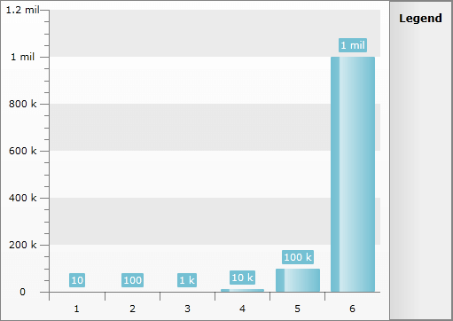
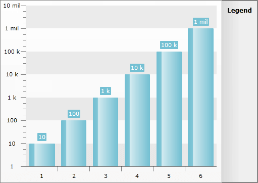

# Logarithmic Scale


## 

If you have a very large range of values on the Y-Axis, the points with the smallest values may not be easily visible. This is because the scale for the Y-Axis will be linear. In this case you can scale the Y-Axis logarithmically, so there is enough space for each value. The logarithmic scaling is calculated automatically, you just have to set the __IsLogarithmic__ property of the __YAxis__ to __True__.

Here is an example of a __RadChart__ that visualizes the following values - 10, 100, 1000, 10000, 100000, 1000000.


```XAML
	<telerik:RadChart x:Name="radChart" />
```


```C#
	this.radChart.ItemsSource = new int[] { 10, 100, 1000, 10000, 100000, 1000000 };
```
```VB.NET
	Me.radChart.ItemsSource = New Integer() {10, 100, 1000, 10000, 100000, 1000000}
```



Here is the same __RadChart__, but this time with logarithmic Y-Axis.


```XAML
	<telerik:RadChart>
	    <telerik:RadChart.DefaultView>
	        <telerik:ChartDefaultView>
	            <telerik:ChartDefaultView.ChartArea>
	                <telerik:ChartArea>
	                    <telerik:ChartArea.AxisY>
	                        <telerik:AxisY IsLogarithmic="True" />
	                    </telerik:ChartArea.AxisY>
	                </telerik:ChartArea>
	            </telerik:ChartDefaultView.ChartArea>
	        </telerik:ChartDefaultView>
	    </telerik:RadChart.DefaultView>
	</telerik:RadChart>
```


```C#
	this.radChart.DefaultView.ChartArea.AxisY.IsLogarithmic = true;
```
```VB.NET
	Me.radChart.DefaultView.ChartArea.AxisY.IsLogarithmic = True
```


>tip You can use the __LogarithmBase__ property of the __AxisY__ to modify the base on which the logarithmic function for the axis is calculated.


