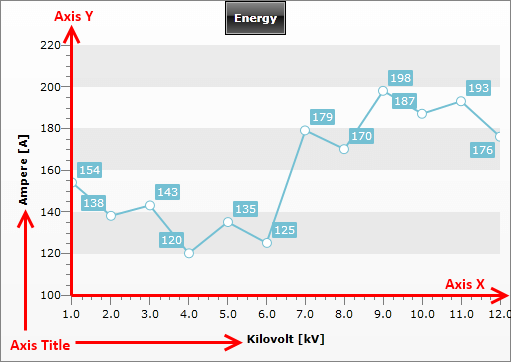
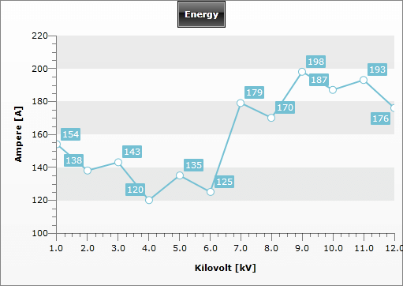

# Overview

## 

__Axes__ in a chart are used to display the dimensions of the data. The __X-axis__ and the __Y-axis__ are contained in the __ChartArea__ and can be customized in XAML or code-behind.

Both, __AxisX__ and __AxisY__ inherit __Axis__, thus sharing common properties, like:

* __MinValue__ and __MaxValue__ - use to set the minimal and maximal value of the axis.  (__AutoRange must be set to false for the Step to be regarded__) 

* __Step__ - indicates the step used when placing ticks along the axis. (__AutoRange must be set to false for the Step to be regarded__) 

* __AutoRange__ - when __True__ the axis will calculate its __MinValue__, __MaxValue__ and __Step__ automatically. When __False__, you have to manually set the appropriate values for each of these properties. 

* __DefaultLabelFormat__ - specifies the format used when labels are placed along the axis. 

* __AxisLabelsVisibility__ - specifies whether the labels for the major ticks should be visible. 

* __Title__ -  gets or sets the title that is shown next to the axis. 

* [Striplines and Gridlines]()

However, there are some specific properties for each of the axes: check [X-Axis]() and [Y-Axis]() for more information.

The following example demonstrates how to use the common properties in XAML and code-behind:

#### __XAML__

{{region radchart-features-axes-overview_0}}
	<telerikChart:RadChart>
	    <telerikChart:RadChart.DefaultView>
	        <telerikCharting:ChartDefaultView>
	            ...
	            <telerikCharting:ChartDefaultView.ChartArea>
	                <telerikCharting:ChartArea>
	                    <telerikCharting:ChartArea.AxisX>
	                        <telerikCharting:AxisX AutoRange="True" DefaultLabelFormat="0.0" Title="Kilovolt [kV]" />
	                    </telerikCharting:ChartArea.AxisX>
	                    <telerikCharting:ChartArea.AxisY>
	                        <telerikCharting:AxisY AutoRange="False" MinValue="100" MaxValue="200" Step="5"
	                           DefaultLabelFormat="0" Title="Ampere [A]"/>
	                    </telerikCharting:ChartArea.AxisY>
	                    ...
	                </telerikCharting:ChartArea>
	            </telerikCharting:ChartDefaultView.ChartArea>
	        </telerikCharting:ChartDefaultView>
	    </telerikChart:RadChart.DefaultView>
	</telerikChart:RadChart>
	{{endregion}}

#### __C#__

{{region radchart-features-axes-overview_1}}
	Telerik.Windows.Controls.RadChart radChart = new Telerik.Windows.Controls.RadChart();
	radChart.DefaultView.ChartArea.AxisX.AutoRange = true;
	radChart.DefaultView.ChartArea.AxisX.DefaultLabelFormat = "0.0";
	radChart.DefaultView.ChartArea.AxisX.Title = "Kilovolt [kV]";
	radChart.DefaultView.ChartArea.AxisY.AutoRange = false;
	radChart.DefaultView.ChartArea.AxisY.MinValue = 100;
	radChart.DefaultView.ChartArea.AxisY.MaxValue = 200;
	radChart.DefaultView.ChartArea.AxisY.Step = 5;
	radChart.DefaultView.ChartArea.AxisY.DefaultLabelFormat = "0";
	radChart.DefaultView.ChartArea.AxisY.Title = "Ampere [A]";
	{{endregion}}

#### __VB.NET__

{{region radchart-features-axes-overview_2}}
	Dim radChart As New Telerik.Windows.Controls.RadChart()
	radChart.DefaultView.ChartArea.AxisX.AutoRange = True
	radChart.DefaultView.ChartArea.AxisX.DefaultLabelFormat = "0.0"
	radChart.DefaultView.ChartArea.AxisX.Title = "Kilovolt [kV]"
	radChart.DefaultView.ChartArea.AxisY.AutoRange = False
	radChart.DefaultView.ChartArea.AxisY.MinValue = 100
	radChart.DefaultView.ChartArea.AxisY.MaxValue = 200
	radChart.DefaultView.ChartArea.AxisY.[Step] = 5
	radChart.DefaultView.ChartArea.AxisY.DefaultLabelFormat = "0"
	radChart.DefaultView.ChartArea.AxisY.Title = "Ampere [A]"
	{{endregion}}

>tipInstead of setting the __MaxValue__, __MinValue__ and __Step__ properties you can call the __AddRange()__ method. This is more performant, because setting each the properties will trigger recalculations of the axis' values.

#### __C#__

{{region radchart-features-axes-overview_3}}
	telerikChart.DefaultView.ChartArea.AxisX.AddRange( 100, 200, 5 );
	{{endregion}}

#### __XAML__

{{region radchart-features-axes-overview_4}}
	telerikChart.DefaultView.ChartArea.AxisX.AddRange(100, 200, 5)
	{{endregion}}

In the code snippet above, both the X and the Y axes are customized. The changes done for the __Y-axis__ are several, but probably the most important of them is that the range auto generation (__AutoRange = False__) for that axis is stopped and this is done manually by defining values for __MinValue__, __MaxValue__ and __Step.__ The result is __Y-axis__ with values starting from 100, ending at 200 with tick placed on each 5 units.

The manual range definition is very useful feature because it allows you to justify the visualization of your axes better.

# See Also

 * [X-Axis]()

 * [Y-Axis]()

 * [Multiple Y axes]()

 * [Striplines and Gridlines]()

 * [Styling the Axes Overview]()

 * [RadChart Visual Structure]()
