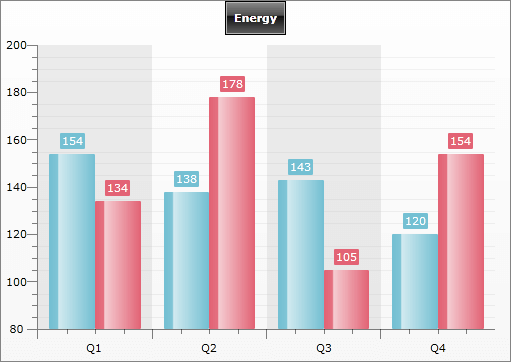
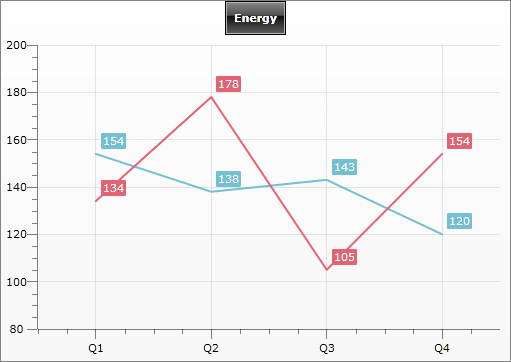

# Striplines and Gridlines

## 

In order to improve the readiness of the chart, you can use __strip lines__ and __grid lines__. Besides, for [Y-Axis]() you can also show grid lines for the minor ticks.

>tipTo learn more about the visual elements of the __RadChart__, read the [Visual Structure]() topic.

The strip lines and grid lines are part of the axes. Therefore, to control the visibility of the grid/strip lines you have to use one of the following properties:

* __Axis.StripLinesVisibility__ - use to show/hide the strip lines. When set to __X-axis__, then the vertical strip lines will be shown, if __Y-axis__ is set then horizontal lines will be shows. 

* __Axis.MajorGridLinesVisibility__ - use to show/hide the grid lines for the major ticks. 

* __AxisY.MinorGridLinesVisibility__ - valid for __Y-axis__ only. When set, the grid lines for the minor ticks will be shown.

The following example demonstrates how to configure the __GridLines__ and __StripLines__ for two different chart types.

#### __XAML__

{{region radchart-features-axes-striplines-and-gridlines_0}}
	<!--Left Chart-->
	<telerikChart:RadChart x:Name="radChart">
	    <telerikChart:RadChart.DefaultView>
	        <telerikCharting:ChartDefaultView>
	            <telerikCharting:ChartDefaultView.ChartArea>
	                <telerikCharting:ChartArea>
	                    ..........
	                    <telerikCharting:ChartArea.AxisX>
	                        <telerikCharting:AxisX StripLinesVisibility="Visible" >
	                        </telerikCharting:AxisX>
	                    </telerikCharting:ChartArea.AxisX>
	                    <telerikCharting:ChartArea.AxisY>
	                        <telerikCharting:AxisY StripLinesVisibility="Collapsed" 
	                            MajorGridLinesVisibility="Visible" MinorGridLinesVisibility="Visible"  >
	                        </telerikCharting:AxisY>
	                    </telerikCharting:ChartArea.AxisY>
	
	                    ..........
	                </telerikCharting:ChartArea>
	            </telerikCharting:ChartDefaultView.ChartArea>
	        </telerikCharting:ChartDefaultView>
	    </telerikChart:RadChart.DefaultView>
	</telerikChart:RadChart>
	<!--Right Chart-->
	<telerikChart:RadChart x:Name="radChart2">
	    <telerikChart:RadChart.DefaultView>
	        <telerikCharting:ChartDefaultView>
	            <telerikCharting:ChartDefaultView.ChartArea>
	                <telerikCharting:ChartArea>
	                    ..........
	                    <telerikCharting:ChartArea.AxisX>
	                        <telerikCharting:AxisX MajorGridLinesVisibility="Visible" LayoutMode="Inside">
	                        </telerikCharting:AxisX>
	                    </telerikCharting:ChartArea.AxisX>
	                    <telerikCharting:ChartArea.AxisY>
	                        <telerikCharting:AxisY StripLinesVisibility="Collapsed" 
	                            MajorGridLinesVisibility="Visible" MinorGridLinesVisibility="Collapsed"  >
	                        </telerikCharting:AxisY>
	                    </telerikCharting:ChartArea.AxisY>
	                    ..........
	                </telerikCharting:ChartArea>
	            </telerikCharting:ChartDefaultView.ChartArea>
	        </telerikCharting:ChartDefaultView>
	    </telerikChart:RadChart.DefaultView>
	</telerikChart:RadChart>
	{{endregion}}

#### __C#__

{{region radchart-features-axes-striplines-and-gridlines_1}}
	// Left Chart
	radChart.DefaultView.ChartLegend.UseAutoGeneratedItems = true;
	radChart.DefaultView.ChartLegend.Visibility = Visibility.Collapsed;
	radChart.DefaultView.ChartArea.AxisX.StripLinesVisibility = Visibility.Visible;
	radChart.DefaultView.ChartArea.AxisY.StripLinesVisibility = Visibility.Collapsed;
	radChart.DefaultView.ChartArea.AxisY.MajorGridLinesVisibility = Visibility.Collapsed;
	radChart.DefaultView.ChartArea.AxisY.MinorGridLinesVisibility = Visibility.Visible;
	// Right Chart
	radChart.DefaultView.ChartArea.AxisX.MajorGridLinesVisibility = Visibility.Visible;
	radChart.DefaultView.ChartArea.AxisY.StripLinesVisibility = Visibility.Collapsed;
	radChart.DefaultView.ChartArea.AxisY.MajorGridLinesVisibility = Visibility.Visible;
	radChart.DefaultView.ChartArea.AxisY.MinorGridLinesVisibility = Visibility.Collapsed;
	radChart.DefaultView.ChartArea.AxisX.LayoutMode = AxisLayoutMode.Inside;
	{{endregion}}

#### __VB.NET__

{{region radchart-features-axes-striplines-and-gridlines_2}}
	' Left Chart
	radChart.DefaultView.ChartLegend.UseAutoGeneratedItems = True
	radChart.DefaultView.ChartLegend.Visibility = Visibility.Collapsed
	radChart.DefaultView.ChartArea.AxisX.StripLinesVisibility = Visibility.Visible
	radChart.DefaultView.ChartArea.AxisY.StripLinesVisibility = Visibility.Collapsed
	radChart.DefaultView.ChartArea.AxisY.MajorGridLinesVisibility = Visibility.Collapsed
	radChart.DefaultView.ChartArea.AxisY.MinorGridLinesVisibility = Visibility.Visible
	' Right Chart
	radChart.DefaultView.ChartArea.AxisX.MajorGridLinesVisibility = Visibility.Visible
	radChart.DefaultView.ChartArea.AxisY.StripLinesVisibility = Visibility.Collapsed
	radChart.DefaultView.ChartArea.AxisY.MajorGridLinesVisibility = Visibility.Visible
	radChart.DefaultView.ChartArea.AxisY.MinorGridLinesVisibility = Visibility.Collapsed
	radChart.DefaultView.ChartArea.AxisX.LayoutMode = AxisLayoutMode.Inside
	{{endregion}}

The image below shows the result. You can see that the left chart has both strip and grid lines shown, while the right one has only grid lines shown, for both X and Y axes.

         
      

and

         
      

If you need to further customize the axes, please refer to [Styling the GridLine]() and [Styling the StripLine]().

# See Also

 * [Axes Overview]()

 * [X-Axis]()

 * [Y-Axis]()

 * [Styling the GridLine]()

 * [Styling the StripLine]()
