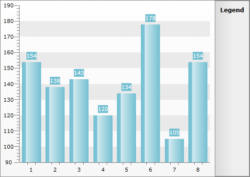

# Ticks


## 

The ticks are part of the chart axes and are typically used to mark a specific value on the axis. There are two types of ticks - minor and major. The major ticks always represent the primary axis values. The minor ticks are used for more readable visualization of the data values.

To control the visibility of the ticks you have to use one fo the following properties:

* __MajorTicksVisibility__ - specifies whether the major ticks should be visible.

* __MinorTicksVisibility__ - specifies whether the minor ticks should be visible.

* __MinorTickPointMultiplier__ - specifies the number of minor ticks per major tick, i.e the number of the minor ticks between two major ticks. The number of ticks is always equal to the (__MinorTickPointMultiplier__ - 1) as the multiplier rerpesents the count of chuks defined by the minor ticks between two major ticks. For example in order to have 3 chunks the Axis will need 2 minor ticks to allocate them.

>tipTo learn how to modify the appearance of the axis' ticks read the [Styling the Axes]() section.

These properties are available for both the x- and the y-axis. Here is an example of hiding the major ticks of the x-axis and configuring it to display 2 minor ticks between each two major ones.


```XAML
	<telerik:RadChart x:Name="radChart">
	    <telerik:RadChart.DefaultView>
	        <telerik:ChartDefaultView>
	            <telerik:ChartDefaultView.ChartArea>
	                <telerik:ChartArea>
	                    <telerik:ChartArea.AxisX>
	                        <telerik:AxisX MajorTicksVisibility="Collapsed"
	                                       MinorTickPointMultiplier="3"
	                                       MinorTicksVisibility="Visible" />
	                    </telerik:ChartArea.AxisX>
	                </telerik:ChartArea>
	            </telerik:ChartDefaultView.ChartArea>
	        </telerik:ChartDefaultView>
	    </telerik:RadChart.DefaultView>
	</telerik:RadChart>
```


You can do this in code-behind too.


```C#
	this.radChart.DefaultView.ChartArea.AxisX.MajorTicksVisibility = System.Windows.Visibility.Collapsed;
	this.radChart.DefaultView.ChartArea.AxisX.MinorTickPointMultiplier = 3;
	this.radChart.DefaultView.ChartArea.AxisX.MinorTicksVisibility = System.Windows.Visibility.Visible;
```
```VB.NET
	Me.radChart.DefaultView.ChartArea.AxisX.MajorTicksVisibility = System.Windows.Visibility.Collapsed
	Me.radChart.DefaultView.ChartArea.AxisX.MinorTickPointMultiplier = 3
	Me.radChart.DefaultView.ChartArea.AxisX.MinorTicksVisibility = System.Windows.Visibility.Visible
```


Here is a snapshot of the result.

