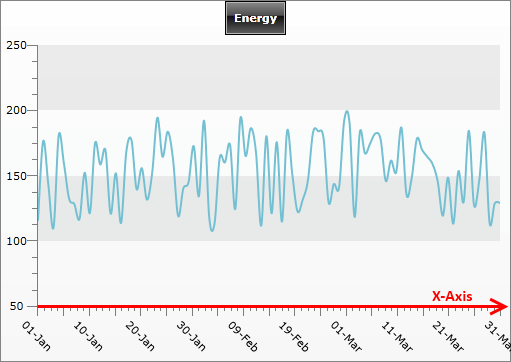
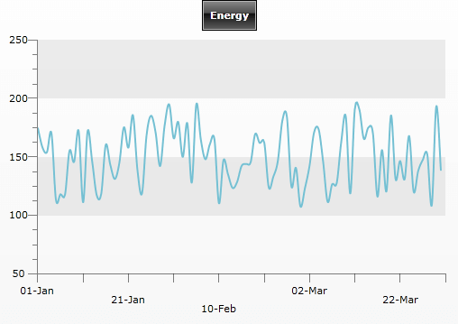
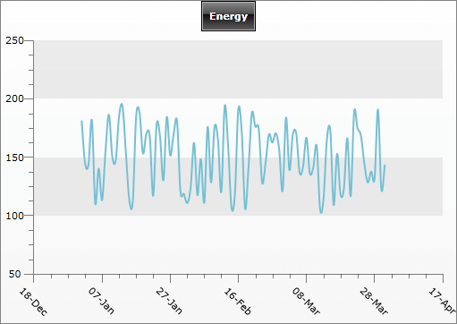
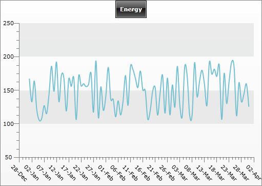
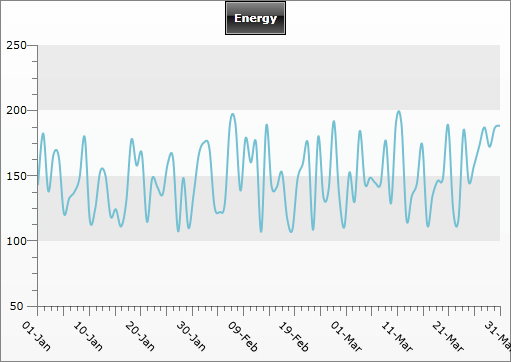

# X-Axis


## 

This topic covers only the properties that are specific to the __X-axis__. If you want to learn more about the properties that are common to both X and Y axes take a look at the [Axes Overview]() topic.


Besides the common properties __X-axis__ has some specific properties, explained in the list below:

* __IsDateTime -__ indicates where the values for the __X-axis__ are considered as dates. 


* __LayoutMode -__ specifies the [LayoutMode]() applied on the horizontal axis. 


* __LabelRotationAngle__ - specifies the value indicating the rotation angle for the __X-axis__ labels. Use when label texts are long and are overlapping each-other. 


* __LabelStep__ - specifies the value indicating that only one out of __n-axis__ labels should be visible, where __n__ is the value of the property. 


* __TicksDistance__ - specifies a value indicating that every axis tick should be placed at least X pixels away from the next one, where X is the value of the property. Use when you have too much data to display on the __X-axis__ to control the number of ticks shown. 


* __StepLabelLevelCount__ - gets or sets the number of levels (steps) that will be used to distribute the axis item labels. 


* __StepLabelLevelHeight__ - gets or sets the height of each step label level (row).

__AxisX.Step__ and __AxisX.LabelStep__ are related: 

* First,__AxisX.Step__ is used to calculate which tick should be visible and which not. 


* Second, having the ticks,__AxisX.LabelStep__ is used to calculate for which ticks the label should be visible and for which it souldn't. It means that the __AxisX.LabelStep__ takes the ticks as a base.Here is 

Here is an example for a __RadChart__ that makes use of the __Step__, __LabelStep__, __StepLableLevelCount__, __StepLabelLevelHeight__:


```XAML
	<telerik:RadChart x:Name="radChart">
	    <telerik:RadChart.SeriesMappings>
	        <telerik:SeriesMapping>
	            <telerik:SeriesMapping.SeriesDefinition>
	                <telerik:SplineSeriesDefinition ShowItemLabels="False" ShowPointMarks="False" />
	            </telerik:SeriesMapping.SeriesDefinition>
	            <telerik:SeriesMapping.ItemMappings>
	                <telerik:ItemMapping DataPointMember="XValue" FieldName="Date" />
	                <telerik:ItemMapping DataPointMember="YValue" FieldName="Value" />
	            </telerik:SeriesMapping.ItemMappings>
	        </telerik:SeriesMapping>
	    </telerik:RadChart.SeriesMappings>
	    <telerik:RadChart.DefaultView>
	        <telerik:ChartDefaultView>
	            <!--  ...  -->
	            <telerik:ChartDefaultView.ChartArea>
	                <telerik:ChartArea>
	                    <telerik:ChartArea.AxisX>
	                        <telerik:AxisX DefaultLabelFormat="dd-MMM"
	                                       IsDateTime="True"
	                                       LabelStep="2"
	                                       Step="5"
	                                       StepLabelLevelCount="3"
	                                       StepLabelLevelHeight="10" />
	                    </telerik:ChartArea.AxisX>
	                </telerik:ChartArea>
	            </telerik:ChartDefaultView.ChartArea>
	        </telerik:ChartDefaultView>
	    </telerik:RadChart.DefaultView>
	</telerik:RadChart>
```


```C#
	//....
	radChart.DefaultView.ChartArea.AxisX.AutoRange = false;
	radChart.DefaultView.ChartArea.AxisX.MinValue = new DateTime( 2009, 1, 1 ).ToOADate();
	radChart.DefaultView.ChartArea.AxisX.MaxValue = new DateTime( 2009, 3, 31 ).ToOADate();
	radChart.DefaultView.ChartArea.AxisX.Step = 5;
	radChart.DefaultView.ChartArea.AxisX.LabelStep = 2;
	radChart.DefaultView.ChartArea.AxisX.LabelRotationAngle = 45;
	radChart.DefaultView.ChartArea.AxisX.DefaultLabelFormat = "dd-MMM";
	//....
```


```VB.NET
	Dim radChart As New Telerik.Windows.Controls.RadChart()
	radChart.DefaultView.ChartArea.AxisX.IsDateTime = True
	radChart.DefaultView.ChartArea.AxisX.Step = 5
	radChart.DefaultView.ChartArea.AxisX.LabelStep = 2
	radChart.DefaultView.ChartArea.AxisX.StepLabelLevelCount = 3
	radChart.DefaultView.ChartArea.AxisX.StepLabelLevelHeight = 10
	radChart.DefaultView.ChartArea.AxisX.DefaultLabelFormat = "dd-MMM"
	'...'
	Dim sm As New SeriesMapping()
	sm.SeriesDefinition = New SplineSeriesDefinition()
	sm.SeriesDefinition.ShowItemLabels = False
	DirectCast(sm.SeriesDefinition, SplineSeriesDefinition).ShowPointMarks = False
	sm.ItemMappings.Add(New ItemMapping("Date", DataPointMember.XValue))
	sm.ItemMappings.Add(New ItemMapping("Value", DataPointMember.YValue))
	radChart.SeriesMappings.Add(sm)
```




The __TickDistance__ has to be used together with __AutoRange__. When __AutoRange__ is set to __True__, the axis __Step__ value is calculated depending on the data range, the available space and the __TicksDistance__ value. Since __TickDistance__ defines the minimal distance between two ticks, increasing its value will cause the __Step__ value to be increased too.

When __AutoRange__ is __False__, __TickDistance__ is omitted, because in this case you have to manually provide values for __MinValues__, __MaxValues__ and __Step__.

The following example demonstrates how to customize the __X-Axis__. The chart is bound (see [Data Binding Support Overview]() or [Data Binding with Manual Series Mapping]() for more about data binding) to a list of business objects with two properties: __Date__ and __Value__ - of type __DateTime__ and __decimal__ respectively. The list contains data for a three months period.


```XAML
	<telerik:RadChart>
	    <telerik:RadChart.SeriesMappings>
	        <telerik:SeriesMapping>
	            <telerik:SeriesMapping.SeriesDefinition>
	                <telerik:SplineSeriesDefinition ShowItemLabels="False" ShowPointMarks="False" />
	            </telerik:SeriesMapping.SeriesDefinition>
	            <telerik:SeriesMapping.ItemMappings>
	                <telerik:ItemMapping DataPointMember="XValue" FieldName="Date" />
	                <telerik:ItemMapping DataPointMember="YValue" FieldName="Value" />
	            </telerik:SeriesMapping.ItemMappings>
	        </telerik:SeriesMapping>
	    </telerik:RadChart.SeriesMappings>
	    <telerik:RadChart.DefaultView>
	        <telerik:ChartDefaultView>
	            <!--  ....  -->
	            <telerik:ChartDefaultView.ChartArea>
	                <telerik:ChartArea>
	                    <telerik:ChartArea.AxisX>
	                        <telerik:AxisX AutoRange="True"
	                                       DefaultLabelFormat="dd-MMM"
	                                       IsDateTime="True"
	                                       LabelRotationAngle="45" />
	                    </telerik:ChartArea.AxisX>
	                </telerik:ChartArea>
	            </telerik:ChartDefaultView.ChartArea>
	        </telerik:ChartDefaultView>
	    </telerik:RadChart.DefaultView>
	</telerik:RadChart>
```


```C#
	Telerik.Windows.Controls.RadChart radChart = new Telerik.Windows.Controls.RadChart();
	radChart.DefaultView.ChartArea.AxisX.AutoRange = true;
	radChart.DefaultView.ChartArea.AxisX.LabelRotationAngle = 45;
	radChart.DefaultView.ChartArea.AxisX.DefaultLabelFormat = "dd-MMM";
	//....
	SeriesMapping sm = new SeriesMapping();
	sm.SeriesDefinition = new SplineSeriesDefinition();
	//....
	sm.ItemMappings.Add( new ItemMapping( "Date", DataPointMember.XValue ) );
	sm.ItemMappings.Add( new ItemMapping( "Value", DataPointMember.YValue ) );
	radChart.SeriesMappings.Add( sm );
```


```VB.NET
	Dim radChart As New Telerik.Windows.Controls.RadChart()
	radChart.DefaultView.ChartArea.AxisX.AutoRange = True
	radChart.DefaultView.ChartArea.AxisX.LabelRotationAngle = 45
	radChart.DefaultView.ChartArea.AxisX.DefaultLabelFormat = "dd-MMM"
	'...'
	Dim sm As New SeriesMapping()
	sm.SeriesDefinition = New SplineSeriesDefinition()
	sm.SeriesDefinition.ShowItemLabels = False
	DirectCast(sm.SeriesDefinition, SplineSeriesDefinition).ShowPointMarks = False
	sm.ItemMappings.Add(New ItemMapping("Date", DataPointMember.XValue))
	sm.ItemMappings.Add(New ItemMapping("Value", DataPointMember.YValue))
	radChart.SeriesMappings.Add(sm)
```


You can see the result on the snapshot below:


When __AutoRange__ is __True__, __RadChart__ calculates the __MinValue__, __MaxValue__ and the __Step__ and draws ticks accordingly. Also, the labels are rotated to 45 degree and formatted to show only the date and a three letter month abbreviation.

However, the chart above could be improved if a bit more ticks are shown. When __AutoRange__ is __True__, then you can control the number of the ticks by playing with the __TickDistance__ property. This property allows you to specify at least how many pixels you want to have between two ticks. Thus, decreasing the tick distance, more ticks could be placed on the axis. If the axis looks overcrowded, increase __TickDistance__ value to reduce the number.


```XAML
	<!--  ....  -->
	<telerik:ChartArea.AxisX>
	    <telerik:AxisX AutoRange="True"
	                   DefaultLabelFormat="dd-MMM"
	                   IsDateTime="True"
	                   LabelRotationAngle="45"
	                   TicksDistance="15" />
	</telerik:ChartArea.AxisX>
	<!--  ....  -->
```


```C#
	//....
	radChart.DefaultView.ChartArea.AxisX.TicksDistance = 15;
	//....
```


```VB.NET
	'....'
	radChart.DefaultView.ChartArea.AxisX.TicksDistance = 15
	'....'
```



As you can see, the number of the ticks is increased and the chart looks much better, because of the reduced step size. Notice the last date on the __X-Axis__ - it is recalculated based on the new __Step__ value and as a result, the chart is using the whole area - no offset on the right side.

The same results you can achieve by setting the __AutoRange__ to __False__ and define __MinValue__, __MaxValue__ and __Step.__


```XAML
	<!--  ...  -->
	<telerik:ChartArea.AxisX>
	    <telerik:AxisX AutoRange="False"
	                   DefaultLabelFormat="dd-MMM"
	                   IsDateTime="True"
	                   LabelRotationAngle="45"
	                   LabelStep="2"
	                   MaxValue="39903.0"
	                   MinValue="39814.0"
	                   Step="5" />
	</telerik:ChartArea.AxisX>
	<!--  ...  -->
```


```C#
	//....
	radChart.DefaultView.ChartArea.AxisX.AutoRange = false;
	radChart.DefaultView.ChartArea.AxisX.MinValue = new DateTime( 2009, 1, 1 ).ToOADate();
	radChart.DefaultView.ChartArea.AxisX.MaxValue = new DateTime( 2009, 3, 31 ).ToOADate();
	radChart.DefaultView.ChartArea.AxisX.Step = 5;
	radChart.DefaultView.ChartArea.AxisX.LabelStep = 2;
	radChart.DefaultView.ChartArea.AxisX.LabelRotationAngle = 45;
	radChart.DefaultView.ChartArea.AxisX.DefaultLabelFormat = "dd-MMM";
	//....
```


```VB.NET
	radChart.DefaultView.ChartArea.AxisX.AutoRange = False
	radChart.DefaultView.ChartArea.AxisX.MinValue = New DateTime(2009, 1, 1).ToOADate()
	radChart.DefaultView.ChartArea.AxisX.MaxValue = New DateTime(2009, 3, 31).ToOADate()
	radChart.DefaultView.ChartArea.AxisX.Step = 5
	radChart.DefaultView.ChartArea.AxisX.LabelStep = 2
	radChart.DefaultView.ChartArea.AxisX.LabelRotationAngle = 45
	radChart.DefaultView.ChartArea.AxisX.DefaultLabelFormat = "dd-MMM"
```



Notice how the __MinValue__ and __MaxValues__ are set - they are set to the OLE Automation equivalent of the __DateTime__ value. In this example, 1 Jan 2009 and 31 Mar 2009. Additionally, the __LabelStep__ is set to 2, which means that each second tick will have a label.

## See Also

 * [Axes Overview]()

 * [Y-Axis]()

 * [Striplines and Gridlines]()

 * [Styling the Axes Overview]()
