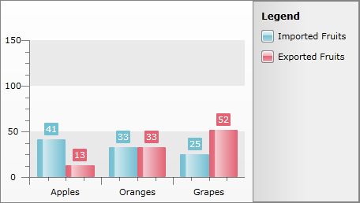

# Categorical Charts


## 

With this feature, the enabled X axis can be used to plot not only values (e.g. number of sales, etc.), but also categories (e.g. months of the year, units, people, etc.). Using a Category axis, the 
Silverlight
WPF Chart treats data as a sequence of non-numerical text labels. The marker is placed according to the position of the category in the sequence. Data is provided per category.
 
      

As you can see from the image above, __RadChart__ automatically set __X-Axis__ labels to the categories they represent and each numeric value is shown in the corresponding category. Note that the numeric values are from two data series and they share the same category.

To create categorical charts, you have to map the category values to the __XCategory__ property of the __DataPoint.__

>The only difference between categorical charts and a normal chart is the way the data is bound. Categorical charts use __XCategory__ data point member while the other charts use __XValue__.


```XAML
	<telerik:DataPoint XCategory="Apples" YValue="41" />
	<telerik:DataPoint XCategory="Oranges" YValue="33" />
	<telerik:DataPoint XCategory="Grapes" YValue="25" />
```


```C#
	DataSeries dataSeries = new DataSeries();
	dataSeries.Definition = new BarSeriesDefinition();
	dataSeries.Add( new DataPoint() { YValue = 41, XCategory = "Apples" } );
	dataSeries.Add( new DataPoint() { YValue = 33, XCategory = "Oranges" } );
	dataSeries.Add( new DataPoint() { YValue = 25, XCategory = "Grapes" } );
	radChart.DefaultView.ChartArea.DataSeries.Add( dataSeries );
```


```VB.NET
	Dim dataSeries As New DataSeries()
	dataSeries.Definition = New BarSeriesDefinition()
	Dim dataPoint As New DataPoint()
	dataPoint.YValue = 41
	dataPoint.XCategory = "Apples"
	dataSeries.Add(dataPoint)
	dataPoint = New DataPoint()
	dataPoint.YValue = 33
	dataPoint.XCategory = "Oranges"
	dataSeries.Add(dataPoint)
	dataPoint = New DataPoint()
	dataPoint.YValue = 25
	dataPoint.XCategory = "Grapes"
	dataSeries.Add(dataPoint)
	radChart.DefaultView.ChartArea.DataSeries.Add(dataSeries)
```

If you want to use data binding, then you have to set the __DataPointMember__ to __XCategory__ instead of __XValue__.


```C#
	SeriesMapping seriesMapping = new SeriesMapping();
	seriesMapping.SeriesDefinition = new BarSeriesDefinition();
	ItemMapping itemMapping = new ItemMapping();
	itemMapping.DataPointMember = DataPointMember.XCategory;
	itemMapping.FieldName = "Fruit";
	seriesMapping.ItemMappings.Add(itemMapping);
	itemMapping = new ItemMapping();
	itemMapping.DataPointMember = DataPointMember.YValue;
	itemMapping.FieldName = "Orders";
	seriesMapping.ItemMappings.Add(itemMapping);
	radChart.SeriesMappings.Add(seriesMapping);
```


```VB.NET
	Dim seriesMapping As New SeriesMapping()
	seriesMapping.SeriesDefinition = New BarSeriesDefinition()
	Dim itemMapping As New ItemMapping()
	itemMapping.DataPointMember = DataPointMember.XCategory
	itemMapping.FieldName = "Fruit"
	seriesMapping.ItemMappings.Add(itemMapping)
	itemMapping = New ItemMapping()
	itemMapping.DataPointMember = DataPointMember.YValue
	itemMapping.FieldName = "Orders"
	seriesMapping.ItemMappings.Add(itemMapping)
	radChart.SeriesMappings.Add(seriesMapping)
```

If you are looking for more data binding options take a look at the [Populating with Data Overview]() topic.

## See Also

 * [Populating With Data Overview]()

 * [Data Binding Support Overview]()

 * [Grouping and Aggregation]()
