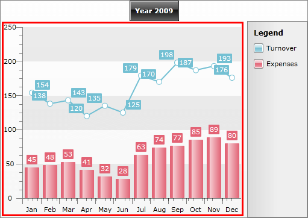
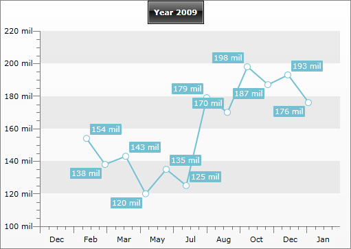

# Chart Area


__ChartArea__ is the place, where the chart graphic is drawn. The __ChartArea__ represents a layout region of the __RadChart__ control that holds certain chart series and axis data. Additionally, the __ChartArea__ exposes events for customizing the [tooltips]() and making the chart more [interactive]().



As you can see on the image above, the __ChartArea__ has two [axes]() - X and Y. By default X- and Y-axes are shown for all chart types except for those, which do not have axes at all - Pie and Doughnut charts.

Use [ChartArea.AxisX]() and [ChartArea.AxisY]() to access the specific properties of the axes. You can also apply your own styles using __AxisXStyle__ and __AxisYStyle__. Take a look at the [Styling the Axes]() topic for more.

Use the __AdditionalYAxes__ property to add more than one Y-Axis to your chart. To learn more about it read the [Multiple Y Axes]() topic.

Use the __PlotAreaAxisXStyle__ and the __PlotAreaAxisYStyle__ properties to set styles for the axes drawn inside the plot area. Example of such axes are the axes drawn in [negative values scenarios](). 

__RadChart__ also allows you to specify how to format the labels by specifying __ChartArea.LabelFormatBehavior__. The __LabelFormatBehaviour__ enumeration has three values: __HumanReadable__(default), __Scientific__ and __None__. The table below shows how the values will be formatted for the first two options. When __None__ is used the values are converted using __ToString()__ manner:


|Value|    HumanReadable|    Scientific|
|-----|-----------------|--------------|
|100|    100|    1.00E+02|
|100,000|    100 k|    1.00E+05|
|100,000,000|    100 mil|    1.00E+08|
|100,000,000,000|    100 bil|    1.00E+11|
|100,000,000,000,000|    100 tri|    1.00E+14|
|1,000,000,000,000,000|    1000 tri|    1.00E+15|


When you set the label format behavior, all the labels (axes, series item labels, tooltips) will be formatted using the logic shown above. However, if you set [Format Expressions]() to an element, then this expression will override the selected __LabelFormatBehavior__. For example, set the format behavior to __Scientific__, but for __X-Axis__ set __DefaultLabelFormat__ to "__MMM__":

#### __XAML__

```XAML
	<telerik:RadChart>
	    <telerik:RadChart.DefaultView>
	        <telerik:ChartDefaultView>
	            <!--  ....  -->
	            <telerik:ChartDefaultView.ChartArea>
	                <telerik:ChartArea LabelFormatBehavior="HumanReadable">
	                    <telerik:ChartArea.AxisX>
	                        <telerik:AxisX DefaultLabelFormat="MMM"
	                                       IsDateTime="True"
	                                       LayoutMode="Between" />
	                    </telerik:ChartArea.AxisX>
	                    <telerik:ChartArea.DataSeries>
	                    <!--  ....  -->
	                    </telerik:ChartArea.DataSeries>
	                </telerik:ChartArea>
	            </telerik:ChartDefaultView.ChartArea>
	        </telerik:ChartDefaultView>
	    </telerik:RadChart.DefaultView>
	</telerik:RadChart>
```

#### __C#__

```C#
	RadChart radChart = new RadChart();
	
	radChart.DefaultView.ChartArea.LabelFormatBehavior = LabelFormatBehavior.HumanReadable;
	radChart.DefaultView.ChartArea.AxisX.IsDateTime = true;
	radChart.DefaultView.ChartArea.AxisX.DefaultLabelFormat = "MMM";
	radChart.DefaultView.ChartArea.AxisX.LayoutMode = AxisLayoutMode.Between;
	//...
```

#### __VB.NET__

```VB.NET
	Dim radChart As New Telerik.Windows.Controls.RadChart()
	'....'
	radChart.DefaultView.ChartArea.LabelFormatBehavior = LabelFormatBehavior.HumanReadable
	radChart.DefaultView.ChartArea.AxisX.IsDateTime = True
	radChart.DefaultView.ChartArea.AxisX.DefaultLabelFormat = "MMM"
	radChart.DefaultView.ChartArea.AxisX.LayoutMode = AxisLayoutMode.Between
```

On the image below you can see how the __Y-Axis__ and the series item labels are formatted when __LayoutFormatBehavior__ is set to __HumanReadable__, while the __X-Axis__ is formatted using custom [Format Expressions]():



## See Also

 * [Styling the Chart Area]()

 * [Axes]()

 * [Format Expressions]()

 * [Chart Title]()

 * [Chart Legend]()

 * [DefaultView]()

 * [RadChart Visual Structure]()
