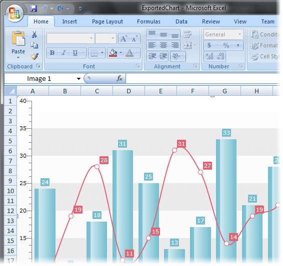

# Chart Export


## 

__RadChart__ allows you to export the chart in several file formats:

* __Png__ - Portable Netwok Graphic. Use __RadChart.ExportToImage(Stream)__.

* __Bmp__ - Bitmap file. Use __RadChart.ExportToImage(Stream, BitmapEncoder)__ where the encoder is of type __BmpBitmapEncoder()__.

* __ExcelML__ - ExcelML file, supported by Office 2003 and above. Use __RadChart.ExportToExcelML(Stream)__.

* __Xps__ - XML Paper Specification file. Use __RadChart.ExportToXps(Stream)__.

>tipIn WPF there are overloads for the methods listed above, which take as parameter the name of the file you want to export to, instead of a stream. This allows you to easily export your chart directly to a file.

The following example demonstrates how to export __RadChart__ to ExcelML file format.


```C#
	SaveFileDialog dialog = new SaveFileDialog();
	dialog.DefaultExt = "*.xls";
	dialog.Filter = "Files(*.xls)|*.xls";
	if ( !( bool )dialog.ShowDialog() )
	    return;
	Stream fileStream = dialog.OpenFile();
	radChart.ExportToExcelML( fileStream );
	fileStream.Close();
```


```VB.NET
	Dim dialog As New SaveFileDialog()
	dialog.DefaultExt = "*.xls"
	dialog.Filter = "Files(*.xls)|*.xls"
	If Not CBool(dialog.ShowDialog()) Then
	    Return
	End If
	Dim fileStream As Stream = dialog.OpenFile()
	radChart.ExportToExcelML(fileStream)
	fileStream.Close()
```


```C#
	SaveFileDialog dialog = new SaveFileDialog();
	dialog.DefaultExt = "*.xls";
	dialog.Filter = "Files(*.xls)|*.xls";
	if (!(bool)dialog.ShowDialog())
	    return;
	radChart.ExportToExcelML(dialog.FileName);
	fileStream.Close();
```


```VB.NET
	Dim dialog As New SaveFileDialog()
	dialog.DefaultExt = "*.xls"
	dialog.Filter = "Files(*.xls)|*.xls"
	If Not CBool(dialog.ShowDialog()) Then
	    Return
	End If
	radChart.ExportToExcelML(dialog.FileName)
	fileStream.Close()
```


The snapshot below shows the exported ExcelML file loaded into Excel.




## See Also

 * [RadChart Visual Structure]()

 * [Data Binding Support Overview]()

 * [Styling and Appearance Overview]()
