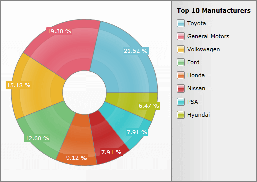
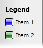
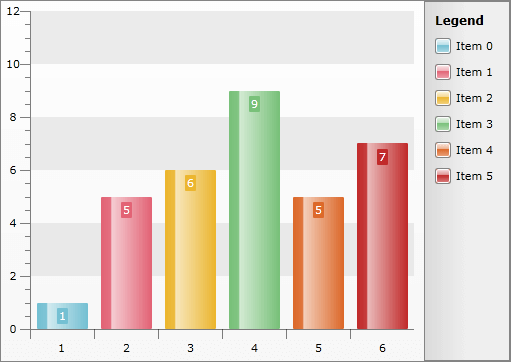
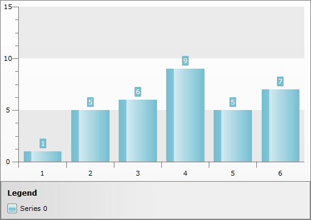
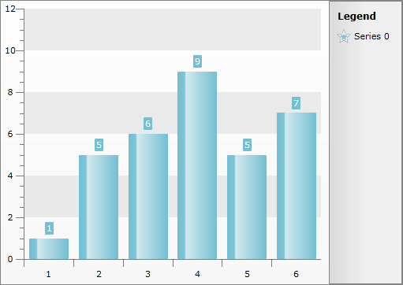

# Chart Legend

__ChartLegend__is used to provide information about the charts shown on the chart area. The __ChartLegend__has __Header__, usually some text and items - one for each chart series.

>tipTo see how to style and template __ChartLegend__ take a look at the [Styling the Chart Legend]() topic.

This topic will make you familiar with the following things:

* [Automatic Legend Items Generation](#Automatic_Legend_Items_Generation)

* [Manual Legend Items Generation](#Manual_Legend_Items_Generation)

* [Legend Display Modes](#Legend_Display_Modes)

* [Legend Positioning](#Legend_Positioning)

* [Legend Items Shape](#Legend_Items_Shape)

* [Reverse Legend Items Order](#Reverse_Legend_Items_Order)

## Automatic Legend Items Generation

In order to have legend items generated automatically, you have to use the property __UseAutoGeneratedItems__. When it is __True__ (__Default__ value), __ChartLegend__will add automatically one item for each chart series from the associated [ChartArea]().

#### __XAML__

{{region radchart-features-chart-legend_0}}
	<telerikChart:RadChart x:Name="radChart" Height="362" Width="511" VerticalAlignment="Top" >
	    <telerikChart:RadChart.DefaultView>
	        <telerikCharting:ChartDefaultView>
	
	            <telerikCharting:ChartDefaultView.ChartLegend>
	                <telerikCharting:ChartLegend x:Name="chartLegend" Header="Top 10 Manufacturers" UseAutoGeneratedItems="True" />
	            </telerikCharting:ChartDefaultView.ChartLegend>
	            <telerikCharting:ChartDefaultView.ChartArea>
	                <telerikCharting:ChartArea LegendName="chartLegend">
	                </telerikCharting:ChartArea>
	            </telerikCharting:ChartDefaultView.ChartArea>
	
	        </telerikCharting:ChartDefaultView>
	    </telerikChart:RadChart.DefaultView>
	</telerikChart:RadChart>
	{{endregion}}

>tipBy default, the __RadChart.DefaultView.ChartLegend__ is associated with the __RadChart.DefaultView.ChartArea__. However, if you predefine the __DefaultView__ (like it was done in the XAML above), be sure that the __ChartArea__ has its property __LegendName__ set to the name of the newly created __ChartLegend__. Otherwise, your legend items will not be auto generated.

>tipIf you want to set the legend title only, it is better to do it in the code-behind not in the XAML, because you will have to predefine the whole [visual structure]() of the chart's default view.

#### __C#__

{{region radchart-features-chart-legend_1}}
	radChart.DefaultView.ChartLegend.UseAutoGeneratedItems = true;
	radChart.DefaultView.ChartLegend.Header = "Top 10 Manufacturers";
	{{endregion}}

#### __VB.NET__

{{region radchart-features-chart-legend_2}}
	radChart.DefaultView.ChartLegend.UseAutoGeneratedItems = true
	radChart.DefaultView.ChartLegend.Header = "Top 10 Manufacturers"
	{{endregion}}

As you can see, the __ChartLegend__ on the right side of the __RadChart__ is automatically generated and has one item for each manufacturer (series).

         
      

## Manual Legend Items Generation

If you need to explicitly create legend items, set the value of the property __UseAutoGeneratedItems__ to __False__ and manually add the items which you need to the chart legend.

Here is a small example which demonstrates how to create and add new legend items to the chart legend of a chart.

#### __XAML__

{{region radchart-features-chart-legend_3}}
	<telerikChart:RadChart x:Name="radChart">
	    <telerikChart:RadChart.DefaultView>
	        <telerikCharting:ChartDefaultView>
	            ...
	            <telerikCharting:ChartDefaultView.ChartLegend>
	                <telerikCharting:ChartLegend x:Name="chartLegend"
	                                             Header="Top 10 Manufacturers"
	                                             UseAutoGeneratedItems="False">
	                    <telerikCharting:ChartLegend.Items>
	                        <telerikCharting:ChartLegendItem MarkerFill="Blue"
	                                                         Label="Item 1" />
	                        <telerikCharting:ChartLegendItem MarkerFill="Green"
	                                                         Label="Item 2" />
	                    </telerikCharting:ChartLegend.Items>
	                </telerikCharting:ChartLegend>
	            </telerikCharting:ChartDefaultView.ChartLegend>
	            ...
	        </telerikCharting:ChartDefaultView>
	    </telerikChart:RadChart.DefaultView>
	</telerikChart:RadChart>
	{{endregion}}

#### __C#__

{{region radchart-features-chart-legend_4}}
	Telerik.Windows.Controls.RadChart radChart = new Telerik.Windows.Controls.RadChart();
	radChart.DefaultView.ChartLegend.UseAutoGeneratedItems = false;
	
	ChartLegendItem item1 = new ChartLegendItem();
	item1.Label = "Item 1";
	item1.MarkerFill = new SolidColorBrush( Colors.Blue );
	radChart.DefaultView.ChartLegend.Items.Add( item1 );
	ChartLegendItem item2 = new ChartLegendItem();
	item2.Label = "Item 2";
	item2.MarkerFill = new SolidColorBrush( Colors.Green );
	radChart.DefaultView.ChartLegend.Items.Add( item2 );
	{{endregion}}

#### __VB.NET__

{{region radchart-features-chart-legend_5}}
	Dim radChart As New Telerik.Windows.Controls.RadChart()
	radChart.DefaultView.ChartLegend.UseAutoGeneratedItems = False
	Dim item1 As New ChartLegendItem()
	item1.Label = "Item 1"
	item1.MarkerFill = New SolidColorBrush( Colors.Blue )
	radChart.DefaultView.ChartLegend.Items.Add( item1 )
	Dim item2 As New ChartLegendItem()
	item2.Label = "Item 2"
	item2.MarkerFill = New SolidColorBrush( Colors.Green )
	radChart.DefaultView.ChartLegend.Items.Add( item2 )
	{{endregion}}

And here is the result:

         
      

## Legend Display Modes

The __SeriesDefinitions__ expose the __LegendDisplayMode__ property, which allows you to specify the way in which the Legend gets displayed. You can choose between three values:

* __DataPointLabel__ - this will display an item for each __DataPoint__ in your series and each series item will be marked with a different color. 

* __None__ - this will display no items in the legend. 

* __SeriesLabel__ - this will display an item for each series in your __RadChart__.

>tipThe default value is different depending on the type of the series.

Here is an example of how the legend looks, when the __LegednDisplayMode__ of the __DefaultSeriesDeifinition__ is set to __DataPointLabel__.

>tipWhen using dynamic data and you want the __LegednDisplayMode__ to be set to __DataPointLabel__, you have to create an __ItemMapping__ for the __LegendLabel__ property of the __DataPoint__. More information about __ItemMappings__ can be found [here]().

#### __C#__

{{region radchart-features-chart-legend_6}}
	public LegendDisplayModeSample()
	{
	    InitializeComponent();
	    this.radChart.ItemsSource = new int[] { 1, 5, 6, 9, 5, 7 };
	    this.radChart.DefaultSeriesDefinition.LegendDisplayMode = LegendDisplayMode.SeriesLabel;
	}
	{{endregion}}

#### __VB.NET__

{{region radchart-features-chart-legend_7}}
	Public Sub New()
	 InitializeComponent()
	 Me.radChart.ItemsSource = New Integer() {1, 5, 6, 9, 5, 7}
	 Me.radChart.DefaultSeriesDefinition.LegendDisplayMode = LegendDisplayMode.SeriesLabel
	End Sub
	{{endregion}}

         
      

## Legend Positioning

You are able to specify the position of the Legend by just setting the __ChartLegendPosition__ property of the __ChartDefaultView__. It can have one of the following values:

* __Bottom__ - places the legend at the bottom of the __RadChart__. 

* __Left__ - places the legend at the left of the __RadChart.__

* __Right__ - places the legend at the right of the __RadChart. (default)__

* __Top__ - places the legend at the top of the __RadChart.__

Here is an example:

#### __C#__

{{region radchart-features-chart-legend_8}}
	this.radChart.DefaultView.ChartLegendPosition = Dock.Bottom;
	{{endregion}}

#### __VB.NET__

{{region radchart-features-chart-legend_9}}
	Me.radChart.DefaultView.ChartLegendPosition = Dock.Bottom
	{{endregion}}

         
      

## Legend Items Shape

You are able to specify the shape of the Legend Item Markers just by setting the __LegendItemMarkerShape__ property of the ChartLegend. It can be assigned to the following shapes:

* __Line__

* __Circle__

* __Diamond__

* __Hexagon__

* __Square__

* __SquareRounded (default)__

* __StarEightRay__

* __StarFiveRay__

* __Triangle__

Here is an example:

#### __C#__

{{region radchart-features-chart-legend_10}}
	this.radChart.DefaultView.ChartLegend.LegendItemMarkerShape = MarkerShape.StarFiveRay;
	{{endregion}}

#### __VB.NET__

{{region radchart-features-chart-legend_11}}
	Me.radChart.DefaultView.ChartLegend.LegendItemMarkerShape = MarkerShape.StarFiveRay
	{{endregion}}

         
      

## Reverse Legend Items Order

There are scenarios where you would like to have the Legend Items displayed in reverse order.
        For example when you have a *Horizontal Bar Series* the series will be displayed in the Legend in the way they are populated.
        The bottom Serie will appear first on the Legend and the topmost will be last in the Legend. For such scenarios RadChart exposes a __ReverseLegendItemsOrder__ boolean property to reverse the Legend Items order as its name implies.

# See Also

 * [Chart Title]()

 * [Chart Area]()

 * [DefaultView]()

 * [RadChart Visual Structure]()

 * [Styling the Chart Legend]()
