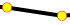
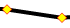
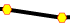
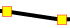
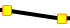
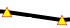

# Chart Point-marks

Most of the charts show a point mark for each data point. __RadChart__ allows you to configure the appearance of these point marks by changing their shape and colors. To do that, you have to use __ISeriesDefinition.Appearance.PointMark__ property which is of type __PointMarkAppearanceSettings__ where you can change the __Fill__, __Shape__, __Stroke__ and __StrokeTickness__ properties of the point marks.

__RadChart__ supports eight predefined shapes that you can use to customize the appearance of the point marks for certain series like __Line__, __Spline__, __Area__, etc. The shapes are members of the __Telerik.Windows.Controls.Charting.MarkerShape__ enumeration:

* __Circle__ (default) 

* __Diamond__

* __Hexagon__

* __Square__

* __SquareRounded__

* __StarEightRay__

* __StarFiveRay__

* __Triangle__

To learn more about customizing the point marks read the [Styling the Point Marks]() topic. In case the provided customizations are not enough, you can completely re-template the point mark. See [here]() for more information.

## See Also

 * [Styling the Point Marks]()

 * [Chart Area]()

 * [Data Binding Support Overview]()
