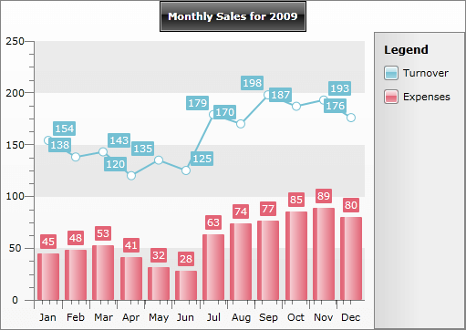
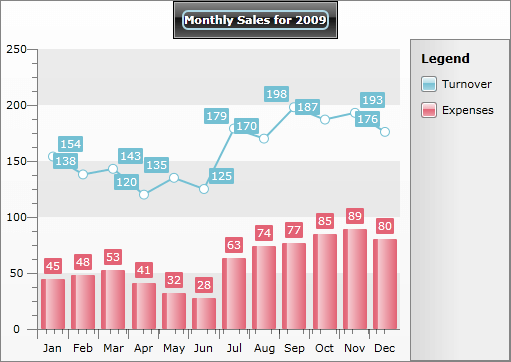

# Chart Title

The __ChartTitle__ is a content control placed at the top of each chart control. It is used to display any title information regarding the visualized chart.
 


You can specify the content of the default __ChartTitle__ control from XAML or code-behind, like this:


```XAML
	<telerik:RadChart x:Name="radChart">
	    <telerik:RadChart.DefaultView>
	        <telerik:ChartDefaultView>
	            <telerik:ChartDefaultView.ChartTitle>
	
	                <telerik:ChartTitle HorizontalAlignment="Center" Content="Monthly Sales for 2009" />
	
	            </telerik:ChartDefaultView.ChartTitle>
	        </telerik:ChartDefaultView>
	    </telerik:RadChart.DefaultView>
	</telerik:RadChart>
```


```C#
	this.radChart.DefaultView.ChartTitle.Content = "Monthly Sales for 2009";
```


```VB.NET
	radChart.DefaultView.ChartTitle.Content = "Monthly Sales for 2009"
```

Since __ChartTitle__ is a content control, you can set as its content not only textual data but also any other type of controls. The following example demonstrates how to create custom chart title with __TextBlock__ in a __Border__ control.


```XAML
	<telerik:RadChart>
	    <telerik:RadChart.DefaultView>
	        <telerik:ChartDefaultView>
	            <telerik:ChartDefaultView.ChartTitle>
	
	                <telerik:ChartTitle HorizontalAlignment="Center">
	                    <Border BorderBrush="LightBlue"
	                            BorderThickness="2"
	                            CornerRadius="5">
	                        <TextBlock Text="Monthly Sales for 2009" />
	                    </Border>
	                </telerik:ChartTitle>
	
	            </telerik:ChartDefaultView.ChartTitle>
	        </telerik:ChartDefaultView>
	    </telerik:RadChart.DefaultView>
	</telerik:RadChart>
```


```C#
	Telerik.Windows.Controls.RadChart radChart = new Telerik.Windows.Controls.RadChart();
	//....
	Border border = new Border();
	border.BorderThickness = new Thickness( 2 );
	border.CornerRadius = new CornerRadius( 5 );
	border.BorderBrush = new SolidColorBrush(Color.FromArgb( 255, 173, 216, 230 ));
	border.Child = new TextBlock(){ Text = "Monthly Sales for 2009" };
	radChart.DefaultView.ChartTitle.Content = border;
```


```VB.NET
	Dim radChart As New Telerik.Windows.Controls.RadChart()
	'....'
	Dim border As New Border()
	border.BorderThickness = New Thickness(2)
	border.CornerRadius = New CornerRadius(5)
	border.BorderBrush = New SolidColorBrush(Color.FromArgb(255, 173, 216, 230))
	border.Child = New TextBlock()
	'Set the content of the ChartTitle'
	radChart.DefaultView.ChartTitle.Content = border
```


And here is the final result:
 


If you want to learn more about styling the __ChartTitle__ take a look at the [Customizing Title]() topic.

## See Also

 * [Styling the Chart Title]()

 * [RadChart Visual Structure]()

 * [Chart Area]()

 * [Chart Legend]()

 * [DefaultView]()
