# 2D Charts

## 

__RadChart__ offers 27 2D chart types:

<table> <tr><td>Bar</td><td>

         
      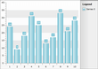</td><td>Bar charts graphically display values in vertical bars across categories.</td><td>Bar charts are useful for comparing multiple series of data (i.e. providing snapshots of data at particular points in time).</td></tr><tr><td>Stacked Bar</td><td>

         
      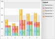</td><td>Stacked Bar charts are used to compare contributions of values to a total across categories</td><td>Use the Stacked Bar chart when you need visibility to the combined values for each category.</td></tr><tr><td>Stacked Bar 100%</td><td>

         
      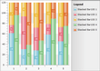</td><td>Stacked Bar 100% shows the combined contribution of values as percentages where the combined total for each category is 100 percent.</td><td>Use when the relationship between values in a category is more significant than the amounts.</td></tr><tr><td>Horizontal Bar</td><td>

         
      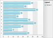</td><td>Horizontal bar charts graphically display values in horizontal bars across categories</td><td>Horizontal bar charts are mostly used to show comparisons between two or more series of data. Also, for categorical charts, you have more space for labels on the Y-Axis which is as a list that reads from top to bottom. These charts might be used to represent data that has a defined start and an end date.</td></tr><tr><td>Horizontal Stacked Bar</td><td>

         
      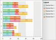</td><td>Horizontal stacked bar charts are used to compare contributions of values to a total across categories</td><td>Use the Horizontal Stacked Bar chart when you need visibility to the combined values for each category. Suitable when you have more than three data series.</td></tr><tr><td>Horizontal Stacked Bar 100%</td><td>

         
      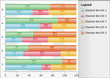</td><td>The Horizontal Stacked Bar 100% shows the combined contribution of values as percentages where the combined total for each category is 100 percent</td><td>Use when the relationship between values in a category is more significant than the amounts. Suitable when you have more than three data series.</td></tr><tr><td>Line</td><td>

         
      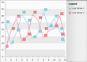</td><td>This chart type displays a set of data points connected by a line.</td><td>A common use for the line chart is to show trends over a period of time.</td></tr><tr><td>Stacked Line</td><td>

         
      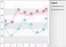</td><td>The Stacked Line chart is a variation of the Line chart that displays a set of data points connected by a line, but the lines are stacked so that each series adjoins but does not overlap the preceding series.</td><td>Use the Stacked Line when you need visibility to the combined values of two or more series.</td></tr><tr><td>Area</td><td>

         
      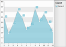</td><td>The Area chart consists of a series of data points joined by a line where the area below the line is filled.</td><td>Area charts are appropriate for visualizing data that fluctuates over a period of time and can be useful for emphasizing trends.</td></tr><tr><td>Stacked Area</td><td>

         
      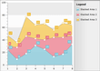</td><td>The Stacked Area chart is a variation of the Area chart that displays trends of the contribution of each value over time (or across categories). The areas are stacked so that each series adjoins but does not overlap the preceding series.</td><td>Stacked Area charts are appropriate for visualizing data that fluctuates over a period of time and where the entire area for all series data must be visible at one time.</td></tr><tr><td>Stacked Area 100%</td><td>

         
      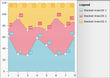</td><td>Stacked Areas 100% charts are a variation of Stacked Area charts that present values for trends as percentages, totaling to 100% for each category.</td><td>Use this chart type to visualize data that fluctuates over a period of time and where the relationship between values in a category is more significant than the amounts.</td></tr><tr><td>Range</td><td>

         
      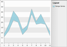</td><td>A range chart type displays a set of data points that are each defined by multiple values for the same category. Values are represented by the height of the marker as measured by the value axis. The range chart fills in the area between the top and bottom value for each data point.</td><td>Range charts are often used to graph data that contains minimum and maximum values for each category group in the dataset.</td></tr><tr><td>Spline Range</td><td>

         
      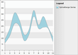</td><td>A spline range chart type displays a set of data points that are each defined by multiple values for the same category. Values are represented by the height of the marker as measured by the value axis. The spline range chart fills in the area between the top and bottom value for each data point.</td><td>Spline range charts are often used to graph data that contains minimum and maximum values for each category group in the dataset.</td></tr><tr><td>Spline</td><td>

         
      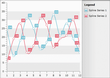</td><td>Spline charts allow you to take a limited set of known data points and approximate intervening values.</td><td>The Spline chart is often used for data modelling by taking a limited number of data points and interpolating or estimating the intervening values.</td></tr><tr><td>Stacked Spline</td><td>

         
      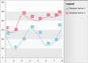</td><td>The Stacked Spline chart is a variation of Spline chart. The areas are stacked so that each series adjoins but does not overlap the preceding series.</td><td>

Use the Stacked Spline when you need to show the correlation between two or more series of data visualized as splines.</td></tr><tr><td>Spline Area</td><td>

         
      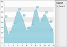</td><td>The Spline Area chart type defines one or more spline curves and fills in the area defined by the spline.</td><td>Can be used for data modelling. It takes a limited number of data points and interpolates the intervening values. This chart type also emphasizes the area between the spline curve and a mid-point of the spline.</td></tr><tr><td>Stacked Spline Area</td><td>

         
      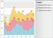</td><td>The Stacked Spline Area chart is a variation of the Spline Area chart. The areas are stacked so that each series adjoins but does not overlap the preceding series.</td><td>Can be used for data modelling. It takes a limited number of data points and interpolates the intervening values. This chart type allows the entire surface area for all sequences to be displayed at one time.</td></tr><tr><td>Stacked Spline Area 100%</td><td>

         
      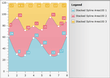</td><td>The Stacked Spline Area 100% chart is a variation of the Spline Area chart. The areas are stacked so that each series adjoins but does not overlap the preceding series and where the combined total for each category is 100 percent.</td><td>Can be used for data modelling. It takes a limited number of data points and interpolates the intervening values. This chart type allows the entire surface area for all sequences to be displayed at one time. Use this chart type when the relationship between the values in a category is more significant than the amounts.</td></tr><tr><td>Bubble</td><td>

         
      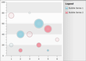</td><td>The Bubble chart show correlations between sets of values. The bubble size is used to convey larger values.</td><td>The Bubble chart is often used for scientific data modeling or financial data.</td></tr><tr><td>Stick</td><td>

         
      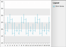</td><td>The Stick, like the CandleStick chart, shows a range of value movement over time. It uses only lines to do so. The left tick shows the "open" value, while the right one represents the "close" value. The vertical line shows the extreme high and low values.</td><td>Use this chart type to visualize prices or currency fluctuations.  Typically this chart is used to analyze stock prices or currency changes.</td></tr><tr><td>CandleStick</td><td>

         
      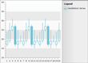</td><td>The CandleStick chart combines bar and line chart styles to show a range of value movement over time. Dark colored bars show downward trends, light colored bars show upward trends and the line through the center (the "wick") shows the extreme high and low values.</td><td>Use this chart type to visualize prices or currency fluctuations.  Typically this chart is used to analyze stock prices or currency changes.</td></tr><tr><td>Pie</td><td>

         
      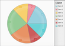</td><td>The Pie chart shows slices representing fractional parts of a whole.</td><td>When you need to display the contribution of fractional parts to a whole.</td></tr><tr><td>Doughnut</td><td>

         
      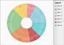</td><td>The Doughnut chart is very close to the Pie chart. The only difference is that it uses a doughnut shape instead of the solid pie.</td><td>When you need to display the contribution of fractional parts to a whole.</td></tr><tr><td>Scatter</td><td>

         
      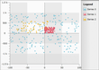</td><td>The Scatter chart displays values as a set of separated points.</td><td>When you have to compare aggregated data across categories, you can use this type of chart.</td></tr><tr><td>Step Line</td><td>

         
      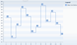</td><td>This chart type displays a set of data points connected by a Step line.</td><td>A common use for the step line chart is to show trends over a period of time.</td></tr><tr><td>Step Area</td><td>

         
      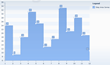</td><td>

The Step Area chart type is similar to step line with the area under the step line filled in
</td><td>Step Area charts are appropriate for visualizing data that fluctuates over a period of time and can be useful for emphasizing trends.</td></tr><tr><td>Range Bar</td><td>

         
      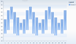</td><td>

The Range Bar, like the CandleStick chart, shows a range of value movement over time. It uses only bars to do so. The vertical bar  shows the extreme high and low values.

The Range Bar can have Horizontal orientation.</td><td>The Range Bar chart type displays separate events that have beginning and end values known as Low and High.</td></tr></table>

# See Also

 * [3D Charts]()

 * [Create Data Bound Chart]()

 * [Create a Line Chart with Static Data]()
