# 3D Charts

## 

__RadChart__ offers 1018 3D chart types: 

<table> <tr><td>Bar 3D</td><td>

         
      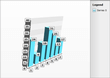</td><td>As Bar charts do, the Bar3D charts graphically display values in vertical and horizontal bars across categories.</td><td>Bar3D charts are useful for comparing multiple series of data (i.e. providing snapshots of data at particular points in time).</td></tr><tr><td>Stacked Bar 3D</td><td>

         
      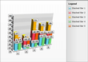</td><td>As StackedBar charts, the StackedBar3D are used to compare contributions of values to a total across categories.</td><td>Use the StackedBar3D chart when you need visibility to the combined values for each category.</td></tr><tr><td>Stacked Bar 100% 3D</td><td>

         
      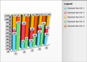</td><td>As Stacked Bar 100% charts, Stacked Bar 100% 3D shows the combined contribution of values as percentages where the combined total for each category is 100 percent.</td><td>Use when the relationship between values in a category is more significant than the amounts.</td></tr><tr><td>Pie 3D</td><td>

         
      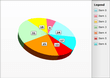</td><td>The Pie3D chart shows slices representing fractional parts of a whole.</td><td>When you need to display the contribution of fractional parts to a whole.</td></tr><tr><td>Doughnut 3D</td><td>

         
      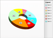</td><td>Same as Pie3D chart, but leaving the center empty (for additional Pie3D/Doughnut3D series).</td><td>When you need to display the contribution of fractional parts to a whole.</td></tr><tr><td>Line 3D</td><td>

         
      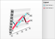</td><td>Line3D chart type displays a set of data points connected by a line in a 3D scene.</td><td>A common use for the line chart is to show trends over a period of time.</td></tr><tr><td>Area 3D</td><td>

         
      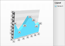</td><td>The Area 3D chart consists of a series of data points joined by a line where the area below the line is filled.</td><td>Area charts are appropriate for visualizing data that fluctuates over a period of time and can be useful for emphasizing trends.</td></tr><tr><td>Stacked Area 3D</td><td>

         
      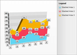</td><td>

The Stacked Area 3D chart is a variation of the Area 3D chart that displays trends of the contribution of each value over time (or across categories). The areas are stacked so that each series adjoins but does not overlap the preceding series.</td><td>

Stacked Area charts are appropriate for visualizing data that fluctuates over a period of time and can be useful for emphasizing trends.</td></tr><tr><td>Stacked Area 100% 3D</td><td>

         
      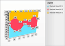</td><td>The Stacked Area 100% 3D charts are a variation of the Stacked Area charts that present values for trends as percentages, totaling to 100% for each category.</td><td>Use this chart type to visualize data that fluctuates over a period of time and where the relationship between the values in a category is more significant than the amounts.</td></tr><tr><td>Stacked Line 3D</td><td>

         
      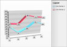</td><td>The Stacked Line 3D chart is a variation of the Stacked Line chart that displays a set of data points connected by a line, but the lines are stacked so that each series adjoins but does not overlap the preceding series.</td><td>Use this chart type when you need visibility to the combined values of two or more series.</td></tr><tr><td>Funnel</td><td>

         
      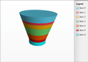

[Link...](#)</td><td>The Funnel chart renders data from a single series, where items are stacked on top of each other. The height of the items represent their contribution to the whole.</td><td>When you need to display the contribution of fractional parts to a whole.</td></tr><tr><td>Pyramid</td><td>

         
      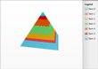

[Link...](#)</td><td>The Pyramid chart renders data from a single series, where items are stacked on top of each other. The height of the items represent their contribution to the whole.</td><td>When you need to display the contribution of fractional parts to a whole.</td></tr><tr><td>Spline 3D</td><td>

         
      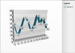

[Link...](#)</td><td>Spline 3D charts allow you to take a limited set of known data points and approximate intervening values.</td><td>The Spline 3D chart is often used for data modelling by taking a limited number of data points and interpolating or estimating the intervening values.</td></tr><tr><td>Spline Area 3D</td><td>

         
      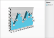</td><td>The Spline Area 3D chart type defines one or more spline curves and fills in the space defined by the spline in the 3D scene.</td><td>Can be used for data modelling. It takes a limited number of data points and interpolates the intervening values. This chart type also emphasizes the area between the spline curve and a mid-point of the spline.</td></tr><tr><td>Stacked Spline 3D</td><td>

         
      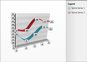</td><td>The Stacked Spline 3D chart is a variation of the Stacked Spline chart. The areas are stacked so that each series adjoins but does not overlap the preceding series.</td><td>

Use the Stacked Spline when you need to show the correlation between two or more series of data visualized as splines.</td></tr><tr><td>Stacked Spline Area 3D</td><td>

         
      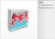</td><td>

The Stacked Spline Area 3D chart is a variation of the Spline Area 3D chart that displays trends of the contribution of each value over time (or across categories). The areas are stacked so that each series adjoins but does not overlap the preceding series.</td><td>

Can be used for data modelling. It takes a limited number of data points and interpolates the intervening values. This chart type allows the entire surface area for all sequences to be displayed at one time.</td></tr><tr><td>Stacked Spline Area 100% 3D</td><td>

         
      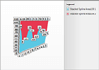</td><td>

The Stacked Spline Area 100% 3D charts are a variation of the Spline Area 3D chart. The areas are stacked so that each series adjoins but does not overlap the preceding series and where the combined total for each category is 100 percent.</td><td>Can be used for data modelling. It takes a limited number of data points and interpolates the intervening values. This chart type allows the entire surface area for all sequences to be displayed at onece. Use this chart type when the relationship between values in a category is more significant than the amounts.</td></tr><tr><td>Bubble3D</td><td>

         
      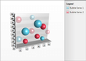</td><td>The Bubble3D chart shows correlations between sets of values. The bubble size is used to convey larger values.</td><td>The Bubble3D chart is often used for scientific data modeling or financial data.</td></tr></table>

# See Also

 * [2D Charts]()

 * [Create Data Bound Chart]()

 * [Create a Line Chart with Static Data]()
