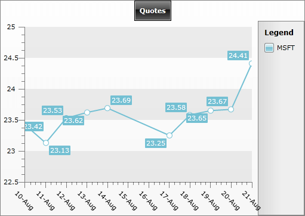
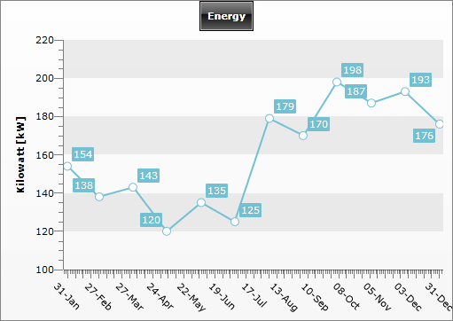

# DateTime Support


Often charts are used to display information for certain period in time. __RadChart__ provides full support of __DateTime__ values and allows you to show dates on the [X-Axis]().

You can populate your chart with __DateTime__ values by using __SeriesMapping__ or __DataPoints__. Take a look at the [Populating with Data]() topic for more details.

## Using data binding (SeriesMapping/ItemMapping)

On the example below, __RadChart.ItemSource__ is set to a collection of __TradeData__ object. __TradeData__ has the following definition:


```C#
	public class TradeData
	{
	    //...
	    public DateTime FromDate { get; set; }
	    public double Close { get; set; }
	    //...
	}
```


```VB.NET
	Public Class TradeData
	    '....'
	    Private _FromDate As DateTime
	    Public Property FromDate() As DateTime
	        Get
	            Return _FromDate
	        End Get
	        Set(ByVal value As DateTime)
	            _FromDate = value
	        End Set
	    End Property
	
	    Private _Close As Double
	    Public Property Close() As Double
	        Get
	            Return _Close
	        End Get
	        Set(ByVal value As Double)
	            _Close = value
	        End Set
	    End Property
	    '....'
	End Class
```

Now, you have to [bind]() the __TradeData.FromDate__ to __DataPointMember.XValue__ and __TradeDate.Close__ to __DataPointMember.YValue__ using [SeriesMapping/ItemMapping]() mechanism. Additionally, the [X-Axis]() is customized: the values are formatted (__radChart.DefaultView.ChartArea.AxisX.DefaultLabelFormat__ = "dd-MMM") and rotated on 45 degree (__radChart.DefaultView.ChartArea.AxisX.LabelRotatingAngle__ = 45):


```XAML
	<telerik:RadChart x:Name="radChart"
	                  Width="511"
	                  Height="362"
	                  VerticalAlignment="Top">
	    <telerik:RadChart.SeriesMappings>
	        <telerik:SeriesMapping LegendLabel="MSFT">
	            <telerik:SeriesMapping.SeriesDefinition>
	                <telerik:LineSeriesDefinition ShowItemLabels="False" />
	            </telerik:SeriesMapping.SeriesDefinition>
	
	            <telerik:SeriesMapping.ItemMappings>
	                <telerik:ItemMapping DataPointMember="XValue" FieldName="FromDate" />
	                <telerik:ItemMapping DataPointMember="YValue" FieldName="Close" />
	            </telerik:SeriesMapping.ItemMappings>
	        </telerik:SeriesMapping>
	    </telerik:RadChart.SeriesMappings>
	    <telerik:RadChart.DefaultView>
	        <telerik:ChartDefaultView>
	            <!--  ....  -->
	            <telerik:ChartDefaultView.ChartArea>
	                <telerik:ChartArea LegendName="chartLegend">
	                    <telerik:ChartArea.AxisX>
	                        <telerik:AxisX DefaultLabelFormat="dd-MMM" LabelRotationAngle="45" />
	
	                    </telerik:ChartArea.AxisX>
	                </telerik:ChartArea>
	            </telerik:ChartDefaultView.ChartArea>
	        </telerik:ChartDefaultView>
	    </telerik:RadChart.DefaultView>
	</telerik:RadChart>
```


```C#
	Telerik.Windows.Controls.RadChart radChart = new Telerik.Windows.Controls.RadChart();
	SeriesMapping seriesMapping = new SeriesMapping();
	seriesMapping.LegendLabel = "MSFT";
	seriesMapping.SeriesDefinition = new LineSeriesDefinition();
	seriesMapping.ItemMappings.Add(new ItemMapping("FromDate", DataPointMember.XValue));
	seriesMapping.ItemMappings.Add(new ItemMapping("Close", DataPointMember.YValue));
	radChart.SeriesMappings.Add(seriesMapping);
	radChart.DefaultView.ChartArea.AxisX.DefaultLabelFormat = "dd-MMM";
	radChart.DefaultView.ChartArea.AxisX.LabelRotationAngle = 45;
```


```VB.NET
	Dim radChart As New Telerik.Windows.Controls.RadChart()
	Dim seriesMapping As New SeriesMapping()
	seriesMapping.LegendLabel = "MSFT"
	seriesMapping.SeriesDefinition = New LineSeriesDefinition()
	seriesMapping.ItemMappings.Add(New ItemMapping("FromDate", DataPointMember.XValue))
	seriesMapping.ItemMappings.Add(New ItemMapping("Close", DataPointMember.YValue))
	radChart.SeriesMappings.Add(seriesMapping)
	radChart.DefaultView.ChartArea.AxisX.DefaultLabelFormat = "dd-MMM"
	radChart.DefaultView.ChartArea.AxisX.LabelRotationAngle = 45
```


As a result, the chart will look like the one on the snapshot:
 
      

## Using DataPoint

This example uses data binding mechanism via [SeriesMapping/ItemMapping](). However, using [DataPoints]() is also possible, but you have to be aware of the following specifics:

* __DataPoint.XValue__ is of type __double__. Therefore, the __DateTime__ values have to be converted to OLE Automation dates first: see [DateTime.ToOADate()](http://msdn.microsoft.com/en-us/library/system.datetime.tooadate(VS.95).aspx). 

* The __AxisX.IsDateTime__ should be set to __True__.


```XAML
	<telerik:RadChart Width="511"
	                  Height="362"
	                  HorizontalAlignment="Right"
	                  VerticalAlignment="Top">
	    <telerik:RadChart.DefaultView>
	        <telerik:ChartDefaultView>
	            <!--  ...  -->
	            <telerik:ChartDefaultView.ChartArea>
	                <telerik:ChartArea Margin="0, 0, 5, 0">
	                    <telerik:ChartArea.AxisX>
	                        <telerik:AxisX DefaultLabelFormat="dd-MMM"
	                                       IsDateTime="True"
	                                       LabelRotationAngle="45"
	                                       LayoutMode="Inside" />
	
	                    </telerik:ChartArea.AxisX>
	                    <!--  ....  -->
	                    <telerik:ChartArea.DataSeries>
	                        <!--  Line Chart  -->
	                        <telerik:DataSeries>
	                            <telerik:DataSeries.Definition>
	                                <telerik:LineSeriesDefinition />
	
	                            </telerik:DataSeries.Definition>
	                            <telerik:DataPoint XValue="39844.0" YValue="154" />
	                            <telerik:DataPoint XValue="39872.0" YValue="138" />
	                            <telerik:DataPoint XValue="39903.0" YValue="143" />
	                            <telerik:DataPoint XValue="39933.0" YValue="120" />
	                            <telerik:DataPoint XValue="39964.0" YValue="135" />
	                            <telerik:DataPoint XValue="39994.0" YValue="125" />
	                            <telerik:DataPoint XValue="40025.0" YValue="179" />
	                            <telerik:DataPoint XValue="40056.0" YValue="170" />
	                            <telerik:DataPoint XValue="40086.0" YValue="198" />
	                            <telerik:DataPoint XValue="40117.0" YValue="187" />
	                            <telerik:DataPoint XValue="40147.0" YValue="193" />
	                            <telerik:DataPoint XValue="40178.0" YValue="176" />
	                        </telerik:DataSeries>
	                    </telerik:ChartArea.DataSeries>
	                </telerik:ChartArea>
	            </telerik:ChartDefaultView.ChartArea>
	        </telerik:ChartDefaultView>
	    </telerik:RadChart.DefaultView>
	</telerik:RadChart>
```


```C#
	Telerik.Windows.Controls.RadChart radChart = new Telerik.Windows.Controls.RadChart();
	//....
	radChart.DefaultView.ChartArea.AxisX.IsDateTime = true;
	radChart.DefaultView.ChartArea.AxisX.LayoutMode = AxisLayoutMode.Inside;
	radChart.DefaultView.ChartArea.AxisX.LabelRotationAngle = 45;
	radChart.DefaultView.ChartArea.AxisX.DefaultLabelFormat = "dd-MMM";
	//....
	DataSeries lineSeries = new DataSeries();
	lineSeries.Definition = new LineSeriesDefinition();
	lineSeries.Add( new DataPoint() { YValue = 154, XValue = new DateTime( 2009, 1, 31 ).ToOADate() } );
	lineSeries.Add( new DataPoint() { YValue = 138, XValue = new DateTime( 2009, 2, 28 ).ToOADate() } );
	lineSeries.Add( new DataPoint() { YValue = 143, XValue = new DateTime( 2009, 3, 31 ).ToOADate() } );
	lineSeries.Add( new DataPoint() { YValue = 120, XValue = new DateTime( 2009, 4, 30 ).ToOADate() } );
	lineSeries.Add( new DataPoint() { YValue = 135, XValue = new DateTime( 2009, 5, 31 ).ToOADate() } );
	lineSeries.Add( new DataPoint() { YValue = 125, XValue = new DateTime( 2009, 6, 30 ).ToOADate() } );
	lineSeries.Add( new DataPoint() { YValue = 179, XValue = new DateTime( 2009, 7, 31 ).ToOADate() } );
	lineSeries.Add( new DataPoint() { YValue = 170, XValue = new DateTime( 2009, 8, 31 ).ToOADate() } );
	lineSeries.Add( new DataPoint() { YValue = 198, XValue = new DateTime( 2009, 9, 30 ).ToOADate() } );
	lineSeries.Add( new DataPoint() { YValue = 187, XValue = new DateTime( 2009, 10, 31 ).ToOADate() } );
	lineSeries.Add( new DataPoint() { YValue = 193, XValue = new DateTime( 2009, 11, 30 ).ToOADate() } );
	lineSeries.Add( new DataPoint() { YValue = 176, XValue = new DateTime( 2009, 12, 31 ).ToOADate() } );
	radChart.DefaultView.ChartArea.DataSeries.Add( lineSeries );
```


```VB.NET
	Dim radChart As New Telerik.Windows.Controls.RadChart()
	'....'
	radChart.DefaultView.ChartArea.AxisX.IsDateTime = True
	radChart.DefaultView.ChartArea.AxisX.LayoutMode = AxisLayoutMode.Inside
	radChart.DefaultView.ChartArea.AxisX.LabelRotationAngle = 45
	radChart.DefaultView.ChartArea.AxisX.DefaultLabelFormat = "dd-MMM"
	'....'
	Dim lineSeries As New DataSeries()
	lineSeries.Definition = New LineSeriesDefinition()
	lineSeries.Add(New DataPoint(New DateTime(2009, 1, 31).ToOADate(), 154))
	lineSeries.Add(New DataPoint(New DateTime(2009, 2, 28).ToOADate(), 138))
	lineSeries.Add(New DataPoint(New DateTime(2009, 3, 31).ToOADate(), 143))
	lineSeries.Add(New DataPoint(New DateTime(2009, 4, 30).ToOADate(), 120))
	lineSeries.Add(New DataPoint(New DateTime(2009, 5, 31).ToOADate(), 135))
	lineSeries.Add(New DataPoint(New DateTime(2009, 6, 30).ToOADate(), 125))
	lineSeries.Add(New DataPoint(New DateTime(2009, 7, 31).ToOADate(), 179))
	lineSeries.Add(New DataPoint(New DateTime(2009, 8, 31).ToOADate(), 170))
	lineSeries.Add(New DataPoint(New DateTime(2009, 9, 30).ToOADate(), 198))
	lineSeries.Add(New DataPoint(New DateTime(2009, 10, 31).ToOADate(), 187))
	lineSeries.Add(New DataPoint(New DateTime(2009, 11, 30).ToOADate(), 193))
	lineSeries.Add(New DataPoint(New DateTime(2009, 12, 31).ToOADate(), 176))
	radChart.DefaultView.ChartArea.DataSeries.Add(lineSeries)
```


The image below shows the chart with defined using __DataPoints__:
 
      

Note how the values are defined in the XAML - this is the OLE Automation equivalent of the dates. In the code behind, __ToOADate()__ method is used to convert the dates and then the value is set to the __XValue__ property of the __DataPoint__ class.

The same logic is used when specifying the __AxisX.MinValue__ and __AxisX.MaxValue__. This example also demonstrates how to customize the __X-axis__ by disabling __AutoRange__ and how to configure the axis manually.


## See Also

 * [Axes Overview]()

 * [Format Expressions]()

 * [Data Binding Support Overview]()
