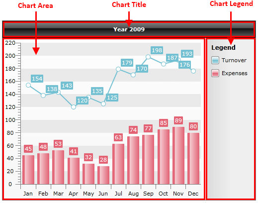

# DefaultView

## 

Usually, when you have a chart to display, it contains title, chart and legend. For this common case, __RadChart__ provides you with __DefaultView__. RadChart.DefaultView is of type __ChartDefaultView__ and contains [ChartTitle](), [ChartArea]() and [ChartLegend]().

When you create your chart declaratively or from the code behind, with static data or using data binding, the chart is displayed using the default view. However, if you need to customize the layout, use __RadChart.UseDefaultLayout__ property and set it to __False__. In this case, you have to build the layout you need and set it to the __RadChar.Content__ property as it is shown in [Creating Chart with Custom Layout]().
        

You can find more information about using __DefaultView__ or a custom layout here: [Creating Chart Declaratively]() and [Creating Chart in Code Behind]().
        

## See Also

 * [Chart Title]()

 * [Chart Area]()

 * [Chart Legend]()

 * [RadChart Visual Structure]()

 * [Populating with Data Overview]()

 * [Data Binding Support Overview]()
