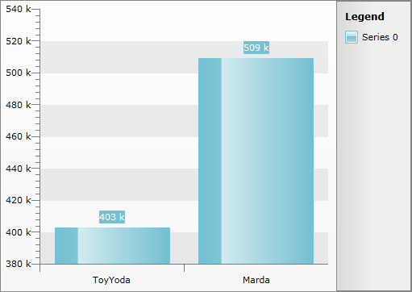
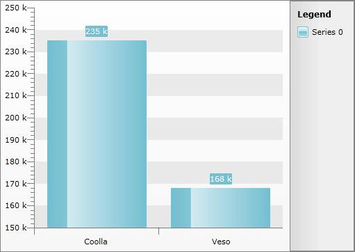

# In a Single Chart Area


## 

Displaying a drill down chart in a single chart area means that the different hierarchy levels won't be visible at the same time. The chart area will visualize only the currently selected one. 

>To make the __RadChart__ display your hierarchical data in drill down form you have to use its __HierarchicalViewDescriptors__ collection. To learn how please read the [Hierarchical View]() topic. It explains the basics around the drill down feature of the __RadChart__ and also gives some sampole data definitions. The same definitions are going to be used in the scope of this topic too.

The usage of a single chart area for displaying hierarchical data in a drill down form is the default behavior for the __RadChart__. So the only thing you have to do is to define the appropriate __ChartHierarchyViewDescriptor__ objects and add the to the __HierarchyViewDescriptors__ collection of the __RadChart__. Here is an example.


```XAML
	<telerik:RadChart x:Name="radChart">
	    <telerik:RadChart.HierarchicalViewDescriptors>
	        <telerik:ChartHierarchicalViewDescriptor>
	            <telerik:ChartHierarchicalViewDescriptor.SeriesMappings>
	                <telerik:SeriesMapping>
	                    <telerik:ItemMapping DataPointMember="YValue" FieldName="Sales.TotalAmount" />
	                    <telerik:ItemMapping DataPointMember="XCategory" FieldName="Name" />
	                </telerik:SeriesMapping>
	            </telerik:ChartHierarchicalViewDescriptor.SeriesMappings>
	        </telerik:ChartHierarchicalViewDescriptor>
	        <telerik:ChartHierarchicalViewDescriptor>
	            <telerik:ChartHierarchicalViewDescriptor.Relation>
	                <telerik:PropertyRelation ParentPropertyName="Sales" />
	            </telerik:ChartHierarchicalViewDescriptor.Relation>
	            <telerik:ChartHierarchicalViewDescriptor.SeriesMappings>
	                <telerik:SeriesMapping>
	                    <telerik:SeriesMapping.GroupingSettings>
	                        <telerik:GroupingSettings ShouldFlattenSeries="True">
	                            <telerik:ChartGroupDescriptor Member="Model" />
	                        </telerik:GroupingSettings>
	                    </telerik:SeriesMapping.GroupingSettings>
	                    <telerik:ItemMapping AggregateFunction="Sum"
	                                         DataPointMember="YValue"
	                                         FieldName="Amount" />
	                    <telerik:ItemMapping DataPointMember="XCategory" FieldName="Model" />
	                </telerik:SeriesMapping>
	            </telerik:ChartHierarchicalViewDescriptor.SeriesMappings>
	        </telerik:ChartHierarchicalViewDescriptor>
	    </telerik:RadChart.HierarchicalViewDescriptors>
	</telerik:RadChart>
```


Here are snapshots of the result - one for the first hierarchy level and one after clicking on the ToyYoda bar.




