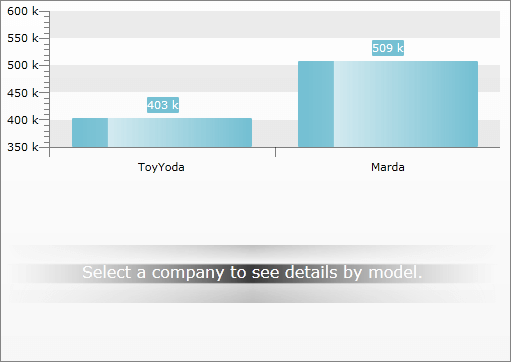
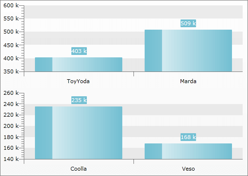

# In Multiple Chart Areas


## 

This is the other of displaying the drill down charts via the __RadChart__ control. Compared to the one that uses a single chart area, this one makes use of multiple chart areas, which count depends on the levels of the hierarchy. Of course you can combine the both of them.

>To make the __RadChart__ display your hierarchical data in drill down form you have to use its __HierarchicalViewDescriptors__ collection. To learn how please read the [Hierarchical View]() topic. It explains the basics around the drill down feature of the __RadChart__ and also gives some sampole data definitions. The same definitions are going to be used in the scope of this topic too.

In order to use multiple chart areas in your __RadChart__ you have to disable the default layout. This is done by setting the __UseDefaultLayout__ property of the __RadChart__ to __False__.

>tipTo learn more about using multiple chart areas read [this topic]().

Now you are able to define more than one chart area inside the __RadChart__ control. Here is a sample structure of a __Grid__ that holds two __ChartAreas__.

#### __XAML__

```XAML
	<telerik:RadChart x:Name="radChart" UseDefaultLayout="False">
	    <Grid>
	        <Grid.RowDefinitions>
	            <RowDefinition Height="*" />
	            <RowDefinition Height="*" />
	        </Grid.RowDefinitions>
	        <telerik:ChartArea x:Name="CompanyChartArea" />
	        <telerik:ChartArea x:Name="ModelSalesChartArea"
	                           Grid.Row="1"
	                           NoDataString="Select a company to see details by model." />
	    </Grid>
	</telerik:RadChart>
```


The definition of the __ChartHierarchicalViewDescriptor__ objects is the same as in the [Hierarchical View]() topic, with the excpetion that each of the SeriesMapping objects is associated with the respective chart area.

>tipYou can associate multiple __SeriesMapping__ objects belonging to different __ChartHierarchicalViewDescriptor__ objects to one and the same __ChartArea__. You just have to set their __ChartAreaName__ property to the respective chart area's name.

#### __XAML__

```XAML
	<telerik:RadChart x:Name="radChart" UseDefaultLayout="False">
	    <Grid>
	        <Grid.RowDefinitions>
	            <RowDefinition Height="*" />
	            <RowDefinition Height="*" />
	        </Grid.RowDefinitions>
	        <telerik:ChartArea x:Name="CompanyChartArea" />
	        <telerik:ChartArea x:Name="ModelSalesChartArea"
	                           Grid.Row="1"
	                           NoDataString="Select a company to see details by model." />
	    </Grid>
	    <telerik:RadChart.HierarchicalViewDescriptors>
	        <telerik:ChartHierarchicalViewDescriptor>
	            <telerik:ChartHierarchicalViewDescriptor.SeriesMappings>
	                <telerik:SeriesMapping ChartAreaName="CompanyChartArea">
	                    <telerik:ItemMapping DataPointMember="YValue" FieldName="Sales.TotalAmount" />
	                    <telerik:ItemMapping DataPointMember="XCategory" FieldName="Name" />
	                </telerik:SeriesMapping>
	            </telerik:ChartHierarchicalViewDescriptor.SeriesMappings>
	        </telerik:ChartHierarchicalViewDescriptor>
	        <telerik:ChartHierarchicalViewDescriptor>
	            <telerik:ChartHierarchicalViewDescriptor.Relation>
	                <telerik:PropertyRelation ParentPropertyName="Sales" />
	            </telerik:ChartHierarchicalViewDescriptor.Relation>
	            <telerik:ChartHierarchicalViewDescriptor.SeriesMappings>
	                <telerik:SeriesMapping ChartAreaName="ModelSalesChartArea">
	                    <telerik:SeriesMapping.GroupingSettings>
	                        <telerik:GroupingSettings ShouldFlattenSeries="True">
	                            <telerik:ChartGroupDescriptor Member="Model" />
	                        </telerik:GroupingSettings>
	                    </telerik:SeriesMapping.GroupingSettings>
	                    <telerik:ItemMapping AggregateFunction="Sum"
	                                         DataPointMember="YValue"
	                                         FieldName="Amount" />
	                    <telerik:ItemMapping DataPointMember="XCategory" FieldName="Model" />
	                </telerik:SeriesMapping>
	            </telerik:ChartHierarchicalViewDescriptor.SeriesMappings>
	        </telerik:ChartHierarchicalViewDescriptor>
	    </telerik:RadChart.HierarchicalViewDescriptors>
	</telerik:RadChart>
```


Here are snapshots of the result - one for the first hierarchy level and one after clicking on the ToyYoda bar.




