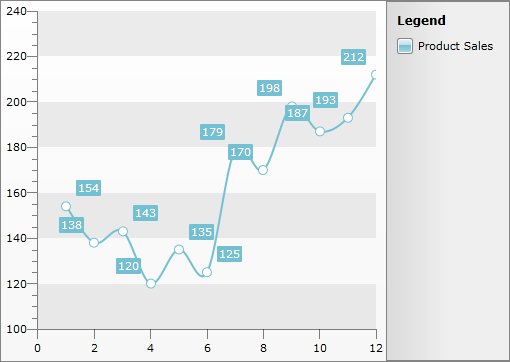

# Filtering

## 

>This feature is available in data bound scenarios only!

The __RadChart__ allows you to programmatically filter its data. This is achieved via the __FilterDescriptors__ property of the __RadChart__or the __FilterDescriptors__ property of the __SeriesMapping__. This collection allows you to use descriptors which define the sorting member and the sorting direction for the data to which the __RadChart__ is bound. As this is a collection you are able not only to add, but also to remove or clear the entries in it, too.

The items in this collection are of type __ChartFilterDescriptor__. It exposes a few important properties:

* __Member__ - defines the field of the data object, by which the data will be filtered.

* __Operator__-  defines the operator, which will be applied to the filtering criteria.

* __Value__ - defines the value that will be compared with the value of the __Member__ property via the __Operator__property.

Here is an example of a chart without filter descriptors.

         
      

Here is an example of implementing filtering.

>tipTo use the __ChartFilterDescriptors__ in XAML you have to declare the following namespace:

#### __XAML__

{{region radchart-features-filtering_0}}
	xmlns:telerikCharting="clr-namespace:Telerik.Windows.Controls.Charting;assembly=Telerik.Windows.Controls.Charting"
	{{endregion}}

#### __XAML__

{{region radchart-features-filtering_1}}
	<telerikChart:RadChart x:Name="radChart">
	    <telerikChart:RadChart.FilterDescriptors>
	        <telerikCharting:ChartFilterDescriptor Member="Quantity"
	                                               Operator="IsLessThanOrEqualTo"
	                                               Value="150" />
	    </telerikChart:RadChart.FilterDescriptors>
	</telerikChart:RadChart>
	{{endregion}}

#### __C#__

{{region radchart-features-filtering_2}}
	ChartFilterDescriptor descriptor = new ChartFilterDescriptor();
	descriptor.Member = "Quantity";
	descriptor.Operator = FilterOperator.IsLessThanOrEqualTo;
	descriptor.Value = 150;
	this.radChart.FilterDescriptors.Add( descriptor );
	{{endregion}}

#### __VB.NET__

{{region radchart-features-filtering_3}}
	Dim descriptor As New ChartFilterDescriptor()
	descriptor.Member = "Quantity"
	descriptor.[Operator] = FilterOperator.IsLessThanOrEqualTo
	descriptor.Value = 150
	Me.radChart.FilterDescriptors.Add(descriptor)
	{{endregion}}

         
      
