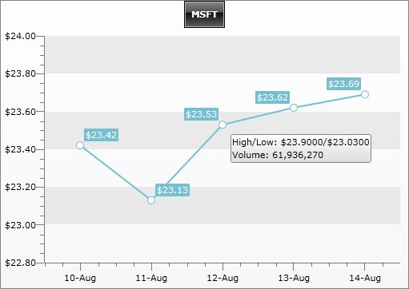

# Format Expressions


__RadChart__ supports format expressions, which you can use to format the series items labels, axes labels and tooltip texts. Besides the [standard](http://msdn.microsoft.com/en-us/library/dwhawy9k.aspx), the [custom](http://msdn.microsoft.com/en-us/library/0c899ak8.aspx) numeric and the [date/time](https://docs.microsoft.com/en-us/dotnet/standard/base-types/standard-date-and-time-format-strings) format strings, __RadChart__ supports chart specific format mechanism that allows you to insert context-specific data. To do that, use one of the following tokens:

|Token|    Use for|    Value|
|-----|-----------|---------|
|#Y|    Series Items Label, Tooltip    |DataPoint.YValue|
|#X|    Series Items Label, Tooltip    |DataPoint.XValue|
|#XCAT|    Series Items Label, Tooltip     |DataPoint.XCategory|
|#HIGH|     Series Items Label, Tooltip     |DataPoint.High|
|#LOW|    Series Items Label, Tooltip    |DataPoint.Low|
|#OPEN|    Series Items Label, Tooltip    |DataPoint.Open|
|#CLOSE|    Series Items Label, Tooltip    |DataPoint.Close|
|#BUBBLESIZE|    Series Items Label, Tooltip    |DataPoint.BubbleSize|
|#LABEL|     Series Items Label, Tooltip    |DataPoint.Label|
|#LEGENDLABEL|     Series Items Label, Tooltip    |DataPoint.LegendLabel|
|#TOOLTIP|     Series Items Label, Tooltip    |DataPoint.Tooltip|
|#SERIESLABEL|    Series Items Label, Tooltip     |DataSeries.LegendLabel|
|#%|    Series Items Label, Tooltip    |DataPoint.YValue / (The sum of all YValues in the current data series)|
|#STSUM|    Series Items Label, Tooltip	|Represents the sum of all stacked items for a given index.|
|#STPERCENT|     Series Items Label, Tooltip     |The percent representation of the value of a given item with respect to all stacked items for the respective index.|
|#DATAITEM.|     Series Items Label, Tooltip     |Use it to access the DataPoint.DataItem and read the value from a property of the underlying business object.|
|#VAL|     X-Axis, Y-Axis     |TickPoint.Value. This will work only when formatting axis labels.|


As you can see, each token consists of two parts: __number sign "#"__ and __name__. Additionally, in a curly braces, you can specify the format of the value if needed.

The __#DATAITEM__ token is a special one. It allows you to specify a property name from the underlying object and when the format expression is applied, the __#DATAITEM__ token will be replaced with the value from the corresponding property. The format is: __#DATAITEM.<PropertyName>__. For example, the format expression "__#DATAITEM.Description__" means, that the value from the property __Description__ will be used.

Besides the format expressions, you can specify how the labels to be formatted by using __ChartArea.LabelFormatBehavior__. You can select one of the three options: __HumanReadable__(default), __Scientific__ and __None__.  However, the format expressions override the selected __LabelFormatBehavior__. More about the label format behavior you can find [here]().

## Specifying Label Formats

The following example demonstrates how to specify a label format expression to customize the axes, the series item labels and the tooltips. 

The created chart is bound to a collection of __TradeData__ objects via [SeriesMapping/ItemMapping](), where the __TradeData__ object has the following structure:


```C#
	public class TradeData
	{
	    public string Emission
	    {
	        get;
	        set;
	    }
	    public DateTime FromDate
	    {
	        get;
	        set;
	    }
	    public DateTime ToDate
	    {
	        get;
	        set;
	    }
	    public double Open
	    {
	        get;
	        set;
	    }
	    public double High
	    {
	        get;
	        set;
	    }
	    public double Low
	    {
	        get;
	        set;
	    }
	    public double Close
	    {
	        get;
	        set;
	    }
	    public double Volume
	    {
	        get;
	        set;
	    }
	    public string Comment
	    {
	        get;
	        set;
	    }
	}
```
```VB.NET
	Public Class TradeData
	    Private _Emission As String
	    Public Property Emission() As String
	        Get
	            Return _Emission
	        End Get
	        Set(ByVal value As String)
	            _Emission = value
	        End Set
	    End Property
	
	    Private _FromDate As DateTime
	    Public Property FromDate() As DateTime
	        Get
	            Return _FromDate
	        End Get
	        Set(ByVal value As DateTime)
	            _FromDate = value
	        End Set
	    End Property
	
	    Private _ToDate As DateTime
	    Public Property ToDate() As DateTime
	        Get
	            Return _ToDate
	        End Get
	        Set(ByVal value As DateTime)
	            _ToDate = value
	        End Set
	    End Property
	
	    Private _Open As Double
	    Public Property Open() As Double
	        Get
	            Return _Open
	        End Get
	        Set(ByVal value As Double)
	            _Open = value
	        End Set
	    End Property
	
	    Private _High As Double
	    Public Property High() As Double
	        Get
	            Return _High
	        End Get
	        Set(ByVal value As Double)
	            _High = value
	        End Set
	    End Property
	
	    Private _Low As Double
	    Public Property Low() As Double
	        Get
	            Return _Low
	        End Get
	        Set(ByVal value As Double)
	            _Low = value
	        End Set
	    End Property
	
	    Private _Close As Double
	    Public Property Close() As Double
	        Get
	            Return _Close
	        End Get
	        Set(ByVal value As Double)
	            _Close = value
	        End Set
	    End Property
	
	    Private _Volume As Double
	    Public Property Volume() As Double
	        Get
	            Return _Volume
	        End Get
	        Set(ByVal value As Double)
	            _Volume = value
	        End Set
	    End Property
	
	    Private _Comment As String
	    Public Property Comment() As String
	        Get
	            Return _Comment
	        End Get
	        Set(ByVal value As String)
	            _Comment = value
	        End Set
	    End Property
	End Class
```

Take a look at the code snippet below and see how to define custom label format strings for your __RadChart__.


```XAML
	<telerik:RadChart x:Name="radChart">
	    <telerik:RadChart.DefaultView>
	        <telerik:ChartDefaultView>
	            <telerik:ChartDefaultView.ChartArea>
	                <telerik:ChartArea>
	                    <telerik:ChartArea.AxisX>
	                        <telerik:AxisX DefaultLabelFormat="dd-MMM" LayoutMode="Inside" />
	                    </telerik:ChartArea.AxisX>
	                    <telerik:ChartArea.AxisY>
	                        <telerik:AxisY DefaultLabelFormat="#VAL{C2}" />
	                    </telerik:ChartArea.AxisY>
	
	                </telerik:ChartArea>
	            </telerik:ChartDefaultView.ChartArea>
	            <!--  ....  -->
	        </telerik:ChartDefaultView>
	    </telerik:RadChart.DefaultView>
	    <telerik:RadChart.SeriesMappings>
	        <telerik:SeriesMapping LegendLabel="MSFT">
	            <telerik:SeriesMapping.SeriesDefinition>
	                <telerik:LineSeriesDefinition ItemLabelFormat="#Y{C2}"
	                                              ItemToolTipFormat="High/Low: #DATAITEM.High{C4}/#DATAITEM.Low{C4}&#x0a;Volume: #DATAITEM.Volume{#,###,###,##0}"
	                                              ShowItemLabels="True"
	                                              ShowItemToolTips="True" />
	            </telerik:SeriesMapping.SeriesDefinition>
	            <telerik:SeriesMapping.ItemMappings>
	                <telerik:ItemMapping DataPointMember="YValue" FieldName="Close" />
	                <telerik:ItemMapping DataPointMember="XValue" FieldName="FromDate" />
	            </telerik:SeriesMapping.ItemMappings>
	        </telerik:SeriesMapping>
	    </telerik:RadChart.SeriesMappings>
	</telerik:RadChart>
```


```C#
	RadChart radChart = new RadChart();
	//....
	radChart.DefaultView.ChartArea.AxisX.DefaultLabelFormat = "dd-MMM";
	radChart.DefaultView.ChartArea.AxisX.LayoutMode = AxisLayoutMode.Inside;
	radChart.DefaultView.ChartArea.AxisY.DefaultLabelFormat = "#VAL{C2}";
	SeriesMapping seriesMapping = new SeriesMapping();
	seriesMapping.SeriesDefinition = new LineSeriesDefinition();
	seriesMapping.SeriesDefinition.ShowItemToolTips = true;
	seriesMapping.SeriesDefinition.ItemLabelFormat = "#Y{C2}";
	seriesMapping.SeriesDefinition.ItemToolTipFormat = 
	    "High/Low: #DATAITEM.High{C4}/#DATAITEM.Low{C4}\nVolume: #DATAITEM.Volume{#,###,###,##0}";
	seriesMapping.ItemMappings.Add( new ItemMapping( "Close", DataPointMember.YValue ) );
	seriesMapping.ItemMappings.Add( new ItemMapping( "FromDate", DataPointMember.XValue ) );
	radChart.SeriesMappings.Add( seriesMapping );
```
```VB.NET
	Dim radChart As New Telerik.Windows.Controls.RadChart()
	'....'
	radChart.DefaultView.ChartArea.AxisX.DefaultLabelFormat = "dd-MMM"
	radChart.DefaultView.ChartArea.AxisX.LayoutMode = AxisLayoutMode.Inside
	radChart.DefaultView.ChartArea.AxisY.DefaultLabelFormat = "#VAL{C2}"
	Dim seriesMapping As New SeriesMapping()
	seriesMapping.SeriesDefinition = New LineSeriesDefinition()
	seriesMapping.SeriesDefinition.ShowItemToolTips = True
	seriesMapping.SeriesDefinition.ItemLabelFormat = "#Y{C2}"
	seriesMapping.SeriesDefinition.ItemToolTipFormat = "High/Low: #DATAITEM.High{C4}/#DATAITEM.Low{C4}" & vbLf & "Volume: #DATAITEM.Volume{#,###,###,##0}"
	seriesMapping.ItemMappings.Add(New ItemMapping("Close", DataPointMember.YValue))
	seriesMapping.ItemMappings.Add(New ItemMapping("FromDate", DataPointMember.XValue))
	radChart.SeriesMappings.Add(seriesMapping)
```

The specified label formats are:

* The __X-Axis__ format is set to "__dd-MMM__". It does not use any tokens, just the standard __DateTime__ formatting to show the day and the three letter abbreviation of the month.

* The __Y-Axis__ uses __#VAL__ token with currency format: "__#VAL{C2}__". As a result, the label shows the tick's value formatted as currency with two digits after the decimal point.

* The series item labels are showing the value from the __DataPoint.Close__ property formatted as currency: "__#Y{C2}__".

* The tooltip is formatted to show two rows. On the first row, the __High__ and the __Low__ values are shown, while on the second - the volume. When the format string is set declaratively, you have to use "&#x0a;" for new line. When it is set in the code behind - "\n":

* "__High/Low: #DATAITEM.High{C4}/#DATAITEM.Low{C4}&#x0a;Volume: #DATAITEM.Volume{#,###,###,##0}"__

* "__High/Low: #DATAITEM.High{C4}/#DATAITEM.Low{C4}\nVolume: #DATAITEM.Volume{#,###,###,##0}"__

The result is shown on the image below. Note that the __YValue__ is bound to the __Close__ property of the underlying business object, while the tooltip using the __#DATAITEM__ token extracts the values from from the __High__, __Low__ and __Volume__ properties and then applies the specified format:
 
      

>The __#TOOLTIP__ token is intended to be used when formatting items labels via __ItemLabelFormat__. This token returns the value from the __DataPoint.Tooltip__ property. More about tooltip formatting see [here]().

On the table below you can see some more examples of format expressions:

|Expression|	Result|
|----------|----------|
|C4|	1234.211|
|#,##0.00|	1,234.21|
|#VAL{C2}|	$1,234.21| 
|Open: #OPEN{C2}|	Open: $1234.21|
|#%{p}|	12.34%|
|Volume: #DATAITEM.Volume{#,###,##0}|	Volume: 1,234,567|


## See Also

 * [Chart Area]()

 * [Axes Overview]()

 * [Chart Point-marks]()

 * [ToolTips]()

 * [Data Binding Support Overview]()
