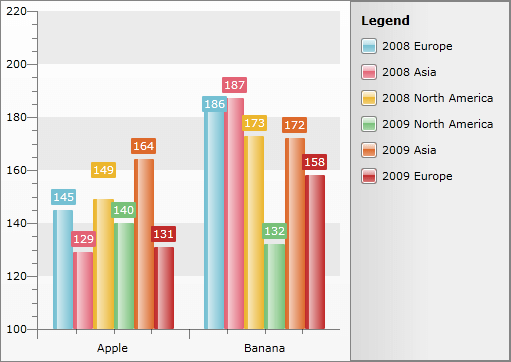
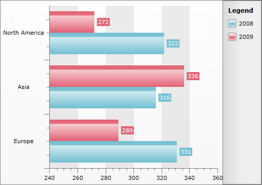
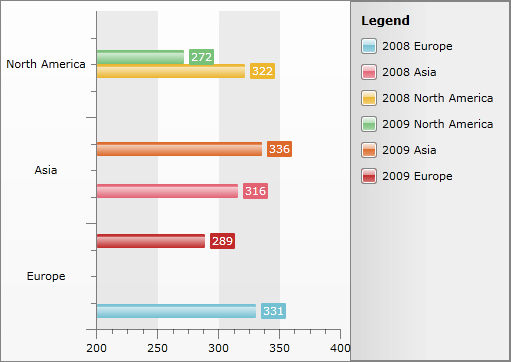

# Grouping and Aggregation


__RadChart__ supports grouping and aggregation. Which means that you can group the underlying data and apply one of the supported aggregation functions. This is a very powerful way to build charts that let you summarize business data in seconds. 

Grouping is a process which groups the data by one or more parameters. __RadChart__ allows you to create charts showing the data grouped by one or more criteria. Using the specified criteria, __RadChart__ will first process and group the data and second, will create as many series as needed in order to visualize the groups properly.

## Understanding Grouping and Aggregation

Consider the following data for Apple and Banana consumption in thee regions for years 2008 and 2009:


|Year|Region|Description|Value|
|----|------|-----------|-----|
|2008|Europe|Apple|145|
|2009|North|America|Banana|132|
|2009|Asia|Apple|164|
|2008|Asia|Banana|187|
|2008|Europe|Banana|186|
|2009|Europe|Apple|131|
|2008|North America|Banana|173|
|2009|Asia|Banana|172|
|2009|North America|Apple|140|
|2008|Asia|Apple|129|
|2009|Europe|Banana|158|
|2008|North America|Apple|149|


As you can see, the data is not grouped. If you group it by Year and Region, you will have this:


|Year| 	Region|	Description |	Value|
|----|--------|-------------|--------|
|2008| 	Europe|	Apple| 	145|
|2008| 	Europe|	Banana| 	186|
|2008| 	North America |	Apple |	149|
|2008| 	North America |	Banana |	173|
|2008| 	Asia| 	Apple |	129|
|2008| 	Asia| 	Banana |	187|
|2009| 	Europe|	Apple |	131|
|2009| 	Europe|	Banana |	158|
|2009| 	North America |	Apple |	140|
|2009| 	North America |	Banana |	132|
|2009| 	Asia|	Apple |	164|
|2009| 	Asia|	Banana |	172|

Sometimes grouping data is enough, but often you might need to apply aggregate function like __Sum__ or __Count__. The table below shows the data when the grouping and the __Sum__ aggregate function are applied.


|Year|	Region|	Sum(Values)|
|----|--------|------------|
|2008|	Europe|	331|
|2008|	North America|	322|
|2008|	Asia|	316|
|2009|	Europe|	289|
|2009|	North America|	272|
|2009|	Asia	|336|


Note how the values for each group (Year, Region) are calculated - as a sum of all the items in the group. As a result, for each group you will have one value: the sum of all Apples and Bananas consumed for the concrete year and region.

## Grouping And Aggregation in RadChart

__RadChart__ allows you to define grouping and aggregation for each series separately. Use __SeriesMapping.GroupSettings__ to define the groups. It is of type __GroupingSettings__ and has the following properties:

* __GroupDescriptors__ - a collection of __ChartGroupDescriptor__ s, one for each property from the underlying data which you want to group by. 


* __ShouldCreateSeriesForLastGroup__ - specifies whether or not a series to be created for the last group.

>To use grouping and aggregation functionality you need data binding via [SeriesMapping/ItemMapping](). You cannot group or aggregate when [DataSeries and DataPoints]() are used.

The following example, considering the sample data above, demonstrates how to use grouping with bar chart:

>tipIn order to use the grouping feature, you have to declare the following namespace:


```XAML
	<!--  xmlns:telerikCharting="clr-namespace:Telerik.Windows.Controls.Charting;assembly=Telerik.Windows.Controls.Charting"  -->
```


```XAML
	<telerik:RadChart x:Name="radChart">
	    <telerik:RadChart.SeriesMappings>
	        <telerik:SeriesMapping>
	            <telerik:SeriesMapping.SeriesDefinition>
	                <telerik:BarSeriesDefinition />
	            </telerik:SeriesMapping.SeriesDefinition>
	            <telerik:SeriesMapping.GroupingSettings>
	                <telerik:GroupingSettings ShouldCreateSeriesForLastGroup="True">
	                    <telerik:GroupingSettings.GroupDescriptors>
	                        <telerik:ChartGroupDescriptor Member="Year" />
	                        <telerik:ChartGroupDescriptor Member="Region" />
	                    </telerik:GroupingSettings.GroupDescriptors>
	                </telerik:GroupingSettings>
	            </telerik:SeriesMapping.GroupingSettings>
	            <telerik:SeriesMapping.ItemMappings>
	                <telerik:ItemMapping DataPointMember="YValue" FieldName="Value" />
	                <telerik:ItemMapping DataPointMember="XCategory" FieldName="Description" />
	            </telerik:SeriesMapping.ItemMappings>
	        </telerik:SeriesMapping>
	    </telerik:RadChart.SeriesMappings>
	</telerik:RadChart>
```


```C#
	RadChart radChart = new RadChart();
	//....
	SeriesMapping seriesMapping = new SeriesMapping();
	seriesMapping.SeriesDefinition = new BarSeriesDefinition();
	seriesMapping.GroupingSettings.GroupDescriptors.Add( new ChartGroupDescriptor( "Year" ) );
	seriesMapping.GroupingSettings.GroupDescriptors.Add( new ChartGroupDescriptor( "Region" ) );
	seriesMapping.ItemMappings.Add( new ItemMapping( "Value", DataPointMember.YValue ) );
	seriesMapping.ItemMappings.Add( new ItemMapping( "Description", DataPointMember.XCategory ) );
	//....
	radChart.SeriesMappings.Add( seriesMapping );
```


```VB.NET
	Dim radChart As New RadChart()
	'....'
	Dim seriesMapping As New SeriesMapping()
	seriesMapping.SeriesDefinition = New BarSeriesDefinition()
	seriesMapping.GroupingSettings.GroupDescriptors.Add(New ChartGroupDescriptor("Year"))
	seriesMapping.GroupingSettings.GroupDescriptors.Add(New ChartGroupDescriptor("Region"))
	seriesMapping.ItemMappings.Add(New ItemMapping("Value", DataPointMember.YValue))
	seriesMapping.ItemMappings.Add(New ItemMapping("Description", DataPointMember.XCategory))
	'....'
	radChart.SeriesMappings.Add(seriesMapping)
```


When visualized in __RadChart__, the data from the table above will look similar to the one from the image below:


As you can see, when the data is grouped by Year and Region, six groups will be created: three groups for the three regions for year 2008 and three groups for the three regions for year 2009. As a result, __RadChart__ creates six series - per one for each of the groups. Moreover, the [Striplines and Gridlines]() display the Description so these six series are again grouped by the fruit name.

The example above shows how to use the grouping feature. However, grouping is often used in combination with aggregation, where a function is applied over the groups. __RadChart__ allows you to apply such aggregate functions for a grouped data by specifying it when __ItemMapping__ is created. For each __ItemMapping__ you can select one of the following functions using the __ChartAggregateFunction__ enumeration:

* __Sum__ - calculates the sum of all values. 


* __Count__ - calculates the total number of the items. 


* __Min__ - returns the minimal value. 


* __Average__ - calculates the average value. 


* __Max__ - returns the maximum value.

Based on the example above, imagine that you want to create a chart that shows the total fruit consumption per year and region:


```XAML
	<telerik:RadChart x:Name="radChart">
	    <telerik:RadChart.SeriesMappings>
	        <telerik:SeriesMapping>
	            <telerik:SeriesMapping.SeriesDefinition>
	                <telerik:HorizontalBarSeriesDefinition />
	            </telerik:SeriesMapping.SeriesDefinition>
	            <telerik:SeriesMapping.GroupingSettings>
	                <telerik:GroupingSettings>
	                    <telerik:GroupingSettings.GroupDescriptors>
	                        <telerik:ChartGroupDescriptor Member="Year" />
	                        <telerik:ChartGroupDescriptor Member="Region" />
	                    </telerik:GroupingSettings.GroupDescriptors>
	                </telerik:GroupingSettings>
	            </telerik:SeriesMapping.GroupingSettings>
	            <telerik:SeriesMapping.ItemMappings>
	                <telerik:ItemMapping DataPointMember="XCategory" FieldName="Region" />
	                <telerik:ItemMapping AggregateFunction="Sum"
	                                     DataPointMember="YValue"
	                                     FieldName="Value" />
	            </telerik:SeriesMapping.ItemMappings>
	        </telerik:SeriesMapping>
	    </telerik:RadChart.SeriesMappings>
	</telerik:RadChart>
```


```C#
	RadChart radChart = new RadChart();
	//....
	SeriesMapping seriesMapping = new SeriesMapping();
	seriesMapping.SeriesDefinition = new HorizontalBarSeriesDefinition();
	seriesMapping.GroupingSettings.GroupDescriptors.Add( new ChartGroupDescriptor( "Year" ) );
	seriesMapping.GroupingSettings.GroupDescriptors.Add( new ChartGroupDescriptor( "Region" ) );
	seriesMapping.ItemMappings.Add( new ItemMapping( "Value", DataPointMember.YValue, ChartAggregateFunction.Sum ) );
	seriesMapping.ItemMappings.Add( new ItemMapping( "Region", DataPointMember.XCategory ) );
	//....
	radChart.SeriesMappings.Add( seriesMapping );
```


```VB.NET
	Dim radChart As New RadChart()
	'....'
	Dim seriesMapping As New SeriesMapping()
	seriesMapping.SeriesDefinition = New HorizontalBarSeriesDefinition()
	seriesMapping.GroupingSettings.GroupDescriptors.Add(New ChartGroupDescriptor("Year"))
	seriesMapping.GroupingSettings.GroupDescriptors.Add(New ChartGroupDescriptor("Region"))
	seriesMapping.ItemMappings.Add(New ItemMapping("Value", DataPointMember.YValue, ChartAggregateFunction.Sum))
	seriesMapping.ItemMappings.Add(New ItemMapping("Region", DataPointMember.XCategory))
	'....'
	radChart.SeriesMappings.Add(seriesMapping)
```


The result is the chart from the snapshot below:


First, the data is grouped by year, then by region. For each region, Sum function is applied to calculate the [Y-Axis]() value. In this case -the sum of all the apples and bananas consumed for that year and region.

One property is very important to be mentioned here. This is the __GroupingSettings.ShouldCreateSeriesForLastGroup__. With this property you can control how the series for each group to be created:

* When __False__ (default), __RadChart__ will not use the last group level for generation series. 


* When __True__, __RadChart__ will create series for the last group.

The last example does not specify explicitly the value for __ShouldCreateSeriesForLastGroup__, so __RadChart,__ by default, will not create series for the last group - Year. From the snapshot you can see, that two series are created - one for year 2008 and one for year 2009. The values for these two series are actually the result of the applied aggregate function (__Sum__) over the last group level. The __RadChart__ will use the aggregated values from the second group descriptor (Region) and for each region it will create [DataPoint]() for the appropriate series based on the the parent group (Year).

If you set __ShouldCreateSeriesForLastGroup__ to __True__, the result will be six data series:


Note, that the values are exactly the same as when the __ShouldCreateSeriesForLastGroup__is set to __False__, but instead of 2 series now __RadChart__ created 6 series.

>__ShouldCreateSeriesForLastGroup__ is used only when an aggregate function is used. If no aggregate function is used, __ShouldCreateSeriesForLastGroup__ is omitted.

Now it's time to summarize the steps needed to build a chart using grouping and aggregation:

* First, a new __SeriesMapping__ is created with __BarSeriesDefinition__. See [Data Binding Support Overview]() for more information. 


* Second, two __ChartGroupDescriptors__ are added to the __SeriesMapping.GroupSettings.GroupDescriptors__ - one for Year and one for Region. 


* Third, via __ItemMapping__, the Region is bound to the __X-Axis__ using __XCategory__. Thus, [Categorical Chart]() is built. See also [Data Binding with Manual Series Mapping](). 


* Forth, via __ItemMapping__, the Value is bound to the __Y-Axis__. Additionally, the data is aggregated using the __Sum__ function. Thus, the value shown on the __Y-Axis__ will be the sum of all the fruits consumed for a certain year and region.

## See Also

 * [Data Binding Support Overview]()

 * [Categorical Charts]()
