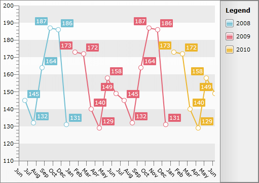

# DateTime Grouping


## 

When using the standard __ChartGroupDescriptor__, it is hard to group the data depending on a __DateTime__ field. For example if you want to group the data by month or by year, or even by day, it would be quite impossible. In order to bring this out of the box the __RadChart__ provides you with a set of group descriptors that are capable to group the data via a __DateTime__ field.

You have the following descriptors at your disposal:

* __ChartSecondGroupDescriptor__

* __ChartMinuteGroupDescriptor__

* __ChartHourGroupDescriptor__

* __ChartDayGroupDescriptor__

* __ChartMonthGroupDescriptor__

* __ChartYearGroupDescriptor__

The name of each of the descriptors implies with which part of the __DateTime__ field it is working. For example if you want to group tour data by year you have to use the __ChartYearGroupDescriptor__.

In order to use properly these descriptors you just have to set the appropriate __DateTime__ field to their __Member__ property. For example if you have a business object with a __DateTime__ field called __Date__, you should have the following definition:

#### __XAML__

```XAML
	<telerik:RadChart x:Name="radPieChart">
	    <telerik:RadChart.SeriesMappings>
	        <telerik:SeriesMapping>
	            <telerik:SeriesMapping.SeriesDefinition>
	                <telerik:LineSeriesDefinition />
	            </telerik:SeriesMapping.SeriesDefinition>
	            <telerik:SeriesMapping.GroupingSettings>
	                <telerik:GroupingSettings>
	                    <telerik:GroupingSettings.GroupDescriptors>
	                        <telerik:ChartYearGroupDescriptor Member="Date" />
	                    </telerik:GroupingSettings.GroupDescriptors>
	                </telerik:GroupingSettings>
	            </telerik:SeriesMapping.GroupingSettings>
	            <telerik:SeriesMapping.ItemMappings>
	                <telerik:ItemMapping DataPointMember="XValue" FieldName="Date" />
	                <telerik:ItemMapping DataPointMember="YValue" FieldName="Value" />
	            </telerik:SeriesMapping.ItemMappings>
	        </telerik:SeriesMapping>
	    </telerik:RadChart.SeriesMappings>
	</telerik:RadChart>
```


