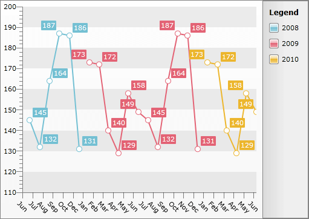
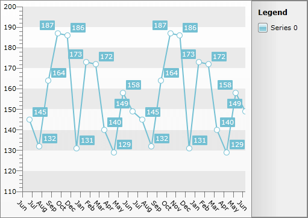

# Flattened Series


Sometimes when the grouping and aggregation get applied you might want to flatten it, in order to make it appear as one. This is done by combining all data points into one series and can be achieved by just setting the __ShouldFlattenSeries__ property of the __GroupingSettings__ class.

Here is a __RadChart__ declaration before setting the __ShouldFlattenSeries__ property to __True__.

>tipTo learn more about __DateTime Grouping__ read [here]().


```XAML
	<telerik:RadChart x:Name="radChart">
	    <telerik:RadChart.SeriesMappings>
	        <telerik:SeriesMapping>
	            <telerik:SeriesMapping.SeriesDefinition>
	                <telerik:LineSeriesDefinition />
	            </telerik:SeriesMapping.SeriesDefinition>
	            <telerik:SeriesMapping.GroupingSettings>
	                <telerik:GroupingSettings>
	                    <telerik:GroupingSettings.GroupDescriptors>
	                        <telerik:ChartYearGroupDescriptor Member="Date" />
	                    </telerik:GroupingSettings.GroupDescriptors>
	                </telerik:GroupingSettings>
	            </telerik:SeriesMapping.GroupingSettings>
	            <telerik:SeriesMapping.ItemMappings>
	                <telerik:ItemMapping DataPointMember="XValue" FieldName="Date" />
	                <telerik:ItemMapping DataPointMember="YValue" FieldName="Value" />
	            </telerik:SeriesMapping.ItemMappings>
	        </telerik:SeriesMapping>
	    </telerik:RadChart.SeriesMappings>
	</telerik:RadChart>
```


Here is the same __RadChart__ after setting the property to __True__.


```XAML
	<telerik:SeriesMapping.GroupingSettings>
	    <telerik:GroupingSettings ShouldFlattenSeries="True">
	        <telerik:GroupingSettings.GroupDescriptors>
	            <telerik:ChartYearGroupDescriptor Member="Date" />
	        </telerik:GroupingSettings.GroupDescriptors>
	    </telerik:GroupingSettings>
	</telerik:SeriesMapping.GroupingSettings>
```


```C#
	public Sample()
	{
	    InitializeComponent();
	    this.radChart.SeriesMappings[ 0 ].GroupingSettings.ShouldFlattenSeries = true;
	}
```
```VB.NET
	Public Sub New()
	    InitializeComponent()
	    Me.radChart.SeriesMappings(0).GroupingSettings.ShouldFlattenSeries = True
	End Sub
```



## Dynamic Series Flattening

If you want to allow the series to get flattened through the UI at run time, you have to change the __ShouldFlattenSeries__ property. The change of the property will not cause the UI to update and to display the series according to it though. To apply the change you have to rebind the chart by calling its __Rebind()__ method.

Here is an example of a __CheckBox__ that manages the series flattening of the __RadChart__ used above.


```XAML
	<CheckBox Click="CheckBox_Click" Content="Flatten" />
```


```C#
	private void CheckBox_Click(object sender, RoutedEventArgs e)
	{
	    bool? isChecked = (sender as CheckBox).IsChecked;
	    if (isChecked == null)
	        return;
	    this.radChart.SeriesMappings[0].GroupingSettings.ShouldFlattenSeries = (bool)isChecked;
	    this.radChart.Rebind();
	}
```
```VB.NET
	Private Sub CheckBox_Click(sender As Object, e As RoutedEventArgs)
	    Dim isChecked As System.Nullable(Of Boolean) = TryCast(sender, CheckBox).IsChecked
	    If isChecked Is Nothing Then
	        Return
	    End If
	    Me.radChart.SeriesMappings(0).GroupingSettings.ShouldFlattenSeries = CBool(isChecked)
	    Me.radChart.Rebind()
	End Sub
```


