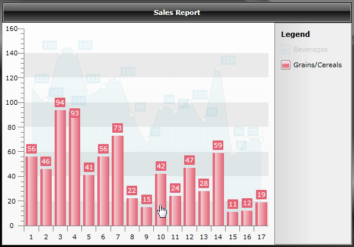

# Interactivity Effects


The purpose of this topic is to demonstrate the selection/hover interactivity effects supported by the RadChart control.

Thе hover and selection interactivity effects greatly enhance the data presentation and readability in various business analysis scenarios. The hover and selection interactivity is supported for all 2D series types (note that "selection" for pie and doughnut types is implemented in the form of exploding the respective item slices). The interactivity support is __disabled by default__ and can be controlled through the Interactivity API under __SeriesDefinition.InteractivitySettings__ complex property:

* __HoverScope__ - gets or sets a value indicating the scope of interactivity for hover effects.

* __SelectionScope__ - gets or sets a value indicating the scope of interactivity for selection effects.

* __SelectionMode__ - gets or sets a value indicating the selection mode used by the chart control (single item or multiple items).

In the following example a new __RadChart__ control is declared along with two series definitions - __SplineAreaSeriesDefinition__ and __BarSeriesDefintion__.

#### __XAML__

```XAML
	<telerik:RadChart x:Name="RadChart">
	    <telerik:RadChart.DefaultView>
	        <telerik:ChartDefaultView>
	            <telerik:ChartDefaultView.ChartTitle>
	                <telerik:ChartTitle Content="Sales Report" />
	            </telerik:ChartDefaultView.ChartTitle>
	        </telerik:ChartDefaultView>
	    </telerik:RadChart.DefaultView>
	    <telerik:RadChart.SeriesMappings>
	        <telerik:SeriesMapping LegendLabel="Beverages">
	            <telerik:SeriesMapping.SeriesDefinition>
	                <telerik:SplineAreaSeriesDefinition>
	                    <telerik:SplineAreaSeriesDefinition.InteractivitySettings>
	                        <telerik:InteractivitySettings HoverScope="Series" SelectionScope="Series" />
	                    </telerik:SplineAreaSeriesDefinition.InteractivitySettings>
	                </telerik:SplineAreaSeriesDefinition>
	            </telerik:SeriesMapping.SeriesDefinition>
	            <telerik:SeriesMapping.ItemMappings>
	                <telerik:ItemMapping DataPointMember="YValue" FieldName="Y4" />
	            </telerik:SeriesMapping.ItemMappings>
	        </telerik:SeriesMapping>
	        <telerik:SeriesMapping LegendLabel="Grains/Cereals">
	            <telerik:SeriesMapping.SeriesDefinition>
	                <telerik:BarSeriesDefinition>
	                    <telerik:BarSeriesDefinition.InteractivitySettings>
	                        <telerik:InteractivitySettings HoverScope="Series" SelectionScope="Series" />
	                    </telerik:BarSeriesDefinition.InteractivitySettings>
	                </telerik:BarSeriesDefinition>
	            </telerik:SeriesMapping.SeriesDefinition>
	            <telerik:SeriesMapping.ItemMappings>
	                <telerik:ItemMapping DataPointMember="YValue" FieldName="Y1" />
	            </telerik:SeriesMapping.ItemMappings>
	        </telerik:SeriesMapping>
	    </telerik:RadChart.SeriesMappings>
	</telerik:RadChart>
```


Take a look at the way the __InteractivitySettings__ are declared for a specific definition:

#### __XAML__

```XAML
	<telerik:BarSeriesDefinition>
	    <telerik:BarSeriesDefinition.InteractivitySettings>
	        <telerik:InteractivitySettings HoverScope="Series" SelectionScope="Series" />
	    </telerik:BarSeriesDefinition.InteractivitySettings>
	</telerik:BarSeriesDefinition>
```


For example if __HoverScope__ is set to __InteractivityScope.Series__ for a given bar series, when one hovers over a bar item, the whole series will be highlighted (i.e. all of the other series within the ChartArea will become temporarily transparent); otherwise if __HoverScope__ is set to __InteractivityScope.Item__, when one hovers over a bar item, only the respective item will be highlighted (i.e. all of the other series as well all of the other bar items within the originating bar series will become temporarily transparent). The same principle applies for __SelectionScope__ as well - if it is set to __InteractivityScope.Series__, all items within the series will be selected; alternatively if it set to __InteractivtyScope.Item__, only the respective item will be selected.



>tipIn order to enable the interactivity functionality you need to first set the interactivity scope for hover, selection, or both. The notion of "interactivity scope" specifies whether the chart control should interpret the interactivity action (selection or hover) on series level (if applicable), or on item level (if applicable).

>__InteractivityScope.Item__ is not supported for series that do not render separate items (__Line__, __Spline__, __Area__, __Range__, and __all their stacked versions__). __InteractivityScope.Series__ is not supported for radial series (__Pie__ and __Doughnut__).

There is one additional setting related to hover effects that can be set on global level - __RadChart.HoverActivationDelay__. This property gets or sets the delay before the hover effect is activated (by default there is no delay and the hover effect becomes active immediately).

>tipYou could check out an online example [here](https://demos.telerik.com/silverlight/#Chart/InteractivityEffects).

## Complete Demo Code

The following code snippets represent the complete source code used in the topic.

#### __XAML__

```XAML
	<telerik:RadChart x:Name="RadChart">
	    <telerik:RadChart.DefaultView>
	        <telerik:ChartDefaultView>
	            <telerik:ChartDefaultView.ChartTitle>
	                <telerik:ChartTitle Content="Sales Report" />
	            </telerik:ChartDefaultView.ChartTitle>
	        </telerik:ChartDefaultView>
	    </telerik:RadChart.DefaultView>
	    <telerik:RadChart.SeriesMappings>
	        <telerik:SeriesMapping LegendLabel="Beverages">
	            <telerik:SeriesMapping.SeriesDefinition>
	                <telerik:SplineAreaSeriesDefinition>
	                    <telerik:SplineAreaSeriesDefinition.InteractivitySettings>
	                        <telerik:InteractivitySettings HoverScope="Series" SelectionScope="Series" />
	                    </telerik:SplineAreaSeriesDefinition.InteractivitySettings>
	                </telerik:SplineAreaSeriesDefinition>
	            </telerik:SeriesMapping.SeriesDefinition>
	            <telerik:SeriesMapping.ItemMappings>
	                <telerik:ItemMapping DataPointMember="YValue" FieldName="Y4" />
	            </telerik:SeriesMapping.ItemMappings>
	        </telerik:SeriesMapping>
	        <telerik:SeriesMapping LegendLabel="Grains/Cereals">
	            <telerik:SeriesMapping.SeriesDefinition>
	                <telerik:BarSeriesDefinition>
	                    <telerik:BarSeriesDefinition.InteractivitySettings>
	                        <telerik:InteractivitySettings HoverScope="Series" SelectionScope="Series" />
	                    </telerik:BarSeriesDefinition.InteractivitySettings>
	                </telerik:BarSeriesDefinition>
	            </telerik:SeriesMapping.SeriesDefinition>
	            <telerik:SeriesMapping.ItemMappings>
	                <telerik:ItemMapping DataPointMember="YValue" FieldName="Y1" />
	            </telerik:SeriesMapping.ItemMappings>
	        </telerik:SeriesMapping>
	    </telerik:RadChart.SeriesMappings>
	</telerik:RadChart>
```


#### __C#__

```C#
	public class DataObject
	{
	    private static Random rand = new Random(Environment.TickCount);
	    private static Random adjrand = new Random(Environment.TickCount + rand.Next());
	    private double _y1;
	    private double _y2;
	    private double _y3;
	    private double _y4;
	    private double _y5;
	
	    public double Y1
	    {
	        get
	        {
	            return _y1;
	        }
	        set
	        {
	            _y1 = value;
	        }
	    }
	
	    public double Y2
	    {
	        get
	        {
	            return _y2;
	        }
	        set
	        {
	            _y2 = value;
	        }
	    }
	
	    public double Y3
	    {
	        get
	        {
	            return _y3;
	        }
	        set
	        {
	            _y3 = value;
	        }
	    }
	
	    public double Y4
	    {
	        get
	        {
	            return _y4;
	        }
	        set
	        {
	            _y4 = value;
	        }
	    }
	
	    public double Y5
	    {
	        get
	        {
	            return _y5;
	        }
	        set
	        {
	            _y5 = value;
	        }
	    }
	
	    public DataObject(double y1, double y2, double y3, double y4, double y5)
	    {
	        this.Y1 = y1;
	        this.Y2 = y2;
	        this.Y3 = y3;
	        this.Y4 = y4;
	        this.Y5 = y5;
	    }
	
	    public static List<DataObject> GetData()
	    {
	        List<DataObject> list = new List<DataObject>();
	
	        for (int i = 0; i < 17; i++)
	        {
	            double y1 = rand.Next(10, 100);
	            list.Add(new DataObject(y1, y1 + adjrand.Next(-10, 10), y1 + adjrand.Next(-5, 5), y1 + adjrand.Next(40, 75), y1 + adjrand.Next(20, 50)));
	        }
	        return list;
	    }
	}
```


#### __VB.NET__

```VB.NET
	Public Class DataObject
	    Private Shared rand As New Random(Environment.TickCount)
	    Private Shared adjrand As New Random(Environment.TickCount + rand.[Next]())
	    Private _y1 As Double
	    Private _y2 As Double
	    Private _y3 As Double
	    Private _y4 As Double
	    Private _y5 As Double
	    Public Property Y1() As Double
	        Get
	            Return _y1
	        End Get
	        Set(value As Double)
	            _y1 = value
	        End Set
	    End Property
	    Public Property Y2() As Double
	        Get
	            Return _y2
	        End Get
	        Set(value As Double)
	            _y2 = value
	        End Set
	    End Property
	    Public Property Y3() As Double
	        Get
	            Return _y3
	        End Get
	        Set(value As Double)
	            _y3 = value
	        End Set
	    End Property
	    Public Property Y4() As Double
	        Get
	            Return _y4
	        End Get
	        Set(value As Double)
	            _y4 = value
	        End Set
	    End Property
	    Public Property Y5() As Double
	        Get
	            Return _y5
	        End Get
	        Set(value As Double)
	            _y5 = value
	        End Set
	    End Property
	    Public Sub New(y1 As Double, y2 As Double, y3 As Double, y4 As Double, y5 As Double)
	        Me.Y1 = y1
	        Me.Y2 = y2
	        Me.Y3 = y3
	        Me.Y4 = y4
	        Me.Y5 = y5
	    End Sub
	    Public Shared Function GetData() As List(Of DataObject)
	        Dim list As New List(Of DataObject)()
	        For i As Integer = 0 To 16
	            Dim y1 As Double = rand.[Next](10, 100)
	            list.Add(New DataObject(y1, y1 + adjrand.[Next](-10, 10), y1 + adjrand.[Next](-5, 5), y1 + adjrand.[Next](40, 75), y1 + adjrand.[Next](20, 50)))
	        Next
	        Return list
	    End Function
	End Class
```


#### __C#__

```C#
	this.RadChart.ItemsSource = DataObject.GetData();
```


#### __VB.NET__

```VB.NET
	Me.RadChart.ItemsSource = DataObject.GetData()
```


## See Also

 * [Filtering]()

 * [Zooming and Scrolling]()

 * [Smart Labels]()
