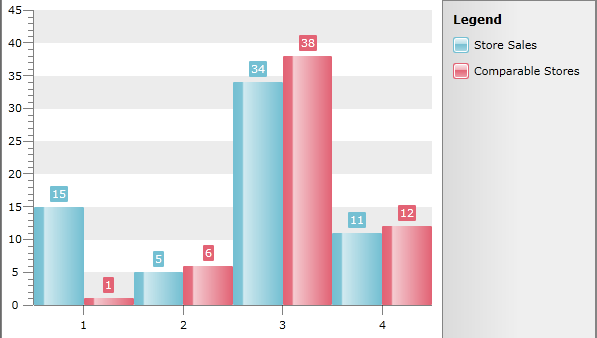
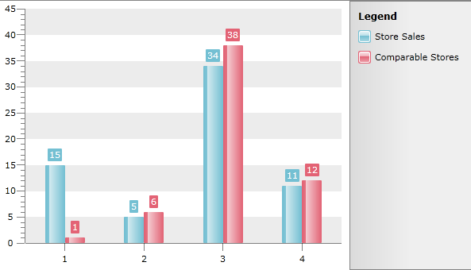
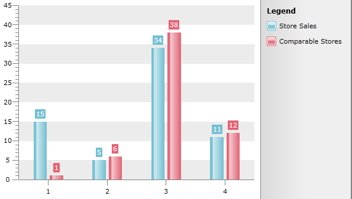
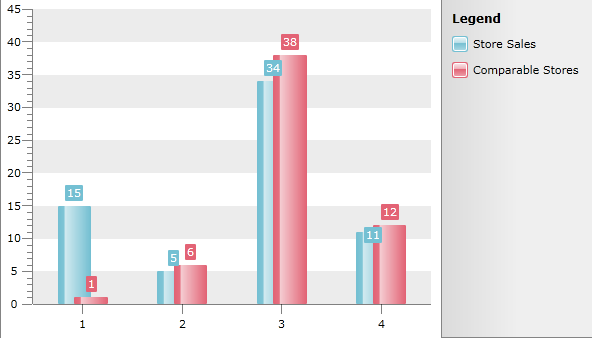

# ItemWidthPercent and ItemOverlapPercent


## 

In scenarios where you have Bar Charts with multiple series it is possible to control the width of the Bars by using the __ItemWidthPercent__ property of the [ChartArea](). You can also control to what percentage the bars will overlap the preceding bar series with the __ItemOverlapPercent__ property. Overlapping is especially useful when a long series of items needs to fit in a small-size chart. If you set negative value for __ItemOverLapPercent,__ a gap appears between the bars of different series.

The width of the Bars depends on the mechanism of calculating the ItemWidthPercent, as well as the number of ticks/length between ticks. Up until a specific point , the way it's calculated is based on a portion of the step, for example, if you have Step = 5 and ItemWidthPercent = 10, it'd mean that the width of the individual bar would be only 2% of the step ( i.e. 10% of 1/5th ). After that specific point the ItemWidthPercent is applied to the available space between two ticks, which is why the bars would become wider or thinner.


>The ItemWidthPercent property of the ChartArea will affect all Series which means that you can't specify different width for the Bars in different Series.

You can set values for the properties like this:


```C#
	radChart.DefaultView.ChartArea.ItemOverlapPercent = 0;
	radChart.DefaultView.ChartArea.ItemWidthPercent = 50;
```
```VB.NET
	RadChart1.DefaultView.ChartArea.ItemOverlapPercent = 0
	RadChart1.DefaultView.ChartArea.ItemWidthPercent = 50
```

    
The sample pictures show these properties in action:

*ItemOverlapPercent* = 0 and *ItemWidthPercent* = 100




*ItemOverlapPercent* = 0 and *ItemWidthPercent* = 50




*ItemOverlapPercent* = -20 and *ItemWidthPercent* = 50




*ItemOverlapPercent* = 50 and *ItemWidthPercent* = 50


