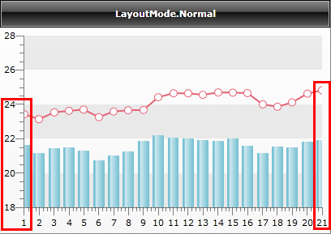
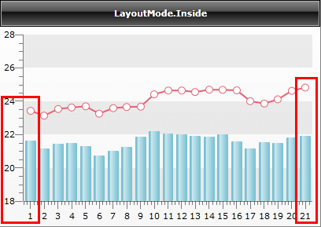
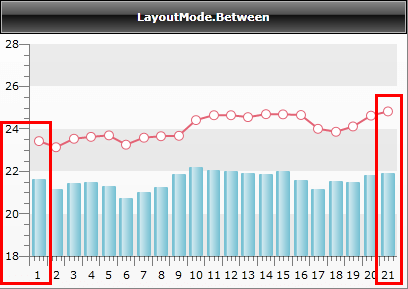
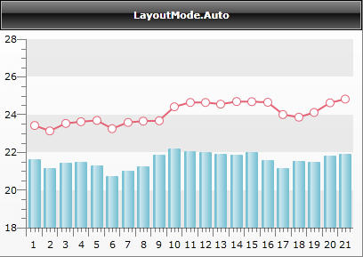

# Layout Mode


## 

__RadChart__ allows you to modify the layout of the __X-axis__ to better fit the different chart types in the chart area. This will help you to improve the look and feel of your charts.

Depending on the selected layout mode, the __X-Axis__'s ticks and labels and also the charts are visualized differently. 

__LayoutMode__ is property related only to the __X-Axis__, hence charts without __X-Axis__, like __Pie__ and __Doughnut__, do not use it.

Each __LayoutMode__ is best to be used with certain chart types:

* __Normal__ - in this mode, the ticks match labels. Best for __Line__ charts and __Area__ charts.

* __Inside__ - ticks match labels; a small margin on both sides is provided for better presentation. Use this for __Bubble__ Charts, __Stick__ and __Candlestick__ charts.

* __Between__ - ticks are margins (labels are between two ticks); a small margin on both sides is provided. Useful for __Bar__ charts.

* __Auto__ - depending on the chart type, __RadChart__ will automatically select the best __LayoutMode__. For multi-series charts, layout mode is prioritized in this order: __Between__, __Inside__, __Normal.__

You can set the __LayoutMode__ from XAML or code-behind like this:


```XAML
	<telerik:RadChart x:Name="radChart">
	    <telerik:RadChart.DefaultView>
	        <telerik:ChartDefaultView>
	            <telerik:ChartDefaultView.ChartArea>
	                <telerik:ChartArea>
	                    <telerik:ChartArea.AxisX>
	                        <telerik:AxisX LayoutMode="Normal" />
	                    </telerik:ChartArea.AxisX>
	                </telerik:ChartArea>
	            </telerik:ChartDefaultView.ChartArea>
	        </telerik:ChartDefaultView>
	    </telerik:RadChart.DefaultView>
	</telerik:RadChart>
```


```C#
	this.radChart.DefaultView.ChartArea.AxisX.LayoutMode = AxisLayoutMode.Normal;
```
```VB.NET
	Me.radChart.DefaultView.ChartArea.AxisX.LayoutMode = AxisLayoutMode.Normal
```

On the snapshots below you can see the differences between the available layout modes.


Note the areas inside the red rectangles and see how the line and the bar charts are drawn and how the __X-Axis__'s ticks and labels are displayed for each of the modes.

* __LayoutMode.Normal__- the chart is drawn starting directly from the first value (1), thus making the first and the last bars partly visible.
 
      

* __LayoutMode.Inside__- the chart data is accommodated in a way that makes the first and the last bars visible by adding small offset in the beginning and in the end of the X axis.
 
      

* __LayoutMode.Between__- in this case each item is visualized as a margin - the labels and the bars are placed between the ticks.
 
      

* __LayoutMode.Auto__- the layout mode is set automatically to __Between__ by following the logic specified above.
 
      

## See Also

 * [X-Axis]()

 * [Axes Overview]()
