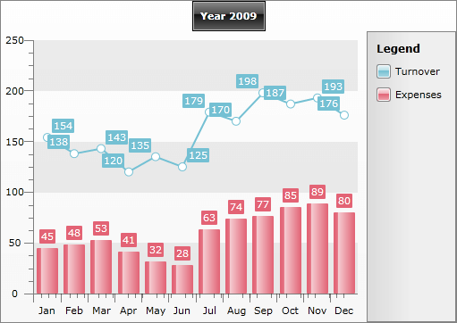

# Multi-series Charts


## 

__RadChart__ provides support of multi-series charts. This is useful, when you want to display two or more charts bound to different data series on the same chart area. Usually these data series are semantically related and putting them together allows the user to compare the values easily.

On the snapshot below, the Turnover is represented by line chart, while the Expenses - by bar chart. As you can see, it is much easier to compare both of the values visually.
 
      

Here is the sample XAML source code used to create this chart declaratively:

#### __XAML__

```XAML
	<telerik:ChartArea.DataSeries>
	    <!--  Line Chart  -->
	    <telerik:DataSeries LegendLabel="Turnover">
	        <telerik:DataSeries.Definition>
	            <telerik:LineSeriesDefinition />
	        </telerik:DataSeries.Definition>
	        <telerikCharting:DataPoint YValue="154" />
	        <telerikCharting:DataPoint YValue="138" />
	        <telerikCharting:DataPoint YValue="143" />
	        <telerikCharting:DataPoint YValue="120" />
	        <telerikCharting:DataPoint YValue="135" />
	        <telerikCharting:DataPoint YValue="125" />
	        <telerikCharting:DataPoint YValue="179" />
	        <telerikCharting:DataPoint YValue="170" />
	        <telerikCharting:DataPoint YValue="198" />
	        <telerikCharting:DataPoint YValue="187" />
	        <telerikCharting:DataPoint YValue="193" />
	        <telerikCharting:DataPoint YValue="176" />
	    </telerik:DataSeries>
	
	    <!--  Bar Chart  -->
	    <telerik:DataSeries LegendLabel="Expenses">
	        <telerik:DataSeries.Definition>
	            <telerik:BarSeriesDefinition />
	
	        </telerik:DataSeries.Definition>
	        <telerikCharting:DataPoint YValue="45" />
	        <telerikCharting:DataPoint YValue="48" />
	        <telerikCharting:DataPoint YValue="53" />
	        <telerikCharting:DataPoint YValue="41" />
	        <telerikCharting:DataPoint YValue="32" />
	        <telerikCharting:DataPoint YValue="28" />
	        <telerikCharting:DataPoint YValue="63" />
	        <telerikCharting:DataPoint YValue="74" />
	        <telerikCharting:DataPoint YValue="77" />
	        <telerikCharting:DataPoint YValue="85" />
	        <telerikCharting:DataPoint YValue="89" />
	        <telerikCharting:DataPoint YValue="80" />
	    </telerik:DataSeries>
	</telerik:ChartArea.DataSeries>
```

However, if you want to create this chart in the code-behind take a look at the [Creating Chart in Code Behind]() topic. If you prefer to use data binding, take a look at the [Data Binding with Automatic Series Mappings]() topic and the [Data Binding with Manual Series Mapping]() topic. To learn how to create a chart with multiple chart areas read the [Data Binding to Many Chart Areas]() topic.

## See Also

 * [2D Charts]()

 * [3D Charts]()

 * [Creating a Chart Declaratively]()

 * [Creating a Chart in Code-behind]()

 * [Data Binding Support Overview]()

 * [Data Binding to Nested Collections]()
