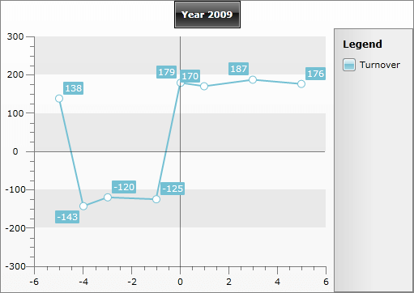
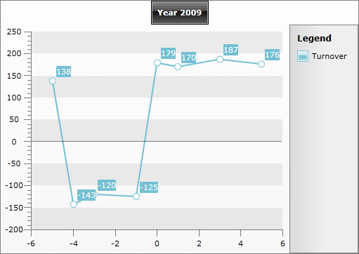

# Negative Values


## 

The __RadChart__ control supports displaying of negative values on both X and Y Axes.



You can see that in this type of scenarios the main X and Y Axes don't get translated. Instead of that, additional axes are drawn, which adjust the coordinate system to the negative data. These additional axes are handled by the __PlotArea__ control and it exposes two style properties - __PlotAreaAxisXStyle__ and __PlotAreaAxisYStyle__, so you can easily modify the appearance of the additional axes.

In order to control the visibility of the plot area's axes you can use the __PlotAreaAxisVisibility__ property, which is available both for the x- and the y-axis. Setting the __AxisX's__ proeprty to __Collapsed__ will make the __y-axis__ of the plot area collapsed and respectively setting the __AxisY's__ property to __Collapsed__ will make the __x-axis__ of the plot area collapsed. As you can notice the __PlotAreaVisibility__ property controls the other dimension's plot area axis visibility. This is because you can decide whether you need to show the horizontal axis within the plot area only when the vertical one's range contains both positive and negative values. For example, when AxisY ranges from -10 to 10 you can decide if you need to see the X axis within the plot area.

>tip The __PlotAreaAxisLabelsVisibility__ applies to the labels of the plot area axes.

Here is an example with hiding the y-axis of the plot area.


```XAML
	<telerik:RadChart x:Name="radChart">
	    <telerik:RadChart.DefaultView>
	        <telerik:ChartDefaultView>
	            <telerik:ChartDefaultView.ChartArea>
	                <telerik:ChartArea>
	                    <telerik:ChartArea.AxisX>
	                        <telerik:AxisX PlotAreaAxisVisibility="Collapsed" />
	                    </telerik:ChartArea.AxisX>
	                </telerik:ChartArea>
	            </telerik:ChartDefaultView.ChartArea>
	        </telerik:ChartDefaultView>
	    </telerik:RadChart.DefaultView>
	</telerik:RadChart>
```


Here is a snapshot of the result.


