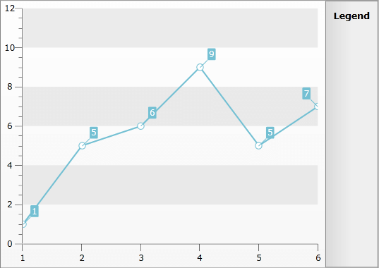
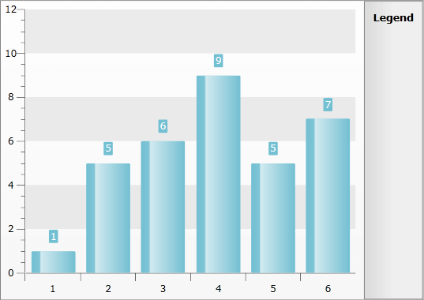
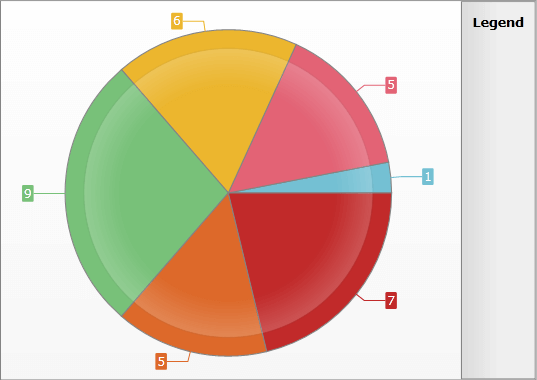

# Smart Labels


For charts that have many data points or data points with values close to one another, labels tend to collide making readability a problem. The Smart Labels feature automatically re-aligns labels making each labeled value stand out clearly. You are also able to configure the settings for the Smart Labels. This topic will explain how to:

* [Enable/Disable Smart Labels feature](#Enable_Disable_Smart_Labels_feature)

* [Configure the Smart Labels feature](#Configure_the_Smart_Labels_feature)

## Enable/Disable Smart Labels feature

The Smart Labels feature can be enabled/disabled through the __SmartLabelsEnabled__ of the __ChartArea__ property.


```XAML
	<telerik:RadChart x:Name="radChart">
	    <telerik:RadChart.DefaultView>
	        <telerik:ChartDefaultView>
	            <telerik:ChartDefaultView.ChartArea>
	                <telerik:ChartArea SmartLabelsEnabled="True" />
	            </telerik:ChartDefaultView.ChartArea>
	        </telerik:ChartDefaultView>
	    </telerik:RadChart.DefaultView>
	</telerik:RadChart>
```


```C#
	this.radChart.DefaultView.ChartArea.SmartLabelsEnabled = true;
```


```VB.NET
	Me.radChart.DefaultView.ChartArea.SmartLabelsEnabled = True
```


## Configure the Smart Labels feature

You are able to configure the setting of the Smart Labels feature by using the __LabelSettings__ property of the series definitions. For the most series this property is of type __LabelSettings__. For the __BarSeriesDefinition__ it is of type __BarLabelSettings__ and for the __PieSeriesDefinition__ and the __DoughnutSeriesDefinition__ it is of type __RadialLabelSettings__.

## LabelSettings

The __LabelSettings__ class is used for all of the __RadChart__ series definitions except for the Bar, Pie and Doughnut series. It allows you to control the following:

* __Distance__ - the distance between the label and the respective point.

* __ShowConnectors__ - indicates whether lines should be visualized between the points and the labels.


```XAML
	<telerik:RadChart x:Name="radChart">
	    <telerik:RadChart.DefaultSeriesDefinition>
	        <telerik:LineSeriesDefinition>
	            <telerik:LineSeriesDefinition.LabelSettings>
	                <telerik:LabelSettings Distance="10" ShowConnectors="True" />
	            </telerik:LineSeriesDefinition.LabelSettings>
	        </telerik:LineSeriesDefinition>
	    </telerik:RadChart.DefaultSeriesDefinition>
	    <telerik:RadChart.DefaultView>
	        <telerik:ChartDefaultView>
	            <telerik:ChartDefaultView.ChartArea>
	                <telerik:ChartArea SmartLabelsEnabled="True" />
	            </telerik:ChartDefaultView.ChartArea>
	        </telerik:ChartDefaultView>
	    </telerik:RadChart.DefaultView>
	</telerik:RadChart>
```


```C#
	LabelSettings settings = new LabelSettings();
	settings.Distance = 10;
	settings.ShowConnectors = true;
	LineSeriesDefinition lineSeries = new LineSeriesDefinition();
	lineSeries.LabelSettings = settings;
	this.radChart.DefaultSeriesDefinition = new LineSeriesDefinition();
	this.radChart.DefaultView.ChartArea.SmartLabelsEnabled = true;
```


```VB.NET
	Dim settings As New LabelSettings()
	settings.Distance = 10
	settings.ShowConnectors = True
	Dim lineSeries As New LineSeriesDefinition()
	lineSeries.LabelSettings = settings
	Me.radChart.DefaultSeriesDefinition = New LineSeriesDefinition()
	Me.radChart.DefaultView.ChartArea.SmartLabelsEnabled = True
```
    
    



## BarLabelSettings

The __BarLabelSettings__ class inherits the __LabelSettings__ class. The additional thing which it allows you to control is the __LabelDisplayMode__. It allows you to specify where to place the label relatively to the bar object. It can be set to one of the following values:

* __Auto__ - automatically chooses the bes position for the label.

* __Inside__ - the labels are placed inside the bar, near the top (or bottom for negative values).

* __MidPoint__ - the labels are placed in the middle of the bar.

* __Outside__ - the labels are placed over the bar (or below it for negative values).


```XAML
	<telerik:RadChart x:Name="radChart">
	    <telerik:RadChart.DefaultSeriesDefinition>
	        <telerik:BarSeriesDefinition>
	            <telerik:BarSeriesDefinition.LabelSettings>
	                <telerik:BarLabelSettings Distance="10"
	                                          LabelDisplayMode="Outside"
	                                          ShowConnectors="False" />
	            </telerik:BarSeriesDefinition.LabelSettings>
	        </telerik:BarSeriesDefinition>
	    </telerik:RadChart.DefaultSeriesDefinition>
	    <telerik:RadChart.DefaultView>
	        <telerik:ChartDefaultView>
	            <telerik:ChartDefaultView.ChartArea>
	                <telerik:ChartArea SmartLabelsEnabled="True" />
	            </telerik:ChartDefaultView.ChartArea>
	        </telerik:ChartDefaultView>
	    </telerik:RadChart.DefaultView>
	</telerik:RadChart>
```


```C#
	BarLabelSettings barSettings = new BarLabelSettings();
	barSettings.Distance = 10;
	barSettings.LabelDisplayMode = LabelDisplayMode.Outside;
	barSettings.ShowConnectors = false;
	BarSeriesDefinition barSeries = new BarSeriesDefinition();
	barSeries.LabelSettings = barSettings;
	this.radChart.DefaultSeriesDefinition = barSeries;
	this.radChart.DefaultView.ChartArea.SmartLabelsEnabled = true;
```


```VB.NET
	Dim barSettings As New BarLabelSettings()
	barSettings.Distance = 10
	barSettings.LabelDisplayMode = LabelDisplayMode.Outside
	barSettings.ShowConnectors = False
	Dim barSeries As New BarSeriesDefinition()
	barSeries.LabelSettings = barSettings
	Me.radChart.DefaultSeriesDefinition = barSeries
	Me.radChart.DefaultView.ChartArea.SmartLabelsEnabled = True
```

    


## RadialLabelSettings

The __RadialLabelSettings__ class inherits the __LabelSettings__ class. In addition, it allows you to control the following:

* __LabelOffset__ - the position of the label relative to the Pie/Doughnut radius. Set it to 0.5 to place the label in the center of the slice. By setting it to a value of 2.0, the label will be placed at distance twice as the radius form the center.

* __SpirderModeEnabled__ - indicates whether the Spider mode is enabled or not. In this mode the labels are ordered around the Pie/Doughnut as spider legs. Combine it with __ShowConnectors__ for a greater effect.


```XAML
	<telerik:RadChart x:Name="radChart">
	    <telerik:RadChart.DefaultSeriesDefinition>
	        <telerik:PieSeriesDefinition>
	            <telerik:PieSeriesDefinition.LabelSettings>
	                <telerik:RadialLabelSettings ShowConnectors="True" SpiderModeEnabled="True" />
	            </telerik:PieSeriesDefinition.LabelSettings>
	        </telerik:PieSeriesDefinition>
	    </telerik:RadChart.DefaultSeriesDefinition>
	    <telerik:RadChart.DefaultView>
	        <telerik:ChartDefaultView>
	            <telerik:ChartDefaultView.ChartArea>
	                <telerik:ChartArea SmartLabelsEnabled="True" />
	            </telerik:ChartDefaultView.ChartArea>
	        </telerik:ChartDefaultView>
	    </telerik:RadChart.DefaultView>
	</telerik:RadChart>
```


```C#
	RadialLabelSettings radialSettings = new RadialLabelSettings();
	radialSettings.SpiderModeEnabled = true;
	radialSettings.ShowConnectors = true;
	PieSeriesDefinition pieSeries = new PieSeriesDefinition();
	pieSeries.LabelSettings = radialSettings;
	this.radChart.DefaultSeriesDefinition = pieSeries;
	this.radChart.DefaultView.ChartArea.SmartLabelsEnabled = true;
```


```VB.NET
	Dim radialSettings As New RadialLabelSettings()
	radialSettings.SpiderModeEnabled = True
	radialSettings.ShowConnectors = True
	Dim pieSeries As New PieSeriesDefinition()
	pieSeries.LabelSettings = radialSettings
	Me.radChart.DefaultSeriesDefinition = pieSeries
	Me.radChart.DefaultView.ChartArea.SmartLabelsEnabled = True
```

Here is a snapshot of the result.
 
