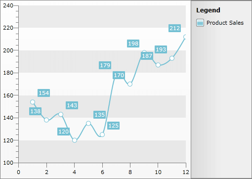
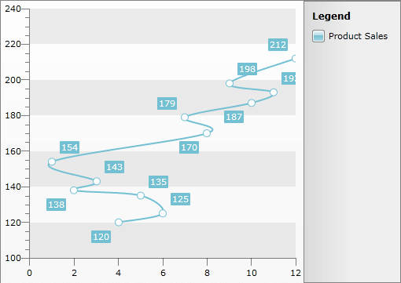

# Sorting


## 

>This feature is available in data bound scenarios only!

The __RadChart__ allows you to programmatically sort its data. This is achieved via the __SortDescriptors__ property of the __RadChart__ or the __SortDescriptors__ property of the __SeriesMapping__. This collection allows you to use descriptors which define the sorting member and the sorting direction for the data to which the __RadChart__ is bound. As this is a collection, you are able not only to add, but to remove or clear the entries in it, too.

The items in this collection are of type __ChartSortDescriptor__. It exposes two important properties:

* __Member__ - defines the property of the data object, by which the data will be sorted.

* __SortDirection__ -  defines the sorting direction.

Basically the sorting in the context of the __RadChart__ represents the way in which the data points are connected. For example, if you have a __LineSeriesDefinition__ and you define an ascending sorting, the line will connect the points in ascending order.

Here is an example of a chart without sorting descriptors.



Here is an example of implementing sorting.

>tipTo use the __ChartSortDescriptors__ in XAML you have to declare the following namespace:

#### __XAML__

```XAML
	<!--  xmlns:telerikCharting="clr-namespace:Telerik.Windows.Controls.Charting;assembly=Telerik.Windows.Controls.Charting"  -->
```


#### __XAML__

```XAML
	<telerik:RadChart x:Name="radChart">
	    <telerik:RadChart.SortDescriptors>
	        <telerik:ChartSortDescriptor Member="Quantity" SortDirection="Ascending" />
	    </telerik:RadChart.SortDescriptors>
	</telerik:RadChart>
```


#### __C#__

```C#
	ChartSortDescriptor descriptor = new ChartSortDescriptor();
	descriptor.Member = "Title";
	descriptor.SortDirection = ListSortDirection.Ascending;
	this.radChart.SortDescriptors.Add(descriptor);
```


#### __VB.NET__

```VB.NET
	Dim descriptor As New ChartSortDescriptor()
	descriptor.Member = "Title"
	descriptor.SortDirection = ListSortDirection.Ascending
	Me.radChart.SortDescriptors.Add(descriptor)
```

    
Here is a snapshot of the result.
    


