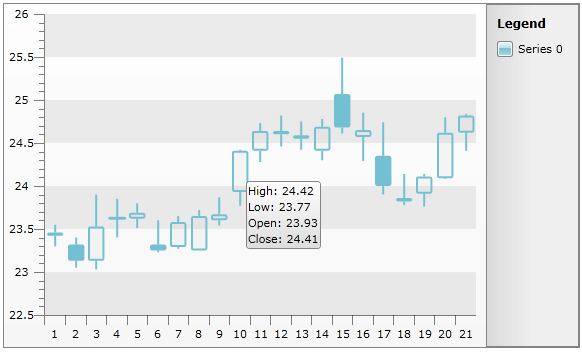
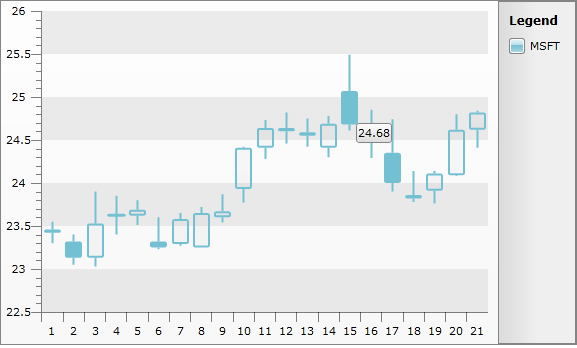
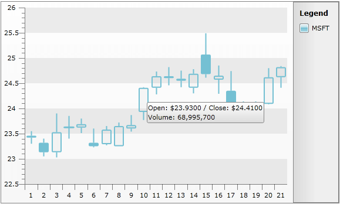
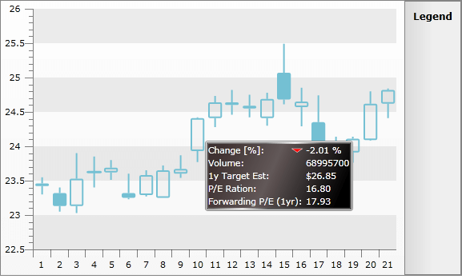

# ToolTips


__RadChart__ provides support for displaying tooltips when the mouse cursor hovers over the respective series items.

The tooltips are disabled by default but you can enable them by setting the __SeriesDefinition.ShowItemToolTips__ to __True__. Moreover, you can enable the functionality for one series and disable it for another in the same chart area. Additionally, you can change the default tooltip format by using __SeriesDefinition.ItemToolTipFormat__ property or you can completely customize the tooltip content by using the __ChartArea.ItemToolTipOpening__ and __ChartArea.ItemToolTipClosing__ events.

The example below shows candlestick chart bound to a collection of __TradeData__ objects, where the __TradeData__ object has the following structure:


```C#
	public class TradeData
	{
	    public string Emission
	    {
	        get;
	        set;
	    }
	    public DateTime FromDate
	    {
	        get;
	        set;
	    }
	    public DateTime ToDate
	    {
	        get;
	        set;
	    }
	    public double Open
	    {
	        get;
	        set;
	    }
	    public double High
	    {
	        get;
	        set;
	    }
	    public double Low
	    {
	        get;
	        set;
	    }
	    public double Close
	    {
	        get;
	        set;
	    }
	    public double Volume
	    {
	        get;
	        set;
	    }
	
	    public static ObservableCollection<TradeData> GetWeeklyData( string code )
	    {
	        ObservableCollection<TradeData> tradeData;
	        tradeData = new ObservableCollection<TradeData>() {
	            new TradeData() { Emission="MSFT", FromDate = new DateTime( 2009, 8, 10 ), Open = 23.4600, High = 23.5500, Low = 23.3000, Close = 23.4200, Volume = 35258950 },
	            new TradeData() { Emission="MSFT", FromDate = new DateTime( 2009, 8, 11 ), Open = 23.3200, High = 23.4000, Low = 23.0500, Close = 23.1300, Volume = 33611790 },
	            new TradeData() { Emission="MSFT", FromDate = new DateTime( 2009, 8, 12 ), Open = 23.1300, High = 23.9000, Low = 23.0300, Close = 23.5300, Volume = 61936270 },
	            new TradeData() { Emission="MSFT", FromDate = new DateTime( 2009, 8, 13 ), Open = 23.6300, High = 23.8500, Low = 23.4000, Close = 23.6200, Volume = 38951990 },
	            new TradeData() { Emission="MSFT", FromDate = new DateTime( 2009, 8, 14 ), Open = 23.6200, High = 23.8000, Low = 23.5100, Close = 23.6900, Volume = 46328540 },
	            new TradeData() { Emission="MSFT", FromDate = new DateTime( 2009, 8, 17 ), Open = 23.3200, High = 23.6000, Low = 23.2300, Close = 23.2500, Volume = 42462890 },
	            new TradeData() { Emission="MSFT", FromDate = new DateTime( 2009, 8, 18 ), Open = 23.2900, High = 23.6520, Low = 23.2700, Close = 23.5800, Volume = 38831620 },
	            new TradeData() { Emission="MSFT", FromDate = new DateTime( 2009, 8, 19 ), Open = 23.2500, High = 23.7200, Low = 23.2500, Close = 23.6500, Volume = 41814320 },
	            new TradeData() { Emission="MSFT", FromDate = new DateTime( 2009, 8, 20 ), Open = 23.6000, High = 23.8700, Low = 23.5400, Close = 23.6700, Volume = 39502680 },
	            new TradeData() { Emission="MSFT", FromDate = new DateTime( 2009, 8, 21 ), Open = 23.9300, High = 24.4200, Low = 23.7700, Close = 24.4100, Volume = 68995700},
	            new TradeData() { Emission="MSFT", FromDate = new DateTime( 2009, 8, 24 ), Open = 24.4100, High = 24.7326, Low = 24.2800, Close = 24.6400, Volume = 54159300 },
	            new TradeData() { Emission="MSFT", FromDate = new DateTime( 2009, 8, 25 ), Open = 24.6000, High = 24.8200, Low = 24.4600, Close = 24.6400, Volume = 43961480 },
	            new TradeData() { Emission="MSFT", FromDate = new DateTime( 2009, 8, 26 ), Open = 24.5900, High = 24.7500, Low = 24.4200, Close = 24.5500, Volume = 41060010 },
	            new TradeData() { Emission="MSFT", FromDate = new DateTime( 2009, 8, 27 ), Open = 24.4100, High = 24.7800, Low = 24.3000, Close = 24.6900, Volume = 45433940 },
	            new TradeData() { Emission="MSFT", FromDate = new DateTime( 2009, 8, 28 ), Open = 25.0700, High = 25.4900, Low = 24.6100, Close = 24.6800, Volume = 55789640 },
	            new TradeData() { Emission="MSFT", FromDate = new DateTime( 2009, 8, 31 ), Open = 24.5700, High = 24.8500, Low = 24.2900, Close = 24.6500, Volume = 49582950 },
	            new TradeData() { Emission="MSFT", FromDate = new DateTime( 2009, 9, 1 ), Open = 24.3500, High = 24.7400, Low = 23.9000, Close = 24.0000, Volume = 62571800 },
	            new TradeData() { Emission="MSFT", FromDate = new DateTime( 2009, 9, 2 ), Open = 23.8200, High = 24.1400, Low = 23.7800, Close = 23.8600, Volume = 40726040 },
	            new TradeData() { Emission="MSFT", FromDate = new DateTime( 2009, 9, 3 ), Open = 23.9100, High = 24.1400, Low = 23.7600, Close = 24.1100, Volume = 34110810 },
	            new TradeData() { Emission="MSFT", FromDate = new DateTime( 2009, 9, 4 ), Open = 24.0900, High = 24.8001, Low = 24.0800, Close = 24.6200, Volume = 44987570 },
	            new TradeData() { Emission="MSFT", FromDate = new DateTime( 2009, 9, 8 ), Open = 24.6200, High = 24.8400, Low = 24.4100, Close = 24.8200, Volume = 52243880 } };
	        return tradeData;
	    }
	}
```
```VB.NET
	Public Class TradeData
	    Public Property Emission() As String
	        Get
	            Return m_Emission
	        End Get
	        Set(value As String)
	            m_Emission = value
	        End Set
	    End Property
	    Private m_Emission As String
	    Public Property FromDate() As DateTime
	        Get
	            Return m_FromDate
	        End Get
	        Set(value As DateTime)
	            m_FromDate = value
	        End Set
	    End Property
	    Private m_FromDate As DateTime
	    Public Property ToDate() As DateTime
	        Get
	            Return m_ToDate
	        End Get
	        Set(value As DateTime)
	            m_ToDate = value
	        End Set
	    End Property
	    Private m_ToDate As DateTime
	    Public Property Open() As Double
	        Get
	            Return m_Open
	        End Get
	        Set(value As Double)
	            m_Open = value
	        End Set
	    End Property
	    Private m_Open As Double
	    Public Property High() As Double
	        Get
	            Return m_High
	        End Get
	        Set(value As Double)
	            m_High = value
	        End Set
	    End Property
	    Private m_High As Double
	    Public Property Low() As Double
	        Get
	            Return m_Low
	        End Get
	        Set(value As Double)
	            m_Low = value
	        End Set
	    End Property
	    Private m_Low As Double
	    Public Property Close() As Double
	        Get
	            Return m_Close
	        End Get
	        Set(value As Double)
	            m_Close = value
	        End Set
	    End Property
	    Private m_Close As Double
	    Public Property Volume() As Double
	        Get
	            Return m_Volume
	        End Get
	        Set(value As Double)
	            m_Volume = value
	        End Set
	    End Property
	    Private m_Volume As Double
	
	    Public Shared Function GetWeeklyData(code As String) As ObservableCollection(Of TradeData)
	        Dim tradeData As ObservableCollection(Of TradeData)
	        tradeData = New ObservableCollection(Of TradeData)() From { _
	            New TradeData() With { _
	                .Emission = "MSFT", _
	                .FromDate = New DateTime(2009, 8, 10), _
	                .Open = 23.46, _
	                .High = 23.55, _
	                .Low = 23.3, _
	                .Close = 23.42, _
	                .Volume = 35258950 _
	            }, _
	            New TradeData() With { _
	                .Emission = "MSFT", _
	                .FromDate = New DateTime(2009, 8, 11), _
	                .Open = 23.32, _
	                .High = 23.4, _
	                .Low = 23.05, _
	                .Close = 23.13, _
	                .Volume = 33611790 _
	            }, _
	            New TradeData() With { _
	                .Emission = "MSFT", _
	                .FromDate = New DateTime(2009, 8, 12), _
	                .Open = 23.13, _
	                .High = 23.9, _
	                .Low = 23.03, _
	                .Close = 23.53, _
	                .Volume = 61936270 _
	            }, _
	            New TradeData() With { _
	                .Emission = "MSFT", _
	                .FromDate = New DateTime(2009, 8, 13), _
	                .Open = 23.63, _
	                .High = 23.85, _
	                .Low = 23.4, _
	                .Close = 23.62, _
	                .Volume = 38951990 _
	            }, _
	            New TradeData() With { _
	                .Emission = "MSFT", _
	                .FromDate = New DateTime(2009, 8, 14), _
	                .Open = 23.62, _
	                .High = 23.8, _
	                .Low = 23.51, _
	                .Close = 23.69, _
	                .Volume = 46328540 _
	            }, _
	            New TradeData() With { _
	                .Emission = "MSFT", _
	                .FromDate = New DateTime(2009, 8, 17), _
	                .Open = 23.32, _
	                .High = 23.6, _
	                .Low = 23.23, _
	                .Close = 23.25, _
	                .Volume = 42462890 _
	            }, _
	            New TradeData() With { _
	                .Emission = "MSFT", _
	                .FromDate = New DateTime(2009, 8, 18), _
	                .Open = 23.29, _
	                .High = 23.652, _
	                .Low = 23.27, _
	                .Close = 23.58, _
	                .Volume = 38831620 _
	            }, _
	            New TradeData() With { _
	                .Emission = "MSFT", _
	                .FromDate = New DateTime(2009, 8, 19), _
	                .Open = 23.25, _
	                .High = 23.72, _
	                .Low = 23.25, _
	                .Close = 23.65, _
	                .Volume = 41814320 _
	            }, _
	            New TradeData() With { _
	                .Emission = "MSFT", _
	                .FromDate = New DateTime(2009, 8, 20), _
	                .Open = 23.6, _
	                .High = 23.87, _
	                .Low = 23.54, _
	                .Close = 23.67, _
	                .Volume = 39502680 _
	            }, _
	            New TradeData() With { _
	                .Emission = "MSFT", _
	                .FromDate = New DateTime(2009, 8, 21), _
	                .Open = 23.93, _
	                .High = 24.42, _
	                .Low = 23.77, _
	                .Close = 24.41, _
	                .Volume = 68995700 _
	            }, _
	            New TradeData() With { _
	                .Emission = "MSFT", _
	                .FromDate = New DateTime(2009, 8, 24), _
	                .Open = 24.41, _
	                .High = 24.7326, _
	                .Low = 24.28, _
	                .Close = 24.64, _
	                .Volume = 54159300 _
	            }, _
	            New TradeData() With { _
	                .Emission = "MSFT", _
	                .FromDate = New DateTime(2009, 8, 25), _
	                .Open = 24.6, _
	                .High = 24.82, _
	                .Low = 24.46, _
	                .Close = 24.64, _
	                .Volume = 43961480 _
	            }, _
	            New TradeData() With { _
	                .Emission = "MSFT", _
	                .FromDate = New DateTime(2009, 8, 26), _
	                .Open = 24.59, _
	                .High = 24.75, _
	                .Low = 24.42, _
	                .Close = 24.55, _
	                .Volume = 41060010 _
	            }, _
	            New TradeData() With { _
	                .Emission = "MSFT", _
	                .FromDate = New DateTime(2009, 8, 27), _
	                .Open = 24.41, _
	                .High = 24.78, _
	                .Low = 24.3, _
	                .Close = 24.69, _
	                .Volume = 45433940 _
	            }, _
	            New TradeData() With { _
	                .Emission = "MSFT", _
	                .FromDate = New DateTime(2009, 8, 28), _
	                .Open = 25.07, _
	                .High = 25.49, _
	                .Low = 24.61, _
	                .Close = 24.68, _
	                .Volume = 55789640 _
	            }, _
	            New TradeData() With { _
	                .Emission = "MSFT", _
	                .FromDate = New DateTime(2009, 8, 31), _
	                .Open = 24.57, _
	                .High = 24.85, _
	                .Low = 24.29, _
	                .Close = 24.65, _
	                .Volume = 49582950 _
	            }, _
	            New TradeData() With { _
	                .Emission = "MSFT", _
	                .FromDate = New DateTime(2009, 9, 1), _
	                .Open = 24.35, _
	                .High = 24.74, _
	                .Low = 23.9, _
	                .Close = 24.0, _
	                .Volume = 62571800 _
	            }, _
	            New TradeData() With { _
	                .Emission = "MSFT", _
	                .FromDate = New DateTime(2009, 9, 2), _
	                .Open = 23.82, _
	                .High = 24.14, _
	                .Low = 23.78, _
	                .Close = 23.86, _
	                .Volume = 40726040 _
	            }, _
	            New TradeData() With { _
	                .Emission = "MSFT", _
	                .FromDate = New DateTime(2009, 9, 3), _
	                .Open = 23.91, _
	                .High = 24.14, _
	                .Low = 23.76, _
	                .Close = 24.11, _
	                .Volume = 34110810 _
	            }, _
	            New TradeData() With { _
	                .Emission = "MSFT", _
	                .FromDate = New DateTime(2009, 9, 4), _
	                .Open = 24.09, _
	                .High = 24.8001, _
	                .Low = 24.08, _
	                .Close = 24.62, _
	                .Volume = 44987570 _
	            }, _
	            New TradeData() With { _
	                .Emission = "MSFT", _
	                .FromDate = New DateTime(2009, 9, 8), _
	                .Open = 24.62, _
	                .High = 24.84, _
	                .Low = 24.41, _
	                .Close = 24.82, _
	                .Volume = 52243880 _
	            } _
	}
	        Return tradeData
	    End Function
	End Class
```


You can set the __ShowItemToolTips__ property to __True__ declaratively or in the code-behind.

>Note that __ShowItemToolTips__ is a property of the __SeriesMapping.SeriesDefinition__, which means that you can control the tooltips for each series separately.


```XAML
	<telerik:RadChart x:Name="radChart">
	    <telerik:RadChart.SeriesMappings>
	        <telerik:SeriesMapping>
	            <telerik:SeriesMapping.SeriesDefinition>
	                <telerik:CandleStickSeriesDefinition ShowItemToolTips="True" />
	            </telerik:SeriesMapping.SeriesDefinition>
	            <telerik:SeriesMapping.ItemMappings>
	                <telerik:ItemMapping DataPointMember="Open" FieldName="Open" />
	                <telerik:ItemMapping DataPointMember="High" FieldName="High" />
	                <telerik:ItemMapping DataPointMember="Low" FieldName="Low" />
	                <telerik:ItemMapping DataPointMember="Close" FieldName="Close" />
	            </telerik:SeriesMapping.ItemMappings>
	        </telerik:SeriesMapping>
	    </telerik:RadChart.SeriesMappings>
	</telerik:RadChart>
```


On the snapshot below you can see the default tooltip for the __CandleStick__ chart type:



The default tooltip depends on the type of the __RadChart__:

* The tooltip for __Range__ charts shows __DataPoint.High__ and __DataPoint.Low__ values. 


* The tooltip for __Stick__ and __Candlestick__ charts shows __DataPoint.High__, __DataPoint.Low__, __DataPoint.Open__ and __DataPoint.Close__ values. 


* For all the other chart types, __DataPoint.YValue__ is used. 

If the default tooltip does not fit your needs, you can use __DataPoint.Tooltip__ to explicitly specify the exact tooltip text for each data series item. Notice that when __DataPoint.Tooltip__ is set, __RadChart__ will ignore the values set for __ItemToolTipFormat__.

You can also bind to __DataPoint.Tooltip__ property, using [SeriesMapping/ItemMapping]() with __DataPointMember__ set to __Tooltip__. Below you can see how to bind the tooltip to the __Close__ property of the underlying __TradeData__ object:


```XAML
	<telerik:RadChart x:Name="radChart">
	    <telerik:RadChart.SeriesMappings>
	        <telerik:SeriesMapping>
	            <telerik:SeriesMapping.SeriesDefinition>
	                <telerik:CandleStickSeriesDefinition ItemToolTipFormat="Open: #OPEN{C4}" ShowItemToolTips="True" />
	            </telerik:SeriesMapping.SeriesDefinition>
	            <telerik:SeriesMapping.ItemMappings>
	                <telerik:ItemMapping DataPointMember="Open" FieldName="Open" />
	                <telerik:ItemMapping DataPointMember="High" FieldName="High" />
	                <telerik:ItemMapping DataPointMember="Low" FieldName="Low" />
	                <telerik:ItemMapping DataPointMember="Close" FieldName="Close" />
	                <telerik:ItemMapping DataPointMember="Tooltip" FieldName="Close" />
	            </telerik:SeriesMapping.ItemMappings>
	        </telerik:SeriesMapping>
	    </telerik:RadChart.SeriesMappings>
	</telerik:RadChart>
```


And on the snapshot below you can see that the tooltip for each data point is taken directly from the __Close__ property of the underlying __TradeData__, ignoring the value specified in __ItemToolTipFormat__. 



##  Formatting the Tooltip

__RadChart__ allows you to use [Format Expressions]() to format the tooltip text. Use the __SeriesDefinition.ItemToolTipFormat__ property to set the tooltip format for each data series. By using format expressions, you can also add some context data in the tooltip text using [tokens](). 

For example, "__#OPEN{0.0000}__" means that the tooltip will take the value from the __DataPoint.Open__ property and will format the value using "__0.000__". When the tooltip is shown, the open value will be formatted with four digits after the decimal point: "147.2746". 

You can construct more complex tooltips combining several tokens, for example: __"Open: #OPEN{C4}/Close: #CLOSE{C4}1&#x0a;#DATAITEM.Volume{###,###,##0}"__. This format expression uses three tokens to obtain the values from the underlying __DataPoint__ object's properties __Open__, __Close__ and __DataItem.Volume__. For more about __#DATAITEM__ token take a look at [Format Expressions]().


```XAML
	<telerik:RadChart x:Name="radChart">
	    <telerik:RadChart.SeriesMappings>
	        <telerik:SeriesMapping LegendLabel="MSFT">
	            <telerik:SeriesMapping.SeriesDefinition>
	                <telerik:CandleStickSeriesDefinition ItemToolTipFormat="Open: #OPEN{C4} / Close: #CLOSE{C4}&#x0a;Volume: #DATAITEM.Volume{###,###,##0}" ShowItemToolTips="True" />
	            </telerik:SeriesMapping.SeriesDefinition>
	            <telerik:SeriesMapping.ItemMappings>
	                <telerik:ItemMapping DataPointMember="Open" FieldName="Open" />
	                <telerik:ItemMapping DataPointMember="High" FieldName="High" />
	                <telerik:ItemMapping DataPointMember="Low" FieldName="Low" />
	                <telerik:ItemMapping DataPointMember="Close" FieldName="Close" />
	
	            </telerik:SeriesMapping.ItemMappings>
	        </telerik:SeriesMapping>
	    </telerik:RadChart.SeriesMappings>
	</telerik:RadChart>
```


```C#
	RadChart radChart = new RadChart();
	SeriesMapping seriesMapping = new SeriesMapping();
	seriesMapping.SeriesDefinition = new CandleStickSeriesDefinition();
	seriesMapping.SeriesDefinition.ShowItemToolTips = true;
	seriesMapping.SeriesDefinition.ItemToolTipFormat = "Open: #OPEN{C4} / Close: #CLOSE{C4}\nVolume: #DATAITEM.Volume{###,###,##0}";
	seriesMapping.ItemMappings.Add( new ItemMapping( "Open", DataPointMember.Open) );
	seriesMapping.ItemMappings.Add( new ItemMapping( "High", DataPointMember.High) );
	seriesMapping.ItemMappings.Add( new ItemMapping( "Low", DataPointMember.Low) );
	seriesMapping.ItemMappings.Add( new ItemMapping( "Close", DataPointMember.Close) );
	radChart.SeriesMappings.Add( seriesMapping );
```
```VB.NET
	Dim radChart As New Telerik.Windows.Controls.RadChart()
	Dim seriesMapping As New SeriesMapping()
	seriesMapping.SeriesDefinition = New CandleStickSeriesDefinition()
	seriesMapping.SeriesDefinition.ShowItemToolTips = True
	seriesMapping.SeriesDefinition.ItemToolTipFormat = "Open: #OPEN{C4} / Close: #CLOSE{C4}" & vbLf & "Volume: #DATAITEM.Volume{###,###,##0}"
	seriesMapping.ItemMappings.Add(New ItemMapping("Open", DataPointMember.Open))
	seriesMapping.ItemMappings.Add(New ItemMapping("High", DataPointMember.High))
	seriesMapping.ItemMappings.Add(New ItemMapping("Low", DataPointMember.Low))
	seriesMapping.ItemMappings.Add(New ItemMapping("Close", DataPointMember.Close))
	radChart.SeriesMappings.Add(seriesMapping)
```


The snapshot below shows the customized tooltip:




If you need more information about label formatting take a look at the [Format Expressions]() topic.

>tip To be able to show the ToolTip content separated on new line in XAML you should use the hexidecimally encoded value " &#x0a;" to represent the "\n" literal.

## Customizing Tooltip Content

Expression formats are useful when the tooltip represents plain text messages. However, as a __ContentControl__ you can completely customize its appearance using the two events exposed by __ChartArea__:

* __ChartArea.ItemToolTipOpening__ - use to define the content of the tooltip. 


* __ChartArea.ItemToolTipClosing__ - use to clear any resources related to the shown tooltip. 

The next example demonstrates how to use __StockToolTipControl__ - a custom user control as a tooltip on a __Candlestick__ chart. As a __RadChart.ItemSource__, a list of __TradeData__ objects will be used (more about data binding you can find [here]()).

Now, __StockToolTipControl__ has to be created. It will show additional information in a grid:


```XAML
	<UserControl>
	    <UserControl.Resources>
	        <Style x:Key="textStyle" TargetType="TextBlock">
	            <Setter Property="Foreground" Value="White" />
	            <Setter Property="FontSize" Value="10.667" />
	        </Style>
	    </UserControl.Resources>
	    <Border BorderThickness="2">
	        <Grid x:Name="LayoutRoot">
	            <Grid.ColumnDefinitions>
	                <ColumnDefinition />
	                <ColumnDefinition Width="Auto" />
	            </Grid.ColumnDefinitions>
	            <Grid.RowDefinitions>
	                <RowDefinition Height="Auto" />
	                <RowDefinition Height="Auto" />
	                <RowDefinition Height="Auto" />
	                <RowDefinition Height="Auto" />
	                <RowDefinition Height="Auto" />
	            </Grid.RowDefinitions>
	            <TextBlock Grid.Row="0"
	                       Grid.Column="0"
	                       Style="{StaticResource textStyle}"
	                       Text="Change [%]: " />
	            <Path x:Name="arrow"
	                  Grid.Row="0"
	                  Grid.Column="0"
	                  HorizontalAlignment="Right"
	                  VerticalAlignment="Center"
	                  Data="M0.000000,0.000000 L20.000000,0.000000 L10.000000,10.000000 z"
	                  Fill="Red"
	                  RenderTransformOrigin="0.5,0.5"
	                  Stroke="White">
	                <Path.RenderTransform>
	                    <TransformGroup>
	                        <ScaleTransform ScaleX="0.65" ScaleY="0.45" />
	                        <SkewTransform />
	                        <RotateTransform x:Name="rotateTransform" />
	                        <TranslateTransform />
	                    </TransformGroup>
	                </Path.RenderTransform>
	            </Path>
	            <TextBlock x:Name="changeNetPercent"
	                       Grid.Row="0"
	                       Grid.Column="1"
	                       Style="{StaticResource textStyle}"
	                       Text="N/A" />
	            <TextBlock Grid.Row="1"
	                       Grid.Column="0"
	                       Style="{StaticResource textStyle}"
	                       Text="Volume:" />
	            <TextBlock x:Name="volume"
	                       Grid.Row="1"
	                       Grid.Column="1"
	                       Style="{StaticResource textStyle}"
	                       Text="N/A" />
	            <TextBlock Grid.Row="2"
	                       Grid.Column="0"
	                       Style="{StaticResource textStyle}"
	                       Text="1y Target Est:" />
	            <TextBlock x:Name="oneYearTargetEst"
	                       Grid.Row="2"
	                       Grid.Column="1"
	                       Style="{StaticResource textStyle}"
	                       Text="N/A" />
	            <TextBlock Grid.Row="3"
	                       Grid.Column="0"
	                       Style="{StaticResource textStyle}"
	                       Text="P/E Ration: " />
	            <TextBlock x:Name="peRatio"
	                       Grid.Row="3"
	                       Grid.Column="1"
	                       Style="{StaticResource textStyle}"
	                       Text="N/A" />
	            <TextBlock Grid.Row="4"
	                       Grid.Column="0"
	                       Style="{StaticResource textStyle}"
	                       Text="Forwarding P/E (1yr): " />
	            <TextBlock x:Name="forwardingPE"
	                       Grid.Row="4"
	                       Grid.Column="1"
	                       Style="{StaticResource textStyle}"
	                       Text="N/A" />
	        </Grid>
	    </Border>
	</UserControl>
```


In the code-behind, there are a few properties - each one is setting the value of the appropriate text box:


```C#
	public partial class StockToolTipControl : UserControl
	{
	    public StockToolTipControl()
	    {
	        InitializeComponent();
	    }
	    public double ChangeNetPercent
	    {
	        set
	        {
	            this.changeNetPercent.Text = value.ToString( "p" );
	            this.arrow.Fill = new SolidColorBrush( value < 0.0 ? Colors.Red : Colors.Green );
	            this.rotateTransform.Angle = value < 0.0 ? 0 : 180;
	        }
	    }
	    public double Volume
	    {
	        set
	        {
	            this.volume.Text = value.ToString( ",##0" );
	        }
	    }
	    public double OneYearTargetEst
	    {
	        set
	        {
	            this.oneYearTargetEst.Text = value.ToString( "C" );
	        }
	    }
	    public double PERatio
	    {
	        set
	        {
	            this.peRatio.Text = value.ToString( "00.00" );
	        }
	    }
	    public double ForwardingPE
	    {
	        set
	        {
	            this.forwardingPE.Text = value.ToString( "00.00" );
	        }
	    }
	}
```
```VB.NET
	Partial Public Class StockToolTipControl
	    Inherits UserControl
	    Public Sub New()
	        InitializeComponent()
	    End Sub
	
	    Public WriteOnly Property ChangeNetPercentProp() As Double
	        Set(value As Double)
	            Me.changeNetPercent.Text = value.ToString("p")
	            Me.arrow.Fill = New SolidColorBrush(If(value < 0.0, Colors.Red, Colors.Green))
	            Me.rotateTransform.Angle = If(value < 0.0, 0, 180)
	        End Set
	    End Property
	    Public WriteOnly Property VolumeProp() As Double
	        Set(value As Double)
	            Me.volume.Text = value.ToString(",##0")
	        End Set
	    End Property
	    Public WriteOnly Property OneYearTargetEstProp() As Double
	        Set(value As Double)
	            Me.oneYearTargetEst.Text = value.ToString("C")
	        End Set
	    End Property
	    Public WriteOnly Property PERatioProp() As Double
	        Set(value As Double)
	            Me.peRatio.Text = value.ToString("00.00")
	        End Set
	    End Property
	    Public WriteOnly Property ForwardingPEProp() As Double
	        Set(value As Double)
	            Me.forwardingPE.Text = value.ToString("00.00")
	        End Set
	    End Property
	End Class
```


You can play with the colors to give the control a better look and feel.The next step is to assign an event handler to the __ChartArea.ItemToolTipOpening__ event:


```XAML
	<!--  Custom tooltip  -->
	<telerik:RadChart x:Name="radChart">
	    <telerik:RadChart.DefaultView>
	        <telerik:ChartDefaultView>
	            <telerik:ChartDefaultView.ChartArea>
	                <telerik:ChartArea ItemToolTipOpening="ChartArea_ItemToolTipOpening" />
	            </telerik:ChartDefaultView.ChartArea>
	        </telerik:ChartDefaultView>
	    </telerik:RadChart.DefaultView>
	    <telerik:RadChart.SeriesMappings>
	        <telerik:SeriesMapping LegendLabel="MSFT">
	            <telerik:SeriesMapping.SeriesDefinition>
	                <telerik:CandleStickSeriesDefinition ShowItemToolTips="True" />
	            </telerik:SeriesMapping.SeriesDefinition>
	            <telerik:SeriesMapping.ItemMappings>
	                <telerik:ItemMapping DataPointMember="Open" FieldName="Open" />
	                <telerik:ItemMapping DataPointMember="High" FieldName="High" />
	                <telerik:ItemMapping DataPointMember="Low" FieldName="Low" />
	                <telerik:ItemMapping DataPointMember="Close" FieldName="Close" />
	            </telerik:SeriesMapping.ItemMappings>
	        </telerik:SeriesMapping>
	    </telerik:RadChart.SeriesMappings>
	</telerik:RadChart>
```


__ItemToolTipOpening__ event handler has two parameters:

* __ItemToolTip2D__ tooltip - the tooltip control to customize. 


* __ItemToolTipEventArgs__ e - event arguments from where you can take the __DataPoint__ for which the tooltip has to be shown. 

The final step is to create a new instance of the __StockToolTipControl__ and to initialize its properties. __ItemToolTipEventArgs.DataPoint.DataItem__ has to be used. It holds the __TradingData__ object associated to this __DataPoint:__


```C#
	private void ChartArea_ItemToolTipOpening(ItemToolTip2D tooltip, ItemToolTipEventArgs e)
	{
	    TradeData tradeData = e.DataPoint.DataItem as TradeData;
	    StockToolTipControl stockToolTip = new StockToolTipControl();
	    stockToolTip.ChangeNetPercent = 1 - (tradeData.Close / tradeData.Open);
	    stockToolTip.Volume = tradeData.Volume;
	    //The next three properties shows some fictional data to illustrate the idea
	    stockToolTip.OneYearTargetEst = tradeData.Close * 1.1;
	    stockToolTip.PERatio = 16.80;
	    stockToolTip.ForwardingPE = 17.93;
	    tooltip.Content = stockToolTip;
	}
```
```VB.NET
	Private Sub ChartArea_ItemToolTipOpening(ByVal tooltip As ItemToolTip2D, ByVal e As ItemToolTipEventArgs)
	    Dim tradeData As TradeData = TryCast(e.DataPoint.DataItem, TradeData)
	    Dim stockToolTip As New StockToolTipControl()
	    stockToolTip.ChangeNetPercentProp = 1 - (tradeData.Close / tradeData.Open)
	    stockToolTip.VolumeProp = tradeData.Volume
	    ' The next three properties shows some fictional data to illustrate the idea' 
	    stockToolTip.OneYearTargetEstProp = tradeData.Close * 1.1
	    stockToolTip.PERatioProp = 16.8R
	    stockToolTip.ForwardingPEProp = 17.93
	
	    tooltip.Content = stockToolTip
	End Sub
```


As you can see, the new instance of __StockToolTipControl__ is created, initialized and set to __toolTip.Content__:



>tip Check out how a [Drill Down Chart]() is created using customized tooltip. 

## See Also

 * [Format Expressions]()

 * [Interactivity]()

 * [Chart Area]()

 * [Chart Point-marks]()

 * [Drill Down Chart]()
