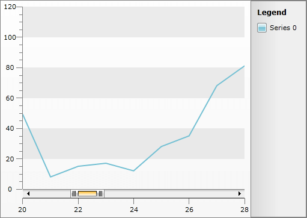
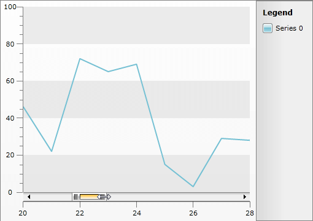
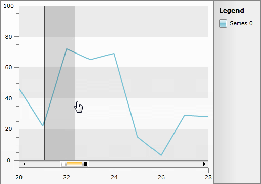

# Zooming and Scrolling


>This feature is available in data bound scenarios only! Additional requirement is an ItemMapping with DataPointMember set to XValue or XCategory.

Sometimes, when having a large sets of data, they are hard to visualize, because the points to be rendered are far more than the space available for the __RadChart__. In this case you can use the [Sampling]() feature of the __RadChart__.

## Implementing Zooming and Scrolling

Besides the __Sampling__, the __RadChart__ provides you with __Zooming__ and __Scrolling__, which additionally help handling large sets of data. The API that implements these two features is encapsulated in the __ZoomScrollingSettings__ class. It exposes the following properties:

>Consider the range of the data as logical values between 0 and 1. For example, if the data has consecutive values from 0 to 100, the 0.2 to 0.3 logical range will match the values between 20 and 30.

* __MinZoomRange__ - specifies the minimal range that can be visible in the __ChartArea__. For example, a minimal range of 0.1 will display 10% of the whole series (the series will get zoomed 10x).

* __RangeStart__ - specifies the start of the range that will get displayed in the __ChartArea__. For example, if you set it to 0.5 the data displayed in the __ChartArea__ will start from the middle of the set.

* __RangeEnd__ - specifies the end of the range that will get displayed in the __ChartArea__. For example, if you set it to 0.5 the data displayed in the __ChartArea__ will end in the middle of the set.

* __Range__ - it is a read only property, that returns the difference between the __RangeEnd__ and the __RangeStart__.

* __ScrollMode__ - determines the mode of the scrolling and has the following values:

* __None__ - neither zoom, nor scrolling are enabled.

* __ScrollAndZoom__ - both zoom and scrolling are enabled.

* __ScrollOnly__ - only scrolling is enabled.

>tip The __ZoomScrollingSetting__ exposes a __PropertyChanged__ event which allows you to execute your custom logic, when a certain property has changed.

To apply the __ZoomScrollingSettings__ you have to set them to the __ZoomScrollingSettingsX__ and/or the __ZoomScrollingSettingsY__ of the __ChartArea__.

>tip Combining the Zooming feature with the Sampling feature can be very useful.

Here is an example.


```C#
	this.radChart.DefaultView.ChartArea.ZoomScrollSettingsX.MinZoomRange = 0.1;
	this.radChart.DefaultView.ChartArea.ZoomScrollSettingsX.RangeEnd = 0.3;
	this.radChart.DefaultView.ChartArea.ZoomScrollSettingsX.RangeStart = 0.2;
	this.radChart.DefaultView.ChartArea.ZoomScrollSettingsX.ScrollMode = ScrollMode.ScrollAndZoom;
```
```VB.NET
	Me.radChart.DefaultView.ChartArea.ZoomScrollSettingsX.MinZoomRange = 0.1
	Me.radChart.DefaultView.ChartArea.ZoomScrollSettingsX.RangeEnd = 0.3
	Me.radChart.DefaultView.ChartArea.ZoomScrollSettingsX.RangeStart = 0.2
	Me.radChart.DefaultView.ChartArea.ZoomScrollSettingsX.ScrollMode = ScrollMode.ScrollAndZoom
```

    



## Using the Zooming and Scrolling

There are two things the user can do in order to zoom the series in the __ChartArea__:

* __Resize the ScrollBar__ - the __ScrollBar__ can be resized from both the left and the right side. Changing its size, changes the range of the displayed data.

    

* __Select an Area__ - you can draw a selection on the __ChartArea__, which will determine the range of data to be displayed.

    

## Styling the Zooming and Scrolling Elements

In order to style the Zooming and Scrolling elements you can use the __DragZoomLayerControlStyle__ and the __DragZoomSelectionStyle__ properties of the __ChartArea__.
