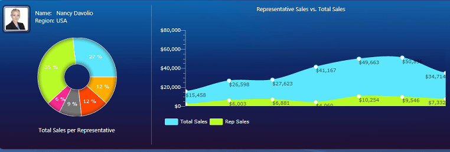

# Key Features

## ____

         
      

__RadChart__ key features:

* __20 2D chart types__ - Bar, Stacked Bar, Stacked Bar 100, Line, StackedLine, Area, Stacked Area, Stacked Area 100, Range, Spline, StackedSpline, Spline Area, Stacked Spline Area, Stacked Spline Area 100, Spline Range, Bubble, Stick, Candlestick, Pie and Doughnut. [Read more]()

* __9__ - Line, Bar, Area, StackedArea, StackedArea 100, Pie, Doughnut, StackedBar, StackedBar 100, Bubble, Funnel, Pyramid, Spline, Spline Area, Stacked Spline Area, Stacked Spline Area 100. [Read more]()

* __Rich Data Binding Support__ - leveraging the SilverlightWPF databinding capabilities, Telerik RadChart can be bound to various data services and other sources, such as Data Services, Lists of objects, ArrayList, ObservableCollection (with support for change notification). [Read more]()

* __Automated Data Binding to Nested Collections__ - with the increasing number of SilverlightWPF data sources and support for various data services, a new scenario is becoming more common: data binding to a collection of collections or nested collections. 
To support new data binding scenarios, Telerik RadChart provides automated data binding to Nested Collections. 

* __Tooltip support -__Telerik Chart allows adding tooltips to your charts for better visualization of your data. The tooltips can easily show the actual numbers behind the chart or even another chart. [Read more]()

* __Completely Stylable and Templatable__ - Telerik SilverlightWPF Chart is a 100% lookless control providing full support for Expression Blend.  All 2D series, charts and axis elements can be dropped independently in Blend and styled individually. Furthermore the control ships with several pre-defined skins, which will help you, deliver a consistent look and feel in your application. Restyling RadChart with the available themes is as simple as changing a single property. 
The added custom style properties for all major chart elements and all series facilitate using custom user styles. See [Styling and Appearance]() and [Templating](13DD5D60-0C6A-4ABE-B72F-27A3F1E14807). 

* __Animations and Interactivity__ - Telerik SilverlightWPF Chart offers rich animations out-of-the-box. With the provided events you are able to build the interactivity you need like drill down charts or customized tooltips. 

* __Categorical X Axis__ - with this feature enabled X axis can be used to plot not only values (e.g. number of sales, etc.), but also categories (e.g. months of the year, units, people, etc.). Using a Category axis, the SilverlightWPF Chart treats data as a sequence of non-numerical text labels; the marker is placed according to the position of the category in the sequence; data is provided per category. [Read more]()

* __DateTime Support__ - no worries binding __DateTimes__ in __RadChart__. [Read more]()

* __MVVM Support__ - Telerik SilverlightWPF Chart can be integrated with the Model-View-ViewModel (MVVM) pattern to get better control over chart customization. The control exposes fully separated functionality from appearance, thus providing you the power to completely restyle it without changing a single line of code. [See an example](http://demos.telerik.com/silverlight/default.aspx#Chart/MVVM)

* __Advanced X Axis Capabilities -__ to make the horizontal axis more intelligent and to improve the way horizontal axis handles user data, several new features are introduced: 

* __Ticks Distance__ - allows you to provide your own custom interval for tick marks. 

* __Label rotation angle__ – allows you to skew the labels and choose the angle in order to use the X axis in the most efficient way. 

* __Label step__ – a very convenient feature in a scenario when there are too many labels and they start overlap on the AxisX. What LabelStep does is kind of “sampling” operation where the criteria is ordinal e.g.
1….2….3….4….5….6….7….8….9….10
with LabelStep=2 will look like
1………..3……….5……….7……….9

* __Strict Mode for X Axis__ -Telerik SilverlightWPF Chart features a so-called "strict mode" for bar series. All XValues will be respected and bars will be positioned according to their XValues. If, however, you don't have any series items with XValues then RadChart will resume standard sequential ordering of each item. The following supporting features are available: 

* __Automatic range calculation__ - given in "strict" mode, the horizontal axis is able to calculate its MinValue and MaxValue such as no data is left behind. 

* __Automatic step calculation__ - when in "strict" mode with AutoRange enabled, the horizontal axis is able to dynamically increase/decrease the number of ticks on resize, resulting in more precise data presentation and better readability.  

* __Axis AutoScale Functionality__ - axes automatically adjust the MinValue / MaxValue range based on the series data that is displayed in the associated chart area. 

* __Axis AutoStep Functionality__ - the AutoStep feature introduces new and improved level of re-scaling that allows the chart axes to automatically re-arrange their values. Thanks to this feature point labels overlapping is avoided and 
the information is presented clearly and neatly. 

* __Multiple Y Axes__ - this feature allows you to present series of different scale on the same chart. The scale of each added Y axis corresponds to the associated data series and auto adjusts its range. 

* __Negative values__- __RadChart__provides full negative values support for all relevant two-dimensional series types.

* __Easily Customizable Series__- with Telerik SilverlightWPF Chart you can easily change the appearance of series: for example you can make the Bar series use Button controls to visualize data with a very simple change or just use the MVVM model and change the color of each bar.____

* __Chart Extending__ - __RadChart__ supports extensibility mechanism for the creation of custom chart extensions (tools) via the [Extensible Object Pattern](http://msdn.microsoft.com/en-us/library/ms733816.aspx). This pattern enables an object to participate in custom behavior, such as registering for events, or watching state transitions. 

* __Flexible Layout__ - Telerik SilverlightWPF Chart offers support for multiple chart areas in a single chart control, with a smart legend that can aggregate data from all of them. 

* __WPF__ - the SilverlightWPF Chart shares a common code-base and API with its WPFSilverlight counterpart. This means that you can achieve close to 100% code reuse for your chart  logic if you have parallel Silverlight/WPF development. 

* __Flexible API__ - with its easy to understand API, __RadChart__ provides you with fast and easy way to further deal with all the chart elements and their properties in the code behind. 

* __Free Testing Framework for RadControls__ - the free WebAii Testing Framework helps developers build automated functional tests and end–to-end scenario tests for both Silverlight- and AJAX-powered applications. The framework ships with special wrappers for Telerik RadControls for Silverlight and ASP.NET AJAX, making it easier than ever before to create and maintain tests.

# See Also

 * [Visual Structure]()

 * [Create Data Bound Chart]()

 * [Create a Line Chart with Static Data]()
