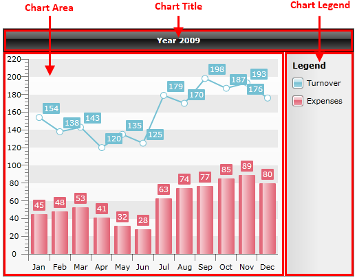
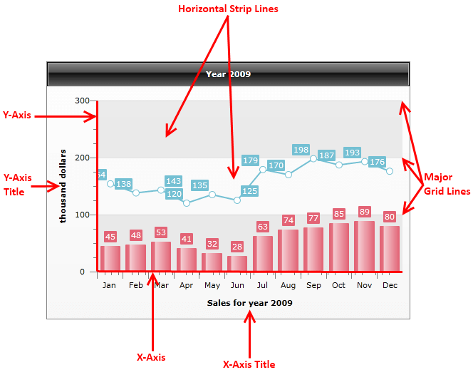
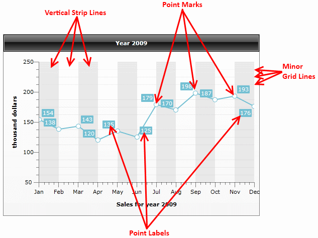
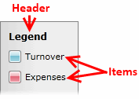

# Visual Structure

This section defines terms and concepts used in the scope of __RadChart__ you have to get familiar with prior to continue reading this help.

## Default layout

The structure of the __RadChart__ control is based on three major elements: [ChartTitle](), [ChartArea]() and [ChartLegend](). These elements are common for all chart types. The illustration below shows the default chart layout and the positions of the chart’s elements:

         
      

## Chart Title

Usually the __ChartTitle__ is used to display a simple text about the chart displayed. However, as a __ContentControl__, you are able to customize the title and add whatever controls you need. [Read more]()

## Chart Area

The __ChartArea__ is where your graphics is drawn. Unlike the __ChartTitle__, __ChartArea__ consists of other elements:

         
      

         
      

In most cases a chart area has the following structure:

* [X-Axis]() and [Y-Axis]() - except the Pie and Doughnut charts.

* __Axes titles__ - axes description text.

* [Horizontal and vertical strip lines]() - for better readability.

* [Major grid lines]() - grid lines for the major ticks.

* [Minor grid lines]() - grid lines for the minor ticks. Valid for X-axis only.

## Chart Legend

         
      

The __ChartLegend__ element contains a header, where explanation text is shown and a list of legend items - one for each data series displayed on a __ChartArea__ associated with the __ChartLegend__. [Read more]()

# See Also

 * [Key Features]()

 * [Create Data Bound Chart]()

 * [Create a Line Chart with Static Data]()
