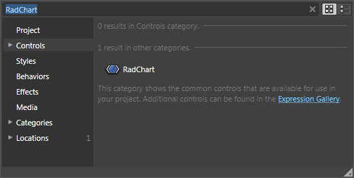
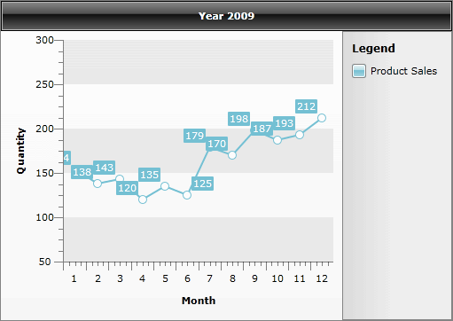

# Create a Line Chart with Static Data


__RadChart__ is an advanced SilverlightWPF control providing full Blend support. From within the visual environment of Blend, you can easily perform various tasks such as edit control properties, modify themes, create and modify templates and more.

This tutorial will walk you through the creation of a __RadChart__ and will show how to:

* Add __RadChart__ in a control using Expression Blend. 

* Add Line Chart with simple static data.

>Before reading this tutorial you should get familiar with the [Visual Structure]() of the standard __RadChart__ control and its elements.

For the purpose of this tutorial, you will need to create an empty SilverlightWPF Application project and open it in Blend.

>In order to use __RadChart__ control in your projects you have to add references to __Telerik.Windows.Controls.Charting.dll__, __Telerik.Windows.Controls.dll__ and __Telerik.Windows.Data.dll.__

## Adding RadChart

* Open the __Asset Library__ (*Window->Assets*) in Expression Blend and start writing the name of the __RadChart__ in the search box. 
 


* Drag a __RadChart__ on the artboard.

As result you can see the __RadChart__ with some demo data displayed. The underlaying XAML is pretty simple and looks like this:


#### __XAML__

```XAML
	<telerik:RadChart x:Name="radChart"
	                  Content="RadChart"
	                  d:LayoutOverrides="Width, Height" />
```

There are two things you should pay attention to: First is the declaration of the __Telerik.Windows.Controls__ namespace and the second is the declaration of the __RadChart__ control itself.

## Creating Line Chart

In this sample you are going to create and visualize your data using simple line chart. This line chart will be based on some predefined static data declared in the XAML or code-behind.


#### __XAML__

```XAML
	<telerik:RadChart x:Name="radChart">
	    <telerik:RadChart.DefaultView>
	        <telerik:ChartDefaultView>
	            <telerik:ChartDefaultView.ChartTitle>
	                <telerik:ChartTitle HorizontalAlignment="Center" Content="Year 2009" />
	            </telerik:ChartDefaultView.ChartTitle>
	            <telerik:ChartDefaultView.ChartLegend>
	                <telerik:ChartLegend x:Name="chartLegend"
	                                     Header="Legend"
	                                     UseAutoGeneratedItems="True" />
	            </telerik:ChartDefaultView.ChartLegend>
	            <telerik:ChartDefaultView.ChartArea>
	                <telerik:ChartArea LegendName="chartLegend">
	                    <telerik:ChartArea.AxisX>
	                        <telerik:AxisX Title="Month"
	                                       AutoRange="False"
	                                       LayoutMode="Between"
	                                       MaxValue="12"
	                                       MinValue="1"
	                                       Step="1" />
	                    </telerik:ChartArea.AxisX>
	                    <telerik:ChartArea.AxisY>
	                        <telerik:AxisY Title="Quantity" />
	                    </telerik:ChartArea.AxisY>
	                    <telerik:ChartArea.DataSeries>
	                        <!--  Line Chart  -->
	                        <telerik:DataSeries LegendLabel="Product Sales">
	                            <telerik:DataSeries.Definition>
	                                <telerik:LineSeriesDefinition />
	                            </telerik:DataSeries.Definition>
	                            <telerik:DataPoint XValue="1" YValue="154" />
	                            <telerik:DataPoint XValue="2" YValue="138" />
	                            <telerik:DataPoint XValue="3" YValue="143" />
	                            <telerik:DataPoint XValue="4" YValue="120" />
	                            <telerik:DataPoint XValue="5" YValue="135" />
	                            <telerik:DataPoint XValue="6" YValue="125" />
	                            <telerik:DataPoint XValue="7" YValue="179" />
	                            <telerik:DataPoint XValue="8" YValue="170" />
	                            <telerik:DataPoint XValue="9" YValue="198" />
	                            <telerik:DataPoint XValue="10" YValue="187" />
	                            <telerik:DataPoint XValue="11" YValue="193" />
	                            <telerik:DataPoint XValue="12" YValue="212" />
	                        </telerik:DataSeries>
	                    </telerik:ChartArea.DataSeries>
	                </telerik:ChartArea>
	            </telerik:ChartDefaultView.ChartArea>
	        </telerik:ChartDefaultView>
	    </telerik:RadChart.DefaultView>
	</telerik:RadChart>
```

#### __C#__

```C#
	radChart.DefaultView.ChartTitle.Content = "Year 2009";
	radChart.DefaultView.ChartLegend.Header = "Legend";
	radChart.DefaultView.ChartLegend.UseAutoGeneratedItems = true;
	//Axis X
	radChart.DefaultView.ChartArea.AxisX.Title = "Month";
	radChart.DefaultView.ChartArea.AxisX.AutoRange = false;
	radChart.DefaultView.ChartArea.AxisX.MinValue = 1;
	radChart.DefaultView.ChartArea.AxisX.MaxValue = 12;
	radChart.DefaultView.ChartArea.AxisX.Step = 1;
	radChart.DefaultView.ChartArea.AxisX.LayoutMode = AxisLayoutMode.Between;
	//Axis Y
	radChart.DefaultView.ChartArea.AxisY.Title = "Quantity";
	DataSeries series = new DataSeries();
	series.Definition = new LineSeriesDefinition();
	series.LegendLabel = "Product Sales";
	series.Add(new DataPoint(1, 154));
	series.Add(new DataPoint(2, 138));
	series.Add(new DataPoint(3, 143));
	series.Add(new DataPoint(4, 120));
	series.Add(new DataPoint(5, 135));
	series.Add(new DataPoint(6, 125));
	series.Add(new DataPoint(7, 179));
	series.Add(new DataPoint(8, 170));
	series.Add(new DataPoint(9, 198));
	series.Add(new DataPoint(10, 187));
	series.Add(new DataPoint(11, 193));
	series.Add(new DataPoint(12, 212));
	radChart.DefaultView.ChartArea.DataSeries.Add(series);
```

#### __VB.NET__

```VB.NET
	radChart.DefaultView.ChartTitle.Content = "Year 2009"
	radChart.DefaultView.ChartLegend.Header = "Legend"
	radChart.DefaultView.ChartLegend.UseAutoGeneratedItems = True
	'Axis X'
	radChart.DefaultView.ChartArea.AxisX.Title = "Month"
	radChart.DefaultView.ChartArea.AxisX.AutoRange = False
	radChart.DefaultView.ChartArea.AxisX.MinValue = 1
	radChart.DefaultView.ChartArea.AxisX.MaxValue = 12
	radChart.DefaultView.ChartArea.AxisX.[Step] = 1
	radChart.DefaultView.ChartArea.AxisX.LayoutMode = AxisLayoutMode.Between
	'Axis Y' 
	radChart.DefaultView.ChartArea.AxisY.Title = "Quantity"
	Dim series As New DataSeries()
	series.Definition = New LineSeriesDefinition()
	series.LegendLabel = "Product Sales"
	series.Add(New DataPoint(1, 154))
	series.Add(New DataPoint(2, 138))
	series.Add(New DataPoint(3, 143))
	series.Add(New DataPoint(4, 120))
	series.Add(New DataPoint(5, 135))
	series.Add(New DataPoint(6, 125))
	series.Add(New DataPoint(7, 179))
	series.Add(New DataPoint(8, 170))
	series.Add(New DataPoint(9, 198))
	series.Add(New DataPoint(10, 187))
	series.Add(New DataPoint(11, 193))
	series.Add(New DataPoint(12, 212))
	radChart.DefaultView.ChartArea.DataSeries.Add(series)
```

The source code above does several things but the most important of them are:

* __telerikCharting__ is declared in XAML for the namespace __Telerik.Windows.Controls.Charting.__ This namespace contains types such as __ChartArea__, __ChartLegend__ and many others. 

* The __ChartLegend__ will generate legend items for the represented data automatically, this is done via the following line of code: __radChart.DefaultView.ChartLegend.UseAutoGeneratedItems = true__. For more information see [Chart Legend](). 

* Prevent the auto range generation for X-axis and customize it to show fixed range of values (1-12) with step of 1. For more information about the X-axis read [Axes Overview]() and [X-Axis](). 

* Create a __DataSeries__ object and set its __Definition__ property to instance of __LineSeriesDefinition__. For more definitions (Spline, Bar, CandleStick etc.) read [2D Charts]() or [3D Charts](). 

* Initialize the __DataSeries__ object with static values for X and Y using DataPoints, then add it to the __ChartArea__'s __DataSeries__ collection. For more examples read also [Creating a Chart Declaratively]() and [Creating a Chart in Code-behind](). Learn more for [populating with data]().


>note that in order to configure the __RadChart.DefaultView__ elements in XAML you have to redefine the whole structure of the __RadChart.DefaultView__(__ChartTitle__, __ChartArea__ and __ChartLegend__), as shown in [Creating a Chart Declaratively](). While in the code-behind you just have to set the property values to the elements created by default, as shown in [Creating a Chart in Code-behind]().

And here is how your first line chart should look like.
 
      

The X-__axis__ can be further customized by replacing the month numbers (1, 2, 3...) with the respective month names (January, February, March...). To find out how to do it read [Categorical Charts]() topic.

 If you need further customizations of the chart you can take a look at some of the following topics:

* Change the [Layout Mode]() of the chart. 

* Format your labels using [Format Expressions](). 

* Change your [Chart Point-marks](). 

* Improve your [Interactivity]() using [ToolTips](). 

* Customize your [Chart Title](), [Chart Legend]() or [Chart Area](). 

* Show [Multi-series Charts](). 

* Customize the chart [Animations](). 

* Change the [Striplines and Gridlines]() of both axes. 

* [Creating Chart with Custom Layout](#Creating_Chart_with_Custom_Layout).

If you need to know how to data bind your __RadChart__, take a look at the following topics:

* [Data Binding Support Overview](). 

* [Data Binding with Automatic Series Mappings]() or [Data Binding with Manual Series Mapping](). 

* [Data Binding to Nested Collections]()

* [Data Binding to Many Chart Areas]()

* [Data Binding to WCF Service]()

* [Data Binding to ADO.NET Data Service]()

## See Also

 * [Key Features]()

 * [Visual Structure]()

 * [Create Data Bound Chart]()
