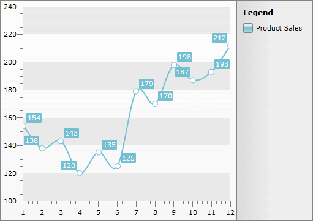
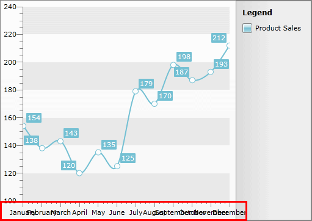

# Create Data Bound Chart

__RadChart__ is an advanced SilverlightWPF control providing full Blend support. From within the visual environment of Blend, you can easily perform various tasks such as edit control properties, modify themes, create and modify templates and more.

This tutorial will walk you through the creation of a __RadChart__ and will show how to:

* [Add RadChart using Expression Blend](#adding-radchart)
* [Create and bind SplineChart to collection of custom objects using SeriesMapping/ItemMapping](#binding-the-radchart)
* [Create categorical chart](#creating-categorical-chart)

>Before reading this tutorial you should get familiar with the [Visual Structure]() of the standard __RadChart__ control and its elements.

For the purpose of this tutorial, you will need to create an empty SilverlightWPF Application project and open it in Blend.

## Adding RadChart

* Open the __Asset Library__ (*Window->Assets*) in Expression Blend and start writing the name of the __RadChart__ in the search box.

 

* Drag a __RadChart__ on the artboard.

As result you can see the __RadChart__ with some demo data displayed. The underlaying XAML is pretty simple and looks like this:


```XAML
	<telerik:RadChart x:Name="radChart"
	                  Content="RadChart"/>
```

There are two things you should pay attention to: First is the declaration of the __Telerik.Windows.Controls__ namespace from __Telerik.Windows.Controls.Charting__ assembly and the second is the declaration of the __RadChart__ control itself.

## Creating Custom Data Object

* In order to bind your __RadChart__ you will need custom data object. Let's create one and name it __ProductSales__, add the properties as shown below:


```C#
	public class ProductSales
	{
		public ProductSales( int quantity, int month, string monthName )
		{
			this.Quantity = quantity;
			this.Month = month;
			this.MonthName = monthName;
		}
		public int Quantity
		{
			get;
			set;
		}
		public int Month
		{
			get;
			set;
		}
		public string MonthName
		{
			get;
			set;
		}
	}
```
```VB.NET
	Public Class ProductSales
	    Public Sub New(ByVal quantity As Integer, ByVal month As Integer, ByVal monthName As String)
	        Me.Quantity = quantity
	        Me.Month = month
	        Me.MonthName = monthName
	    End Sub
	    Private _Quantity As Integer
	    Public Property Quantity() As Integer
	        Get
	            Return _Quantity
	        End Get
	        Set(ByVal value As Integer)
	            _Quantity = value
	        End Set
	    End Property
	    Private _Month As Integer
	    Public Property Month() As Integer
	        Get
	            Return _Month
	        End Get
	        Set(ByVal value As Integer)
	            _Month = value
	        End Set
	    End Property
	    Private _MonthName As String
	    Public Property MonthName() As String
	        Get
	            Return _MonthName
	        End Get
	        Set(ByVal value As String)
	            _MonthName = value
	        End Set
	    End Property
	End Class
```


* Now create custom method that returns collection populated with several __ProductSales__ objects.


```C#
	private List<ProductSales> CreateData()
	{
	    List<ProductSales> persons = new List<ProductSales>();
	    persons.Add( new ProductSales( 154, 1, "January" ) );
	    persons.Add( new ProductSales( 138, 2, "February" ) );
	    persons.Add( new ProductSales( 143, 3, "March" ) );
	    persons.Add( new ProductSales( 120, 4, "April" ) );
	    persons.Add( new ProductSales( 135, 5, "May" ) );
	    persons.Add( new ProductSales( 125, 6, "June" ) );
	    persons.Add( new ProductSales( 179, 7, "July" ) );
	    persons.Add( new ProductSales( 170, 8, "August" ) );
	    persons.Add( new ProductSales( 198, 9, "September" ) );
	    persons.Add( new ProductSales( 187, 10, "October" ) );
	    persons.Add( new ProductSales( 193, 11, "November" ) );
	    persons.Add( new ProductSales( 212, 12, "December" ) );
	    return persons;
	}
```
```VB.NET
	Private Function CreateData() As List(Of ProductSales)
	    Dim persons As New List(Of ProductSales)()
	
	    persons.Add(New ProductSales(154, 1, "January"))
	    persons.Add(New ProductSales(138, 2, "February"))
	    persons.Add(New ProductSales(143, 3, "March"))
	    persons.Add(New ProductSales(120, 4, "April"))
	    persons.Add(New ProductSales(135, 5, "May"))
	    persons.Add(New ProductSales(125, 6, "June"))
	    persons.Add(New ProductSales(179, 7, "July"))
	    persons.Add(New ProductSales(170, 8, "August"))
	    persons.Add(New ProductSales(198, 9, "September"))
	    persons.Add(New ProductSales(187, 10, "October"))
	    persons.Add(New ProductSales(193, 11, "November"))
	    persons.Add(New ProductSales(212, 12, "December"))
	
	    Return persons
	End Function
```

## Binding the RadChart

* Now after you have the needed data object it is time to configure and bind the __RadChart__ to the appropriate properties of the __ProductSales__ class. It can be done using __SeriesMapping/ItemMapping__ from XAML or code-behind, but in most cases it is better to do it declaratively.


```XAML
	<telerik:RadChart x:Name="radChart">
	    <telerik:RadChart.SeriesMappings>
	        <telerik:SeriesMapping LegendLabel="Product Sales">
	            <telerik:SeriesMapping.SeriesDefinition>
	                <telerik:SplineSeriesDefinition />
	            </telerik:SeriesMapping.SeriesDefinition>
	            <telerik:SeriesMapping.ItemMappings>
	                <telerik:ItemMapping DataPointMember="XValue" FieldName="Month" />
	                <telerik:ItemMapping DataPointMember="YValue" FieldName="Quantity" />
	            </telerik:SeriesMapping.ItemMappings>
	        </telerik:SeriesMapping>
	    </telerik:RadChart.SeriesMappings>
	</telerik:RadChart>
```


```C#
	SeriesMapping seriesMapping = new SeriesMapping();
	seriesMapping.LegendLabel = "Product Sales";
	seriesMapping.SeriesDefinition = new SplineSeriesDefinition();
	seriesMapping.ItemMappings.Add( new ItemMapping( "Month", DataPointMember.XValue ) );
	seriesMapping.ItemMappings.Add( new ItemMapping("Quantity", DataPointMember.YValue));
	radChart.SeriesMappings.Add( seriesMapping );
	this.radChart.ItemsSource = this.CreateData();
```
```VB.NET
	Dim seriesMapping As New SeriesMapping()
	seriesMapping.LegendLabel = "Product Sales"
	seriesMapping.SeriesDefinition = New SplineSeriesDefinition()
	seriesMapping.ItemMappings.Add(New ItemMapping("Month", DataPointMember.XValue))
	seriesMapping.ItemMappings.Add(New ItemMapping("Quantity", DataPointMember.YValue))
	radChart.SeriesMappings.Add(seriesMapping)
	Me.radChart.ItemsSource = Me.CreateData()
```

In the source code above one instance of the class __SeriesMapping__ is created with two __ItemMappings__, one for __X-axis__ and one for __Y-axis__. __X-axis__ is bound to the __ProductSales.Month__ property, while __Y-axis__ is bound to __ProductSales.Quantity__ property. Both properties are numeric, that's why their __DataPointMember__ property is set to __XValue__ and __YValue__ respectively. If you want to bind your __X-axis__ to string values read [Categorical Charts]() or read below.

* And the last step is to set the __ItemSource__ of the __RadChart__ control to the collection returned by the __GetData__ method. You can insert this call inside your Constructor right after the __InitializeComponent()__ method call.


```C#
	this.radChart.ItemsSource = this.CreateData();
```
```VB.NET
	Me.radChart.ItemsSource = Me.CreateData()
```

Now if you run your application, the result should be similar to the below snapshot. Note that:

* __RadChart__ has automatically generated value ranges for both axes X and Y, based on the values provided by the data source. If needed you can specify the ranges [manually](). 


* The [Chart Legend]() is also generated automatically, containing information about the only one available series "Product Sales". 


* [X-Axis]() shows the month numbers. 


* [Y-Axis]() shows the sold quantity values. 


* Spline connects all dots in one smooth graphic


## Creating Categorical Chart

The __X-axis__ can be further customized by replacing the month numbers (1, 2, 3...) with the respective month names (January, February, March...). To achieve this we have to set the __ItemMapping.DataPointMember__ property for the __X-axis__ to __XCategory__ and the __ItemMapping.FieldName__ to "__MonthName__", as shown in the samples below.


```XAML
	<telerik:ItemMapping DataPointMember="XCategory" FieldName="MonthName" />
```


```C#
	seriesMapping.ItemMappings.Add(new ItemMapping("MonthName", DataPointMember.XCategory));
```
```VB.NET
	seriesMapping.ItemMappings.Add(New ItemMapping("MonthName", DataPointMember.XCategory))
```


And here is the same chart but this time showing month names as categories for the __X-axis__ instead of the month numbers.
      

>tipTo make the x-Axis labels more readable you can use one of the label features provided by the __XAxis__ class. For more information read [here]().

If you need further customizations of the chart you can take a look at some of the following topics:

* Change the [Layout Mode]() of the chart. 

* Format your labels using [Format Expressions](). 

* Change your [Chart Point-marks](). 

* Improve your [Interactivity]() using [ToolTips](). 

* Customize your [Chart Title](), [Chart Legend]() or [Chart Area](). 

* Show [Multi-series Charts](). 

* Customize the chart [Animations](). 

* Change the [Striplines and Gridlines]() of both axes. 

If you need to know more about __RadChart__ data binding, take a look at the following topics:

* [Data Binding Support Overview]()

* [Data Binding with Automatic Series Mappings]() or [Data Binding with Manual Series Mapping]()

* [Data Binding to Nested Collections]()

* [Data Binding to Many Chart Areas]()

* [Data Binding to WCF Service]()

* [Data Binding to ADO.NET Data Service]()

## See Also

 * [Key Features]()

 * [Visual Structure]()

 * [Create a Line Chart with Static Data]()
