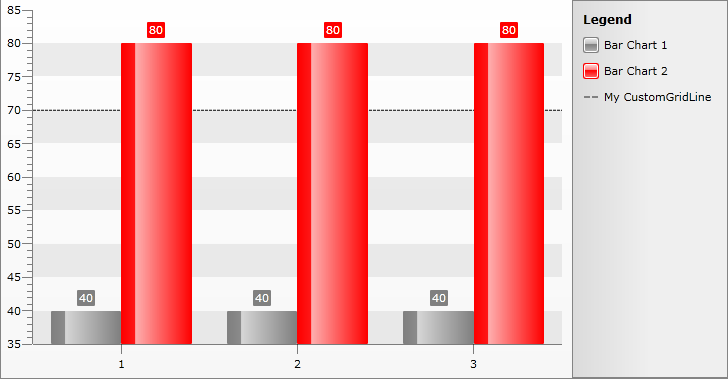

# Add Annotations in Chart Legend

The following help article will demonstrate how to customize the Chart Legend so that Annotations - in this case a Custom GridLine can be added as Chart Legend Item.

##### 1. Create CustomGridLine Style that has Line as *TargetType*. Currently the GridLine will be presented as dashed line by using the [StrokeDashArray](http://msdn.microsoft.com/en-us/library/bb980148(v=vs.95).aspx) as Setter:


```XAML
	<Style x:Key="CustomGridLineStyle" TargetType="Line">
	<Setter Property="StrokeDashArray" Value="3,1" />
	<Setter Property="Stroke" Value="DarkBlue" />
	<Setter Property="StrokeThickness" Value="2" />
	</Style>
```

##### 2. Customize the *ChartLegendItem *Style so that it will draw a Dashed Line as Legend Item Marker:

```XAML
	<controls:Office_BlackTheme x:Key="Theme" /> 
	
	<Style x:Key="DashedLegendItem2" TargetType="charting:ChartLegendItem" controls:StyleManager.BasedOn="{StaticResource Theme}">
		<Setter Property="Template" >
			<Setter.Value>
				<ControlTemplate TargetType="charting:ChartLegendItem">
					<Grid x:Name="PART_MainContainer" HorizontalAlignment="Stretch" VerticalAlignment="Top">
						<Grid.ColumnDefinitions>
							<ColumnDefinition Width="Auto" />
							<ColumnDefinition />
						</Grid.ColumnDefinitions>
						<Line Width="16"
							  Margin="{TemplateBinding Margin}" 
							  Stroke="Gray"
							  StrokeThickness="2" 
							  StrokeDashArray="3 1"
							  X1 = "0" Y1 = "0"
							  X2 = "10" Y2 = "0" 
							  Stretch="Fill" />

						<TextBlock Grid.Column="1"
						 Padding="{TemplateBinding Padding}"
						 Margin="{TemplateBinding Margin}"
						 Foreground="{TemplateBinding Foreground}"
						 Text="{TemplateBinding Label}" />
					</Grid>
				</ControlTemplate>
			</Setter.Value>
		</Setter>
	</Style>
```


>tipThe ChartLegendItem style may be different for the older versions of the RadChart

##### 3. Create a sample Chart and add CustomGridLine by applying the CustomGridLine Style:

```C#
	InitializeComponent();
	            DataSeries series1 = new DataSeries()
	            {
	                new DataPoint(40), 
	                new DataPoint(40), 
	                new DataPoint(40) 
	            };
	            series1.Definition = new BarSeriesDefinition();
	
	            DataSeries series2 = new DataSeries()
	            {
	                new DataPoint(80), 
	                new DataPoint(80), 
	                new DataPoint(80) 
	            };
	            series2.Definition = new BarSeriesDefinition();
	
	            CustomGridLine gridline = new CustomGridLine();
	            gridline.YIntercept = 70;
	            gridline.ElementStyle = this.Resources["CustomGridLineStyle"] as Style; 
	            RadChart1.DefaultView.ChartArea.Annotations.Add(gridline);
	
	            RadChart1.DefaultView.ChartArea.PaletteBrushes.Add(new SolidColorBrush(Colors.Gray));
	            RadChart1.DefaultView.ChartArea.PaletteBrushes.Add(new SolidColorBrush(Colors.Red));
	            RadChart1.DefaultView.ChartArea.AxisX.LayoutMode = AxisLayoutMode.Inside;
	            RadChart1.DefaultView.ChartArea.DataSeries.Add(series1);
	            RadChart1.DefaultView.ChartArea.DataSeries.Add(series2);
```
```VB.NET
	InitializeComponent()
	Dim series1 As New DataSeries() With { New DataPoint(40), New DataPoint(40), New DataPoint(40) }
	series1.Definition = New BarSeriesDefinition()
	
	Dim series2 As New DataSeries() With { New DataPoint(80), New DataPoint(80), New DataPoint(80) }
	series2.Definition = New BarSeriesDefinition()
	
	Dim gridline As New CustomGridLine()
	gridline.YIntercept = 70
	gridline.ElementStyle = TryCast(Me.Resources("CustomGridLineStyle"), Style)
	RadChart1.DefaultView.ChartArea.Annotations.Add(gridline)
	
	RadChart1.DefaultView.ChartArea.PaletteBrushes.Add(New SolidColorBrush(Colors.Gray))
	RadChart1.DefaultView.ChartArea.PaletteBrushes.Add(New SolidColorBrush(Colors.Red))
	RadChart1.DefaultView.ChartArea.AxisX.LayoutMode = AxisLayoutMode.Inside
	RadChart1.DefaultView.ChartArea.DataSeries.Add(series1)
	RadChart1.DefaultView.ChartArea.DataSeries.Add(series2)
```

##### 4. Add the Chart Legend Items explicitly as shown in this [help topic](). The recently created LegendItemStyle is added for the ChartLegendItem that will show the CustomGridLine:

#### __C#__

```C#
	RadChart1.DefaultView.ChartLegend.UseAutoGeneratedItems = false;
	ChartLegendItem item01 = new ChartLegendItem();
	item01.MarkerFill = new SolidColorBrush(Colors.Gray);
	item01.Label = "Bar Chart 1";
	RadChart1.DefaultView.ChartLegend.Items.Add(item01);
	ChartLegendItem item02 = new ChartLegendItem();
	item02.MarkerFill = new SolidColorBrush(Colors.Red);
	item02.Label = "Bar Chart 2";
	RadChart1.DefaultView.ChartLegend.Items.Add(item02);
	ChartLegendItem item2 = new ChartLegendItem();
	item2.Label = "My CustomGridLine";
	item2.Style = this.Resources["DashedLegendItem2"] as Style;
	RadChart1.DefaultView.ChartLegend.Items.Add(item2);
```
```VB.NET
	RadChart1.DefaultView.ChartLegend.UseAutoGeneratedItems = False
	                  Dim item01 As New ChartLegendItem()
	                  item01.MarkerFill = New SolidColorBrush(Colors.Gray)
	                  item01.Label = "Bar Chart 1"
	                  RadChart1.DefaultView.ChartLegend.Items.Add(item01)
	                  Dim item02 As New ChartLegendItem()
	                  item02.MarkerFill = New SolidColorBrush(Colors.Red)
	                  item02.Label = "Bar Chart 2"
	                  RadChart1.DefaultView.ChartLegend.Items.Add(item02)
	                  Dim item2 As New ChartLegendItem()
	                  item2.Label = "My CustomGridLine"
	                  item2.Style = TryCast(Me.Resources("DashedLegendItem2"), Style)
	                  RadChart1.DefaultView.ChartLegend.Items.Add(item2)
```

The result is shown below:




