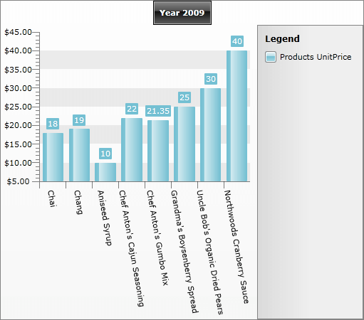
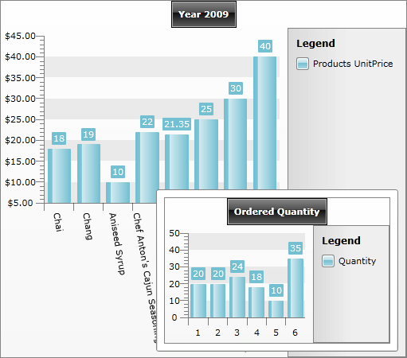
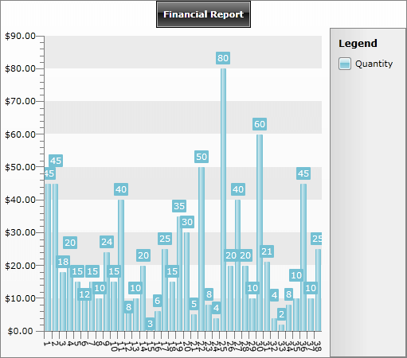

# Drill Down Chart


## 

>To learn how to use the built-in __RadChart Drill Down__ feature please read the [Drill Down]() section.

The purpose of this tutorial is to show you the drill down capabilities of the chart with tooltips enabled.

The idea behind the drill down behavior is to move the chart content from summary information to detailed data by focusing on something. 

>This tutorial will use the __Northwind__ database, which can be downloaded from [here](http://www.microsoft.com/downloads/details.aspx?FamilyID=06616212-0356-46A0-8DA2-EEBC53A68034&displaylang=en).

Also in the following examples the charts will be populated with a various data from an __ADO.NET Data Service__. You can read more information about populating with data [here]().

* Here is the initial __RadChart__ declaration. 


```XAML
	<FrameworkElement.Resources>            
	    <example:NorthwindDataSource x:Key="DataSource" />
	</FrameworkElement.Resources>
	
	<Grid x:Name="LayoutRoot" Background="White">
	    <telerik:RadChart x:Name="radChart"
	                      Margin="8"
	                      ItemsSource="{Binding Source={StaticResource DataSource},
	                                            Path=Products}">
	
	        <telerik:RadChart.SeriesMappings>
	            <telerik:SeriesMapping LegendLabel="Products UnitPrice">
	                <telerik:SeriesMapping.SeriesDefinition>
	                    <telerik:BarSeriesDefinition />
	                </telerik:SeriesMapping.SeriesDefinition>
	                <telerik:SeriesMapping.ItemMappings>
	
	                    <telerik:ItemMapping DataPointMember="YValue" FieldName="UnitPrice" />
	                    <telerik:ItemMapping DataPointMember="XCategory" FieldName="ProductName" />
	
	                </telerik:SeriesMapping.ItemMappings>
	            </telerik:SeriesMapping>
	        </telerik:RadChart.SeriesMappings>
	        <telerik:RadChart.DefaultView>
	            <telerik:ChartDefaultView>
	
	                <telerik:ChartDefaultView.ChartTitle>
	                    <telerik:ChartTitle HorizontalAlignment="Center" Content="Year 2009" />
	                </telerik:ChartDefaultView.ChartTitle>
	
	                <telerik:ChartDefaultView.ChartLegend>
	                    <telerik:ChartLegend x:Name="chartLegend" UseAutoGeneratedItems="True" />
	                </telerik:ChartDefaultView.ChartLegend>
	
	                <telerik:ChartDefaultView.ChartArea>
	                    <telerik:ChartArea LegendName="chartLegend">
	
	                        <telerik:ChartArea.AxisX>
	                            <telerik:AxisX LabelRotationAngle="45" />
	                        </telerik:ChartArea.AxisX>
	
	                        <telerik:ChartArea.AxisY>
	                            <telerik:AxisY DefaultLabelFormat="C" />
	                        </telerik:ChartArea.AxisY>
	
	                    </telerik:ChartArea>
	                </telerik:ChartDefaultView.ChartArea>
	            </telerik:ChartDefaultView>
	        </telerik:RadChart.DefaultView>
	    </telerik:RadChart>
	</Grid>
```



When the application (the user control) is loaded, the __RadChart__ is populated with the first eight products from the Products table in the Northwind database. On the __Y Axis__ is displayed the products __UnitPrice__. On the __X Axis__ is displayed the __ProductName__ property. This is done through the __ItemsMapping__ property. 


```XAML
	<telerik:RadChart.SeriesMappings>
	    <telerik:SeriesMapping LegendLabel="Products UnitPrice">
	        <telerik:SeriesMapping.SeriesDefinition>
	            <telerik:BarSeriesDefinition />
	        </telerik:SeriesMapping.SeriesDefinition>
	        <telerik:SeriesMapping.ItemMappings>
	
	            <telerik:ItemMapping DataPointMember="YValue" FieldName="UnitPrice" />
	            <telerik:ItemMapping DataPointMember="XCategory" FieldName="ProductName" />
	
	        </telerik:SeriesMapping.ItemMappings>
	    </telerik:SeriesMapping>
	</telerik:RadChart.SeriesMappings>
```


Also the products' names are rotated on 45 degrees. In order to do that you should use the __LabelRotationAngle__ property of the __XAxis__. Here is the XAML which does it: 


```XAML
	<telerik:RadChart x:Name="radChart"
	                  Margin="8"
	                  ItemsSource="{Binding}">
	    <telerik:RadChart.SeriesMappings>
	        <telerik:SeriesMapping LegendLabel="Quantity">
	            <telerik:SeriesMapping.ItemMappings>
	                <telerik:ItemMapping DataPointMember="YValue" FieldName="Quantity" />
	            </telerik:SeriesMapping.ItemMappings>
	        </telerik:SeriesMapping>
	    </telerik:RadChart.SeriesMappings>
	    <telerik:RadChart.DefaultView>
	        <telerik:ChartDefaultView>
	            <telerik:ChartDefaultView.ChartTitle>
	                <telerik:ChartTitle HorizontalAlignment="Center" Content="Ordered Quantity" />
	            </telerik:ChartDefaultView.ChartTitle>
	        </telerik:ChartDefaultView>
	    </telerik:RadChart.DefaultView>
	</telerik:RadChart>
```


* The __NorthwindDataSource__ class is used for __ItemsSource__ of the __RadChart__. 


```XAML
	<telerik:RadChart x:Name="radChart"
	                  Margin="8"
	                  ItemsSource="{Binding Source={StaticResource DataSource},
	                                        Path=Products}" />
```


It has two properties of type __ObservableCollection__:

* __Products__ - displayed during the initial load of the __RadChart.__

* __OrderDetails__- displayed as a tooltip for a specific product in the chart. More detailed information about the order details is displayed when the user clicks on a chart item. 


```C#
	public class NorthwindDataSource
	{
	    private static NorthwindEntities northwindEntity;
	    public NorthwindDataSource()
	    {
	        northwindEntity = new NorthwindEntities( new Uri( "http://localhost:52981/Services/SampleAdoNetDataService.svc/" ) );
	        this.Products = new ObservableCollection<Products>();
	    }
	    public ObservableCollection<Products> Products
	    {
	        get;
	        set;
	    }
	    public ObservableCollection<Order_Details> OrderDetails
	    {
	        get;
	        set;
	    }
	    public static void LoadOrderDetails(object param1, object param2)
	    {
	    }
	    public static void BeginLoadingOrderDetails(object param1, object param2)
	    {
	    }
	}
```


```VB.NET
	Public Class NorthwindDataSource
	    Private Shared northwindEntity As NorthwindEntities
	
	    Public Sub New()
	        northwindEntity = New NorthwindEntities(New Uri("http://localhost:52981/Services/SampleAdoNetDataService.svc/"))
	        Me.Products = New ObservableCollection(Of Products)()
	    End Sub
	
	    Private _Products As ObservableCollection(Of Products)
	    Public Property Products() As ObservableCollection(Of Products)
	        Get
	            Return _Products
	        End Get
	        Set(ByVal value As ObservableCollection(Of Products))
	            _Products = value
	        End Set
	    End Property
	
	    Private _OrderDetails As ObservableCollection(Of Order_Details)
	    Public Property OrderDetails() As ObservableCollection(Of Order_Details)
	        Get
	            Return _OrderDetails
	        End Get
	        Set(ByVal value As ObservableCollection(Of Order_Details))
	            _OrderDetails = value
	        End Set
	    End Property
	End Class
```


Here is the initial loading of the products. The code is placed in the __NorthwindDataSource__ constructor:


```C#
	public NorthwindDataSource()
	{
	    northwindEntity = new NorthwindEntities( new Uri( "http://localhost:52981/Services/SampleAdoNetDataService.svc/" ) );
	    this.Products = new ObservableCollection<Products>();
	    var query = ( from p in northwindEntity.Products
	                  select p ).Take( 8 );
	    DataServiceQuery<Products> products = ( DataServiceQuery<Products> )query;
	    products.BeginExecute(
	        (IAsyncResult result) => { EntitiesLoaded<Products>(result, this.Products); }, products);
	}
```


```C#
	public NorthwindDataSource()
	{
	    northwindEntity = new NorthwindEntities(new Uri("http://localhost:52981/Services/SampleAdoNetDataService.svc/"));
	    this.Products = new ObservableCollection<Products>();
	               
	    foreach ( Products p in northwindEntity.Products.Execute().Take( 8 ) )
	    {
	        this.Products.Add( p );
	    }
	}
```

    


```VB.NET
	Public Sub New()
	    northwindEntity = New NorthwindEntities(New Uri("http://localhost:52981/Services/SampleAdoNetDataService.svc/"))
	    Me.Products = New ObservableCollection(Of Products)()
	
	    Dim query = (From p In northwindEntity.Products _
	        Select p).Take(8)
	    Dim products As DataServiceQuery(Of Products) = DirectCast(query, DataServiceQuery(Of Products))
	End Sub
	' #endregion
	
	Public Products As ObservableCollection(Of Products)
	
	'#region radchart-how-to-drill-down-chart_11
	Private Shared Sub EntitiesLoaded(Of T)(ByVal result As IAsyncResult, ByVal entities As Collection(Of T))
	    Dim query As DataServiceQuery(Of T) = TryCast(result.AsyncState, DataServiceQuery(Of T))
	    For Each entity As T In query.EndExecute(result)
	        entities.Add(entity)
	    Next
	End Sub
```

    


```VB.NET
	Public Sub New()
	    northwindEntity = New NorthwindEntities(New Uri("http://localhost:52981/Services/SampleAdoNetDataService.svc/"))
	    Me.Products = New ObservableCollection(Of Products)()
	
	    For Each p As Products In northwindEntity.Products.Execute().Take(8)
	        Me.Products.Add(p)
	    Next
	End Sub
```



And the __EntitiesLoaded__ method:


```C#
	private static void EntitiesLoaded<T>( IAsyncResult result, Collection<T> entities )
	{
	    DataServiceQuery<T> query = result.AsyncState as DataServiceQuery<T>;
	    foreach ( T entity in query.EndExecute( result ) )
	    {
	        entities.Add( entity );
	    }
	}
```


```VB.NET
	Private Shared Sub EntitiesLoaded(Of T)(ByVal result As IAsyncResult, ByVal entities As Collection(Of T))
	    Dim query As DataServiceQuery(Of T) = TryCast(result.AsyncState, DataServiceQuery(Of T))
	    For Each entity As T In query.EndExecute(result)
	        entities.Add(entity)
	    Next
	End Sub
```


The __NorthwindDataSource__ class contains one more method. It is used to load order details per a specific product:


```C#
	public static void BeginLoadingOrderDetails(Products p, int rowCount )
	{
	    var query = ( from od in northwindEntity.Order_Details.Expand("Orders")
	                 where od.ProductID == p.ProductID
	                 select od );
	    if ( rowCount > -1 )
	        query = query.Take( rowCount );                                
	    DataServiceQuery<Order_Details> orderDetails = ( DataServiceQuery<Order_Details> )query;
	    orderDetails.BeginExecute(
	        ( IAsyncResult result ) => EntitiesLoaded<Order_Details>( result, p.Order_Details ), orderDetails );
	}
```


```C#
	public static void LoadOrderDetails( Products p, int rowCount )
	{
	    var query = ( from od in northwindEntity.Order_Details.Expand( "Orders" )
	                  where od.ProductID == p.ProductID
	                  select od );
	    if ( rowCount > -1 )
	        query = query.Take( rowCount );
	    foreach (Order_Details orderDetail in query.ToList())
	    {
	        p.Order_Details.Add( orderDetail );
	    }
	}
```


```VB.NET
	Public Shared Sub BeginLoadingOrderDetails(ByVal p As Products, ByVal rowCount As Integer)
	    Dim query = (From od In northwindEntity.Order_Details.Expand("Orders") _
	        Where od.ProductID = p.ProductID _
	        Select od)
	    If rowCount > -1 Then
	        query = query.Take(rowCount)
	    End If
	
	    Dim orderDetails As DataServiceQuery(Of Order_Details) = DirectCast(query, DataServiceQuery(Of Order_Details))
	    orderDetails.BeginExecute(Sub(result As IAsyncResult) EntitiesLoaded(Of Order_Details)(result, p.Order_Details), orderDetails)
	End Sub
```


```VB.NET
	Public Shared Sub LoadOrderDetails(ByVal p As Products, ByVal rowCount As Integer)
	    Dim query = (From od In northwindEntity.Order_Details.Expand("Orders") _
	        Where od.ProductID = p.ProductID _
	        Select od)
	    If rowCount > -1 Then
	        query = query.Take(rowCount)
	    End If
	
	    For Each orderDetail As Order_Details In query.ToList()
	        p.Order_Details.Add(orderDetail)
	    Next
	End Sub
```


* Enable __ToolTip__. In order to do that use the __ShowItemToolTips__ property. 


```XAML
	<telerik:SeriesMapping.SeriesDefinition>
	    <telerik:BarSeriesDefinition ShowItemToolTips="True" />
	</telerik:SeriesMapping.SeriesDefinition>
```


* Attach to the __ItemToolTipOpening__ event. 


```XAML
	<telerik:ChartArea ItemToolTipOpening="ChartArea_ItemToolTipOpening" LegendName="chartLegend">
	    <telerik:ChartArea.AxisX>
	        <telerik:AxisX LabelRotationAngle="45" />
	    </telerik:ChartArea.AxisX>
	    <telerik:ChartArea.AxisY>
	        <telerik:AxisY DefaultLabelFormat="C" />
	    </telerik:ChartArea.AxisY>
	</telerik:ChartArea>
	<!-- #endregion-->
	</telerik:RadChart>
	
	<!-- #region radchart-how-to-drill-down-chart_25 -->
	<telerik:ChartArea ItemClick="ChartArea_ItemClick"
	               ItemToolTipOpening="ChartArea_ItemToolTipOpening"
	               LegendName="chartLegend">
	<telerik:ChartArea.AxisX>
	    <telerik:AxisX LabelRotationAngle="45" />
	</telerik:ChartArea.AxisX>
	<telerik:ChartArea.AxisY>
	    <telerik:AxisY DefaultLabelFormat="C" />
	</telerik:ChartArea.AxisY>
	</telerik:ChartArea>
```


Switch in the code-behind. Here is the code for the event handler:


```C#
	private void ChartArea_ItemToolTipOpening( ItemToolTip2D tooltip, ItemToolTipEventArgs e )
	{
	    Products p = e.DataPoint.DataItem as Products;
	    p.Order_Details = new ObservableCollection<Order_Details>();
	    NorthwindDataSource.BeginLoadingOrderDetails( p, 6 );
	    DrillDownChartToolTip toolTipControl = new DrillDownChartToolTip();
	    toolTipControl.DataContext = p.Order_Details;
	    tooltip.Content = toolTipControl;
	}
```


```C#
	private void ChartArea_ItemToolTipOpening(ItemToolTip2D tooltip, ItemToolTipEventArgs e)
	{
	    Products p = e.DataPoint.DataItem as Products;
	    p.Order_Details = new ObservableCollection<Order_Details>();
	    NorthwindDataSource.LoadOrderDetails(p, 6);
	    DrillDownChartToolTip toolTipControl = new DrillDownChartToolTip();
	    toolTipControl.DataContext = p.Order_Details;
	    tooltip.Content = toolTipControl;
	}
```


```VB.NET
	Private Sub ChartArea_ItemToolTipOpening(ByVal tooltip As ItemToolTip2D, ByVal e As ItemToolTipEventArgs)
	    Dim p As Products = TryCast(e.DataPoint.DataItem, Products)
	    p.Order_Details = New ObservableCollection(Of Order_Details)()
	    NorthwindDataSource.BeginLoadingOrderDetails(p, 6)
	
	    Dim toolTipControl As New DrillDownChartToolTip()
	    toolTipControl.DataContext = p.Order_Details
	    tooltip.Content = toolTipControl
	End Sub
```


```VB.NET
	Private Sub ChartArea_ItemToolTipOpening(ByVal tooltip As ItemToolTip2D, ByVal e As ItemToolTipEventArgs)
	    Dim p As Products = TryCast(e.DataPoint.DataItem, Products)
	    p.Order_Details = New ObservableCollection(Of Order_Details)()
	    NorthwindDataSource.LoadOrderDetails(p, 6)
	
	    Dim toolTipControl As New DrillDownChartToolTip()
	    toolTipControl.DataContext = p.Order_Details
	    tooltip.Content = toolTipControl
	End Sub
```


When the tooltip is opened, the underlying product is extracted first: 


```C#
	           
	Products p = e.DataPoint.DataItem as Products;
```


```VB.NET
	Dim p As Products = TryCast(e.DataPoint.DataItem, Products)
```


Second, the __BeginLoadingOrderDetails()__ method is invoked. Finally, a new instance of a user control is created and is set as a content of the tooltip.

You can see the result on the snapshot below:



Here is the XAML declaration of the __DrillDownChartToolTip__ control, which is used as a tooltip content: 


```XAML
	<telerik:RadChart x:Name="radChart"
	                  Margin="8"
	                  ItemsSource="{Binding}">
	    <telerik:RadChart.SeriesMappings>
	        <telerik:SeriesMapping LegendLabel="Quantity">
	            <telerik:SeriesMapping.ItemMappings>
	                <telerik:ItemMapping DataPointMember="YValue" FieldName="Quantity" />
	            </telerik:SeriesMapping.ItemMappings>
	        </telerik:SeriesMapping>
	    </telerik:RadChart.SeriesMappings>
	    <telerik:RadChart.DefaultView>
	        <telerik:ChartDefaultView>
	            <telerik:ChartDefaultView.ChartTitle>
	                <telerik:ChartTitle HorizontalAlignment="Center" Content="Ordered Quantity" />
	            </telerik:ChartDefaultView.ChartTitle>
	        </telerik:ChartDefaultView>
	    </telerik:RadChart.DefaultView>
	</telerik:RadChart>
```


* The final step is to add the drill down behavior. To do that, attach to the __ItemClick__ event. 


```XAML
	<telerik:ChartArea ItemClick="ChartArea_ItemClick"
	                   ItemToolTipOpening="ChartArea_ItemToolTipOpening"
	                   LegendName="chartLegend">
	    <telerik:ChartArea.AxisX>
	        <telerik:AxisX LabelRotationAngle="45" />
	    </telerik:ChartArea.AxisX>
	    <telerik:ChartArea.AxisY>
	        <telerik:AxisY DefaultLabelFormat="C" />
	    </telerik:ChartArea.AxisY>
	</telerik:ChartArea>
```


Switch in the code-behind. Add the code for handling the event. Here is a sample how this can be done:


```C#
	private void ChartArea_ItemClick( object sender, ChartItemClickEventArgs e )
	{
	    // Get the product and load all order details
	    Products selectedItem = ( e.DataPoint.DataItem as Products );
	    selectedItem.Order_Details = new ObservableCollection<Order_Details>();
	    radChart.ItemsSource = selectedItem.Order_Details;
	    NorthwindDataSource.BeginLoadingOrderDetails( selectedItem, -1 );
	    // Change the chart title
	    radChart.DefaultView.ChartTitle.Content = "Financial Report";
	    radChart.SeriesMappings.Clear();
	
	    // Change the Item mapping
	    SeriesMapping newSeriesMapping = new SeriesMapping();
	    newSeriesMapping.LegendLabel = "Quantity";
	    ItemMapping newItemMapping = new ItemMapping();
	    newItemMapping.FieldName = "Quantity";
	    newItemMapping.DataPointMember = DataPointMember.YValue;
	    newSeriesMapping.ItemMappings.Add( newItemMapping );
	    radChart.SeriesMappings.Add( newSeriesMapping );
	}
```


```C#
	private void ChartArea_ItemClick(object sender, ChartItemClickEventArgs e)
	{
	    // Get the product and load all order details
	    Products selectedItem = (e.DataPoint.DataItem as Products);
	    selectedItem.Order_Details = new ObservableCollection<Order_Details>();
	    radChart.ItemsSource = selectedItem.Order_Details;
	    NorthwindDataSource.LoadOrderDetails(selectedItem, -1);
	
	    // Change the chart title
	    radChart.DefaultView.ChartTitle.Content = "Financial Report";
	    radChart.SeriesMappings.Clear();
	
	    // Change the Item mapping
	    SeriesMapping newSeriesMapping = new SeriesMapping();
	    newSeriesMapping.LegendLabel = "Quantity";
	    ItemMapping newItemMapping = new ItemMapping();
	    newItemMapping.FieldName = "Quantity";
	    newItemMapping.DataPointMember = DataPointMember.YValue;
	    newSeriesMapping.ItemMappings.Add(newItemMapping);
	    radChart.SeriesMappings.Add(newSeriesMapping);
	}
```


```VB.NET
	Private Sub ChartArea_ItemClick(ByVal sender As Object, ByVal e As ChartItemClickEventArgs)
	    ' Get the product and load all order details
	    Dim selectedItem As Products = TryCast(e.DataPoint.DataItem, Products)
	    selectedItem.Order_Details = New ObservableCollection(Of Order_Details)()
	    radChart.ItemsSource = selectedItem.Order_Details
	    NorthwindDataSource.BeginLoadingOrderDetails(selectedItem, -1)
	
	    ' Change the chart title '
	    radChart.DefaultView.ChartTitle.Content = "Financial Report"
	    radChart.SeriesMappings.Clear()
	
	    ' Change the Item mapping '
	    Dim newSeriesMapping As New SeriesMapping()
	    newSeriesMapping.LegendLabel = "Quantity"
	    Dim newItemMapping As New ItemMapping()
	    newItemMapping.FieldName = "Quantity"
	    newItemMapping.DataPointMember = DataPointMember.YValue
	    newSeriesMapping.ItemMappings.Add(newItemMapping)
	    radChart.SeriesMappings.Add(newSeriesMapping)
	End Sub
```


```VB.NET
	Private Sub ChartArea_ItemClick(ByVal sender As Object, ByVal e As ChartItemClickEventArgs)
	    ' Get the product and load all order details
	    Dim selectedItem As Products = TryCast(e.DataPoint.DataItem, Products)
	    selectedItem.Order_Details = New ObservableCollection(Of Order_Details)()
	    radChart.ItemsSource = selectedItem.Order_Details
	    NorthwindDataSource.LoadOrderDetails(selectedItem, -1)
	
	    ' Change the chart title
	    radChart.DefaultView.ChartTitle.Content = "Financial Report"
	    radChart.SeriesMappings.Clear()
	
	    ' Change the Item mapping
	    Dim newSeriesMapping As New SeriesMapping()
	    newSeriesMapping.LegendLabel = "Quantity"
	    Dim newItemMapping As New ItemMapping()
	    newItemMapping.FieldName = "Quantity"
	    newItemMapping.DataPointMember = DataPointMember.YValue
	    newSeriesMapping.ItemMappings.Add(newItemMapping)
	    radChart.SeriesMappings.Add(newSeriesMapping)
	End Sub
```


When the user clicks on a specific item (product), some information about the order details will be displayed: 



## See Also

 * [MVVM Support]()

 * [Integration with RadGridView]()
