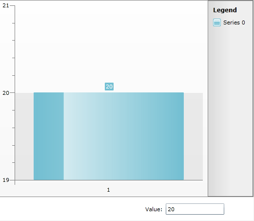

# Binding DataPointMember to a DependencyProperty


The purpose of this tutorial is to show you how to databind the chart's DataPointMember to a [DependencyProperty](http://msdn.microsoft.com/en-us/library/ms752914.aspx).

>To learn what __DataPointMember__ is please read the [Manual Series Mapping]() section.

This help topic will show you how to change the bar height (assuming that RadChart is created with its DefaultSeriesDefinition which is BarSeriesDefinition) as soon as you change the value in Text box.

The main idea behind this binding is to create an object that implements INotifyPropertyChanged and setting it to both RadChart and Text Box:


```XAML
	<telerik:RadChart x:Name="RadChart1" Margin="0,0,0,48" ItemsSource="{Binding}">
	     <telerik:RadChart.SeriesMappings>
	          <telerik:SeriesMapping>
	               <telerik:SeriesMapping.SeriesDefinition>
	                    <telerik:BarSeriesDefinition />
	               </telerik:SeriesMapping.SeriesDefinition>
	               <telerik:ItemMapping FieldName="yValue" DataPointMember="YValue" />
	          </telerik:SeriesMapping>
	     </telerik:RadChart.SeriesMappings>
	</telerik:RadChart>
	<TextBox Height="23" HorizontalAlignment="Left" Margin="342,0,0,12" Name="textBox1" VerticalAlignment="Bottom" Width="120" Text="{Binding Path=[0].yValue, Mode=TwoWay}" />
	<TextBlock Height="23" HorizontalAlignment="Left" Margin="300,0,0,8" Name="textBlock1" Text="Value:" VerticalAlignment="Bottom" />
```


Here is how to create object that implements INotifyPropertyChanged in code-behind: 


```C#
	public class MyObject : INotifyPropertyChanged
	{
	  private double _yValue = 0;
	  public event PropertyChangedEventHandler PropertyChanged;
	  public double yValue
	  {
	    get
	    {
	      return this._yValue;
	    }
	    set
	    {
	     if (this._yValue == value)
	     return;
	     this._yValue = value;
	     this.OnPropertyChanged("yValue");
	     }
	   }
	   protected virtual void OnPropertyChanged(string propertyName)
	   {
	     if (PropertyChanged != null)
	     PropertyChanged(this, new PropertyChangedEventArgs(propertyName));
	   }
	}
```
```VB.NET
	Public Class MyObject
	    Implements INotifyPropertyChanged
	
	
	    Private _yValue As Double = 0
	
	    Public Property yValue() As Double
	
	        Get
	
	            Return Me._yValue
	        End Get
	        Set(value As Double)
	
	            If Me._yValue = value Then
	                Return
	            End If
	            Me._yValue = value
	
	            Me.OnPropertyChanged("yValue")
	        End Set
	    End Property
	
	    Protected Overridable Sub OnPropertyChanged(propertyName As String)
	
	        RaiseEvent PropertyChanged(Me, New PropertyChangedEventArgs(propertyName))
	    End Sub
	
	    Public Event PropertyChanged(sender As Object, e As PropertyChangedEventArgs) Implements INotifyPropertyChanged.PropertyChanged
	End Class
```


Set the DataContext property to List of MyObject class after the InitializeComponent method:


```C#
	this.DataContext = new List<MyObject>() { new MyObject() };
```
```VB.NET
	Me.DataContext = New List(Of MyObject)() From { _
	New MyObject() _
	}
```


Here is the final result: 



>tipYou should move the focus out of the Text box in Silverlight to be able to see the new value of the Bar. 

## See Also

 * [MVVM Support]()

 * [Integration with RadGridView]()
