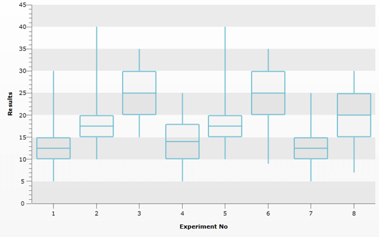
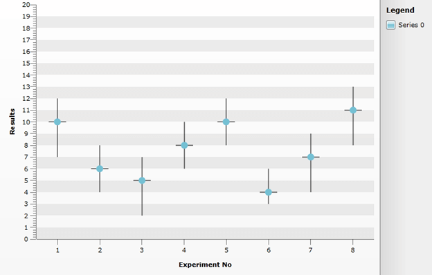

# Create Scatter ErrorBars and BoxPlot Series

Currently RadChart provides 27 2D Chart types for SL/WPF. You can easily customise the existing chart types to create a more complex series like the [box plot](http://en.wikipedia.org/wiki/Box_plot)(also known as box-and-whisker diagram and widely spread in [descriptive statistics](http://en.wikipedia.org/wiki/Descriptive_statistics)).

This help topic will demonstrate how to create BoxPlot and Scatter ErrorBars by reusing the default Styles of the *CandleStick *and *Scatter *series and adding custom CandleStick / CandleStickSeriesDefinition (ScatterPoint/ ScatterSeriesDefinition) pair of classes.

## Box Plot:

The BoxPlot have five number summaries: the smallest observation (sample minimum), lower quartile(Q1), median (Q2), upper quartile(Q3), and largest observation (sample maximum). For the purpose the Open, Close, High and Low values of the CandleStick will be used with retemplating the Series Definition to add the additional Median Line visual. You will also need to create custom CandleStick / CandleStickSeriesDefinition pair of classes (to calculate the necessary coordinates for the additional Line).

##### 1. Add the additional Line visual(s) in the default template of the CandleStick Chart type: 

- A new part with Name “*PART_CustomLine*” is added for the Median Line (percentile) that is to be shown:

```XAML
	<Style x:Key="CustomCandleStickStyle" TargetType="telerik:CandleStick">
	                <Setter Property="EmptyFill" Value="{StaticResource CandleStickEmptyRectangleFill}"/>
	                <Setter Property="RadiusX" Value="{StaticResource CandleRadiusX}" />
	                <Setter Property="RadiusY" Value="{StaticResource CandleRadiusY}" />
	                <Setter Property="LineThickness" Value="{StaticResource CandleStickLineStrokeThickness}" />
	                <Setter Property="Template">
	                    <Setter.Value>
	                        <ControlTemplate TargetType="telerik:CandleStick">
	                            <Canvas x:Name="PART_MainContainer">
	                                <telerik:ParametricLine x:Name="PART_UpperLine" LineStyle="{TemplateBinding ItemStyle}"
	                                    StrokeThickness="{TemplateBinding LineThickness}" />
	                                <telerik:ParametricLine x:Name="PART_LowerLine" LineStyle="{TemplateBinding ItemStyle}"
	                                        StrokeThickness="{TemplateBinding LineThickness}" />
	                                <Rectangle x:Name="PART_CenterRectangle" 
	                                           Height="{TemplateBinding CandleHeight}" 
	                                           Canvas.Top="{TemplateBinding MinYValue}"
	                                           Style="{TemplateBinding ItemStyle}"
	                                           RadiusX="{TemplateBinding RadiusX}"
	                                           RadiusY="{TemplateBinding RadiusY}" />
	                                <telerik:ParametricLine x:Name="PART_DojiLine"
	                                      Visibility="{TemplateBinding DojiLineVisibility}"
	                                      LineStyle="{TemplateBinding ItemStyle}"
	                                      StrokeThickness="{TemplateBinding LineThickness}" />
	                                <telerik:ParametricLine x:Name="PART_CustomLine"
	                                      LineStyle="{TemplateBinding ItemStyle}"
	                                      StrokeThickness="{TemplateBinding LineThickness}"
	                                      X1="{Binding Center}"
	                                      Y1="{Binding CustomMinValue}"
	                                      X2="{Binding Center}"
	                                      Y2="{Binding CustomMaxValue}" />
	                            </Canvas>
	                        </ControlTemplate>
	                    </Setter.Value>
	                </Setter>
	            </Style>
```


##### 2. Create new *CustomCandleStick* class that inherits the *CandleStick* class and set the CustomLine as set in the template as Parametric Line. A few more methods are added in order to calculate the necessary coordinates for the additional Line visual, so that it can be positioned on the Plot Area:

- void UpdateParametricLinesParameters() – overridden from the CandleStick class 

- void UpdateParametricLinesCoordinates(Size constraint) – overridden form the CandleStick class

- DataRange CalculateRange(double value)

##### 3. Create new class that inherits the *CandleStickSeriesDefinition* class and override the CreateChartItem() method so that the *CustomCandleStick* becomes a brand new Series Definition.

The following code snippet demonstrates the steps in action:


```C#
	public partial class MainPage : UserControl 
	    {
	        public MainPage() //MainWindow() in WPF
	        {
	            InitializeComponent();
	
	            DataSeries series = new DataSeries();
	            series.Definition = new CustomCandleStickSeriesDefinition() { ItemStyle = this.LayoutRoot.Resources["CustomCandleStickStyle"] as Style };
	            series.Add(new DataPoint() { Open = 10, High = 30, Low = 5, Close = 15 });
	            series.Add(new DataPoint() { Open = 15, High = 40, Low = 10, Close = 20 });
	            series.Add(new DataPoint() { Open = 20, High = 35, Low = 15, Close = 30 });
	            series.Add(new DataPoint() { Open = 10, High = 25, Low = 5, Close = 18 });
	            series.Add(new DataPoint() { Open = 15, High = 40, Low = 10, Close = 20 });
	            series.Add(new DataPoint() { Open = 20, High = 35, Low = 9, Close = 30 });
	            series.Add(new DataPoint() { Open = 10, High = 25, Low = 5, Close = 15 });
	            series.Add(new DataPoint() { Open = 15, High = 30, Low = 7, Close = 25 });
	
	            RadChart1.DefaultView.ChartArea.DataSeries.Add(series);
	            RadChart1.DefaultView.ChartLegend.Visibility = System.Windows.Visibility.Collapsed;
	            RadChart1.DefaultView.ChartArea.AxisX.Title = "Experiment No";
	            RadChart1.DefaultView.ChartArea.AxisY.Title = "Results";
	            RadChart1.DefaultView.ChartArea.AxisX.LayoutMode = AxisLayoutMode.Inside;
	        }
	    }
	
	    public class CustomCandleStick : CandleStick
	    {
	        private ParametricLine CustomLine
	        {
	            get
	            {
	                return this.GetTemplateChild("PART_CustomLine") as ParametricLine;
	            }
	        }
	
	        protected override void UpdateParametricLinesCoordinates(Size constraint)
	        {
	            base.UpdateParametricLinesCoordinates(constraint);
	
	            double middleValue = (this.DataPoint.Open + this.DataPoint.Close) / 2;
	            DataRange minRange = this.CalculateRange(middleValue) * constraint.Height;
	            UpdateParametricLineCoordinates(this.CustomLine, this.Center - constraint.Width / 2, minRange.From, this.Center + constraint.Width / 2, minRange.From);
	        }
	
	        protected override void UpdateParametricLinesParameters()
	        {
	            base.UpdateParametricLinesParameters();
	
	            UpdateParametricLineParameter(this.CustomLine, false);
	        }
	
	        private DataRange CalculateRange(double value)
	        {
	            DataRange axisRange = new DataRange(this.ChartArea.AxisY.ActualMinValue, this.ChartArea.AxisY.ActualMaxValue);
	
	            double itemY = axisRange.Normalize(value);
	            double zero = axisRange.Normalize(0d);
	            DataRange restrictedRange = new DataRange(DataRange.Unit.Restrict(zero), itemY);
	
	            return DataRange.Unit.Invert(restrictedRange);
	        }
	    }
	
	    public class CustomCandleStickSeriesDefinition : CandleStickSeriesDefinition
	    {
	        public override IChartItem CreateChartItem()
	        {
	            return new CustomCandleStick();
	        }
	    }
```
```VB.NET
	Partial Public Class MainPage
	Inherits UserControl
	Public Sub New()
	InitializeComponent()
	Dim series As New DataSeries()
	series.Definition = New CustomCandleStickSeriesDefinition() With {.ItemStyle = TryCast(Me.LayoutRoot.Resources("CustomCandleStickStyle"), Style)}
	series.Add(New DataPoint() With {.Open = 10, .High = 30, .Low = 5, .Close = 15})
	series.Add(New DataPoint() With {.Open = 15, .High = 40, .Low = 10, .Close = 20})
	series.Add(New DataPoint() With {.Open = 20, .High = 35, .Low = 15, .Close = 30})
	series.Add(New DataPoint() With {.Open = 10, .High = 25, .Low = 5, .Close = 18})
	series.Add(New DataPoint() With {.Open = 15, .High = 40, .Low = 10, .Close = 20})
	series.Add(New DataPoint() With {.Open = 20, .High = 35, .Low = 9, .Close = 30})
	series.Add(New DataPoint() With {.Open = 10, .High = 25, .Low = 5, .Close = 15})
	series.Add(New DataPoint() With {.Open = 15, .High = 30, .Low = 7, .Close = 25})
	RadChart1.DefaultView.ChartArea.DataSeries.Add(series)
	RadChart1.DefaultView.ChartLegend.Visibility = System.Windows.Visibility.Collapsed
	RadChart1.DefaultView.ChartArea.AxisX.Title = "Experiment No"
	RadChart1.DefaultView.ChartArea.AxisY.Title = "Results"
	RadChart1.DefaultView.ChartArea.AxisX.LayoutMode = AxisLayoutMode.Inside
	End Sub
	End Class
	Public Class CustomCandleStick
	Inherits CandleStick
	Private ReadOnly Property CustomLine() As ParametricLine
	Get
	Return TryCast(Me.GetTemplateChild("PART_CustomLine"), ParametricLine)
	End Get
	End Property
	Protected Overrides Sub UpdateParametricLinesCoordinates(ByVal constraint As Size)
	MyBase.UpdateParametricLinesCoordinates(constraint)
	Dim middleValue As Double = (Me.DataPoint.Open + Me.DataPoint.Close) / 2
	Dim minRange As DataRange = Me.CalculateRange(middleValue) * constraint.Height
	UpdateParametricLineCoordinates(Me.CustomLine, Me.Center - constraint.Width \ 2, minRange.From, Me.Center + constraint.Width \ 2, minRange.From)
	End Sub
	Protected Overrides Sub UpdateParametricLinesParameters()
	MyBase.UpdateParametricLinesParameters()
	UpdateParametricLineParameter(Me.CustomLine, False)
	End Sub
	Private Function CalculateRange(ByVal value As Double) As DataRange
	Dim axisRange As New DataRange(Me.ChartArea.AxisY.ActualMinValue, Me.ChartArea.AxisY.ActualMaxValue)
	Dim itemY As Double = axisRange.Normalize(value)
	Dim zero As Double = axisRange.Normalize(0R)
	Dim restrictedRange As New DataRange(DataRange.Unit.Restrict(zero), itemY)
	Return DataRange.Unit.Invert(restrictedRange)
	End Function
	End Class
	Public Class CustomCandleStickSeriesDefinition
	Inherits CandleStickSeriesDefinition
	Public Overrides Function CreateChartItem() As IChartItem
	Return New CustomCandleStick()
	End Function
	End Class
```

The result is shown below:


## Scatter Error Bar:

Since we will need two crossing Lines to achieve the Error Bar Chart we can add them in the default Scatter Series Style like this:

```XAML
	<Style x:Key="CustomScatterPointStyle" 
	              TargetType="demo:ScatterErrorBar"> 
		  <Setter Property="Template" > 
			  <Setter.Value> 
				  <ControlTemplate TargetType="demo:ScatterErrorBar"> 
					  <Canvas> 
						  <Line Stroke="Black" 
								Y1="{TemplateBinding MinValueY}" 
								Y2="{TemplateBinding MaxValueY}" /> 
						  <Line Stroke="Black" 
								X1="-15" X2="15" 
								Y1="{TemplateBinding StartPointY}" 
								Y2="{TemplateBinding StartPointY}" /> 

						  <telerik:PointMark x:Name="PART_PointMark" 
											 Canvas.Top="{TemplateBinding StartPointY}" 
											 ShapeStyle="{TemplateBinding PointMarkShapeStyle}" 
											 Size="{TemplateBinding PointSize}" /> 
					  </Canvas> 
				  </ControlTemplate> 
			  </Setter.Value> 
		  </Setter> 
	  </Style>
```


The first one is Vertical and the second one is Horizontal Line (with X1 and X2 coordinates hardcoded for better positioning). Since the Scatter Series doesn’t have MinValueY, MaxValueY or StartPointY properties needed for drawing the Lines they should be registered as dependency properties. This is done as follows:

- Create new *ScatterErrorBar* class that inherits the *ScatterPoint* class and register the dependency properties there. A few more methods are added in order to accommodate the necessary coordinate calculations for the additional visual elements that will be added to the template:

1. void CreatePoints(Size arrangedBounds) – overridden from the ScatterPoint class
2. double CalculateMinValueY(Size arrangedBounds)
3. double CalculateMaxValueY(Size arrangedBounds)
4. DataRange CalculateRange(double value)

- Create new *ScatterErrorSeriesDefinition* by inheriting the *ScatterSeriesDefinition* class and override the CreateChartItem() method that returns the ScatterErrorBar class. This way you create brand new Series Definition -ScatterErrorBar that is used as TargetType in the Style mentioned above. You can create a ScatterErrorBar Chart by setting YValue for the Scatterpoint and MinValue and MaxValue that will be used to position the crossing Lines.

The following code snippet demonstrates the steps above in action:


```C#
	public partial class MainPage : UserControl
	    {
	        public MainPage()
	        {
	            InitializeComponent();
	
	            RadChart1.DefaultView.ChartArea.AxisX.LayoutMode = AxisLayoutMode.Inside;
	            RadChart1.DefaultView.ChartArea.AxisX.Title = "Experiment No";
	            RadChart1.DefaultView.ChartArea.AxisY.Title = "Results";
	            RadChart1.DefaultView.ChartArea.AxisY.IsZeroBased = true;
	            RadChart1.DefaultView.ChartArea.AxisY.AutoRange = false;
	            RadChart1.DefaultView.ChartArea.AxisY.AddRange(0, 20, 1);
	            RadChart1.DefaultView.ChartArea.AxisX.LayoutMode = AxisLayoutMode.Inside;
	
	            RadChart1.DefaultSeriesDefinition = new ScatterErrorBarSeriesDefinition() 
	            { 
	                PointSize = 12, 
	                ItemStyle = this.LayoutRoot.Resources["CustomScatterPointStyle"] as Style 
	            };
	
	            SeriesMapping mapping = new SeriesMapping();
	            mapping.ItemMappings.Add(new ItemMapping("YValue", DataPointMember.YValue));
	            RadChart1.SeriesMappings.Add(mapping);
	            RadChart1.ItemsSource = GetData();
	            RadChart1.DefaultView.ChartArea.EnableAnimations = false;
	        }
	
	        private static List<ChartData> GetData()
	        {
	            List<ChartData> data = new List<ChartData>();
	            data.Add(new ChartData() { YValue = 10, MinValue = 7, MaxValue = 12 });
	            data.Add(new ChartData() { YValue = 6, MinValue = 4, MaxValue = 8 });
	            data.Add(new ChartData() { YValue = 5, MinValue = 2, MaxValue = 7 });
	            data.Add(new ChartData() { YValue = 8, MinValue = 6, MaxValue = 10 });
	            data.Add(new ChartData() { YValue = 10, MinValue = 8, MaxValue = 12 });
	            data.Add(new ChartData() { YValue = 4, MinValue = 3, MaxValue = 6 });
	            data.Add(new ChartData() { YValue = 7, MinValue = 4, MaxValue = 9 });
	            data.Add(new ChartData() { YValue = 11, MinValue = 8, MaxValue = 13 });
	
	            return data;
	        }
	    }
	
	    public class ScatterErrorBarSeriesDefinition : ScatterSeriesDefinition
	    {
	        public override IChartItem CreateChartItem()
	        {
	            return new ScatterErrorBar();
	        }
	    }
	
	    public class ScatterErrorBar : ScatterPoint
	    {
	        /// <summary>
	        /// Identifies the <see cref="MinValueY"/> dependency property.
	        /// </summary>
	        public static readonly DependencyProperty MinValueYProperty = DependencyProperty.Register("MinValueY",
	            typeof(double),
	            typeof(ScatterErrorBar),
	            new PropertyMetadata(0d));
	
	        /// <summary>
	        /// Identifies the <see cref="MaxValueY"/> dependency property.
	        /// </summary>
	        public static readonly DependencyProperty MaxValueYProperty = DependencyProperty.Register("MaxValueY",
	            typeof(double),
	            typeof(ScatterErrorBar),
	            new PropertyMetadata(0d));
	
	        /// <summary>
	        /// Gets or sets the MaxValueY.
	        /// </summary>
	        [Description("Gets or sets the MaxValueY")]
	        public double MaxValueY
	        {
	            get
	            {
	                return (double)this.GetValue(MaxValueYProperty);
	            }
	            set
	            {
	                this.SetValue(MaxValueYProperty, value);
	            }
	        }
	
	        /// <summary>
	        /// Gets or sets the MinValueY.
	        /// </summary>
	        [Description("Gets or sets the MinValueY")]
	        public double MinValueY
	        {
	            get
	            {
	                return (double)this.GetValue(MinValueYProperty);
	            }
	            set
	            {
	                this.SetValue(MinValueYProperty, value);
	            }
	        }
	
	        protected override void CreatePoints(Size arrangedBounds)
	        {
	            base.CreatePoints(arrangedBounds);
	
	            this.MinValueY = this.CalculateMinValueY(arrangedBounds);
	            this.MaxValueY = this.CalculateMaxValueY(arrangedBounds);
	        }
	
	        private double CalculateMinValueY(Size arrangedBounds)
	        {
	            double minValue = (this.DataPoint.DataItem as ChartData).MinValue;
	            DataRange minRange = this.CalculateRange(minValue) * arrangedBounds.Height;
	
	            return minRange.From;
	        }
	
	        private double CalculateMaxValueY(Size arrangedBounds)
	        {
	            double maxValue = (this.DataPoint.DataItem as ChartData).MaxValue;
	            DataRange maxRange = this.CalculateRange(maxValue) * arrangedBounds.Height;
	
	            return maxRange.From;
	        }
	
	        private DataRange CalculateRange(double value)
	        {
	            DataRange axisRange = new DataRange(this.ChartArea.AxisY.ActualMinValue, this.ChartArea.AxisY.ActualMaxValue);
	
	            double itemY = axisRange.Normalize(value);
	            double zero = axisRange.Normalize(0d);
	            DataRange restrictedRange = new DataRange(DataRange.Unit.Restrict(zero), itemY);
	
	            return DataRange.Unit.Invert(restrictedRange);
	        }
	    }
	
	    public class ChartData
	    {
	        public double YValue
	        {
	            get;
	            set;
	        }
	
	        public double MinValue
	        {
	            get;
	            set;
	        }
	
	        public double MaxValue
	        {
	            get;
	            set;
	        }
	    }
```
```VB.NET
	Partial Public Class MainPage
	Inherits UserControl
	Public Sub New()
	InitializeComponent()
	RadChart1.DefaultView.ChartArea.AxisX.LayoutMode = AxisLayoutMode.Inside
	RadChart1.DefaultView.ChartArea.AxisX.Title = "Experiment No"
	RadChart1.DefaultView.ChartArea.AxisY.Title = "Results"
	RadChart1.DefaultView.ChartArea.AxisY.IsZeroBased = True
	RadChart1.DefaultView.ChartArea.AxisY.AutoRange = False
	RadChart1.DefaultView.ChartArea.AxisY.AddRange(0, 20, 1)
	RadChart1.DefaultView.ChartArea.AxisX.LayoutMode = AxisLayoutMode.Inside
	RadChart1.DefaultSeriesDefinition = New ScatterErrorBarSeriesDefinition() With {.PointSize = 12, .ItemStyle = TryCast(Me.LayoutRoot.Resources("CustomScatterPointStyle"), Style)}
	Dim mapping As New SeriesMapping()
	mapping.ItemMappings.Add(New ItemMapping("YValue", DataPointMember.YValue))
	RadChart1.SeriesMappings.Add(mapping)
	RadChart1.ItemsSource = GetData()
	RadChart1.DefaultView.ChartArea.EnableAnimations = False
	End Sub
	Private Shared Function GetData() As List(Of ChartData)
	Dim data As New List(Of ChartData)()
	data.Add(New ChartData() With {.YValue = 10, .MinValue = 7, .MaxValue = 12})
	data.Add(New ChartData() With {.YValue = 6, .MinValue = 4, .MaxValue = 8})
	data.Add(New ChartData() With {.YValue = 5, .MinValue = 2, .MaxValue = 7})
	data.Add(New ChartData() With {.YValue = 8, .MinValue = 6, .MaxValue = 10})
	data.Add(New ChartData() With {.YValue = 10, .MinValue = 8, .MaxValue = 12})
	data.Add(New ChartData() With {.YValue = 4, .MinValue = 3, .MaxValue = 6})
	data.Add(New ChartData() With {.YValue = 7, .MinValue = 4, .MaxValue = 9})
	data.Add(New ChartData() With {.YValue = 11, .MinValue = 8, .MaxValue = 13})
	Return data
	End Function
	End Class
	Public Class ScatterErrorBarSeriesDefinition
	Inherits ScatterSeriesDefinition
	Public Overrides Function CreateChartItem() As IChartItem
	Return New ScatterErrorBar()
	End Function
	End Class
	Public Class ScatterErrorBar
	Inherits ScatterPoint
	''' <summary>
	''' Identifies the <see cref="MinValueY"/> dependency property.
	''' </summary>
	Public Shared ReadOnly MinValueYProperty As DependencyProperty = DependencyProperty.Register("MinValueY", GetType(Double), GetType(ScatterErrorBar), New PropertyMetadata(0R))
	''' <summary>
	''' Identifies the <see cref="MaxValueY"/> dependency property.
	''' </summary>
	Public Shared ReadOnly MaxValueYProperty As DependencyProperty = DependencyProperty.Register("MaxValueY", GetType(Double), GetType(ScatterErrorBar), New PropertyMetadata(0R))
	''' <summary>
	''' Gets or sets the MaxValueY.
	''' </summary>
	<Description("Gets or sets the MaxValueY")>
	Public Property MaxValueY() As Double
	Get
	Return CDbl(Me.GetValue(MaxValueYProperty))
	End Get
	Set(ByVal value As Double)
	Me.SetValue(MaxValueYProperty, value)
	End Set
	End Property
	''' <summary>
	''' Gets or sets the MinValueY.
	''' </summary>
	<Description("Gets or sets the MinValueY")>
	Public Property MinValueY() As Double
	Get
	Return CDbl(Me.GetValue(MinValueYProperty))
	End Get
	Set(ByVal value As Double)
	Me.SetValue(MinValueYProperty, value)
	End Set
	End Property
	Protected Overrides Sub CreatePoints(ByVal arrangedBounds As Size)
	MyBase.CreatePoints(arrangedBounds)
	Me.MinValueY = Me.CalculateMinValueY(arrangedBounds)
	Me.MaxValueY = Me.CalculateMaxValueY(arrangedBounds)
	End Sub
	Private Function CalculateMinValueY(ByVal arrangedBounds As Size) As Double
	Dim minValue As Double = (TryCast(Me.DataPoint.DataItem, ChartData)).MinValue
	Dim minRange As DataRange = Me.CalculateRange(minValue) * arrangedBounds.Height
	Return minRange.From
	End Function
	Private Function CalculateMaxValueY(ByVal arrangedBounds As Size) As Double
	Dim maxValue As Double = (TryCast(Me.DataPoint.DataItem, ChartData)).MaxValue
	Dim maxRange As DataRange = Me.CalculateRange(maxValue) * arrangedBounds.Height
	Return maxRange.From
	End Function
	Private Function CalculateRange(ByVal value As Double) As DataRange
	Dim axisRange As New DataRange(Me.ChartArea.AxisY.ActualMinValue, Me.ChartArea.AxisY.ActualMaxValue)
	Dim itemY As Double = axisRange.Normalize(value)
	Dim zero As Double = axisRange.Normalize(0R)
	Dim restrictedRange As New DataRange(DataRange.Unit.Restrict(zero), itemY)
	Return DataRange.Unit.Invert(restrictedRange)
	End Function
	End Class
	Public Class ChartData
	Public Property YValue() As Double
	Public Property MinValue() As Double
	Public Property MaxValue() As Double
	End Class
```

The result is shown below:

