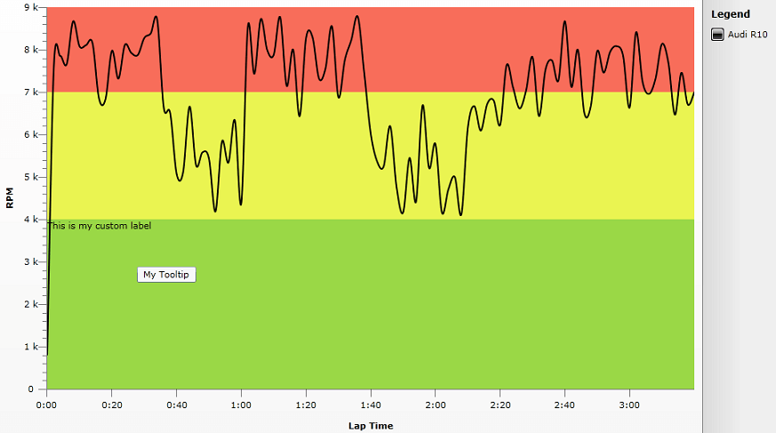
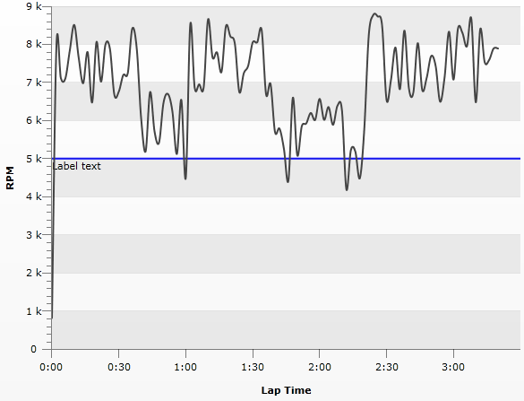

# Display Labels And Tooltips For Annotations

Annotations like [MarkedZone]() or [CustomGridLine]() allows you to customize their appearance using the *Background*, *Stroke* or *StrokeThickness* properties. However it is common scenario that you would like to have __Label__ or __Tooltip__ for your annotations and this is what this help topic will demonstrate.

>The article demonstrates how to set Tooltip and Label for MarkedZone but the approach is the same for the other Annotations. __Adding Tooltip__

##### 1. To be able to see the Tooltips for MarkedZones you should re-template the Chart Area and put the Annotations Layer within the Zoom Layer. Then by using *TooltipService.ToolTip* property of the MarkedZone you can set custom tooltip:


```XAML
	<Style x:Key="ChartAreaStyle" TargetType="telerik:ChartArea">
	                <Setter Property="Template2D">
	                    <Setter.Value>
	                        <ControlTemplate TargetType="telerik:ChartArea">
	                            <Border Padding="{TemplateBinding Padding}"
	                            Margin="{TemplateBinding Margin}"
	                            Background="{TemplateBinding Background}"
	                            BorderBrush="{TemplateBinding BorderBrush}"
	                            BorderThickness="{TemplateBinding BorderThickness}">
	                                <Grid>
	                                    <Grid.RowDefinitions>
	                                        <RowDefinition Height="auto" />
	                                        <RowDefinition Height="*" />
	                                        <RowDefinition Height="auto" />
	                                    </Grid.RowDefinitions>
	                                    <Grid.ColumnDefinitions>
	                                        <ColumnDefinition Width="auto" />
	                                        <ColumnDefinition Width="*" />
	                                        <ColumnDefinition Width="auto" />
	                                    </Grid.ColumnDefinitions>
	
	                                    <telerik:AxisX2D x:Name="PART_AxisX" 
	                                    Style="{TemplateBinding AxisXStyle}"  Grid.Row="2" Grid.Column="1" />
	
	                                    <telerik:AxisY2D x:Name="PART_AxisY" 
	                                        Style="{TemplateBinding AxisYStyle}" Grid.Row="1" Grid.Column="0" />
	
	                                    <telerik:AdditionalAxes2DContainer x:Name="PART_AdditionalHorizontalAxesPanel"
	                                StackOrientation="Vertical"
	                                Grid.Row="0" Grid.Column="1"/>
	                                    <telerik:AdditionalAxes2DContainer x:Name="PART_AdditionalVerticalAxesPanel"
	                                StackOrientation="Horizontal"
	                                Grid.Row="1" Grid.Column="2"/>
	
	                                    <telerik:RadTransitionControl x:Name="PART_RadTransitionControl" 
	                                                                                  Grid.Row="1" Grid.Column="1"
	                                                                                  Style="{TemplateBinding TransitionControlStyle}">
	
	                                        <telerik:ClipPanel x:Name="PART_PlotAreaPanel" Style="{TemplateBinding PlotAreaStyle}">
	                                            <telerik:HorizontalStripLines2D x:Name="PART_HorizontalStripLines"  />
	                                            <telerik:VerticalStripLines2D x:Name="PART_VerticalStripLines"  />
	
	                                            <telerik:VerticalMinorGridLines2D x:Name="PART_VerticalMinorGridLines" />
	                                            <telerik:HorizontalMinorGridLines2D x:Name="PART_HorizontalMinorGridLines" />
	                                            <telerik:HorizontalGridLines2D x:Name="PART_HorizontalGridLines"  />
	                                            <telerik:VerticalGridLines2D x:Name="PART_VerticalGridLines" />
	                                            <telerik:AdditionalPlotAreaAxes2DContainer x:Name="PART_AdditionalPlotAreaHorizontalAxesPanel"
	                                                        StackOrientation="Vertical"/>
	                                            <telerik:AdditionalPlotAreaAxes2DContainer x:Name="PART_AdditionalPlotAreaVerticalAxesPanel"
	                                                        StackOrientation="Horizontal" />
	
	                                            <telerik:DragZoomLayerControl x:Name="PART_DragZoomLayer" Style="{TemplateBinding DragZoomLayerControlStyle}">
	                                                <Grid>
	                                                    <telerik:AnnotationLayer x:Name="PART_AnnotationLayer" ItemsSource="{TemplateBinding Annotations}" />
	                                                    <ItemsPresenter />
	                                                </Grid>
	                                            </telerik:DragZoomLayerControl>
	
	                                            <telerik:PlotAreaAxisY2D x:Name="PART_PlotAreaAxisY"
	                                                            Style="{TemplateBinding PlotAreaAxisYStyle}" />
	                                            <telerik:PlotAreaAxisX2D x:Name="PART_PlotAreaAxisX"
	                                                                Style="{TemplateBinding PlotAreaAxisXStyle}" />
	                                            <telerik:LabelsPanel x:Name="PART_LabelsPanel" />
	                                        </telerik:ClipPanel>
	
	                                    </telerik:RadTransitionControl>
	
	                                    <telerik:NoDataControl x:Name="PART_NoData" 
	                                                Style="{TemplateBinding NoDataControlStyle}"  
	                                                Grid.RowSpan="3" Grid.ColumnSpan="3" />
	                                </Grid>
	                            </Border>
	                        </ControlTemplate>
	                    </Setter.Value>
	                </Setter>
	            </Style>
```

##### 2. Set the re-templated ChartArea Style to the RadChart. Then create new __MarkedZone__ and set custom string for it's *TooltipService.ToolTip* property:

```XAML
	<telerik:RadChart x:Name="RadChart1" ItemsSource="{Binding Data}" BorderThickness="1,0,1,1" BorderBrush="Black">
	            <telerik:RadChart.PaletteBrushes>
	                <SolidColorBrush Color="Black" />
	            </telerik:RadChart.PaletteBrushes>
	            <telerik:RadChart.SeriesMappings>
	                <telerik:SeriesMapping LegendLabel="Audi R10">
	                    <telerik:SeriesMapping.SeriesDefinition>
	                        <telerik:SplineSeriesDefinition ShowItemLabels="False" ShowPointMarks="False" ShowItemToolTips="True" />
	                    </telerik:SeriesMapping.SeriesDefinition>
	                    <telerik:SeriesMapping.ItemMappings>
	                        <telerik:ItemMapping FieldName="Time" DataPointMember="XValue"/>
	                        <telerik:ItemMapping FieldName="RPM" DataPointMember="YValue"/>
	                    </telerik:SeriesMapping.ItemMappings>
	                </telerik:SeriesMapping>
	            </telerik:RadChart.SeriesMappings>
	            <telerik:RadChart.DefaultView>
	                <telerik:ChartDefaultView>
	                    <telerik:ChartDefaultView.ChartArea>
	                        <telerik:ChartArea LegendName="CustomLegend" Style="{StaticResource ChartAreaStyle}">
	                            <telerik:ChartArea.Annotations>
	                                <telerik:MarkedZone StartY="0" EndY="4000" Background="#FF9AD846" ToolTipService.ToolTip="My Tooltip"  />
	                                <telerik:MarkedZone StartY="4000" EndY="7000" Background="#FFEAF451" />
	                                <telerik:MarkedZone StartY="7000" EndY="9000" Background="#FFF86D5A" />
	                            </telerik:ChartArea.Annotations>
	                            <telerik:ChartArea.AxisX>
	                                <telerik:AxisX Title="Lap Time"
	                                               DefaultLabelFormat="#VAL{m:ss}" />
	                            </telerik:ChartArea.AxisX>
	                            <telerik:ChartArea.AxisY>
	                                <telerik:AxisY MajorGridLinesVisibility="Visible"
	                                               MinorTicksVisibility="Visible"
	                                               Title="RPM"
	                                               AutoRange="False"
	                                               MinValue="0"
	                                               MaxValue="9000"
	                                               Step="1000">
	                                </telerik:AxisY>
	                            </telerik:ChartArea.AxisY>
	                        </telerik:ChartArea>
	                    </telerik:ChartDefaultView.ChartArea>
	                    <telerik:ChartDefaultView.ChartLegend>
	                        <telerik:ChartLegend x:Name="CustomLegend" UseAutoGeneratedItems="True" BorderThickness="1,0,0,0" />
	                    </telerik:ChartDefaultView.ChartLegend>
	                </telerik:ChartDefaultView>
	            </telerik:RadChart.DefaultView>
	        </telerik:RadChart>
```

## Adding Label

##### 1.  You can show any text in annotation zone by re-templating it and adding *TextBlock* in it's *ControlTemplate*. For this purpose the Rectangle and the newly added *TextBlock* are placed in a Grid. *The retemplated MarkedZone's Style* is as follows*:

```XAML
	<Style x:Key="NewMarkedZones" TargetType="telerik:MarkedZone">
	                <Setter Property="Background" Value="#33333333" />
	                <Setter Property="Template" >
	                    <Setter.Value>
	                        <ControlTemplate TargetType="telerik:MarkedZone">
	                            <Grid>
	                                <Rectangle Grid.ColumnSpan="3"
	                                   Fill="{TemplateBinding Background}" 
	                                   Stroke="{TemplateBinding Stroke}"
	                                   StrokeThickness="{TemplateBinding StrokeThickness}"
	                                   Margin="{TemplateBinding ElementMargin}" 
	                                   Style="{TemplateBinding ElementStyle}" />
	                                <TextBlock Grid.Column="0" TextWrapping="Wrap" Text="{Binding}" Margin="{TemplateBinding ElementMargin}"/>
	                            </Grid>
	                        </ControlTemplate>
	                    </Setter.Value>
	                </Setter>
	            </Style>
```

Additionally the __TextWrapping__ property of the MarkedZone's Text Block is set to __Wrap__ - this way the overflowed text does not clips.

##### 2. Set the newly created Style to your MarkedZone and provide Label's content using the DataContext property:

```XAML
	<telerik:MarkedZone StartY="0" EndY="4000" Style="{StaticResource NewMarkedZones}" DataContext="This is my custom label" Background="#FF9AD846" />
```

The result image shows the tooltip and the label:


The same can be achieved with __CustomGridLines__ like this:

```XAML
	     <SolidColorBrush x:Key="AxisStroke" Color="#FF000000" />
	
	        <Style x:Key="gridLineStyle"
	            TargetType="telerik:CustomGridLine" >
	            <Setter Property="Stroke" Value="{StaticResource AxisStroke}" />
	            <Setter Property="StrokeThickness" Value="1" />
	            <Setter Property="Template" >
	                <Setter.Value>
	                    <ControlTemplate TargetType="telerik:CustomGridLine">
	                        <Grid>
	                            <Line X1="{TemplateBinding ElementX1}"
	                              X2="{TemplateBinding ElementX2}" 
	                              Y1="{TemplateBinding ElementY1}" 
	                              Y2="{TemplateBinding ElementY2}" 
	                              Stroke="{TemplateBinding Stroke}"
	                              StrokeThickness="{TemplateBinding StrokeThickness}"
	                              Style="{TemplateBinding ElementStyle}" />
	                            <Canvas>
	                                <TextBlock TextWrapping="Wrap" Text="{Binding}" Canvas.Left="{TemplateBinding ElementX1}" Canvas.Top="{TemplateBinding ElementY1}">   
	                            </TextBlock>
	                            </Canvas>
	                        </Grid>
	                    </ControlTemplate>
	                </Setter.Value>
	            </Setter>
	        </Style>
```

Note that the position of the TextBlock is controlled via X1 and Y1 properties (the starting point of the GridLine) as taken using TemplateBinding. The result can be seen below:

