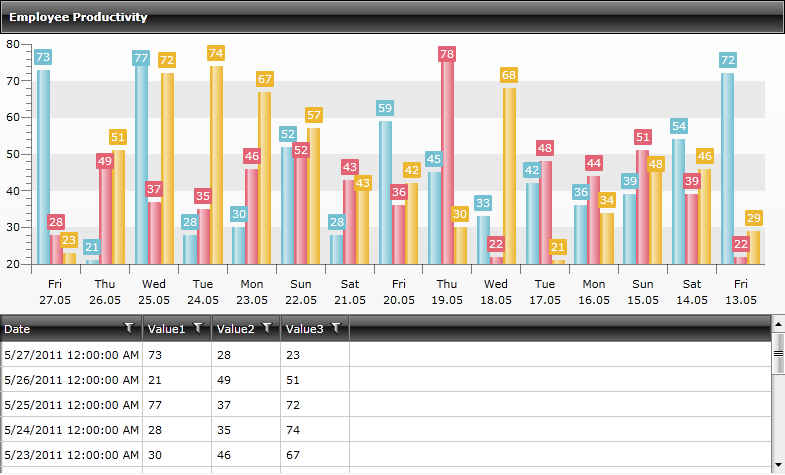
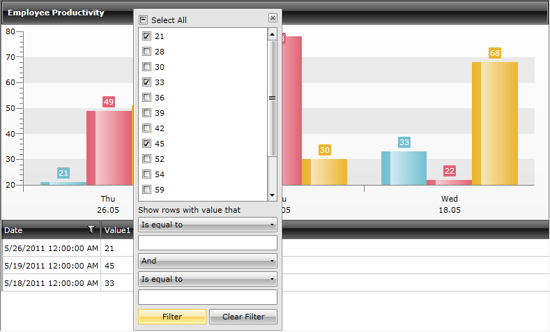
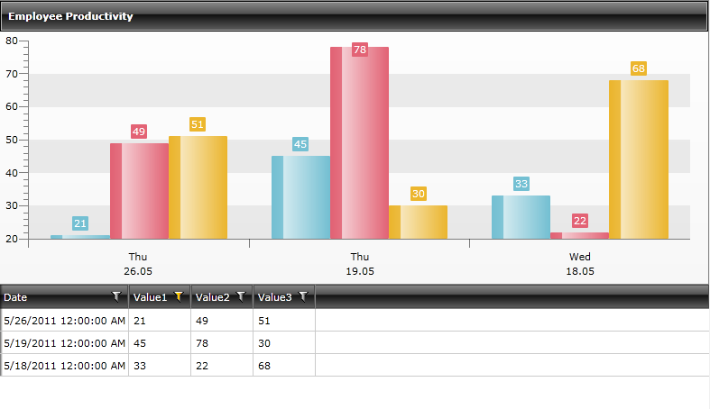

# Filter RadChart Using The GridView's CompositeFilterDescriptor

The __RadChart__ allows you to programmatically filter its data as demonstrated in our [help topic](). However there are scenarios where you would like to have more complex filtering like the one presented by the GridView's [ComplexFilterDescriptor](http://www.telerik.com/help/wpf/radgridview-filtering-composite-filter-descriptors.html) object. It contains a collection of filter descriptors objects and the logical operator for that filters.

This help topic will demonstrate how to create a GridView and draw a Chart with the filtered data from the GridView.

##### 1. Create a List of Business objects that will be used to populate the Chart and the GridView.


```C#
	public class MyDateObject
	    {
	        public double Value1 { get; set; }
	        public double Value2 { get; set; }
	        public double Value3 { get; set; }
	        public DateTime Date { get; set; }
	    }
	
	    public class MyDataContext
	    {
	        public const int min = 21;
	        public const int max = 79;
	        public ObservableCollection<MyDateObject> List { get; set; }
	        Random r = new Random();
	        DateTime baseDate = DateTime.Today;
	
	        public MyDataContext()
	        {
	            this.CreateChartData();
	        }
	
	        private void CreateChartData()
	        {
	            List = new ObservableCollection<MyDateObject>();
	            for (int i = 0; i < 15; i++)
	            {
	                List.Add(new MyDateObject() { Value1 = r.Next(min, max), Value2 = r.Next(min, max), Value3 = r.Next(min, max), Date = baseDate.AddDays(i) });
	            }
	        }
	    }
```
```VB.NET
	Public Class MyDateObject
	            Public Property Value1() As Double
	            Public Property Value2() As Double
	            Public Property Value3() As Double
	            Public Property [Date]() As Date
	   End Class
	
	      Public Class MyDataContext
	            Public Const min As Integer = 21
	            Public Const max As Integer = 79
	            Public Property List() As ObservableCollection(Of MyDateObject)
	            Private r As New Random()
	            Private baseDate As Date = Date.Today
	
	            Public Sub New()
	                  Me.CreateChartData()
	            End Sub
	
	            Private Sub CreateChartData()
	                  List = New ObservableCollection(Of MyDateObject)()
	                  For i As Integer = 0 To 14
	                        List.Add(New MyDateObject() With {.Value1 = r.Next(min, max), .Value2 = r.Next(min, max), .Value3 = r.Next(min, max), .Date = baseDate.AddDays(i)})
	                  Next i
	            End Sub
	      End Class
```

##### 2. Create the GridView and the Chart in *XAML*:


```XAML
	<telerik:RadChart x:Name="RadChart1" ItemsSource="{Binding List}">
	            <telerik:RadChart.SeriesMappings>
	                <telerik:SeriesMapping LegendLabel="Lee Young">
	                    <telerik:SeriesMapping.SeriesDefinition>
	                        <telerik:BarSeriesDefinition/>
	                    </telerik:SeriesMapping.SeriesDefinition>
	                    <telerik:ItemMapping FieldName="Value1" DataPointMember="YValue"></telerik:ItemMapping>
	                    <telerik:ItemMapping FieldName="Date" DataPointMember="XCategory"></telerik:ItemMapping>
	                </telerik:SeriesMapping>
	                <telerik:SeriesMapping LegendLabel="Linda Baker">
	                    <telerik:SeriesMapping.SeriesDefinition>
	                        <telerik:BarSeriesDefinition />
	                    </telerik:SeriesMapping.SeriesDefinition>
	                    <telerik:ItemMapping FieldName="Value2" DataPointMember="YValue"></telerik:ItemMapping>
	                    <telerik:ItemMapping FieldName="Date" DataPointMember="XCategory"></telerik:ItemMapping>
	                </telerik:SeriesMapping>
	                <telerik:SeriesMapping LegendLabel="Martin Thompson">
	                    <telerik:SeriesMapping.SeriesDefinition>
	                        <telerik:BarSeriesDefinition />
	                    </telerik:SeriesMapping.SeriesDefinition>
	                    <telerik:ItemMapping FieldName="Value3" DataPointMember="YValue"></telerik:ItemMapping>
	                    <telerik:ItemMapping FieldName="Date" DataPointMember="XCategory"></telerik:ItemMapping>
	                </telerik:SeriesMapping>
	            </telerik:RadChart.SeriesMappings>
	            <telerik:RadChart.DefaultView>
	                <telerik:ChartDefaultView ChartLegendPosition="Bottom">
	                    <telerik:ChartDefaultView.ChartLegend>
	                        <telerik:ChartLegend x:Name="legend" Visibility="Collapsed" />
	                    </telerik:ChartDefaultView.ChartLegend>
	                    <telerik:ChartDefaultView.ChartTitle>
	                        <telerik:ChartTitle Content="Employee Productivity" HorizontalContentAlignment="Left"/>
	                    </telerik:ChartDefaultView.ChartTitle>
	                    <telerik:ChartDefaultView.ChartArea>
	                        <telerik:ChartArea LegendName="legend" Padding="5,10,20,5">
	                            <telerik:ChartArea.AxisY>
	                                <telerik:AxisY ExtendDirection="None" />
	                            </telerik:ChartArea.AxisY>
	                        </telerik:ChartArea>
	                    </telerik:ChartDefaultView.ChartArea>
	                </telerik:ChartDefaultView>
	            </telerik:RadChart.DefaultView>
	        </telerik:RadChart>
	
	        <telerik:RadGridView AutoGenerateColumns="True" Filtered="GridView1_Filtered" ItemsSource="{Binding List}" 
	                             Grid.Row="1"
	                             Name="GridView1"
	                             BorderThickness="0"
	                             CanUserSortColumns="False"
	                             IsFilteringAllowed="True" 
	                             ShowGroupPanel="False" 
	                             CanUserSelect="False"
	                             RowIndicatorVisibility="Collapsed">
	        </telerik:RadGridView>
```

The Chart has 3 Bar Series and is populated using [Manual Series Mappings](). On the other side the GridView is bound by the ItemsSource property. Several properties are turned off so that we gain the needed filtering functionality only and nothing more (no grouping, selecting or sorting).

Note the Filtered event in the GridView's declaration:

```C#
	CompositeFilterDescriptor chartFilterDescriptorCol = new CompositeFilterDescriptor();
	private void GridView1_Filtered(object sender, Telerik.Windows.Controls.GridView.GridViewFilteredEventArgs e)
	        {
	            if (e.Added.Count() > 0)
	            {
	                foreach (FilterDescriptor filter in e.Added)
	                {
	                    FilterDescriptor gridFilterDescriptor = filter;
	
	                    chartFilterDescriptorCol.FilterDescriptors.Add(gridFilterDescriptor);
	                    chartFilterDescriptorCol.LogicalOperator = FilterCompositionLogicalOperator.Or;
	                }
	            }
	                this.RadChart1.FilterDescriptors.Add(chartFilterDescriptorCol);                
	        }
```
```VB.NET
	Dim chartFilterDescriptorCol As New CompositeFilterDescriptor()
	Private Sub GridView1_Filtered(ByVal sender As Object, ByVal e As Telerik.Windows.Controls.GridView.GridViewFilteredEventArgs)
	If e.Added.Count() > 0 Then
	For Each filter As FilterDescriptor In e.Added
	Dim gridFilterDescriptor As FilterDescriptor = filter
	chartFilterDescriptorCol.FilterDescriptors.Add(gridFilterDescriptor)
	chartFilterDescriptorCol.LogicalOperator = FilterCompositionLogicalOperator.Or
	Next filter
	End If
	Me.RadChart1.FilterDescriptors.Add(chartFilterDescriptorCol)
	End Sub
```

The RadChart's FilterDescriptors collection is populated with GridView's CompositeFilterDescriptor as shown above. The LogicalOperator chosen is "Or".

The full source code for the sample can be found here:

```XAML
	<Grid x:Name="LayoutRoot">
	        <Grid.RowDefinitions>
	            <RowDefinition Height="2*"/>
	            <RowDefinition Height="*"/>
	        </Grid.RowDefinitions>
	        <telerik:RadChart x:Name="RadChart1" ItemsSource="{Binding List}">
	            <telerik:RadChart.SeriesMappings>
	                <telerik:SeriesMapping LegendLabel="Lee Young">
	                    <telerik:SeriesMapping.SeriesDefinition>
	                        <telerik:BarSeriesDefinition/>
	                    </telerik:SeriesMapping.SeriesDefinition>
	                    <telerik:ItemMapping FieldName="Value1" DataPointMember="YValue"></telerik:ItemMapping>
	                    <telerik:ItemMapping FieldName="Date" DataPointMember="XCategory"></telerik:ItemMapping>
	                </telerik:SeriesMapping>
	                <telerik:SeriesMapping LegendLabel="Linda Baker">
	                    <telerik:SeriesMapping.SeriesDefinition>
	                        <telerik:BarSeriesDefinition />
	                    </telerik:SeriesMapping.SeriesDefinition>
	                    <telerik:ItemMapping FieldName="Value2" DataPointMember="YValue"></telerik:ItemMapping>
	                    <telerik:ItemMapping FieldName="Date" DataPointMember="XCategory"></telerik:ItemMapping>
	                </telerik:SeriesMapping>
	                <telerik:SeriesMapping LegendLabel="Martin Thompson">
	                    <telerik:SeriesMapping.SeriesDefinition>
	                        <telerik:BarSeriesDefinition />
	                    </telerik:SeriesMapping.SeriesDefinition>
	                    <telerik:ItemMapping FieldName="Value3" DataPointMember="YValue"></telerik:ItemMapping>
	                    <telerik:ItemMapping FieldName="Date" DataPointMember="XCategory"></telerik:ItemMapping>
	                </telerik:SeriesMapping>
	            </telerik:RadChart.SeriesMappings>
	            <telerik:RadChart.DefaultView>
	                <telerik:ChartDefaultView ChartLegendPosition="Bottom">
	                    <telerik:ChartDefaultView.ChartLegend>
	                        <telerik:ChartLegend x:Name="legend" Visibility="Collapsed" />
	                    </telerik:ChartDefaultView.ChartLegend>
	                    <telerik:ChartDefaultView.ChartTitle>
	                        <telerik:ChartTitle Content="Employee Productivity" HorizontalContentAlignment="Left"/>
	                    </telerik:ChartDefaultView.ChartTitle>
	                    <telerik:ChartDefaultView.ChartArea>
	                        <telerik:ChartArea LegendName="legend" Padding="5,10,20,5">
	                            <telerik:ChartArea.AxisY>
	                                <telerik:AxisY ExtendDirection="None" />
	                            </telerik:ChartArea.AxisY>
	                        </telerik:ChartArea>
	                    </telerik:ChartDefaultView.ChartArea>
	                </telerik:ChartDefaultView>
	            </telerik:RadChart.DefaultView>
	        </telerik:RadChart>
	
	        <telerik:RadGridView AutoGenerateColumns="True" Filtered="GridView1_Filtered" ItemsSource="{Binding List}" 
	                             Grid.Row="1"
	                             Name="GridView1"
	                             BorderThickness="0"
	                             CanUserSortColumns="False"
	                             IsFilteringAllowed="True" 
	                             ShowGroupPanel="False" 
	                             CanUserSelect="False"
	                             RowIndicatorVisibility="Collapsed">
	        </telerik:RadGridView>
	    </Grid>
```

The code-behind:

```C#
	CompositeFilterDescriptor chartFilterDescriptorCol = new CompositeFilterDescriptor();
	        public MainPage()
	        {
	            InitializeComponent();
	            RadChart1.DefaultView.ChartArea.AxisX.DefaultLabelFormat = "ddd\ndd.MM";
	
	            MyDataContext context = new MyDataContext();
	
	            this.DataContext = context;
	        }
	
	        private void GridView1_Filtered(object sender, Telerik.Windows.Controls.GridView.GridViewFilteredEventArgs e)
	        {
	            if (e.Added.Count() > 0)
	            {
	                foreach (FilterDescriptor filter in e.Added)
	                {
	                    FilterDescriptor gridFilterDescriptor = filter;
	
	                    chartFilterDescriptorCol.FilterDescriptors.Add(gridFilterDescriptor);
	                    chartFilterDescriptorCol.LogicalOperator = FilterCompositionLogicalOperator.Or;
	                }
	            }
	                this.RadChart1.FilterDescriptors.Add(chartFilterDescriptorCol);                
	        }
	    }
	
	    public class MyDateObject
	    {
	        public double Value1 { get; set; }
	        public double Value2 { get; set; }
	        public double Value3 { get; set; }
	        public DateTime Date { get; set; }
	    }
	
	    public class MyDataContext
	    {
	        public const int min = 21;
	        public const int max = 79;
	        public ObservableCollection<MyDateObject> List { get; set; }
	        Random r = new Random();
	        DateTime baseDate = DateTime.Today;
	
	        public MyDataContext()
	        {
	            this.CreateChartData();
	        }
	
	        private void CreateChartData()
	        {
	            List = new ObservableCollection<MyDateObject>();
	            for (int i = 0; i < 15; i++)
	            {
	                List.Add(new MyDateObject() { Value1 = r.Next(min, max), Value2 = r.Next(min, max), Value3 = r.Next(min, max), Date = baseDate.AddDays(i) });
	            }
	        }
	    }
```
```VB.NET
	Imports Microsoft.VisualBasic
	
	Private chartFilterDescriptorCol As New CompositeFilterDescriptor()
	public MainPage()
	            Public Sub New()
	                  InitializeComponent()
	                  RadChart1.DefaultView.ChartArea.AxisX.DefaultLabelFormat = "ddd" & vbLf & "dd.MM"
	
	                  Dim context As New MyDataContext()
	
	                  Me.DataContext = context
	            End Sub
	
	            Private Sub GridView1_Filtered(ByVal sender As Object, ByVal e As Telerik.Windows.Controls.GridView.GridViewFilteredEventArgs)
	                  If e.Added.Count() > 0 Then
	                        For Each filter As FilterDescriptor In e.Added
	                              Dim gridFilterDescriptor As FilterDescriptor = filter
	
	                              chartFilterDescriptorCol.FilterDescriptors.Add(gridFilterDescriptor)
	                              chartFilterDescriptorCol.LogicalOperator = FilterCompositionLogicalOperator.Or
	                        Next filter
	                  End If
	                        Me.RadChart1.FilterDescriptors.Add(chartFilterDescriptorCol)
	            End Sub
	      }
	
	      Public Class MyDateObject
	            Public Property Value1() As Double
	            Public Property Value2() As Double
	            Public Property Value3() As Double
	            Public Property [Date]() As Date
	      End Class
	
	      Public Class MyDataContext
	            Public Const min As Integer = 21
	            Public Const max As Integer = 79
	            Public Property List() As ObservableCollection(Of MyDateObject)
	            Private r As New Random()
	            Private baseDate As Date = Date.Today
	
	            Public Sub New()
	                  Me.CreateChartData()
	            End Sub
	
	            Private Sub CreateChartData()
	                  List = New ObservableCollection(Of MyDateObject)()
	                  For i As Integer = 0 To 14
	                        List.Add(New MyDateObject() With {.Value1 = r.Next(min, max), .Value2 = r.Next(min, max), .Value3 = r.Next(min, max), .Date = baseDate.AddDays(i)})
	                  Next i
	            End Sub
	      End Class
```

>tipThe code snippets above were taken from a Silverlight project but are absolutely applicable for WPF scenarios.

The bound non-filtered data looks like this:


Filter the data by Value1 column:


The filtered data:

