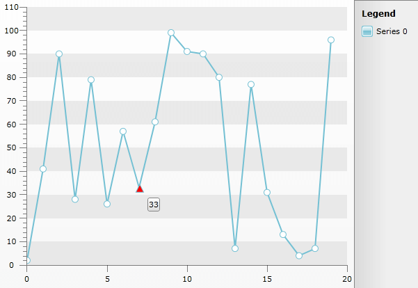

# Highlight PointMark On Click

It is common scenario that you would like to select a single PointMark of Line Series for example. Since __InteractivityScope.Item__ (for more information see Interactivity Effects [topic]()) is not supported for series that do not render separate items (__Line__, __Spline__, __Area__, __Range__, and __all their stacked versions__) this help topic will demonstrate how to select single Line's PointMark and customise it. 

##### 1.  Create Line Chart Series. The following code snippet demonstrates LineSeries created using [Manual Series Mappings]().


```C#
	public MainPage() //MainWindow() for WPF
	        {
	            InitializeComponent();
	            Random r = new Random();
	            List<ItemData> chartData = new List<ItemData>();
	            for (int i = 0; i < 20; i++)
	            {
	                chartData.Add(new ItemData(i, r.Next(0, 100)));
	            }
	            this.radChart.ItemsSource = chartData;
	            this.SetUpMappings();
	        }
	
	        private void SetUpMappings()
	        {
	            SeriesMapping mapping = new SeriesMapping();
	            mapping.SeriesDefinition = new LineSeriesDefinition()
	            {
	                ShowItemToolTips = true,
	                ShowItemLabels = false
	            };
	            mapping.ItemMappings.Add(new ItemMapping("YValue", DataPointMember.YValue));
	            mapping.ItemMappings.Add(new ItemMapping("XValue", DataPointMember.XValue));
	
	            this.radChart.SeriesMappings.Add(mapping);
	        }
	
	        public class ItemData
	        {
	            public double XValue { get; set; }
	            public double YValue { get; set; }
	            public ItemData(double xValue, double yValue)
	            {
	                this.XValue = xValue;
	                this.YValue = yValue;
	            }
	        }
```
```VB.NET
	Public Sub New() 'MainWindow() for WPF
	                  InitializeComponent()
	                  Dim r As New Random()
	                  Dim chartData As New List(Of ItemData)()
	                  For i As Integer = 0 To 19
	                        chartData.Add(New ItemData(i, r.Next(0, 100)))
	                  Next i
	                  Me.radChart.ItemsSource = chartData
	                  Me.SetUpMappings()
	       End Sub
	
	            Private Sub SetUpMappings()
	                  Dim mapping As New SeriesMapping()
	                  mapping.SeriesDefinition = New LineSeriesDefinition() With {.ShowItemToolTips = True, .ShowItemLabels = False}
	                  mapping.ItemMappings.Add(New ItemMapping("YValue", DataPointMember.YValue))
	                  mapping.ItemMappings.Add(New ItemMapping("XValue", DataPointMember.XValue))
	
	                  Me.radChart.SeriesMappings.Add(mapping)
	            End Sub
	
	            Public Class ItemData
	                  Public Property XValue() As Double
	                  Public Property YValue() As Double
	                  Public Sub New(ByVal xValue As Double, ByVal yValue As Double)
	                        Me.XValue = xValue
	                        Me.YValue = yValue
	                  End Sub
	            End Class
```

##### 2. Subscribe to the *ItemClick* event of the ChartArea and get a list of all PointMarks in the ChartArea using the ChildrenOfType<T> extension method. The next step is to figure out which PointMark is selected. Find the SingleOrDefault PointMark from the eventargs (e.DataPoint) which matches the datacontext of a pointmark in the collection of pointmarks:


```C#
	void ChartArea_ItemClick(object sender, ChartItemClickEventArgs e)
	        {
	            this.ClearPointMarkSelectedState();
	
	            var pointMarks = 
	                radChart.DefaultView.ChartArea.ChildrenOfType<PointMark>().ToList<PointMark>();
	
	            this.selectedPointMark =
	                pointMarks.Where(x => x.DataContext == e.DataPoint).SingleOrDefault();
	
	            this.SetPointMarkSelectedState();
	        }
```
```VB.NET
	Private Sub ChartArea_ItemClick(ByVal sender As Object, ByVal e As ChartItemClickEventArgs)
	Me.ClearPointMarkSelectedState()
	Dim pointMarks = radChart.DefaultView.ChartArea.ChildrenOfType(Of PointMark)().ToList(Of PointMark)()
	Me.selectedPointMark = pointMarks.Where(Function(x) x.DataContext = e.DataPoint).SingleOrDefault()
	Me.SetPointMarkSelectedState()
	End Sub
```


##### 3. The methods SetPointMarkSelectedState() and ClearPointMarkSelectedState() define what should be done with the selected PointMark (in this case the selected one's MarkerShape is set to Triangle and the Fill to Red) and how to return to it's default state when another one is selected (Circle MarkerShape and White Fill):

```C#
	private void SetPointMarkSelectedState()
	        {
	            if (this.selectedPointMark == null)
	                return;
	
	            this.selectedPointMark.Fill = new SolidColorBrush(Colors.Red);
	            this.selectedPointMark.Shape = MarkerShape.Triangle;
	            this.selectedPointMark.Size = 12;
	        }
	
	        private void ClearPointMarkSelectedState()
	        {
	            if (this.selectedPointMark == null)
	                return;
	
	            this.selectedPointMark.Fill = new SolidColorBrush(Colors.White);
	            this.selectedPointMark.Shape = MarkerShape.Circle;
	        }
```
```VB.NET
	Private Sub SetPointMarkSelectedState()
	If Me.selectedPointMark Is Nothing Then
	Return
	End If
	Me.selectedPointMark.Fill = New SolidColorBrush(Colors.Red)
	Me.selectedPointMark.Shape = MarkerShape.Triangle
	Me.selectedPointMark.Size = 12
	End Sub
	Private Sub ClearPointMarkSelectedState()
	If Me.selectedPointMark Is Nothing Then
	Return
	End If
	Me.selectedPointMark.Fill = New SolidColorBrush(Colors.White)
	Me.selectedPointMark.Shape = MarkerShape.Circle
	End Sub
```

The snapshot below shows the result:

