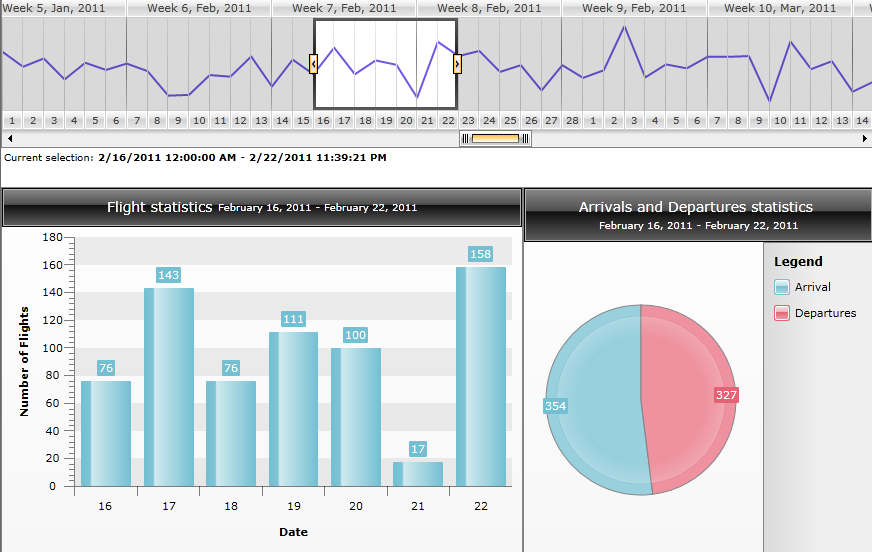
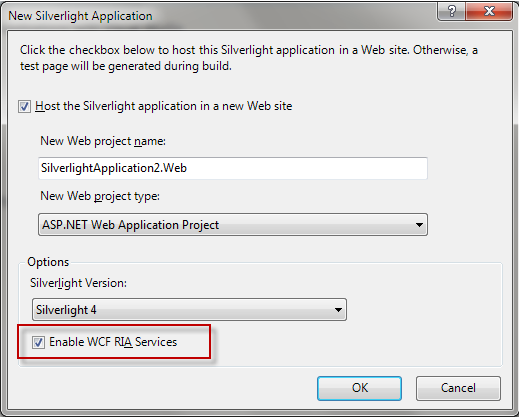
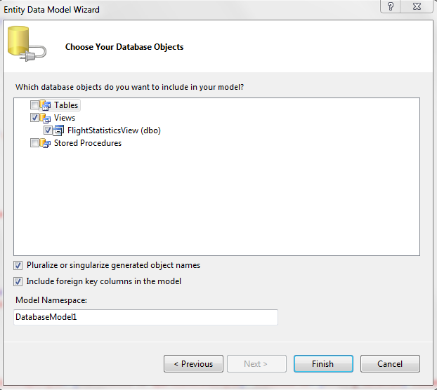
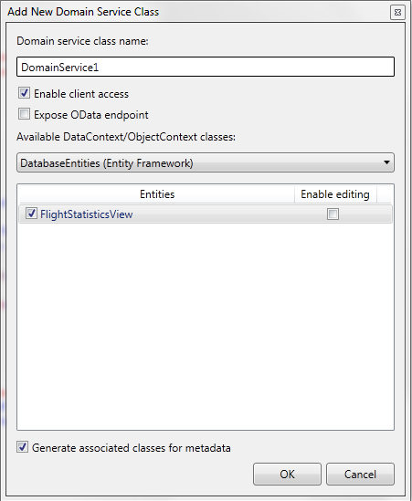
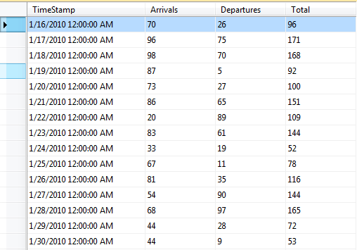

# Integrate Data Visualization Controls With WCF RIA services

## 

This help topic will show how the Data Visualization controls can be bound to а sample database with [WCF RIA services](http://msdn.microsoft.com/en-us/library/ee707344(v=vs.91).aspx). For this sample a combination of RadTimeBar and RadLinearSparkline is used without code behind modifications or ViewModel. Changing the selection of  TimeBar’s time span updates the “Flight Statistics” and “Arrivals and Departures statistics” charts. The Bar Chart is populated with the number of Arrivals per Date (as being selected) and the Pie shows the Total of the Arrivals/Departures for the chosen time period. The picture below shows how this will look in action:

         
      

Here is how this is done step-by-step:

1.     Create new Visual Studio 2010 Silverlight Application and check  “Enable WCF Ria Services”:

         
      

2.    Now that we have the web application, we will add our data model using the sample database (which you may find in the sample’s source code at the end of this post). For the purpose of this demonstration Entity Framework is used. Right click on the *TimeBarFirstLook_WCF_RIA.Web* server project in Solution Explorer and select Add New Item. Pick the Data category on the left, and select ADO.NET Entity Data Model, and name it FlightStatisticsModel.edmx. Create a new connection to the SQL database that will be used as datasource. In the next step, Choose Your Database Objects, check the box for Views and click Finish:

         
      

3.     Rebuild the project so when we add the DomainDataSource it will see the generated entities.

4.     In the server project (TimeBarFirstLook_WCF_RIA.Web) add a new __Domain Service Class__ and select the FlightStatisticsView:

         
      

5.     Click OK and rebuild the solution.

6.     Now that we are ready with the server side, let's go to the client side - the Silverlight application.

Create new *RadTimeBar*, *RadChart* and *RadLinearSparkline *controls in XAML. Add the server project as new xmlns declaration:

#### __XAML__

{{region radchart-howto-integrate-data-visualization-controls-with-wcf-ria-services_0}}
	xmlns:web="clr-namespace:TimeBarFirstLook_WCF_RIA.Web"
	{{endregion}}

Add [RadDomainDataSource](http://www.telerik.com/help/silverlight/dds-overview.html) control and set the FlightStatisticsContext as DomainContext that will be used for the binding:

#### __XAML__

{{region radchart-howto-integrate-data-visualization-controls-with-wcf-ria-services_1}}
	<telerik:RadDomainDataSource Name="flightStatisticsSource" QueryName="GetFlightStatisticsViews"
	                                     AutoLoad="True"
	                                     Height="0" Width="0">
	            <telerik:RadDomainDataSource.DomainContext>
	                <web:FlightStatisticsContext />
	            </telerik:RadDomainDataSource.DomainContext>
	        </telerik:RadDomainDataSource>
	{{endregion}}

Now the Data Visualizations controls will use the DataView as ItemsSource with ElementName set to the newly added domain data source (flightStatisticsSource).

Since the Pie Chart should display the Total of the Flights/Departures it is not enough to just group the data by *FlightType* and display the Sum with AggregateFunction. The chart would create a new DataSeries for each column in its datasource and we want it to be bound to both Arrivals and Departures and display a single pie. Our sample SQL Table has the Arrivals and Departures values in separate columns (see __Fig. 1__ below), so what we need is a list of two items – one for Arrivals and another one for Departures.

__Fig.1:__

____

To achieve this a Converter is used where the data is managed by a LINQ query:

#### __C#__

{{region radchart-howto-integrate-data-visualization-controls-with-wcf-ria-services_2}}
	public object Convert(object value, Type targetType, object parameter, System.Globalization.CultureInfo culture)
	        {
	            IEnumerable<FlightStatisticsView> data = (value as DataItemCollection).Cast<FlightStatisticsView>();
	
	            return (from p in data
	                    select new FlightRecords() { Type = "Arrival", TimeStamp = p.TimeStamp, FlightCount = p.Arrivals }).Concat(
	                    from p in data
	                    select new FlightRecords() { Type = "Departures", TimeStamp = p.TimeStamp, FlightCount = p.Departures });
	        }
	{{endregion}}

#### __VB.NET__

{{region radchart-howto-integrate-data-visualization-controls-with-wcf-ria-services_3}}
	Public Function Convert(ByVal value As Object, ByVal targetType As Type, ByVal parameter As Object, ByVal culture As System.Globalization.CultureInfo) As Object
	Dim data As IEnumerable(Of FlightStatisticsView) = (TryCast(value, DataItemCollection)).Cast(Of FlightStatisticsView)()
	Return (
	From p In data
	Select New FlightRecords() With {.Type = "Arrival", .TimeStamp = p.TimeStamp, .FlightCount = p.Arrivals}).Concat(
	From p In data
	Select New FlightRecords() With {.Type = "Departures", .TimeStamp = p.TimeStamp, .FlightCount = p.Departures})
	End Function
	{{endregion}}

The full XAML is as follows:

#### __XAML__

{{region radchart-howto-integrate-data-visualization-controls-with-wcf-ria-services_4}}
	<UserControl x:Class="TimeBarFirstLook_WCF_RIA.MainPage"
	    xmlns="http://schemas.microsoft.com/winfx/2006/xaml/presentation"
	    xmlns:x="http://schemas.microsoft.com/winfx/2006/xaml"
	    xmlns:d="http://schemas.microsoft.com/expression/blend/2008"
	    xmlns:mc="http://schemas.openxmlformats.org/markup-compatibility/2006"
	    xmlns:telerik="http://schemas.telerik.com/2008/xaml/presentation"
	    xmlns:web="clr-namespace:TimeBarFirstLook_WCF_RIA.Web"
	    xmlns:converters="clr-namespace:TimeBarFirstLook_WCF_RIA.Converters"
	    mc:Ignorable="d"
	    d:DesignHeight="300" d:DesignWidth="400">
	    <UserControl.Resources>
	        <converters:PieConverter x:Key="converter" />
	    </UserControl.Resources>
	
	    <Grid x:Name="LayoutRoot" Background="White">
	        <Grid.Resources>
	            
	            
	        </Grid.Resources>
	
	        <Grid.RowDefinitions>
	            <RowDefinition Height="Auto" />
	            <RowDefinition Height="*" />
	        </Grid.RowDefinitions>
	
	        <telerik:RadDomainDataSource Name="flightStatisticsSource" QueryName="GetFlightStatisticsViews"
	                                     AutoLoad="True"
	                                     Height="0" Width="0">
	            <telerik:RadDomainDataSource.DomainContext>
	                <web:FlightStatisticsContext />
	            </telerik:RadDomainDataSource.DomainContext>
	        </telerik:RadDomainDataSource>
	
	        <telerik:RadBusyIndicator IsBusy="{Binding Path=IsBusy, ElementName=flightStatisticsSource}" />
	        <Grid Grid.Row="0">
	            <Grid.RowDefinitions>
	                <RowDefinition Height="150" />
	                <RowDefinition Height="Auto" />
	            </Grid.RowDefinitions>
	            <telerik:RadTimeBar Name="timeBar1" Grid.Row="0"
	                                PeriodStart="1-Jan-2010" PeriodEnd="1-Jan-2012"
	                                VisiblePeriodStart="1-Feb-2011" VisiblePeriodEnd="15-March-2011">
	                <telerik:RadTimeBar.Intervals>
	                    <telerik:QuarterInterval />
	                    <telerik:MonthInterval />
	                    <telerik:WeekInterval />
	                    <telerik:DayInterval />
	                </telerik:RadTimeBar.Intervals>
	                <telerik:RadLinearSparkline LineStroke="#7156E4" LineShapeStyle="{StaticResource SparklineLineStyle}" ItemsSource="{Binding DataView, ElementName=flightStatisticsSource}" XValuePath="TimeStamp" YValuePath="Total" Margin="0,8" />
	            </telerik:RadTimeBar>
	            <Border Grid.Row="1">
	                <StackPanel Margin="3,2" Orientation="Horizontal" VerticalAlignment="Center">
	                    <StackPanel.Resources>
	                        
	                    </StackPanel.Resources>
	                    <TextBlock Text="Current selection: " />
	                    <TextBlock Text="{Binding ElementName=timeBar1, Path=SelectionStart}" FontWeight="Bold" />
	                    <TextBlock Text=" - " />
	                    <TextBlock Text="{Binding ElementName=timeBar1, Path=SelectionEnd}" FontWeight="Bold" />
	                </StackPanel>
	            </Border>
	        </Grid>
	        <Grid Grid.Row="1" Margin="0,20,0,0">
	            <Grid.ColumnDefinitions>
	                <ColumnDefinition Width="463*" />
	                <ColumnDefinition Width="311*" />
	            </Grid.ColumnDefinitions>
	
	            <!--Bar chart-->
	            <telerik:RadChart Grid.Column="0" >
	                <telerik:RadChart.SeriesMappings>
	                    <telerik:SeriesMapping>
	                        <telerik:SeriesMapping.SeriesDefinition>
	                            <telerik:BarSeriesDefinition />
	                        </telerik:SeriesMapping.SeriesDefinition>
	                        <telerik:SeriesMapping.ItemMappings>
	                            <telerik:ItemMapping FieldName="TimeStamp" DataPointMember="XCategory" />
	                            <telerik:ItemMapping FieldName="Total" DataPointMember="YValue" />
	                        </telerik:SeriesMapping.ItemMappings>
	                    </telerik:SeriesMapping>
	                </telerik:RadChart.SeriesMappings>
	
	                <telerik:RadChart.DefaultView>
	                    <telerik:ChartDefaultView>
	                        <telerik:ChartDefaultView.ChartLegend >
	                            <telerik:ChartLegend Name="legend" Visibility="Collapsed" />
	                        </telerik:ChartDefaultView.ChartLegend>
	                        <telerik:ChartDefaultView.ChartArea>
	                            <telerik:ChartArea LegendName="legend"
	                                                EnableAnimations="False" 
	                                                EnableTransitionAnimations="True"
	                                                TransitionControlStyle="{StaticResource TransitionControlStyle}">
	                                <telerik:ChartArea.AxisY>
	                                    <telerik:AxisY Title="Number of Flights" />
	                                </telerik:ChartArea.AxisY>
	                                <telerik:ChartArea.AxisX>
	                                    <telerik:AxisX Title="Date" DefaultLabelFormat="dd" />
	                                </telerik:ChartArea.AxisX>
	                            </telerik:ChartArea>
	                        </telerik:ChartDefaultView.ChartArea>
	                        <telerik:ChartDefaultView.ChartTitle>
	                            <telerik:ChartTitle FontWeight="Normal">
	                                <StackPanel Orientation="Horizontal">
	                                    <StackPanel.Resources>
	                                        
	                                    </StackPanel.Resources>
	                                    <TextBlock Text="Flight statistics " FontSize="14" />
	                                    <TextBlock Text="{Binding ElementName=timeBar1, Path=SelectionStart, StringFormat='MMMM dd, yyyy'}" />
	                                    <TextBlock Text=" - " />
	                                    <TextBlock Text="{Binding ElementName=timeBar1, Path=SelectionEnd, StringFormat='MMMM dd, yyyy'}" />
	                                </StackPanel>
	                            </telerik:ChartTitle>
	                        </telerik:ChartDefaultView.ChartTitle>
	                    </telerik:ChartDefaultView>
	                </telerik:RadChart.DefaultView>
	                <telerik:RadChart.TimeBar>
	                    <Binding ElementName="timeBar1" />
	                </telerik:RadChart.TimeBar>
	                <telerik:RadChart.ItemsSource>
	                    <Binding ElementName="flightStatisticsSource" Path="DataView" />
	                </telerik:RadChart.ItemsSource>
	            </telerik:RadChart>
	
	            <!--Pie chart-->
	            <telerik:RadChart Grid.Column="1" Name="pieChart">
	                <telerik:RadChart.SeriesMappings>
	                    <telerik:SeriesMapping>
	                        <telerik:SeriesMapping.SeriesDefinition>
	                            <telerik:PieSeriesDefinition StartAngle="90" />
	                        </telerik:SeriesMapping.SeriesDefinition>
	                        <telerik:SeriesMapping.ItemMappings>
	                            <telerik:ItemMapping FieldName="TimeStamp" DataPointMember="XCategory" />
	                            <telerik:ItemMapping FieldName="FlightCount"  DataPointMember="YValue" AggregateFunction="Sum" />
	                            <telerik:ItemMapping FieldName="Type" DataPointMember="LegendLabel" />
	                        </telerik:SeriesMapping.ItemMappings>
	                        <telerik:SeriesMapping.GroupingSettings>
	                            <telerik:GroupingSettings ShouldFlattenSeries="True">
	                                <telerik:GroupingSettings.GroupDescriptors>
	                                    <telerik:ChartGroupDescriptor Member="Type" />
	                                </telerik:GroupingSettings.GroupDescriptors>
	                            </telerik:GroupingSettings>
	                        </telerik:SeriesMapping.GroupingSettings>
	                    </telerik:SeriesMapping>
	                </telerik:RadChart.SeriesMappings>
	
	                <telerik:RadChart.DefaultView>
	                    <telerik:ChartDefaultView>
	                        <telerik:ChartDefaultView.ChartLegend >
	                            <telerik:ChartLegend Name="legend2" />
	                        </telerik:ChartDefaultView.ChartLegend>
	                        <telerik:ChartDefaultView.ChartArea>
	                            <telerik:ChartArea LegendName="legend2"
	                                                EnableAnimations="False"
	                                                EnableTransitionAnimations="True"/>
	                        </telerik:ChartDefaultView.ChartArea>
	                        <telerik:ChartDefaultView.ChartTitle>
	                            <telerik:ChartTitle FontWeight="Normal">
	                                <StackPanel Orientation="Vertical">
	                                    <TextBlock Text="Arrivals and Departures statistics " FontSize="14" />
	                                    <StackPanel Orientation="Horizontal" HorizontalAlignment="Center">
	                                        <StackPanel.Resources>
	                                            
	                                        </StackPanel.Resources>
	                                        <TextBlock Text="{Binding ElementName=timeBar1, Path=SelectionStart, StringFormat='MMMM dd, yyyy'}" />
	                                        <TextBlock Text=" - " />
	                                        <TextBlock Text="{Binding ElementName=timeBar1, Path=SelectionEnd, StringFormat='MMMM dd, yyyy'}" />
	                                    </StackPanel>
	                                </StackPanel>
	                            </telerik:ChartTitle>
	                        </telerik:ChartDefaultView.ChartTitle>
	                    </telerik:ChartDefaultView>
	                </telerik:RadChart.DefaultView>
	                <telerik:RadChart.TimeBar>
	                    <Binding ElementName="timeBar1" />
	                </telerik:RadChart.TimeBar>
	                <telerik:RadChart.ItemsSource>
	                    <Binding ElementName="flightStatisticsSource" Path="DataView" Converter="{StaticResource converter}" />
	                </telerik:RadChart.ItemsSource>
	            </telerik:RadChart>
	        </Grid>
	    </Grid>
	</UserControl>
	{{endregion}}

