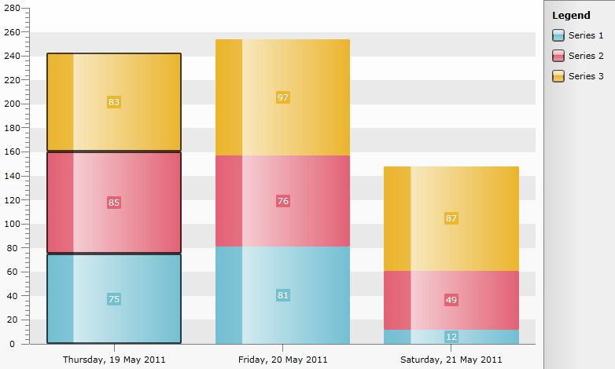

# Select Whole Stack Of Bars Using The Interactivity Effects


## 

By using the [Interactivity Effects]() you can select/hover Items or whole Series of the RadChart. This help topic will demonstrate the Interactivity Effects applied for Stacked Bar Series. The main goal is to select the whole stack of Bars by clicking on a single Bar in the Stack.
For the purpose 3 StackedBar series are created using the [Manual Series Mappings]() approach as follows:


```C#
	public partial class MainPage : UserControl
	{
	    public class Company
	    {
	        public double Value1 { get; set; }
	        public double Value2 { get; set; }
	        public double Value3 { get; set; }
	        public DateTime Category { get; set; }
	        public Company(DateTime category, double value1, double value2, double value3)
	        {
	            Category = category;
	            Value1 = value1;
	            Value2 = value2;
	            Value3 = value3;
	        }
	    } 
	
	    public MainPage()
	    {
	        InitializeComponent();
	        RadChart1.DefaultView.ChartArea.ItemClick +=new EventHandler<ChartItemClickEventArgs>(ChartArea_ItemClick);
	        DateTime today = DateTime.Today;
	        List<Company> sampleData = new List<Company>();
	        Random r = new Random();
	        for (int i = 0; i < 3; i++)
	        {
	            sampleData.Add(new Company(today.AddDays(i), r.Next(0, 100), r.Next(0, 100), r.Next(0, 100)));                
	        }
	
	        SeriesMapping seriesMapping = new SeriesMapping { LegendLabel = "Series 1" };
	        seriesMapping.ItemMappings.Add(new ItemMapping("Value1", DataPointMember.YValue));
	        seriesMapping.ItemMappings.Add(new ItemMapping("Category", DataPointMember.XCategory));
	        SeriesMapping seriesMapping1 = new SeriesMapping { LegendLabel = "Series 2" };
	        seriesMapping1.ItemMappings.Add(new ItemMapping("Value2", DataPointMember.YValue));
	        seriesMapping1.ItemMappings.Add(new ItemMapping("Category", DataPointMember.XCategory));
	        SeriesMapping seriesMapping2 = new SeriesMapping { LegendLabel = "Series 3" };
	        seriesMapping2.ItemMappings.Add(new ItemMapping("Value3", DataPointMember.YValue));
	        seriesMapping2.ItemMappings.Add(new ItemMapping("Category", DataPointMember.XCategory));
	
	        StackedBarSeriesDefinition horBar = new StackedBarSeriesDefinition();
	        horBar.InteractivitySettings.SelectionMode = Telerik.Windows.Controls.Charting.ChartSelectionMode.Multiple;
	        horBar.InteractivitySettings.SelectionScope = InteractivityScope.Item;
	        seriesMapping2.SeriesDefinition = horBar;
	        seriesMapping1.SeriesDefinition = horBar;
	        seriesMapping.SeriesDefinition = horBar;
	        RadChart1.DefaultView.ChartArea.AxisX.LayoutMode = AxisLayoutMode.Inside;
	        RadChart1.ItemsSource = sampleData;
	
	        RadChart1.SeriesMappings.Add(seriesMapping);
	        RadChart1.SeriesMappings.Add(seriesMapping1);
	        RadChart1.SeriesMappings.Add(seriesMapping2);
	    }
	
	    void ChartArea_ItemClick(object sender, ChartItemClickEventArgs e)
	    {
	        if (RadChart1.DefaultView.ChartArea.SelectedItems.Count > 1)
	        {
	            RadChart1.DefaultView.ChartArea.ClearSelection();
	        }            
	        List<DataPoint> barsInStack = new List<DataPoint>();
	        foreach (StackedBar item in this.RadChart1.DefaultView.ChartArea.ChildrenOfType<StackedBar>())
	        {
	            if (item.DataPoint.XCategory == e.DataPoint.XCategory)
	            {
	                barsInStack.Add(item.DataPoint);
	            }
	        }
	        RadChart1.DefaultView.ChartArea.SelectItems(barsInStack);
	    }
	}
```


```VB.NET
	Partial Public Class MainPage
	    Inherits UserControl
	    Public Class Company
	        Public Property Value1() As Double
	        Public Property Value2() As Double
	        Public Property Value3() As Double
	        Public Property Category() As Date
	        Public Sub New(ByVal category As Date, ByVal value1 As Double, ByVal value2 As Double, ByVal value3 As Double)
	            Me.Category = category
	            Me.Value1 = value1
	            Me.Value2 = value2
	            Me.Value3 = value3
	        End Sub
	    End Class
	
	    Public Sub New()
	        InitializeComponent()
	        AddHandler RadChart1.DefaultView.ChartArea.ItemClick, AddressOf ChartArea_ItemClick
	        Dim today As Date = Date.Today
	        Dim sampleData As New List(Of Company)()
	        Dim r As New Random()
	        For i As Integer = 0 To 2
	            sampleData.Add(New Company(today.AddDays(i), r.Next(0, 100), r.Next(0, 100), r.Next(0, 100)))
	        Next i
	
	        Dim seriesMapping As SeriesMapping = New SeriesMapping With {.LegendLabel = "Series 1"}
	        seriesMapping.ItemMappings.Add(New ItemMapping("Value1", DataPointMember.YValue))
	        seriesMapping.ItemMappings.Add(New ItemMapping("Category", DataPointMember.XCategory))
	        Dim seriesMapping1 As SeriesMapping = New SeriesMapping With {.LegendLabel = "Series 2"}
	        seriesMapping1.ItemMappings.Add(New ItemMapping("Value2", DataPointMember.YValue))
	        seriesMapping1.ItemMappings.Add(New ItemMapping("Category", DataPointMember.XCategory))
	        Dim seriesMapping2 As SeriesMapping = New SeriesMapping With {.LegendLabel = "Series 3"}
	        seriesMapping2.ItemMappings.Add(New ItemMapping("Value3", DataPointMember.YValue))
	        seriesMapping2.ItemMappings.Add(New ItemMapping("Category", DataPointMember.XCategory))
	
	        Dim horBar As New StackedBarSeriesDefinition()
	        horBar.InteractivitySettings.SelectionMode = Telerik.Windows.Controls.ChartSelectionMode.Multiple
	        horBar.InteractivitySettings.SelectionScope = InteractivityScope.Item
	        seriesMapping2.SeriesDefinition = horBar
	        seriesMapping1.SeriesDefinition = horBar
	        seriesMapping.SeriesDefinition = horBar
	        RadChart1.DefaultView.ChartArea.AxisX.LayoutMode = AxisLayoutMode.Inside
	        RadChart1.ItemsSource = sampleData
	
	        RadChart1.SeriesMappings.Add(seriesMapping)
	        RadChart1.SeriesMappings.Add(seriesMapping1)
	        RadChart1.SeriesMappings.Add(seriesMapping2)
	    End Sub
	
	    Private Sub ChartArea_ItemClick(ByVal sender As Object, ByVal e As ChartItemClickEventArgs)
	        If RadChart1.DefaultView.ChartArea.SelectedItems.Count > 1 Then
	            RadChart1.DefaultView.ChartArea.ClearSelection()
	        End If
	        Dim barsInStack As New List(Of DataPoint)()
	        For Each item As StackedBar In Me.RadChart1.DefaultView.ChartArea.ChildrenOfType(Of StackedBar)()
	            If item.DataPoint.XCategory = e.DataPoint.XCategory Then
	                barsInStack.Add(item.DataPoint)
	            End If
	        Next item
	        RadChart1.DefaultView.ChartArea.SelectItems(barsInStack)
	    End Sub
	
	End Class
```


Note that the *SelectionScope* is set to Multiple and *SelectionMode* to Item.

>tip __ChildrenOfType__() is an extension method of *Telerik.Windows.Controls.dll* and you will need to add reference to it.

The Selection is cleared each time the SelectedItems are more than one so that you won't have more than one Stack of Bars selected simultaneously.

The result can be seen below:


