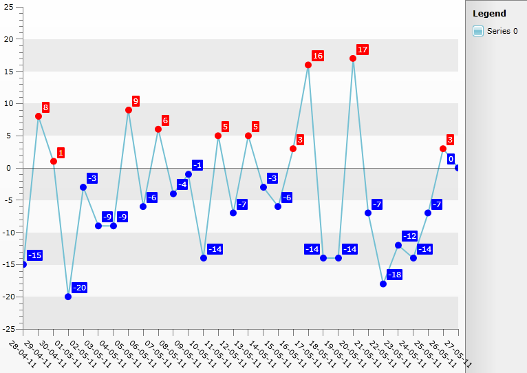

# Set Custom Fill For PointMarks Depending On Condition


## 

It is common scenario that you would like to customize the appearance of the PointMarks in a Line Series. However since Line Series are Self-Drawing Series changing a property affects all PointMarks. This help article will demonstrate how to set custom Fill for PointMarks in a single Line Serie where it is set according to their YValue - *Blue *SolidColorBrush for those that are negative and *Red *for the positive ones. Additionally the Series Items Labels are set with Color according to their corresponding PointMark.

* Create a new class named __Data__, which implements the __INotifyPropertyChanged__ interface. It will be used as an __ItemsSource__ for the chart control. The class has three properties:

- __Date__ - will be displayed on the X axis. 

- __YValue__ - will be displayed on the Y axis.

- __PointMarkFill__ - will be applied to the PointMark Style to set the Fill for the PointMark.


```C#
	public class Data : INotifyPropertyChanged
	{
	    private DateTime _date;
	    private SolidColorBrush _pointMarkFill;
	    private int _yvalue;
	    public Data(DateTime date, int yvalue)
	    {
	        this._date = date;
	        this._yvalue = yvalue;
	        this.UpdatePointMarkVisibility();
	    }
	    public event PropertyChangedEventHandler PropertyChanged;
	    public DateTime Date
	    {
	        get
	        {
	            return _date;
	        }
	        set
	        {
	            if (this._date == value)
	                return;
	            this._date = value;
	            this.OnPropertyChanged("Date");
	        }
	    }
	    public int YValue
	    {
	        get
	        {
	            return _yvalue;
	        }
	        set
	        {
	            if (this._yvalue == value)
	                return;
	            this._yvalue = value;
	            this.OnPropertyChanged("YValue");
	        }
	    }
	    public SolidColorBrush PointMarkFill
	    {
	        get
	        {
	            return _pointMarkFill;
	        }
	        private set
	        {
	            if (object.Equals(this._pointMarkFill, value))
	                return;
	            this._pointMarkFill = value;
	            this.OnPropertyChanged("PointMarkVisibility");
	        }
	    }
	    protected virtual void OnPropertyChanged(string propertyName)
	    {
	        if (this.PropertyChanged != null)
	            this.PropertyChanged(this, new PropertyChangedEventArgs(propertyName));
	    }
	    private void UpdatePointMarkVisibility()
	    {
	        if (this.YValue > 0)
	            this.PointMarkFill = new SolidColorBrush(Colors.Red);
	        else
	            this.PointMarkFill = new SolidColorBrush(Colors.Blue);
	    }
	}
```


```VB.NET
	Public Class Data
	    Implements INotifyPropertyChanged
	    Private _date As Date
	    Private _pointMarkFill As SolidColorBrush
	    Private _yvalue As Integer
	    Public Sub New(ByVal [date] As Date, ByVal yvalue As Integer)
	        Me._date = [date]
	        Me._yvalue = yvalue
	        Me.UpdatePointMarkVisibility()
	    End Sub
	    Public Property [Date]() As Date
	        Get
	            Return _date
	        End Get
	        Set(ByVal value As Date)
	            If Me._date = value Then
	                Return
	            End If
	            Me._date = value
	            Me.OnPropertyChanged("Date")
	        End Set
	    End Property
	    Public Property YValue() As Integer
	        Get
	            Return _yvalue
	        End Get
	        Set(ByVal value As Integer)
	            If Me._yvalue = value Then
	                Return
	            End If
	            Me._yvalue = value
	            Me.OnPropertyChanged("YValue")
	        End Set
	    End Property
	    Public Property PointMarkFill() As SolidColorBrush
	        Get
	            Return _pointMarkFill
	        End Get
	        Private Set(ByVal value As SolidColorBrush)
	            If Object.Equals(Me._pointMarkFill, value) Then
	                Return
	            End If
	            Me._pointMarkFill = value
	            Me.OnPropertyChanged("PointMarkVisibility")
	        End Set
	    End Property
	    Protected Overridable Sub OnPropertyChanged(ByVal propertyName As String)
	        If Me.PropertyChangedEvent IsNot Nothing Then
	            RaiseEvent PropertyChanged(Me, New PropertyChangedEventArgs(propertyName))
	        End If
	    End Sub
	    Private Sub UpdatePointMarkVisibility()
	        If Me.YValue > 0 Then
	            Me.PointMarkFill = New SolidColorBrush(Colors.Red)
	        Else
	            Me.PointMarkFill = New SolidColorBrush(Colors.Blue)
	        End If
	    End Sub
	
	    Public Event PropertyChanged(sender As Object, e As PropertyChangedEventArgs) Implements INotifyPropertyChanged.PropertyChanged
	End Class
```


Note that the check for setting the *PointMarkFill's* value is added in the end of the code snippet above.Add the RadChart declaration:


```XAML
	<telerik:RadChart Name="chart"/>
```


Retemplate the default PointMark Style - Add *Fill *Property databound to *DataItem.PointMarkFill* property of the class. Add the Style between the starting and ending tags of the UserControl:


```XAML
	<Style x:Key="MyPointMark_Style" TargetType="telerik:PointMark">
	    <Setter Property="Template">
	        <Setter.Value>
	            <ControlTemplate TargetType="telerik:PointMark">
	                <Canvas>
	                    <Path x:Name="PART_PointMarkPath"
	                    Canvas.Left="{TemplateBinding PointMarkCanvasLeft}"
	                    Canvas.Top="{TemplateBinding PointMarkCanvasTop}"
	                    Style="{TemplateBinding ShapeStyle}"
	                    Width="{TemplateBinding Size}"
	                    Height="{TemplateBinding Size}"
	                    Fill="{Binding DataItem.PointMarkFill}"
	                    Stroke="{Binding DataItem.PointMarkFill}"
	                    Stretch="Fill">
	                        <Path.Data>
	                            <PathGeometry x:Name="PART_PointMarkPathGeometry" />
	                        </Path.Data>
	                    </Path>
	                </Canvas>
	            </ControlTemplate>
	        </Setter.Value>
	    </Setter>
	</Style>
```

 Retemplate the default *SeriesItemLabel *Style so that the appropriate color will be set for each Label too:


```XAML
	<Style x:Key="MySeriesItemLabel_Style" TargetType="telerik:SeriesItemLabel">
	    <Setter Property="Padding" Value="2,0" />
	    <Setter Property="IsHitTestVisible" Value="False"/>
	    <Setter Property="ContentTemplate">
	        <Setter.Value>
	            <DataTemplate>
	                <TextBlock Text="{Binding RelativeSource={RelativeSource TemplatedParent}, Path=Content }" TextAlignment="Center" />
	            </DataTemplate>
	        </Setter.Value>
	    </Setter>
	    <Setter Property="Template" >
	        <Setter.Value>
	            <ControlTemplate TargetType="telerik:SeriesItemLabel">
	                <Canvas x:Name="PART_MainContainer">
	                    <Path                            
	                Visibility="{TemplateBinding ConnectorVisibility}"
	                Style="{TemplateBinding ConnectorStyle}"
	                Stroke="{TemplateBinding Stroke}" 
	                StrokeThickness="{TemplateBinding StrokeThickness}">
	                        <Path.Data>
	                            <PathGeometry >
	                                <PathGeometry.Figures>
	                                    <PathFigure x:Name="PART_Connector">
	                                        <PathFigure.Segments>
	                                            <PolyLineSegment />
	                                        </PathFigure.Segments>
	                                    </PathFigure>
	                                </PathGeometry.Figures>
	                            </PathGeometry>
	                        </Path.Data>
	                    </Path>
	                    <Border x:Name="PART_TextContainer"
	                Style="{TemplateBinding LabelStyle}"
	                BorderBrush="{TemplateBinding Stroke}"
	                Background="{Binding DataItem.PointMarkFill}"
	                Width="{TemplateBinding Width}"
	                Height="{TemplateBinding Height}">
	                        <ContentPresenter Margin="{TemplateBinding Padding}" />
	                    </Border>
	                </Canvas>
	            </ControlTemplate>
	        </Setter.Value>
	    </Setter>
	</Style>
```


The chart is populated with data in code-behind using [Manual Series Mappings](). The last line in the code snippet demonstrates how the Style for the PointMarks can be set.


```C#
	List<Data> exportData = new List<Data>();
	DateTime baseDate = DateTime.Today;
	Random r = new Random();
	for (int i = 0; i < 30; i++)
	{
	    exportData.Add(new Data(baseDate.AddDays(i), r.Next(-20, 20)));
	}
	SeriesMapping mapping = new SeriesMapping();
	mapping.ItemMappings.Add(new ItemMapping("YValue", DataPointMember.YValue));
	mapping.ItemMappings.Add(new ItemMapping("Date", DataPointMember.XCategory));
	chart.ItemsSource = exportData;
	chart.SeriesMappings.Add(mapping);
	chart.DefaultView.ChartArea.AxisX.IsDateTime = true;
	chart.DefaultView.ChartArea.AxisX.LabelRotationAngle = 45;
	chart.DefaultView.ChartArea.AxisX.DefaultLabelFormat = "dd-MM-yy";
	LineSeriesDefinition line = new LineSeriesDefinition();
	chart.DefaultSeriesDefinition = line;
	line.ShowPointMarks = true;
	line.ShowItemLabels = true;
	chart.DefaultSeriesDefinition.PointMarkItemStyle = this.Resources["MyPointMark_Style"] as Style;
	chart.DefaultSeriesDefinition.SeriesItemLabelStyle = this.Resources["MySeriesItemLabel_Style"] as Style;
```


```VB.NET
	Dim exportData As New List(Of Data)()
	Dim baseDate As Date = Date.Today
	Dim r As New Random()
	For i As Integer = 0 To 29
	    exportData.Add(New Data(baseDate.AddDays(i), r.Next(-20, 20)))
	Next i
	Dim mapping As New SeriesMapping()
	mapping.ItemMappings.Add(New ItemMapping("YValue", DataPointMember.YValue))
	mapping.ItemMappings.Add(New ItemMapping("Date", DataPointMember.XCategory))
	chart.ItemsSource = exportData
	chart.SeriesMappings.Add(mapping)
	chart.DefaultView.ChartArea.AxisX.IsDateTime = True
	chart.DefaultView.ChartArea.AxisX.LabelRotationAngle = 45
	chart.DefaultView.ChartArea.AxisX.DefaultLabelFormat = "dd-MM-yy"
	Dim line As New LineSeriesDefinition()
	chart.DefaultSeriesDefinition = line
	line.ShowPointMarks = True
	line.ShowItemLabels = True
	chart.DefaultSeriesDefinition.PointMarkItemStyle = TryCast(Me.Resources("MyPointMark_Style"), Style)
	chart.DefaultSeriesDefinition.SeriesItemLabelStyle = TryCast(Me.Resources("MySeriesItemLabel_Style"), Style)
```


The result can be seen on the image below:

