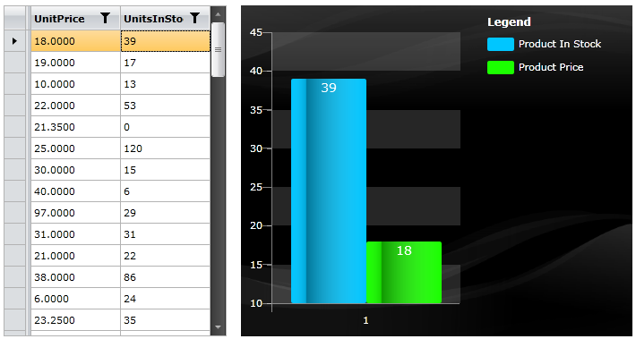
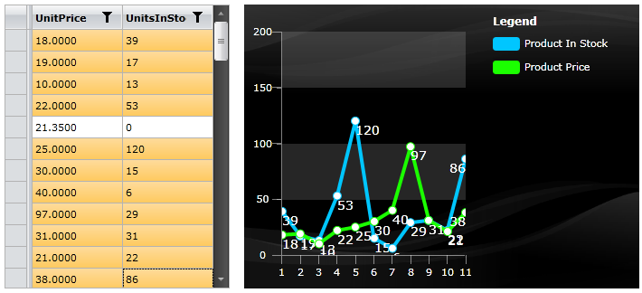
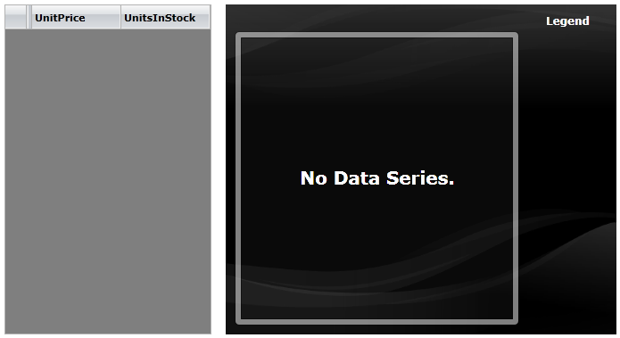
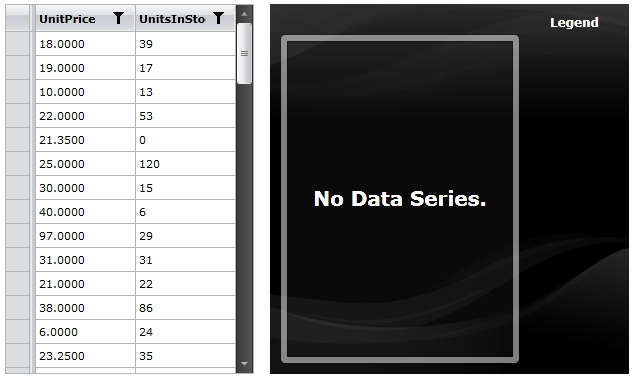

# Integration with RadGridView

The Telerik __RadChart__ supports great integration with other controls. This tutorial will show you how to integrate __RadChart__ with __RadGridView__.

The final result should look like the snapshots below: 




>This tutorial will use the __Northwind__ database, which can be downloaded from [here](http://www.microsoft.com/downloads/details.aspx?FamilyID=06616212-0356-46A0-8DA2-EEBC53A68034&displaylang=en).

* Here is the initial staging: 


```XAML
	<Grid x:Name="LayoutRoot" Background="White">
	    <Grid.ColumnDefinitions>
	        <ColumnDefinition Width="Auto"/>
	        <ColumnDefinition Width="*"/>
	    </Grid.ColumnDefinitions>
	    <telerik:RadGridView Margin="8" 
	                         AutoGenerateColumns="False" SelectionMode="Extended"
	                         IsReadOnly="True" ShowGroupPanel="False">
	        <telerik:RadGridView.Columns>
	           <telerik:GridViewDataColumn DataMemberBinding="{Binding UnitPrice}"/>
	           <telerik:GridViewDataColumn DataMemberBinding="{Binding UnitsInStock}"/>
	        </telerik:RadGridView.Columns>
	    </telerik:RadGridView>
	    <telerik:RadChart x:Name="radChart" Grid.Column="1" Margin="8"/>
	</Grid>
```



On the left side you have a __RadGridView__, where the __UnitPrice__ and __UnitsInStock__ properties from the Products table in the Northwind database will be displayed. When you select a single row, a bar chart will be generated to compare both of the parameters. If you select several rows, then a line chart will be generated.

* Populate the __RadGridView__ control with all products from the Northwind database. Here is a sample code how to do that:


```C#
	public class NorthwindDataSource
	{
		private static NorthwindEntities northwindEntity;
		public NorthwindDataSource()
		{
			northwindEntity = new NorthwindEntities( new Uri( "http://localhost:52981/Services/SampleAdoNetDataService.svc/" ) );
			this.Products = new ObservableCollection<Products>();
	
			var query = from p in northwindEntity.Products
						select p;
	
			DataServiceQuery<Products> products = ( DataServiceQuery<Products> )query;
			
			products.BeginExecute(
			   (IAsyncResult result) => EntitiesLoaded<Products>( result, this.Products ), products );
		}
	
		public ObservableCollection<Products> Products
		{
			get;
			set;
		}
	
		private static void EntitiesLoaded<T>(IAsyncResult result, Collection<T> entities )
		{
			DataServiceQuery<T> query = result.AsyncState as DataServiceQuery<T>;
			foreach ( T entity in query.EndExecute( result ) )
			{
				entities.Add( entity );
			}
		}
	}
```


```C#
	public class NorthwindDataSource
	{
	    private static NorthwindEntities northwindEntity;
	    public NorthwindDataSource()
	    {
	        northwindEntity = new NorthwindEntities( new Uri( "http://localhost:52981/Services/SampleAdoNetDataService.svc/" ) );
	        this.Products = new ObservableCollection<Products>();
	
	        foreach ( Products p in northwindEntity.Products.Execute() )
	        {
	            this.Products.Add( p );
	        }
	    }
	
	    public ObservableCollection<Products> Products
	    {
	        get;
	        set;
	    }
	}
```
```VB.NET
	Public Class NorthwindDataSource
	    Private Shared northwindEntity As NorthwindEntities
	
	    Public Sub New()
	        northwindEntity = New NorthwindEntities(New Uri("http://localhost:52981/Services/SampleAdoNetDataService.svc/"))
	        Me.Products = New ObservableCollection(Of Products)()
	
	        Dim query = From p In northwindEntity.Products _
	            Select p
	
	        Dim products As DataServiceQuery(Of Products) = DirectCast(query, DataServiceQuery(Of Products))
	        products.BeginExecute(Sub(result As IAsyncResult) EntitiesLoaded(Of Products)(result, Me.Products), products)
	    End Sub
	
	    Private _Products As ObservableCollection(Of Products)
	    Public Property Products() As ObservableCollection(Of Products)
	        Get
	            Return _Products
	        End Get
	        Set(ByVal value As ObservableCollection(Of Products))
	            _Products = value
	        End Set
	    End Property
	
	    Private Shared Sub EntitiesLoaded(Of T)(ByVal result As IAsyncResult, ByVal entities As Collection(Of T))
	        Dim query As DataServiceQuery(Of T) = TryCast(result.AsyncState, DataServiceQuery(Of T))
	        For Each entity As T In query.EndExecute(result)
	            entities.Add(entity)
	        Next
	    End Sub
	End Class
```


```VB.NET
	Public Class NorthwindDataSource
	    Private Shared northwindEntity As NorthwindEntities
	
	    Public Sub New()
	        northwindEntity = New NorthwindEntities(New Uri("http://localhost:52981/Services/SampleAdoNetDataService.svc/"))
	        Me.Products = New ObservableCollection(Of Products)()
	        For Each p As Products In northwindEntity.Products.Execute()
	            Me.Products.Add(p)
	        Next
	    End Sub
	
	    Private _Products As ObservableCollection(Of Products)
	    Public Property Products() As ObservableCollection(Of Products)
	        Get
	            Return _Products
	        End Get
	        Set(ByVal value As ObservableCollection(Of Products))
	            _Products = value
	        End Set
	    End Property
	End Class
```


Declare the __NorthwindDataSource__ class as a resource in your application and set it as an __ItemsSource__ for the gridview. 


```XAML
	<FrameworkElement.Resources>
	    <example:NorthwindDataSource x:Key="DataSource"/>
	</FrameworkElement.Resources>
```


```XAML
	<telerik:RadGridView Margin="8" 
	AutoGenerateColumns="False" SelectionMode="Multiple"
	IsReadOnly="True" ShowGroupPanel="False"
	ItemsSource="{Binding Source={StaticResource DataSource}, Path=Products}" />
```


Here is the result so far: 



* The next step is to build the bar chart (comparing the __UnitPrice__ and __UnitsInStock__ parameters) depending on the selected row(s) in the gridview.

* Attach to the __SelectionChanged__ event of the __RadGridView__.


```XAML
	<telerik:RadGridView x:Name="radGridView" Margin="8" 
	AutoGenerateColumns="False" SelectionMode="Multiple"
	IsReadOnly="True" ShowGroupPanel="False"
	ItemsSource="{Binding Source={StaticResource DataSource}, Path=Products}"
	SelectionChanged="radGridView_SelectionChanged" />
```


* Switch to the code-behind and add the following code in the event handler. It aims to get all the selected products and to build the chart. 


```C#
	private void radGridView_SelectionChanged(object sender, SelectionChangeEventArgs e)
	{
	    Collection<Products> selectedList = new Collection<Products>();
	
	    // Get all selected Items
	    foreach (Products product in radGridView.SelectedItems)
	    {
	        selectedList.Add(product);
	    }
	
	    CreateSeriesMappings(selectedList);
	    SetChartItemsSource(selectedList);
	}
```
```VB.NET
	Private Sub radGridView_SelectionChanged(ByVal sender As Object, ByVal e As SelectionChangeEventArgs)
	    Dim selectedList As New Collection(Of Products)()
	    ' Get all selected Items '
	
	    For Each product As Products In radGridView.SelectedItems
	        selectedList.Add(product)
	    Next
	
	    CreateSeriesMappings(selectedList)
	    SetChartItemsSource(selectedList)
	End Sub
```


* Here is the code for the __CreateSeriesMapping__ method. It builds the __RadChart__ control based on the selected products. If there is only one product that is selected, then the result will be a __BarChart__ comparing the __UnitPrice__ and the __UnitsInStock__ parameters. If there are two or more products that are selected, then the result will be a __LineChart__. 


```C#
	private void CreateSeriesMappings( Collection<Products> invoicesList )
	{
	    radChart.SeriesMappings.Clear();
	
	    SeriesMapping seriesMapping = new SeriesMapping();
	    seriesMapping.SeriesDefinition = invoicesList.Count < 2 ? ( ISeriesDefinition )new BarSeriesDefinition() : ( ISeriesDefinition )new LineSeriesDefinition();
	    seriesMapping.LegendLabel = "Product In Stock";
	
	    ItemMapping itemMapping = new ItemMapping();
	    itemMapping.DataPointMember = DataPointMember.YValue;
	    itemMapping.FieldName = "UnitsInStock";
	    seriesMapping.ItemMappings.Add( itemMapping );
	
	    SeriesMapping seriesMapping1 = new SeriesMapping();
	    seriesMapping1.SeriesDefinition = invoicesList.Count < 2 ? ( ISeriesDefinition )new BarSeriesDefinition() : ( ISeriesDefinition )new LineSeriesDefinition();
	    seriesMapping1.LegendLabel = "Product Price";
	
	    ItemMapping itemMapping1 = new ItemMapping();
	    itemMapping1.DataPointMember = DataPointMember.YValue;
	    itemMapping1.FieldName = "UnitPrice";
	    seriesMapping1.ItemMappings.Add( itemMapping1 );
	
	    radChart.SeriesMappings.Add( seriesMapping );
	    radChart.SeriesMappings.Add( seriesMapping1 );
	}
```
```VB.NET
	Private Sub CreateSeriesMappings(ByVal invoicesList As Collection(Of Products))
	    radChart.SeriesMappings.Clear()
	
	    Dim seriesMapping As New SeriesMapping()
	    seriesMapping.SeriesDefinition = If(invoicesList.Count < 2, DirectCast(New BarSeriesDefinition(), ISeriesDefinition), DirectCast(New LineSeriesDefinition(), ISeriesDefinition))
	    seriesMapping.LegendLabel = "Product In Stock"
	
	    Dim itemMapping As New ItemMapping()
	    itemMapping.DataPointMember = DataPointMember.YValue
	    itemMapping.FieldName = "UnitsInStock"
	    seriesMapping.ItemMappings.Add(itemMapping)
	
	    Dim seriesMapping1 As New SeriesMapping()
	    seriesMapping1.SeriesDefinition = If(invoicesList.Count < 2, DirectCast(New BarSeriesDefinition(), ISeriesDefinition), DirectCast(New LineSeriesDefinition(), ISeriesDefinition))
	    seriesMapping1.LegendLabel = "Product Price"
	
	    Dim itemMapping1 As New ItemMapping()
	    itemMapping1.DataPointMember = DataPointMember.YValue
	    itemMapping1.FieldName = "UnitPrice"
	    seriesMapping1.ItemMappings.Add(itemMapping1)
	
	    radChart.SeriesMappings.Add(seriesMapping)
	    radChart.SeriesMappings.Add(seriesMapping1)
	End Sub
```


* The __SetChartItemsSource__ method does only one thing - it sets the __ItemsSource__ of the chart. 


```C#
	private void SetChartItemsSource( Collection<Products> invoicesList )
	{
	    radChart.ItemsSource = invoicesList;
	}
```
```VB.NET
	Private Sub SetChartItemsSource(ByVal invoicesList As Collection(Of Products))
	    radChart.ItemsSource = invoicesList
	End Sub
```


Here is the final result, when you select single row from the grid view: 


And when you select multiple rows:


## See Also

 * [Drill Down Chart]()
 * [MVVM Support]()
