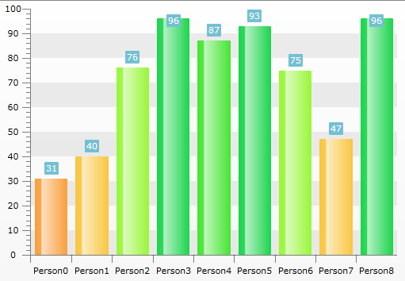
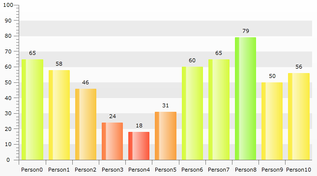

# MVVM Support


## 

The Telerik __RadChart__ control can be used with great success with the __Model-View-ViewModel (MVVM)__ pattern. This tutorial will demonstrate how to use the MVVM pattern to get a better control over the colors of the bars of a single series.

* Create a new class named __Person__, which implements the __INotifyPropertyChanged__ interface. 


```C#
	public class Person : INotifyPropertyChanged
	{
	    private double grade;
	    private string _name;
	    public string Name
	    {
	        get
	        {
	            return _name;
	        }
	        private set
	        {
	            _name = value;
	        }
	    }
	    public double Grade
	    {
	        get
	        {
	            return this.grade;
	        }
	        set
	        {
	            this.grade = value;
	            this.OnPropertyChanged( "Grade" );
	        }
	    }
	    public Person( string name, double grade )
	    {
	        Name = name;
	        Grade = grade;
	    }
	    public event PropertyChangedEventHandler PropertyChanged;
	    protected virtual void OnPropertyChanged( string propertyName )
	    {
	        if ( this.PropertyChanged != null )
	            this.PropertyChanged( this, new PropertyChangedEventArgs( propertyName ) );
	    }
	}
```
```VB.NET
	Public Class Person
	    Implements INotifyPropertyChanged
	    Private m_grade As Double
	    Private _name As String
	
	    Public Property Name() As String
	        Get
	            Return _name
	        End Get
	        Private Set(ByVal value As String)
	            _name = value
	        End Set
	    End Property
	
	    Public Property Grade() As Double
	        Get
	            Return Me.m_grade
	        End Get
	        Set(ByVal value As Double)
	            Me.m_grade = value
	            Me.OnPropertyChanged("Grade")
	        End Set
	    End Property
	
	    Public Sub New(ByVal name__1 As String, ByVal grade__2 As Double)
	        Name = name__1
	        Grade = grade__2
	    End Sub
	
	    Protected Overridable Sub OnPropertyChanged(ByVal propertyName As String)
	        RaiseEvent PropertyChanged(Me, New PropertyChangedEventArgs(propertyName))
	    End Sub
	
	    Public Event PropertyChanged(sender As Object, e As PropertyChangedEventArgs) Implements INotifyPropertyChanged.PropertyChanged
	End Class
```


The class has two properties:

* __Name__ - will be displayed on the X axis. 


* __Grade__ - will be displayed on the Y axis.

Create a new class named __PersonViewModel__, which implements the __INotifyPropertyChanged__ interface. It will be used as an __ItemsSource__ for the chart control. 


```C#
	public class PersonViewModel : INotifyPropertyChanged
	{
	    private Person _person;
	    public Person Person
	    {
	        get
	        {
	            return _person;
	        }
	        private set
	        {
	            _person = value;
	        }
	    }
	    private Brush _gradeColor;
	    public Brush GradeColor
	    {
	        get
	        {
	            return _gradeColor;
	        }
	        private set
	        {
	            _gradeColor = value;
	        }
	    }
	    public PersonViewModel( Person person )
	    {
	        this.Person = person;
	        person.PropertyChanged += HandleStudentPropertyChanged;
	        this.UpdateGradeColor();
	    }
	    private void HandleStudentPropertyChanged( object sender, PropertyChangedEventArgs e )
	    {
	        if ( e.PropertyName == "Grade" )
	            this.UpdateGradeColor();
	    }
	    private void UpdateGradeColor()
	    {
	        if ( this.Person.Grade < 10 )
	            this.GradeColor = this.CreateBrush( "#FFFF3D40" );
	        else if ( this.Person.Grade < 20 )
	            this.GradeColor = this.CreateBrush( "#FFFD583A" );
	        else if ( this.Person.Grade < 30 )
	            this.GradeColor = this.CreateBrush( "#FFFD8145" );
	        else if ( this.Person.Grade < 40 )
	            this.GradeColor = this.CreateBrush( "#FFFAA03D" );
	        else if ( this.Person.Grade < 50 )
	            this.GradeColor = this.CreateBrush( "#FFFAC741" );
	        else if ( this.Person.Grade < 60 )
	            this.GradeColor = this.CreateBrush( "#FFFCED40" );
	        else if ( this.Person.Grade < 70 )
	            this.GradeColor = this.CreateBrush( "#FFD7FC3C" );
	        else if ( this.Person.Grade < 80 )
	            this.GradeColor = this.CreateBrush( "#FF99F839" );
	        else if ( this.Person.Grade < 90 )
	            this.GradeColor = this.CreateBrush( "#FF46E633" );
	        else
	            this.GradeColor = this.CreateBrush( "#FF1CD64D" );
	        this.OnPropertyChanged( "GradeColor" );
	    }
	    public event PropertyChangedEventHandler PropertyChanged;
	    protected virtual void OnPropertyChanged( string propertyName )
	    {
	        if ( this.PropertyChanged != null )
	            this.PropertyChanged( this, new PropertyChangedEventArgs( propertyName ) );
	    }
	    private Brush CreateBrush( string color )
	    {
	        return new SolidColorBrush( this.GetColorFromHexString( color ) );
	    }
	    private Color GetColorFromHexString( string s )
	    {
	        s = s.Replace( "#", string.Empty );
	        byte a = System.Convert.ToByte( s.Substring( 0, 2 ), 16 );
	        byte r = System.Convert.ToByte( s.Substring( 2, 2 ), 16 );
	        byte g = System.Convert.ToByte( s.Substring( 4, 2 ), 16 );
	        byte b = System.Convert.ToByte( s.Substring( 6, 2 ), 16 );
	        return Color.FromArgb( a, r, g, b );
	    }
	}
```
```VB.NET
	Public Class PersonViewModel
	    Implements INotifyPropertyChanged
	    Private _person As Person
	    Public Property Person() As Person
	        Get
	            Return _person
	        End Get
	        Private Set(ByVal value As Person)
	            _person = value
	        End Set
	    End Property
	
	    Private _gradeColor As Brush
	    Public Property GradeColor() As Brush
	        Get
	            Return _gradeColor
	        End Get
	        Private Set(ByVal value As Brush)
	            _gradeColor = value
	        End Set
	    End Property
	
	    Public Sub New(ByVal person As Person)
	        Me.Person = person
	        AddHandler person.PropertyChanged, AddressOf HandleStudentPropertyChanged
	        Me.UpdateGradeColor()
	    End Sub
	
	    Private Sub HandleStudentPropertyChanged(ByVal sender As Object, ByVal e As PropertyChangedEventArgs)
	        If e.PropertyName = "Grade" Then
	            Me.UpdateGradeColor()
	        End If
	    End Sub
	
	    Private Sub UpdateGradeColor()
	        If Me.Person.Grade < 10 Then
	            Me.GradeColor = Me.CreateBrush("#FFFF3D40")
	        ElseIf Me.Person.Grade < 20 Then
	            Me.GradeColor = Me.CreateBrush("#FFFD583A")
	        ElseIf Me.Person.Grade < 30 Then
	            Me.GradeColor = Me.CreateBrush("#FFFD8145")
	        ElseIf Me.Person.Grade < 40 Then
	            Me.GradeColor = Me.CreateBrush("#FFFAA03D")
	        ElseIf Me.Person.Grade < 50 Then
	            Me.GradeColor = Me.CreateBrush("#FFFAC741")
	        ElseIf Me.Person.Grade < 60 Then
	            Me.GradeColor = Me.CreateBrush("#FFFCED40")
	        ElseIf Me.Person.Grade < 70 Then
	            Me.GradeColor = Me.CreateBrush("#FFD7FC3C")
	        ElseIf Me.Person.Grade < 80 Then
	            Me.GradeColor = Me.CreateBrush("#FF99F839")
	        ElseIf Me.Person.Grade < 90 Then
	            Me.GradeColor = Me.CreateBrush("#FF46E633")
	        Else
	            Me.GradeColor = Me.CreateBrush("#FF1CD64D")
	        End If
	
	        Me.OnPropertyChanged("GradeColor")
	    End Sub
	
	    Protected Overridable Sub OnPropertyChanged(ByVal propertyName As String)
	        RaiseEvent PropertyChanged(Me, New PropertyChangedEventArgs(propertyName))
	    End Sub
	
	    Private Function CreateBrush(ByVal color As String) As Brush
	        Return New SolidColorBrush(Me.GetColorFromHexString(color))
	    End Function
	
	    Private Function GetColorFromHexString(ByVal s As String) As Color
	        s = s.Replace("#", String.Empty)
	
	        Dim a As Byte = System.Convert.ToByte(s.Substring(0, 2), 16)
	        Dim r As Byte = System.Convert.ToByte(s.Substring(2, 2), 16)
	        Dim g As Byte = System.Convert.ToByte(s.Substring(4, 2), 16)
	        Dim b As Byte = System.Convert.ToByte(s.Substring(6, 2), 16)
	        Return Color.FromArgb(a, r, g, b)
	    End Function
	
	    Public Event PropertyChanged(sender As Object, e As PropertyChangedEventArgs) Implements INotifyPropertyChanged.PropertyChanged
	End Class
```


The class has two properties:

* A reference to a __Person__ object. 


* __GradeColor__ - the corresponding color of the referenced person.

There are a few helper methods. The __UpdateGradeColor__ method is used to return a specific color, based on the person __Grade__ property.

* Add a new chart declaration to your XAML.


```XAML
	<telerik:RadChart x:Name="radChart" Margin="8"/>
```


* The chart will be built in the code-behind. 

* A BarChart will be used. 


* The __Grade__ property will be displayed on the ordinate. 


* The __Name__ property will be displayed on the absciss. 


```C#
	private void MVVM_Loaded( object sender, RoutedEventArgs e )
	{
	    radChart.DefaultView.ChartArea.AxisY.AutoRange = false;
	    radChart.DefaultView.ChartArea.AxisY.MinValue = 0;
	    radChart.DefaultView.ChartArea.AxisY.MaxValue = 100;
	    radChart.DefaultView.ChartArea.AxisY.Step = 10;
	    radChart.DefaultView.ChartLegend.Visibility = System.Windows.Visibility.Collapsed;
	    radChart.DefaultSeriesDefinition = new BarSeriesDefinition();
	
	    SeriesMapping seriesMapping = new SeriesMapping();
	    seriesMapping.ItemMappings.Add( new ItemMapping( "Person.Grade", DataPointMember.YValue ) );
	    seriesMapping.ItemMappings.Add( new ItemMapping( "Person.Name", DataPointMember.XCategory ) );
	    radChart.SeriesMappings.Add( seriesMapping );
	    radChart.ItemsSource = this.GetData();
	}
```
```VB.NET
	Private Sub MVVM_Loaded(ByVal sender As Object, ByVal e As RoutedEventArgs)
	    radChart.DefaultView.ChartArea.AxisY.AutoRange = False
	    radChart.DefaultView.ChartArea.AxisY.MinValue = 0
	    radChart.DefaultView.ChartArea.AxisY.MaxValue = 100
	    radChart.DefaultView.ChartArea.AxisY.[Step] = 10
	
	    radChart.DefaultView.ChartLegend.Visibility = System.Windows.Visibility.Collapsed
	    radChart.DefaultSeriesDefinition = New BarSeriesDefinition()
	
	    Dim seriesMapping As New SeriesMapping()
	    seriesMapping.ItemMappings.Add(New ItemMapping("Person.Grade", DataPointMember.YValue))
	    seriesMapping.ItemMappings.Add(New ItemMapping("Person.Name", DataPointMember.XCategory))
	
	    radChart.SeriesMappings.Add(seriesMapping)
	    radChart.ItemsSource = Me.GetData()
	End Sub
```


Here is the code for the __GetData()__ method, which creates the mockup data: 


```C#
	private List<PersonViewModel> GetData()
	{
	    Random rand = new Random( DateTime.Now.Millisecond );
	    List<Person> studentList = new List<Person>();
	    for ( int i = 0; i < rand.Next( 9, 12 ); i++ )
	        studentList.Add( new Person( "Person" + i, rand.Next( 15, 100 ) ) );
	    List<PersonViewModel> modelList = new List<PersonViewModel>();
	    foreach ( Person person in studentList )
	        modelList.Add( new PersonViewModel( person ) );
	    return modelList;
	}
```
```VB.NET
	Private Function GetData() As List(Of PersonViewModel)
        Dim rand As Random = New Random(DateTime.Now.Millisecond)
        Dim studentList As List(Of Person) = New List(Of Person)
        Dim i As Integer = 0
        Do While (i < rand.Next(9, 12))
            studentList.Add(New Person(("Person" + i), rand.Next(15, 100)))
            i = (i + 1)
        Loop
        
        Dim modelList As List(Of PersonViewModel) = New List(Of PersonViewModel)
        For Each person As Person In studentList
            modelList.Add(New PersonViewModel(person))
        Next
        Return modelList
    End Function
```


The result so far can be seen on the image below: 


* The final step is to bind the __GradeColor__ property of the __PersonViewModel__ business object to the background of a single bar.

In order to change the background of each bar from the chart, you need to use the __CreateItemStyleDelegate__ property of the __RadChart__. For more information read [here]().

Here is the method that will be passed to the delegate.


```C#
	public Style BuildCustomItemStyle( Control item, Style style, DataPoint point, DataSeries dataSeries )
	{
	    if ( ( item as BaseChartItem ) == null )
	    {
	        return style;
	    }
	    Style newStyle = new Style();
	    newStyle.BasedOn = style;
	    newStyle.TargetType = typeof( Shape );
	    Brush brush = ( dataSeries[ ( item as BaseChartItem ).CurrentIndex ].DataItem as PersonViewModel ).GradeColor;
	    newStyle.Setters.Add( new Setter( Shape.FillProperty, brush ) );
	    return newStyle;
	}
```
```VB.NET
	Public Function BuildCustomItemStyle(item As Control, style As Style, point As DataPoint, dataSeries As DataSeries) As Style
	    If TryCast(item, BaseChartItem) Is Nothing Then
	        Return style
	    End If
	    Dim newStyle As New Style()
	    newStyle.BasedOn = style
	    newStyle.TargetType = GetType(Shape)
	    Dim brush As Brush = TryCast(dataSeries(TryCast(item, BaseChartItem).CurrentIndex).DataItem, PersonViewModel).GradeColor
	    newStyle.Setters.Add(New Setter(Shape.FillProperty, brush))
	    Return newStyle
	End Function
```


To pass this method to the __RadChart__ use its __CustomItemStyleDelegate__ property.


```C#
	this.radChart.CreateItemStyleDelegate = this.BuildCustomItemStyle;
```
```VB.NET
	Me.radChart.CreateItemStyleDelegate = Me.BuildCustomItemStyle
```


Set this property into the __MVVM_Loaded__ handler.

Here is the final result: 


Additionally you may want to remove the Background from the SeriesItemsLabels. This can be achieved by retemplating the default Style so that the Background applied to the Labels is Transparent and setting the Foreground to Black for example:


```XAML
	<Style x:Key="MySeriesItemLabel_Style" TargetType="telerik:SeriesItemLabel">
	    <Setter Property="Padding" Value="2,0" />
	    <Setter Property="Foreground" Value="Black"/>
	    <Setter Property="IsHitTestVisible" Value="False"/>
	    <Setter Property="ContentTemplate">
	        <Setter.Value>
	            <DataTemplate>
	                <TextBlock Text="{Binding RelativeSource={RelativeSource TemplatedParent}, Path=Content }" TextAlignment="Center" />
	            </DataTemplate>
	        </Setter.Value>
	    </Setter>
	    <Setter Property="Template" >
	        <Setter.Value>
	            <ControlTemplate TargetType="telerik:SeriesItemLabel">
	                <Canvas x:Name="PART_MainContainer">
	                    <Path                            
	                  Visibility="{TemplateBinding ConnectorVisibility}"
	                  Style="{TemplateBinding ConnectorStyle}"
	                  Stroke="{TemplateBinding Stroke}"
	                  StrokeThickness="{TemplateBinding StrokeThickness}">
	                        <Path.Data>
	                            <PathGeometry >
	                                <PathGeometry.Figures>
	                                    <PathFigure x:Name="PART_Connector">
	                                        <PathFigure.Segments>
	                                            <PolyLineSegment />
	                                        </PathFigure.Segments>
	                                    </PathFigure>
	                                </PathGeometry.Figures>
	                            </PathGeometry>
	                        </Path.Data>
	                    </Path>
	                    <Border x:Name="PART_TextContainer"
	                   Style="{TemplateBinding LabelStyle}"
	                   BorderBrush="{TemplateBinding Stroke}"
	                   Background="Transparent"
	                   Width="{TemplateBinding Width}"
	                   Height="{TemplateBinding Height}">
	                        <ContentPresenter Margin="{TemplateBinding Padding}" />
	                    </Border>
	                </Canvas>
	            </ControlTemplate>
	        </Setter.Value>
	    </Setter>
	</Style>
```


Don't forget to apply the Style to the SeriesItemLabelStyle property of the Series Definition:


```C#
	radChart.DefaultSeriesDefinition.SeriesItemLabelStyle = this.Resources["MySeriesItemLabel_Style"] as Style;
```
```VB.NET
	radChart.DefaultSeriesDefinition.SeriesItemLabelStyle = TryCast(Me.Resources("MySeriesItemLabel_Style"), Style)
```


The result:


## See Also

 * [Drill Down Chart]()

 * [Integration with RadGridView]()
