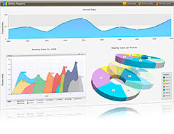

# Overview



>important We encourage you to review our new control [RadChartView]() for super-fast visualization of your data. The new RadChartView is a set of controls - RadCartesianChart,RadFunnelChart, RadPieChart and RadPolarChart. The new components have better implementation and improved performance. Furthermore, the new charts are also quite flexible and easier to set up. You can read about the differences between the charts in the [RadChart vs. RadChartView] () help article.

__RadChart__ for {{ site.framework_name }} is the exact tool to transform various business scenarios into interactive, rich, animated charts that enable the end users to analyze complex data. Telerik {{ site.framework_name }} Chart is a 100% lookless control providing full support for Expression Blend.  All 2D series, charts and axis elements can be dropped independently in Blend and styled individually. Furthermore the control offers several pre-defined skins, which will help you to deliver a consistent look and feel in your application.application best.

>In order to use __RadChart__ control, you will need to add references to the following assemblies:
* __Telerik.Windows.Controls.Charting.dll__
* __Telerik.Windows.Controls.dll__
* __Telerik.Windows.Data.dll__

RadChart key features list:

* __2D Chart Types__: Telerik __RadChart__ supports __24 types of 2D__ charts to help you create rich, visually-appealing presentations, among which are: __Bar__, __Stacked Bar 100__, __Line__, __StackedLine__, __Area__, __Range__, __Spline__, __Bubble__, __Candlestick__, __Pie__, __Doughnut__ and many more. [Read more]()

* __3D Chart Types__: Telerik __RadChart__ is the first commercial control to support 3D charts. The 3D charts gallery includes __10__ types, such as __Line__, __Bar__, __Area__, __Pie__, __Doughnut__ and more. Furthermore the control offers rotation on 360 degrees on the X axis. [Read more]()

* __Rich Data Binding Support__: Leveraging the databinding capabilities, Telerik RadChart can bind to various data services and other sources, such as Data Services, Lists of objects, ArrayList, ObservableCollection (with support for change notification). [Read more]()

* __Automated Data Binding to Nested Collections__: With the increasing number of data sources and support for various data services, a new scenario is becoming more common: data binding to a collection of collections or nested collections. To support new data binding scenarios, Telerik RadChart provides automated data binding to Nested Collections. 

* __Data Virtualization and Data Sampling__: This functionality allows you to handle and visualize millions of data points in a matter of milliseconds. The control splits the data into groups and aggregates each group using one of the many provided sampling functions. The end result is a graph that summarizes the real data close enough while performing times faster. The control comes with a number of pre set sampling functions but you can also specify your own in order to achieve the most accurate chart view for your application. [Read more]()

* __Scrolling and Zooming__: To make it easier to drill-down inside and navigate the entire data source we have also provided zooming and scrolling functionality and a modified __RadSlider__ to make it even more convenient to browse. [Read more]()

* __Tooltip Support__: Telerik RadChart allows adding tooltips to your charts for better visualization of your data. The tooltips can easily show the actual numbers behind the chart or even another chart. [Read more]()

* __Styling and Appearance__: Telerik RadChart is a 100% lookless control providing full support for Expression Blend.  All 2D series, charts and axis elements can be dropped independently in Blend and styled individually. Furthermore the control ships with several pre-defined skins, which will help you, deliver a consistent look and feel in your application. Restyling __RadChart__ with the available themes is as simple as changing a single property. The added custom style properties for all major chart elements and all series facilitate using custom user styles.

* __Animations and Interactivity__: Telerik RadChart offers rich animations out of the box. Define your own settings that suits best your needs. [Read more]()

* __Categorical X Axis__: With this feature enabled X axis can be used to plot not only values (e.g. number of sales, etc.), but also categories (e.g. months of the year, units, people, etc.). Using a Category axis, the __RadChart__ treats data as a sequence of non-numerical text labels; the marker is placed according to the position of the category in the sequence; data is provided per category. [Read more]()

* __DateTime Support__: RadChart support __DateTime__ format on its X-Axis. [Read more]()

* __MVVM Support__: Telerik RadChart can be integrated with the Model-View-ViewModel (MVVM) pattern to get better control over chart customization. The control exposes fully separates functionality from appearance, thus providing you the power to completely restyle it without changing a single line of code. [See an example](http://demos.telerik.com/silverlight/default.aspx#Chart/MVVM)

* __Flexible API__: The control provides a flexible API that grants full control over various programmatic operations. Show/Hide charts labels, tooltips, axes, gridlines and strip lines. Change the chart titles and the data formatting for all chart elements is made easy. 

Check out the online demo at:[https://demos.telerik.com/silverlight/#Chart/FirstLook](https://demos.telerik.com/silverlight/#Chart/FirstLook)

Check out the online demo at:[https://demos.telerik.com/wpf/](https://demos.telerik.com/wpf/)

## See Also
 * [RadChartView]()
