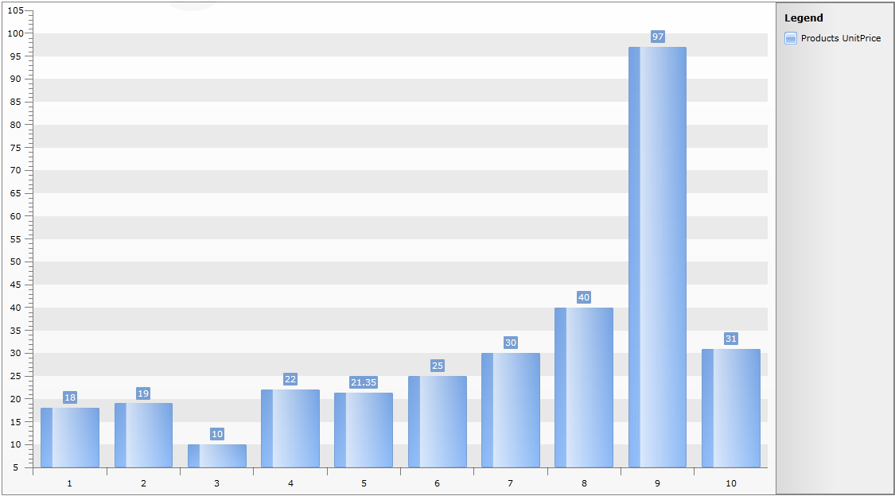

# Data Binding to ADO.NET Data Service


The purpose of this tutorial is to show you how to populate a __RadChart__ with data from an __ADO.NET Data Service__ in two ways:

* A straight-forward way - [plain method calls](#plain-method-calls).

* [Using MVVM approach](#using-mvvm-approach)

>This tutorial will use the __Northwind__ database, which can be downloaded from [here](http://www.microsoft.com/downloads/details.aspx?FamilyID=06616212-0356-46A0-8DA2-EEBC53A68034&displaylang=en).

Before proceeding further with this tutorial you need to create a new application and add a __RadChart__ declaration in your XAML: 

#### __XAML__

```XAML
	<telerik:RadChart x:Name="radChart" Margin="8" />
```


The chart control will be populated with the top 10 products from the Northwind database. On the __Y axis__ the __UnitPrice__ property will be displayed.

* Add a new __SeriesMapping__ to your chart declaration and set the __LegendLabel__ property to "Products UnitPrice".

* Add a new __ItemMapping__ and set the following properties:

* __FieldName__ to __UnitPrice__

* __DataPointMember__ to __YValue__

#### __XAML__

```XAML
	<telerik:RadChart x:Name="radChart" Margin="8">
	    <telerik:RadChart.SeriesMappings>
	        <telerik:SeriesMapping LegendLabel="Products UnitPrice">
	            <telerik:SeriesMapping.ItemMappings>
	                <telerik:ItemMapping FieldName="UnitPrice" DataPointMember="YValue"/>
	            </telerik:SeriesMapping.ItemMappings>
	        </telerik:SeriesMapping>
	    </telerik:RadChart.SeriesMappings>
	</telerik:RadChart>
```


* Create new __Business Object__ and name it __ProductDetail__:

#### __C#__

```C#
	public class ProductDetail
	    {
	        public decimal? UnitPrice { get; set; }
	
	        public ProductDetail(decimal? unitPrice)
	        {
	            this.UnitPrice = unitPrice;
	        }
	    }
```


#### __VB.NET__

```VB.NET
	Public Class ProductDetail
	    Public Property UnitPrice() As Decimal?
	    Public Sub New(ByVal unitPrice? As Decimal)
	        Me.UnitPrice = unitPrice
	    End Sub
	End Class
```


## Plain Method Calls

Add a reference to your ADO.NET Data Service. 

* Switch to the code-behind and add a reference to the __NorthWindEntities__ object__DataServiceContext__.

#### __C#__

```C#
	dbContext = new DataServiceContext(new Uri("SampleAdoNetDataService.svc", UriKind.Relative));
```


#### __VB.NET__

```VB.NET
	Dim dbContext As New DataServiceContext(New Uri("SampleAdoNetDataService.svc", UriKind.Relative))
```


#### __C#__

```C#
	NorthwindEntities dbContext = new NorthwindEntities(new Uri("Enter your service address here"));
```


#### __VB.NET__

```VB.NET
	Dim dbContext As New NorthwindEntities(New Uri("Enter your service address here"))
```


>tipFor more information about how to add a reference to an ADO.NET Data Service and how to create a new instance of the exposed entity, take a look at the [Consuming ADO.NET Data Service](http://www.telerik.com/help/silverlight/consuming-data-ado-net-data-service.html) topic.

Add the following code which will make the initial load of the objects.

#### __C#__

```C#
	private void BeginRequest()
	{
	    DataServiceQuery<Products> query = dbContext.CreateQuery<Products>( "Products" );
	    query.BeginExecute(ProductsRequestCompleted, query);
	}
	
	private void ProductsRequestCompleted(IAsyncResult asyncResult)
	  {
	    DataServiceQuery<Products> query = asyncResult.AsyncState as DataServiceQuery<Products>;
	    products = query.EndExecute(asyncResult).ToList();
	    List<ProductDetail> result = new List<ProductDetail>();
	  foreach (Products p in products.Take(10))
	   {
	    result.Add(new ProductDetail(p.UnitPrice));
	   }
	   RadChart1.ItemsSource = result;
	 }
```


#### __VB.NET__

```VB.NET
	Private Sub BeginRequest()
	    Dim query As DataServiceQuery(Of Products) = dbContext.CreateQuery(Of Products)("Products")
	    query.BeginExecute(AddressOf ProductsRequestCompleted, query)
	End Sub
	
	Private Sub ProductsRequestCompleted(ByVal asyncResult As IAsyncResult)
	    Dim query As DataServiceQuery(Of Products) = TryCast(asyncResult.AsyncState, DataServiceQuery(Of Products))
	    Products = query.EndExecute(asyncResult)
	    Dim result As New List(Of ProductDetail)()
	
	    For Each p As Products In Products.Take(10)
	        result.Add(New ProductDetail(p.UnitPrice))
	    Next p
	    RadChart1.ItemsSource = result
	End Sub
```


#### __C#__

```C#
	this.radChart.ItemsSource = dbContext.Products.Execute().Take(10).ToList();
```


#### __VB.NET__

```VB.NET
	Me.radChart.ItemsSource = dbContext.Products.Execute().Take(10).ToList()
```


Run your demo, the result can be seen on the next image:



## Using MVVM Approach

This section will show you how to populate your __RadChart__ control in a MVVM manner.

* Create a new class named __NorthwindDataSource__. 

#### __C#__

```C#
	public class NorthwindDataSource
	{
	}
```


#### __VB.NET__

```VB.NET
	Public Class NorthwindDataSource
	End Class
```


* Add a reference to your ADO.NET Data Service.

* In the __NorthwindDataSource__ class add a reference to an __ObservableCollection__ of __Categories__.

* In the __NorthwindDataSource__ class add a reference to the __NorthwindEntities__ object.

#### __C#__

```C#
	public class NorthwindDataSource
	{
	    private static NorthwindEntities northwindEntity;
	    public NorthwindDataSource()
	    {
	        northwindEntity = new NorthwindEntities( new Uri( "SampleAdoNetDataService.svc", UriKind.Relative ) );
	        this.Products = new ObservableCollection<Products>();
	    }
	    public ObservableCollection<Products> Products
	    {
	        get;
	        set;
	    }
	}
```


#### __VB.NET__

```VB.NET
	Public Class NorthwindDataSource
	    Private Shared northwindEntity As NorthwindEntities
	
	    Public Sub New()
	        northwindEntity = New NorthwindEntities(New Uri("SampleAdoNetDataService.svc", UriKind.Relative))
	        Me.Products = New ObservableCollection(Of Products)()
	    End Sub
	
	    Private _Products As ObservableCollection(Of Products)
	    Public Property Products() As ObservableCollection(Of Products)
	        Get
	            Return _Products
	        End Get
	        Set(ByVal value As ObservableCollection(Of Products))
	            _Products = value
	        End Set
	    End Property
	End Class
```


* Add the following code in the constructor of the __NorthwindDataSource__. It will make the initial load of all __Categories__ from the database: 

#### __C#__

```C#
	var query = ( from p in northwindEntity.Products
	              select p ).Take( 10 );
	DataServiceQuery<Products> products = ( DataServiceQuery<Products> )query;
	products.BeginExecute((IAsyncResult result) => EntitiesLoaded<Products>(result, this.Products ), products );
	         
	foreach ( Products p in query.ToList() )
	{
	    this.Products.Add( p );
	}
```


#### __VB.NET__

```VB.NET
	Dim query = (From p In northwindEntity.Products _
	    Select p).Take(10)
	Dim products As DataServiceQuery(Of Products) = DirectCast(query, DataServiceQuery(Of Products))
	products.BeginExecute(Sub(result As IAsyncResult) EntitiesLoaded(Of Products)(result, Me.Products), products)
	For Each p As Products In query.ToList()
	    Me.Products.Add(p)
	Next
```

And here is the code for the __EntitiesLoaded__ method: 

#### __C#__

```C#
	private static void EntitiesLoaded<T>(IAsyncResult result, Collection<T> entities)
	{
	    DataServiceQuery<T> query = result.AsyncState as DataServiceQuery<T>;
	    foreach (T entity in query.EndExecute(result))
	    {
	        entities.Add(entity);
	    }
	}
```


#### __VB.NET__

```VB.NET
	Private Shared Sub EntitiesLoaded(Of T)(ByVal result As IAsyncResult, ByVal entities As Collection(Of T))
	    Dim query As DataServiceQuery(Of T) = TryCast(result.AsyncState, DataServiceQuery(Of T))
	    For Each entity As T In query.EndExecute(result)
	        entities.Add(entity)
	    Next
	End Sub
```


* Declare the __NorthwindDataSource__ object as a resource in your application. 

#### __XAML__

```XAML
	<UserControl.Resources>
	    <example:NorthwindDataSource x:Key="DataSource"/>
	</UserControl.Resources>
```


*  Update your chart declaration - set the __ItemsSource__ property. 

#### __XAML__

```XAML
	<telerik:RadChart x:Name="radChart" Margin="8" 
	                  ItemsSource="{Binding Source={StaticResource DataSource}, Path=Products}">
	    <telerik:RadChart.SeriesMappings>
	        <telerik:SeriesMapping LegendLabel="Products UnitPrice">
	            <telerik:SeriesMapping.ItemMappings>
	                <telerik:ItemMapping FieldName="UnitPrice" DataPointMember="YValue"/>
	            </telerik:SeriesMapping.ItemMappings>
	        </telerik:SeriesMapping>
	    </telerik:RadChart.SeriesMappings>
	</telerik:RadChart>
```


Here it is shown how the final result should look like: 


## See Also

 * [Populating with Data Overview]()

 * [Data Binding Support Overview]()

 * [Data Binding to WCF Service]()

 * [Creating a Chart Declaratively]()

 * [Creating a Chart in Code-behind]()
