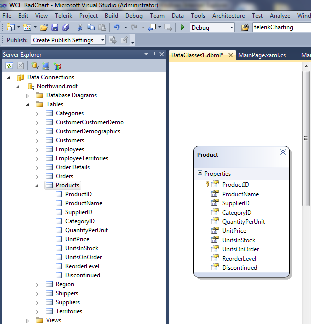
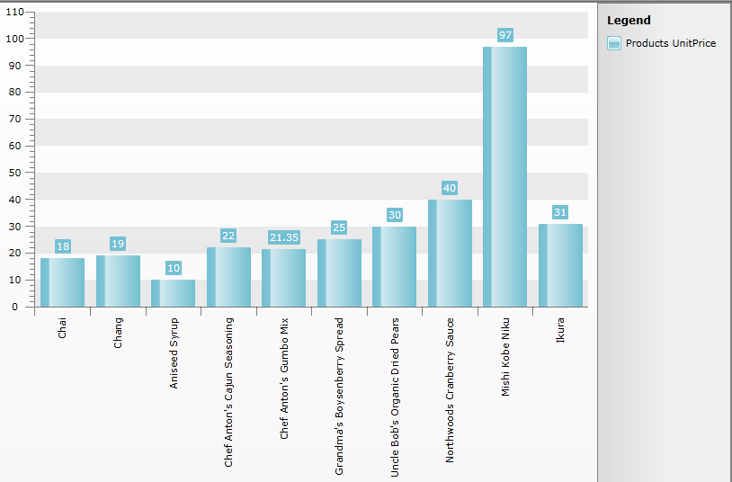

# Data Binding to WCF Service


The purpose of this tutorial is to show you how to populate a __RadChart__ with data from a __WCF Service__ in two ways:

* A straight-forward way - [plain method calls](#Plain_Method_Calls).

* [Using MVVM approach](#Using_MVVM_Approach)

>This tutorial will use the __Northwind__ database, which can be downloaded from [here](http://www.microsoft.com/downloads/details.aspx?FamilyID=06616212-0356-46A0-8DA2-EEBC53A68034&displaylang=en).

Before proceeding further with this tutorial you need to create a new application and add a __RadChart__ declaration in your XAML: 


```XAML
	<telerik:RadChart x:Name="radChart" Margin="8" />
```


The chart control will be populated with the top 10 products from the Northwind database. On the __Y axis__ the __UnitPrice__ property will be displayed.

* Add a new __SeriesMapping__ to your chart declaration and set the __LegendLabel__ property to "Products UnitPrice".

* Add a new __ItemMapping__ and set the following properties:

* __FieldName__ to __UnitPrice__

* __DataPointMember__ to __YValue__


```XAML
	<telerik:RadChart x:Name="radChart" Margin="8">
	    <telerik:RadChart.SeriesMappings>
	        <telerik:SeriesMapping LegendLabel="Products UnitPrice">
	            <telerik:SeriesMapping.ItemMappings>
	                <telerik:ItemMapping FieldName="UnitPrice" DataPointMember="YValue"/>
	            </telerik:SeriesMapping.ItemMappings>
	        </telerik:SeriesMapping>
	    </telerik:RadChart.SeriesMappings>
	</telerik:RadChart>
```


Creating the WCF Service:

* Add a new item "LINQ to SQL Classes" inside the web server project. Use the .dbml’s designer and drag the *Products *table onto the design surface:



* Then add a new item "Silverlight-enabled WCF Service" to the server project. In the *.svc.cs* file add the following Linq query to get the first 10 Products from the table:


```C#
	[ServiceContract(Namespace = "")]
	[AspNetCompatibilityRequirements(RequirementsMode = AspNetCompatibilityRequirementsMode.Allowed)]
	public class Service2
	{
	    [OperationContract]
	    public List<Products> LoadTop10Products()
	    {
	        DataClasses1DataContext db = new DataClasses1DataContext();
	        var query = from c in db.Products select c;
	        return query.Take(10).ToList();
	    }
	}
```
```VB.NET
	<ServiceContract(Namespace:=""), AspNetCompatibilityRequirements(RequirementsMode:=AspNetCompatibilityRequirementsMode.Allowed)>
	Public Class Service2
	    <OperationContract>
	    Public Function LoadTop10Products() As List(Of Products)
	        Dim db As New DataClasses1DataContext()
	        Dim query = From c In db.Products
	                    Select c
	        Return query.Take(10).ToList()
	    End Function
	End Class
```


Now build the project before continuing.

## Plain Method Calls

* Add a reference to your WCF Service. 

>tipFor more information about how to add a reference to a WCF Service and how to create a new instance of a WCF Service client, take a look at the [Consuming WCF Service](http://www.telerik.com/help/silverlight/consuming-data-wcf-service.html) topic.

* Switch to the code-behind and create a new instance of your WCF Service client.


```C#
	           
	MyService.Service2Client client = new MyService.Service2Client();
```
```VB.NET
	Dim client As New MyService.Service2Client()
```


Add the following code in your __xaml.cs__ which will make the initial load of the objects.


```C#
	public void SetupService()
	{
	    InitializeComponent();
	    MyService.Service2Client client = new MyService.Service2Client();
	    client.LoadTop10ProductsCompleted += new EventHandler<LoadTop10ProductsCompletedEventArgs>(client_LoadTop10ProductsCompleted);
	    client.LoadTop10ProductsAsync();
	}
	void client_LoadTop10ProductsCompleted(object sender, LoadTop10ProductsCompletedEventArgs e)
	{
	    var products = e.Result;
	    this.radChart.ItemsSource = products;
	    this.radChart.DefaultView.ChartArea.AxisX.LabelRotationAngle = -90;
	}
```
```VB.NET
	Public Sub SetupClient()
	    Dim client As New MyService.Service2Client()
	    AddHandler client.LoadTop10ProductsCompleted, AddressOf client_LoadTop10ProductsCompleted
	    client.LoadTop10ProductsAsync()
	End Sub
	Public Sub client_LoadTop10ProductsCompleted(ByVal sender As Object, ByVal e As LoadTop10ProductsCompletedEventArgs)
	    Dim products = e.Result
	    Me.radChart.ItemsSource = products
	    Me.radChart.DefaultView.ChartArea.AxisX.LabelRotationAngle = -90
	End Sub
```


```C#
	radChart.ItemsSource = serviceClient.LoadTop10Products();
```
```VB.NET
	radChart.ItemsSource = serviceClient.LoadTop10Products()
```


Run your demo, the result can be seen on the next image:




## Using MVVM Approach

This section will show you how to populate your __RadChart__ control in a MVVM manner.

* Create a new class named __NorthwindDataSource__. 


```C#
	public class NorthwindDataSource
	{
	}
```
```VB.NET
	Public Class NorthwindDataSource
	End Class
```


* Add a reference to your WCF Service.

* In the __NorthwindDataSource__ class add a reference to an __ObservableCollection__ of __Products__.

* In the __NorthwindDataSource__ class add a reference to your WCF Service client.


```C#
	public class NorthwindDataSource
	{
	    private SampleWcfServiceClient serviceClient;
	    public NorthwindDataSource()
	    {
	        this.serviceClient = new SampleWcfServiceClient();
	        this.Products = new ObservableCollection<Products>();
	    }
	    public ObservableCollection<Products> Products
	    {
	        get;
	        set;
	    }
	}
```
```VB.NET
	Public Class NorthwindDataSource
	    Private serviceClient As SampleWcfServiceClient
	
	    Public Sub New()
	        Me.serviceClient = New SampleWcfServiceClient()
	        Me.Products = New ObservableCollection(Of Products)()
	    End Sub
	
	    Private _Products As ObservableCollection(Of Products)
	    Public Property Products() As ObservableCollection(Of Products)
	        Get
	            Return _Products
	        End Get
	        Set(ByVal value As ObservableCollection(Of Products))
	            _Products = value
	        End Set
	    End Property
	End Class
```


>tipFor more information about how to add a reference to a WCF Service and how to create a new instance of a WCF Service client, take a look at the [Consuming WCF Service](http://www.telerik.com/help/silverlight/consuming-data-wcf-service.html) topic.

* Add the following code in the constructor of the __NorthwindDataSource__. It will make the initial load of all __Products__ from the database:


```C#
	this.serviceClient.LoadTop10ProductsCompleted += new EventHandler<LoadTop10ProductsCompletedEventArgs>(serviceClient_LoadTop10ProductsCompleted);
	this.serviceClient.LoadTop10ProductsAsync();
```


```C#
	foreach ( Products p in serviceClient.LoadTop10Products() )
	{
	    this.Products.Add( p );
	}
```
```VB.NET
	AddHandler Me.serviceClient.LoadTop10ProductsCompleted, AddressOf serviceClient_LoadTop10ProductsCompleted
	Me.serviceClient.LoadTop10ProductsAsync()
```


```VB.NET
	For Each p As Products In serviceClient.LoadTop10Products()
	    Me.Products.Add(p)
	Next
```



And here is the code handling the __LoadTop10ProductsCompleted__ event:


```C#
	private void serviceClient_LoadTop10ProductsCompleted(object sender, LoadTop10ProductsCompletedEventArgs e)
	{
	    foreach (Products p in e.Result)
	    {
	        this.Products.Add(p);
	    }
	}
```
```VB.NET
	Private Sub serviceClient_LoadTop10ProductsCompleted(ByVal sender As Object, ByVal e As LoadTop10ProductsCompletedEventArgs)
	    For Each p As Products In e.Result
	        Me.Products.Add(p)
	    Next
	End Sub
```


* Declare the __NorthwindDataSource__ object as a resource in your application. 


```XAML
	<UserControl.Resources>
	    <example:NorthwindDataSource x:Key="DataSource"/>
	</UserControl.Resources>
```


* Update your chart declaration - set the __ItemsSource__ property. 


```XAML
	<telerik:RadChart x:Name="radChart" Margin="8"    
	                  ItemsSource="{Binding Source={StaticResource DataSource}, Path=Products}">
	    <telerik:RadChart.SeriesMappings>
	        <telerik:SeriesMapping LegendLabel="Products UnitPrice">
	            <telerik:SeriesMapping.ItemMappings>
	                <telerik:ItemMapping FieldName="UnitPrice" DataPointMember="YValue"/>
	            </telerik:SeriesMapping.ItemMappings>
	        </telerik:SeriesMapping>
	    </telerik:RadChart.SeriesMappings>
	</telerik:RadChart>
```


Here it is shown how the final result should look like: 


## See Also

 * [Populating with Data Overview]()

 * [Data Binding Support Overview]()

 * [Data Binding to ADO.NET Data Service]()

 * [Creating a Chart Declaratively]()

 * [Creating a Chart in Code-behind]()
